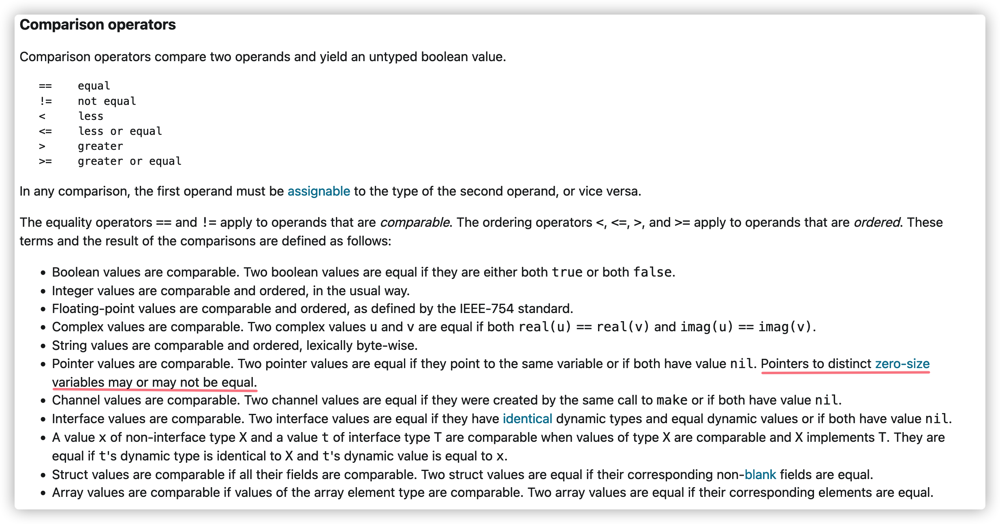

# Go 初步

[TOC]


Go语言的演化主要分为三个分支

- 从C语言中，Go继承了表达式、控制流语句、基本数据类型、指针等等语法。而且它还继承了C语言所要强调的要点，即程序需要编译成高效的机器码，并且自然地与操作系统所提供的抽象机制相配合。
- 从Module-2、Oberon等语言借鉴了包、模块化地概念
- Go also is inspired by the concept of **communicating sequential processes (CSP)** from TonyHoare’s seminal 1978 paper on the found ations of concurrency. In CSP,a program is a parallel composition of processes that have no shared state; the processes communicate and synchronize using channels.


Go是编译型的语言，它的工具链将程序的源文件转变成机器相关的原生二进制指令。

Go对于代码格式有着十分苛刻的要求，以下情况都会编译失败：

- 缺失导入或者存在不需要的包
- 声明但未使用的变量
- 左大括号与某些语句（for、func）不在同一行。

## 命名

命名规则：

1. 以字符或者下划线开头（支持Unicode）

2. 数字、字符、下划线（支持Unicode）

3. 对大小写敏感

4. 关键字在某些上下文中，不能作为名字

   ~~~go
   break 		default 	func 	interface 	select
   case 		defer 		go 		map 		struct
   chan 		else 		goto 	package 	switch
   const 		fallthrough if 		range 		type
   continue 	for 		import 	return 		var
   ~~~

命名风格是驼峰式的。

   

预声明的常量、函数、类型不是保留的。也就是说可以在声明中使用它们，但是会有潜在的命名冲突问题。

   ~~~go
   true false iota nil
   ~~~

   ~~~go
   int int8 int16 int32 int64
   uint uint8 uint16 uint32 uint64 uintptr
   float32 float64 complex128 complex64
   bool byte rune string error
   ~~~

   ~~~go
   make len cap new append copy close delete
   complex real imag
   panic recover
   ~~~


在函数内声明的变量，仅在函数局部作用域中可见。在函数外声明的变量，对本包中所有其他的源文件可见。

如果第一个字母是大写的，那么它在包外也是可见的（导出的），否则仅在包内可见。

> 对于中文汉字，Unicode标志都作为小写字母处理，因此中文的命名默认不能导出。不过国内的用户针对该问题提出了不同的看法，根据RobPike的回复 [Issue763](https://github.com/golang/go/issues/5763) ，在Go2中有可能会将中日韩等字符当作大写字母处理

## 声明

声明是给一个实体命名，并且指定该实体的性质。Go语言主要有四种类型的声明语句：`var`、`const`、`type`和`func`，分别对应变量、常量、类型和函数实体对象的声明。

## 变量

var声明语句可以创建一个特定类型的变量，语法如下

~~~go
var 变量名字 类型 = 初始化表达式
~~~

初始化表达式可以是字面量或任意的表达式。在包级别声明的变量会在main入口函数执行前完成初始化，局部变量将在声明语句被执行到的时候完成初始化。


如果省略类型，那么将根据初始化表达式来推导变量的类型。

如果省略表达式，那么用零值初始化该变量。零值初始化机制可以确保每个声明的变量总是有一个良好定义的值：

- 数值类型变量对应的零值是0
- 布尔类型变量对应的零值是false
- 字符串类型对应的零值是空字符串
- 接口或引用类型（包括slice、指针、map、chan和函数）变量对应的零值是nil
- 数组或结构体等聚合类型对应的零值是每个元素或字段都是对应该类型的零值。


也可以在一个声明语句中同时声明一组变量

~~~go
var i, j, k int
var b, f, s = true, 2.3, "four"
~~~


在函数内部，有一种简短变量声明语句的形式，可用于声明和初始化局部变量，语法如下：

~~~go
名字 := 表达式
~~~

变量的类型根据表达式来自动推导。

~~~go
anim := gif.GIF{LoopCount: nframes}
freq := rand.Float64() * 3.0
t := 0.0
i, j := 0, 1 	//声明和初始化一组变量
~~~

var形式的声明语句往往是用于

- 需要显式指定变量类型的地方
- 变量稍后会被重新赋值，并且初始值无关紧要的地方。


**请记住“:=”是一个变量声明语句，而“=”是一个变量赋值操作。**这里有一个比较微妙的地方：简短变量声明左边的有一些变量，已经在**相同的作用域**声明过了，此时对于已经声明过的变量就只有赋值行为了。

~~~go
in, err := os.Open(infile)
// ...
out, err := os.Create(outfile)
~~~

简短变量声明语句中必须至少要声明一个新的变量，下面的代码将不能编译通过：

~~~go
f, err := os.Open(infile)
// ...
f, err := os.Create(outfile) // compile error: no new variables
~~~

解决的方法是第二个简短变量声明语句改用普通的多重赋值语句。


### 指针

Go还支持指针的特性。在Go语言中，返回函数中局部变量的地址也是安全的。

~~~go
var p = f()

func f() *int {
	v := 1
	return &v
}
~~~

在 Go 语言中，如果可能，编译器会在函数的栈帧中为局部变量分配空间。然而，如果编译器确定某个变量必须在函数返回后继续存在，那么该变量将被分配在堆上，用Go语言的术语说，这个x局部变量从函数f中逃逸了。

~~~go
fmt.Println(f() == f()) // "false"
~~~


另一个创建变量的方法是调用内建的new函数。表达式new(T)将创建一个T类型的匿名变量，初始化为T类型的零值，然后返回该变量的地址。

~~~go
p := new(int)   // p, *int 类型, 指向匿名的 int 变量
fmt.Println(*p) // "0"
*p = 2          // 设置 int 匿名变量的值为 2
fmt.Println(*p) // "2"
~~~

每次调用new函数都是返回一个新的变量的地址，因此下面两个地址是不同的：

```
p := new(int)
q := new(int)
fmt.Println(p == q) // "false"
```

当然也可能有特殊情况：如果两个类型都是空的，也就是说类型的大小是0，例如`struct{}`和`[0]int`，那么有可能有相同的地址（依赖具体的语言实现）


### 生命周期

变量的生命周期指的是在程序运行期间变量有效存在的时间段。

- 对于在包一级声明的变量来说，它们的生命周期和整个程序的运行周期是一致的。

- 局部变量的生命周期则是由Go语言的自动垃圾收集器来负责。

  函数的参数变量和返回值变量都是局部变量。它们在函数每次被调用的时候创建。


### 赋值

~~~go
x = 1                       // 命名变量的赋值
*p = true                   // 通过指针间接赋值
person.name = "bob"         // 结构体字段赋值
count[x] = count[x] * scale // 数组、slice或map的元素赋值
~~~

元组赋值是另一种形式的赋值语句，它允许同时更新多个变量的值。在赋值之前，赋值语句右边的所有表达式将会先进行求值，然后再统一更新左边对应变量的值。

~~~go
x, y = y, x

a[i], a[j] = a[j], a[i]
~~~

但如果表达式太复杂的话，应该尽量避免过度使用元组赋值；因为每个变量单独赋值语句的写法可读性会更好。

我们可以用下划线空白标识符`_`来丢弃不需要的值。

~~~go
_, err = io.Copy(dst, src) // 丢弃字节数
_, ok = x.(T)              // 只检测类型，忽略具体值
~~~


### 类型

变量或表达式的类型定义了其属性特征，例如数值在内存的存储大小，它们在内部是如何表达的，是否支持一些操作符，以及它们自己关联的方法集等。

而类型的语义是由程序员自己来解释的。例如，一个int类型的变量可以用来表示一个循环的迭代索引、或者一个时间戳、或者一个文件描述符、或者一个月份；一个float64类型的变量可以用来表示每秒移动几米的速度、或者是不同温度单位下的温度；一个字符串可以用来表示一个密码或者一个颜色的名称。

一个类型声明语句创建了一个新的类型，和现有类型具有相同的底层结构，**并且提供了更加丰富的语义信息**。**但是新的类型和原类型是不兼容的，即使它们具有相同的底层结构。**

~~~go
type 新类型名 旧类型名
~~~


新类型还可以定义额外的行为，这些行为表示为一组关联到该类型的函数集合，我们称为类型的**方法集**。我们之后会讨论方法的细节，这里只说些简单用法。

~~~go
func (c Celsius) String() string { return fmt.Sprintf("%g°C", c) }

// 使用
fmt.Println(c.String()) // "100°C"
~~~

### 类型转换

**在 Go 语言中，不存在隐式类型转换。**

类型转换通常不会改变值本身，但是一定会使它们的语义发生变化。对于每一个类型T，都有一个对应的类型转换操作T(x)，用于将x转为T类型。只有当两个类型的底层基础类型相同时，或者是两者都是指向相同底层结构的指针类型，才允许这种转型操作。


数值类型之间的显式转型也是允许的，并且在字符串和一些特定类型的slice之间也是可以转换的。这类转换可能有改变值的行为，例如：

1. 将一个大尺寸的整数类型转为一个小尺寸的整数类型
2. 将一个浮点数转为整数


### 作用域

注意区分「作用域」与「生命周期」。

- 作用域对应的是一个名字的可见性；它是一个编译时的属性
- 生命周期作用对象是一个位于内存中的变量；它是一个运行时的属性

例如，for循环语句的作用域包括循环体以及初始化部分。


同一个作用域中，禁止包括多个同名的声明。当编译器遇到一个名字引用时，它会对其定义进行查找，查找过程从最内层的词法域向全局的作用域进行。如果查找失败，则报告“未声明的名字”这样的错误。如果该名字在内部和外部的块分别声明过，则内部块的声明首先被找到。在这种情况下，内部声明屏蔽了外部同名的声明：

~~~go
func main() {
	x := "hello!"
	for i := 0; i < len(x); i++ {
		x := x[i]
		if x != '!' {
			x := x + 'A' - 'a'
			fmt.Printf("%c", x) // "HELLO" (one letter per iteration)
		}
	}
}
~~~

注意到`x:=x[i]`语句中，左右两边的`x`虽然同名，然而是不同的实体。原因在于，当编译器遇到一个名字引用时，它会按照操作（例如，函数调用、数组访问等等）所期望的定义进行查找。


## 基本类型

### 整型

Go语言同时提供了有符号和无符号类型的整数运算

- `int8`、`int16`、`int32`和`int64`
- `uint8`、`uint16`、`uint32`和`uint64`

此外，还有以下整型类型

- `int`、`uint`，它们的大小取决于机器的具体实现。
- `rune`，是和int32等价的类型，通常用于表示一个Unicode码点
- `byte`，是uint8类型的等价类型，通常用于表示二进制原始数据
- `uintptr`，用于存储指针值


即使需要非负数的语义，也不要使用无符号数。例如我们看一个经典的溢出Bug

~~~go
medals := []string{"gold", "silver", "bronze"}
for i := len(medals) - 1; i >= 0; i-- {
	fmt.Println(medals[i]) // "bronze", "silver", "gold"
}
~~~

出于避免溢出情况的考量，我们一般在操纵二进制数据时才使用无符号类型。


### 浮点数

Go语言提供了两种精度的浮点数，float32和float64。它们的算术规范由IEEE754浮点数国际标准定义。

- 常量`math.MaxFloat32`表示`float32`能表示的最大数值，大约是 `3.4e38`；对应的`math.MaxFloat64`常量大约是`1.8e308`。
- 一个`float32`类型的浮点数可以提供大约6个十进制数的精度，而`float64`则可以提供约15个十进制数的精度


小数点前面或后面的数字都可能被省略（例如`.707`或`1.`）

~~~go
const e = 2.71828 // (approximately)
const Avogadro = 6.02214129e23  // 阿伏伽德罗常数
const Planck   = 6.62606957E-34 // 普朗克常数
~~~


我们看一下float类型的误差问题：

~~~go
var f float32 = 16777216 // 1 << 24
fmt.Println(f == f+1)    // "true"!
~~~

要处理这种误差问题，第一种方案是使用数值算法，第二种是使用大整数进行模拟。


### 复数

Go语言提供了两种精度的复数类型：`complex64`和`complex128`，两者分别由`float32`和`float64`来实现的。内置的`complex`函数用于构建复数，内建的`real`和`imag`函数分别返回复数的实部和虚部：

~~~go
var x complex128 = complex(1, 2) // 1+2i
var y complex128 = complex(3, 4) // 3+4i
fmt.Println(x*y)                 // "(-5+10i)"
fmt.Println(real(x*y))           // "-5"
fmt.Println(imag(x*y))           // "10"
~~~

如果一个浮点数面值或一个十进制整数面值后面跟着一个i，例如`3.141592i`或`2i`，它将构成一个复数的虚部。

Go语言中的复数还支持`+`、`-`、`*`、`\`。我们可以通过`+`来将一个复数虚部字面量可以加到另一个普通数值字面量上，从而构成一个复数。

~~~go
x := 1 + 2i
y := 4i + 3 // OK
~~~

复数也可以用==和!=进行相等比较。只有两个复数的实部和虚部都相等的时候它们才是相等的（注意，实部和虚部是由浮点数来实现的）。

math/cmplx包提供了复数处理的许多函数，例如求复数的平方根函数和求幂函数。

```go
fmt.Println(cmplx.Sqrt(-1)) // "(0+1i)"
```

### 布尔

一个布尔类型的值只有两种：true和false。

在Go语言中，不支持隐式转换。因此布尔值并不会隐式转换为数字值0或1，反之亦然。

### 字符串

一个字符串是一个**不可改变的**字节序列。内置的`len`函数可以返回一个字符串的字节个数（不是`Unicode`字符个数）。索引操作`s[i]`返回第`i`个字节的字节值

~~~go
s := "hello, world"
fmt.Println(len(s))     // "12"
fmt.Println(s[0], s[7]) // "104 119" ('h' and 'w')
~~~

如果试图访问超出字符串索引范围的字节将会导致panic异常：

~~~go
c := s[len(s)] // panic: index out of range
~~~

因为字符串是不可修改的，因此尝试修改字符串内部数据的操作也是被禁止的：

```go
s[0] = 'L' // compile error: cannot assign to s[0]
```


通过`s[i:j]`来返回子串（深复制），区间是左闭右开的。`i`、`j`都可以被忽略。其中`i`的默认值是`0`，而`j`的默认值是`len(s)`。

~~~go
fmt.Println(s[0:5]) // "hello"
fmt.Println(s[:5]) // "hello"
fmt.Println(s[7:]) // "world"
fmt.Println(s[:])  // "hello, world"
~~~

由于string类型的不可修改性，所以两个字符串共享相同数据的行为也是安全的。而且字符串切片操作代价也是低廉的。


其中+操作符将两个字符串连接构造一个新字符串：

```go
fmt.Println("goodbye" + s[5:]) // "goodbye, world"
```

字符串可以用`==`和`<`进行比较，其中会逐个字节进行比较。


因为Go语言源文件总是用UTF8编码，**所以Go语言的字符串字面量以UTF-8来编码**。如果想要在字符串面值中包含二进制字节数据，那么使用转义字符`\xhh`，或者`\ooo`。其中两个`h`表示十六进制数字（大写或小写都可以），o三个`o`表示八进制数字，但不能超过`\377`，即十进制`255`。


Go语言中的转义字符如下：

~~~
\a      响铃
\b      退格
\f      换页
\n      换行
\r      回车
\t      制表符
\v      垂直制表符
\'      单引号（只用在 '\'' 形式的rune符号面值中）
\"      双引号（只用在 "..." 形式的字符串面值中）
\\      反斜杠
~~~


原生的字符串字面量的语法为

~~~go
const GoUsage = `Go is a tool for managing Go source code.

Usage:
	go command [arguments]
...`
~~~

在原生字面量内，转义序列不起作用。原生字符串包括所有的文本内容，甚至包括反斜杠和换行。唯一的特殊处理是，回车符会被删除（换行符会被保留）。

原生字符串字面量广泛应用于HTML模板、JSON面值、命令行提示信息等需要多行或者有大量转义字符的场景。


Unicode（ [http://unicode.org](http://unicode.org/) ）字符集包括了世界上大部分文字符号，甚至包括重音符号。每个符号都分配一个唯一的Unicode码点。

在Go语言中，提供了`rune`类型（与`int32`类型等价）来表示一个Unicode码点。

UTF8是变长编码方案，用1到4个字节来表示每个Unicode字符。它有一个前缀编码来支持变长方案

~~~
0xxxxxxx                             runes 0-127    
110xxxxx 10xxxxxx                    128-2047       
1110xxxx 10xxxxxx 10xxxxxx           2048-65535     
11110xxx 10xxxxxx 10xxxxxx 10xxxxxx  65536-0x10ffff 
~~~

在Go语言中，可以使用`\xhh`（对应8bit编码值）、`\uhhhh`（对应16bit编码值）或者`\Uhhhhhhhh`（对应32bit的编码值）来表示一个Unicode字符。

~~~go
"世界"
"\xe4\xb8\x96\xe7\x95\x8c"
"\u4e16\u754c"
"\U00004e16\U0000754c"
~~~

上面这四种表达方式都是一样的。


len内置函数只能获取字符串的字节长度，要获取字符长度要使用`utf8.RuneCountInString`

~~~go
import "unicode/utf8"

s := "Hello, 世界"
fmt.Println(len(s))                    // "13"
fmt.Println(utf8.RuneCountInString(s)) // "9"
~~~

`utf8.DecodeRuneInString`函数接收一个字符串作为输入参数，返回首个有效Unicode字符对应的rune值以及该字符的字节长度。

```go
for i := 0; i < len(s); {
	r, size := utf8.DecodeRuneInString(s[i:])
	fmt.Printf("%d\t%c\n", i, r)
	i += size
}
```

幸运的是，Go语言的range循环在处理字符串的时候，会自动隐式地解码UTF8字符串。

~~~go
for i, r := range "Hello, 世界" {
    fmt.Printf("%d\t%q\t%d\n", i, r, r)
}
/**
0       'H'     72
1       'e'     101
2       'l'     108
3       'l'     108
4       'o'     111
5       ','     44
6       ' '     32
7       '世'    19990
10      '界'    30028
*/
~~~


每一个UTF8字符解码，不管是显式地调用utf8.DecodeRuneInString解码或是在range循环中隐式地解码，如果遇到一个错误的UTF8编码输入，将生成一个特别的Unicode字符`\uFFFD` �

UTF8字符串作为数据交换格式是非常方便的，但是在程序内部采用rune序列可能更方便，因为rune大小一致，支持数组索引和方便切割。

UTF8和[]rune之间的转换

~~~go
s := "プログラム"

r := []rune(s)
s1 := string(r)
~~~

整数转型为字符串：

~~~go
string(65)		// "A", not "65"
string(0x4eac)	// "京"
string(1234567)	// 如果对应码点的字符是无效的，则用\uFFFD无效字符代替
~~~

FormatInt和FormatUint函数可以用不同的进制来格式化数字：

~~~go
x := 123
strconv.FormatInt(int64(x), 2)	"1111011"
~~~

fmt.Sprintf函数往往比strconv包的Format函数方便很多，特别是在需要包含有附加额外信息的时候：

~~~go
s := fmt.Sprintf("x=%b", x) // "x=1111011"
~~~

如果要将一个字符串解析为整数，可以使用strconv包的Atoi或ParseInt函数：

~~~go
x, err := strconv.Atoi("123")             // x is an int
y, err := strconv.ParseInt("123", 10, 64) // base 10, up to 64 bits
~~~


字符串和字节slice之间的转换

~~~go
s := "abc"
b := []byte(s)
s2 := string(b)
~~~


标准库中有四个包对字符串处理尤为重要：

- strings包提供了许多如字符串的查询、替换、比较、截断、拆分和合并等功能
- bytes包也提供了很多类似功能的函数，但是针对和字符串有着相同结构的[]byte类型。
- strconv包提供了布尔型、整型数、浮点数和对应字符串的相互转换
- unicode包提供了IsDigit、IsLetter、IsUpper和IsLower等类似功能，它们用于给字符分类


因为字符串是只读的，因此逐步构建字符串会导致很多分配和复制。在这种情况下，使用bytes.Buffer类型将会更有效

~~~go
// intsToString is like fmt.Sprint(values) but adds commas.
func intsToString(values []int) string {
    var buf bytes.Buffer
    buf.WriteByte('[')
    for i, v := range values {
        if i > 0 {
            buf.WriteString(", ")
        }
        fmt.Fprintf(&buf, "%d", v)
    }
    buf.WriteByte(']')
    return buf.String()
}

func main() {
    fmt.Println(intsToString([]int{1, 2, 3})) // "[1, 2, 3]"
}
~~~


### 常量

常量表达式的值在编译期计算，而不是在运行期。

~~~go
const pi = 3.14159

const (
    e  = 2.71828182845904523536
    pi = 3.14159265358979323846
)
~~~

以下运算结果都是常量

- 常量间的所有算术运算、逻辑运算和比较运算
- 对常量的类型转换操作
- 对常量调用len、cap、real、imag、complex和unsafe.Sizeof


如果是批量声明的常量，除了第一个外，其它常量的初始化表达式都可以省略。省略后，复用前一个常量的初始化表达式

~~~go
const (
	a = 1
	b
	c = "Hello"
	d
)

fmt.Println(a, b, c, d) // "1 1 Hello Hello"
~~~


iota常量生成器，用于生成一组以相似规则初始化的常量，它从零开始依次加一

~~~go
type Weekday int
const (
    Sunday Weekday = iota		// 0
    Monday						// 1
    Tuesday						// 2
    Wednesday					// 3
    Thursday					// 4
    Friday						// 5
    Saturday					// 6
)
~~~

~~~go
type Flags uint

const (
    FlagUp Flags = 1 << iota // 1
    FlagBroadcast            // 2
    FlagLoopback             // 4
    FlagPointToPoint         // 8
    FlagMulticast            // 16
)
~~~

~~~go
const (
    _ = 1 << (10 * iota)
    KiB // 1024
    MiB // 1048576
    GiB // 1073741824
    TiB // 1099511627776             (exceeds 1 << 32)
    PiB // 1125899906842624
    EiB // 1152921504606846976
    ZiB // 1180591620717411303424    (exceeds 1 << 64)
    YiB // 1208925819614629174706176
)
~~~


常量的底层类型必须兼容int，float，complex，boolean和string之一。

一个常量声明如果没有指定类型，那么类型将从右边的表达式推断出。这个常量被称为**未类型化的**。此外，字面量也是一种未类型化的常量。

编译器为这些未类型化的常量，提供比基础类型更高精度的算术运算；你可以认为至少有256bit的运算精度。例如，`YiB`常量（1208925819614629174706176）已经超出任何整数类型所能表达的范围，但是它依然是合法的常量。

未类型化的常量可以直接使用，无需做类型转换

~~~go
var f float64 = 3 + 0i // untyped complex -> float64
f = 2                  // untyped integer -> float64
f = 1e123              // untyped floating-point -> float64
f = 'a'                // untyped rune -> float64

// 等价于
var f float64 = float64(3 + 0i)
f = float64(2)
f = float64(1e123)
f = float64('a')
~~~

~~~go
i := 0      // untyped integer;        implicit int(0)
r := '\000' // untyped rune;           implicit rune('\000')
f := 0.0    // untyped floating-point; implicit float64(0.0)
c := 0i     // untyped complex;        implicit complex128(0i)
~~~


### 运算符

下面是Go语言中关于算术运算、逻辑运算和比较运算的二元运算符，它们按照优先级递减的顺序排列：

```go
*      /      %      <<       >>     &       &^
+      -      |      ^
==     !=     <      <=       >      >=
&&
||
```

在同一个优先级，使用左优先结合规则。但是使用括号`()`可以提升优先级。

运算的一些行为

- 在Go语言中，%取模结果的符号和被取模数的符号总是一致的。
- 只有整型支持取模操作%
- 整数除法会向着0方向截断余数。


关于比较运算符的说明

- "==" 运算符可以用于比较所有的基本数据类型，如 int, float, string 等。它也可以在比较 struct 类型时使用，只要它们的每个成员都是可比较的。
- 然而，“==”不能直接用于比较数组、切片、映射或函数。
- "==" 要求两个操作数的类型相同。


Go语言还提供了以下的bit位操作运算符，前面4个操作运算符并不区分是有符号还是无符号数：

```go
&      位运算 AND
|      位运算 OR
^      位运算 XOR
&^     位清空（AND NOT）
<<     左移
>>     右移
```

在`x<<n`和`x>>n`移位运算中，决定了移位操作的bit数部分必须是无符号数；被操作的x可以是有符号数或无符号数。

- 左移运算用0填充右边空缺的bit位，

- 无符号数的右移运算也是用0填充左边空缺的bit位，

- 有符号数的右移运算会用符号位的值填充左边空缺的bit位。


## 复合类型

数组和结构体是聚合类型，数组是由同构的元素组成，即每个数组元素都是完全相同的类型，而结构体则是由异构的元素组成的

数组和结构体都是有固定内存大小的数据结构。相比之下，slice和map则是动态的数据结构，它们将根据需要动态增长。

默认情况下，数组的每个元素都被初始化为元素类型对应的零值。

### 数组

数组是一个由特定类型元素组成的、固定长度的序列。

一个简单的示例：

~~~go
var a [3]int             // array of 3 integers
a[0]					// the first element
a[len(a)-1]				// the last element

for i, v := range a {
    fmt.Printf("%d %d\n", i, v)
}
~~~


默认情况下，数组的每个元素都被初始化为元素类型对应的零值。我们可以使用数组字面值语法来初始化数组：

~~~go
var q [3]int = [3]int{} 		// OK
var q [3]int = [3]int{1}		// OK
var q [3]int					// nil
~~~

在数组字面值中，可以用索引指定要初始化的元素

~~~go
type Currency int

const (
    USD Currency = iota // 美元
    EUR                 // 欧元
    GBP                 // 英镑
    RMB                 // 人民币
)

symbol := [...]string{USD: "$", EUR: "€", GBP: "￡", RMB: "￥"}
~~~

在数组字面值中，如果在数组的长度位置出现的是“...”省略号，则表示数组的长度是根据初始化值的个数来计算

~~~go
q := [...]int{1, 2, 3}
fmt.Printf("%T\n", q) // "[3]int"
~~~

甚至，...可以和索引搭配使用

~~~go
r := [...]int{99: -1}
~~~

定义了一个含有100个元素的数组r，最后一个元素被初始化为-1，其它元素都是用0初始化。


错误用法：

~~~go
var q []int = [3]int {1, 2, 3}	// Error, Java中却允许类似的语法，其实这里是将数组赋值给切片类型
var q [3]int = [2]int			// Error
var q [3]int = []int			// Error
var q [3]int = []int{}			// Error
var q [3]int = [3]int			// Error
~~~


数组的长度是数组类型的一个组成部分，因此[3]int和[4]int是两种不同的数组类型。数组的长度必须是常量表达式，因为数组的长度需要在编译阶段确定。

~~~go
q := [3]int{1, 2, 3}
q = [4]int{1, 2, 3, 4} // compile error: cannot assign [4]int to [3]int
~~~

如果一个数组的元素类型是可以相互比较的，那么数组类型也是可以相互比较的，这时候我们可以直接通过==比较运算符来比较两个数组

~~~go
a := [2]int{1, 2}
b := [...]int{1, 2}
c := [2]int{1, 3}
fmt.Println(a == b, a == c, b == c) // "true false false"
~~~

数组之间的赋值是深复制的

~~~go
var q [3]int = [3]int{1, 2}
var p = q
p[1] = 100
fmt.Println(q)
fmt.Println(p)
/**
[1 2 0]
[1 100 0]
*/
~~~

### Slice

Slice字面量

~~~go
s []int = []int{};	 			// OK
s []int = []int{0, 1, 2, 3}	 	// OK
s []int;			 			// nil
~~~

内置的make函数创建一个指定元素类型、长度和容量的slice。容量部分可以省略，在这种情况下，容量将等于长度。

~~~go
make([]T, len)
make([]T, len, cap) // same as make([]T, cap)[:len]
~~~

错误用法

~~~go
s []int = []int;	 			// Error
~~~

一个slice由三个部分构成：指针、长度和容量


slice的底层引用一个数组对象，而且多个slice之间可以共享底层的数据。

如果切片操作超出`cap(s)`的上限将导致一个panic异常，但是超出`len(s)`则是意味着扩展了slice

~~~go
months := [...]string{1: "January", /* ... */, 12: "December"}	// 数组
summer := months[6:9] 			// ["June" "July" "August"]
summer[:20]						// panic: out of range
endlessSummer := summer[:5] 	// extend a slice (within capacity) "[June July August September October]"
~~~


slice与数组的转换

~~~go
var a [3]byte = [...]byte{1, 2, 3}
var s1 []byte = a[:]
s1[0] = 100
fmt.Println(s1)		// [100 2 3]
fmt.Println(a)		// [100 2 3]
~~~

slice之间是浅复制。

~~~go
func reverse(s []int) {}

a := [...]int{0, 1, 2, 3, 4, 5}
reverse(a[:])
~~~


与数组不同，slice之间不能直接比较，这是因为：

- 如果直接比较引用的话，与数组的行为不一致（一个比较引用、一个比较元素值），容易造成混淆。
- 切片可以引用自身，有循环引用的问题（例如[]interface{}中元素可以是任何类型，当然包括自己）

不过，标准库提供了充分优化的bytes.Equal函数来判断两个[]byte类型的slice是否相等（两两元素是否相等）

slice唯一合法的比较操作是和nil比较

~~~go
if summer == nil { /* ... */ }
~~~

~~~go
var s []int    // len(s) == 0, s == nil
s = nil        // len(s) == 0, s == nil
s = []int(nil) // len(s) == 0, s == nil
s = []int{}    // len(s) == 0, s != ni
~~~

所以，如果你需要测试一个slice是否是空的，使用len(s) == 0来判断，而不应该用s == nil来判断。

Go语言约定，以相同的方式对待nil值的slice和0长度的slice。这对于内置函数、range循环来说都成立


内置的append函数用于向slice追加元素：

~~~go
var x []int
x = append(x, 1)
x = append(x, 2, 3)
x = append(x, 4, 5, 6)
x = append(x, x...) // append the slice x
fmt.Println(x)      // "[1 2 3 4 5 6 1 2 3 4 5 6]"
~~~

下面我们通过`appendInt`来简单地说明一下append的实现原理：

~~~go
func appendInt(x []int, y int) []int {
    var z []int
    zlen := len(x) + 1
    if zlen <= cap(x) {
        // There is room to grow.  Extend the slice.
        z = x[:zlen]
    } else {
        // There is insufficient space.  Allocate a new array.
        // Grow by doubling, for amortized linear complexity.
        zcap := zlen
        if zcap < 2*len(x) {
            zcap = 2 * len(x)
        }
        z = make([]int, zlen, zcap)
        copy(z, x) // a built-in function; 类似 z = x
    }
    z[len(x)] = y
    return z
}
~~~


这里要说明的是内置的append函数可能使用比appendInt更复杂的内存扩展策略。因此，通常我们并不知道append调用是否导致了内存的重新分配，因此我们也不能确认新的slice和原始的slice是否引用的是相同的底层数组空间。所以，通常是将append返回的结果直接赋值给输入的slice变量

~~~go
runes = append(runes, r)
~~~

### 结构体

~~~go
type Employee struct {
    ID        int
    Name      string
    Address   string
    DoB       time.Time
    Position  string
    Salary    int
    ManagerID int
}

var dilbert Employee
~~~


如果相邻成员的类型相同的话（例如，Name、Address），那么可以合并到同一行

~~~go
type Employee struct {
    //...
    Name, Address 	string
    DoB 			time.Time
}
~~~


注意，即使两个结构体中的成员数量、类型、名称都相同，但顺序不同，那么也会被视为不同的类型。

~~~go
type Employee struct {
	ID   int
	name string
}

type Employee2 struct {
	name string
	ID   int
}

// OK
~~~

如果结构体成员名字是以大写字母开头的，那么该成员就是导出的；这是Go语言导出规则决定的。


结构体字面量

~~~go
type Point struct{ X, Y int }

p := Point{1, 2}				// 必须按位置传入，且不能忽略成员
p := Point{Y : 2, X : 1}		// 可以按名称传入，可以忽略某些成员，如果成员被忽略的话将默认用零值

// 不能混合使用两种不同形式的写法
~~~


如果结构体的全部成员都是可以比较的，那么结构体也是可以比较的。


访问成员

~~~go
dilbert.Salary -= 5000

position := &dilbert.Position
*position = "Senior " + *position
~~~


一个关于指针访问的语法糖

~~~go
var employeeOfTheMonth *Employee = &dilbert
employeeOfTheMonth.Position;

// 等价
(*employeeOfTheMonth).Position;
~~~


一个命名为S的结构体类型将不能再包含S类型的成员：因为一个聚合的值不能包含它自身。但是S类型的结构体可以包含`*S`指针类型的成员

~~~go
type tree struct {
    value 		int
    left, right *tree
}
~~~


嵌套结构体：

~~~go
type Point struct {
    X, Y int
}

type Circle struct {
    Center Point
    Radius int
}

type Wheel struct {
    Circle Circle
    Spokes int
}

var w Wheel
w.Circle.Center.X = 8
w.Circle.Center.Y = 8
w.Circle.Radius = 5
w.Spokes = 20
~~~


Go语言的匿名成员特性，让我们可以只声明一个成员对应的数据类型，而不需要指名成员的名字；当要访问成员时，无需给出完整的访问路径：
~~~go
type Circle struct {
    Point
    Radius int
}

type Wheel struct {
    Circle
    Spokes int
}

var w Wheel
w.X = 8            // equivalent to w.Circle.Point.X = 8
w.Y = 8            // equivalent to w.Circle.Point.Y = 8
w.Radius = 5       // equivalent to w.Circle.Radius = 5
w.Spokes = 20
~~~

如果想要匿名成员是不导出的，那么只能将相应的类型名称改为小写。

~~~go
type point struct {
    
}

type circle struct {
    point
    Radius int
}

type Wheel struct {
    circle
    Spokes int
}
~~~


不幸的是，结构体字面值并没有简短地表示匿名成员的语法：

~~~go
w = Wheel{8, 8, 5, 20}                       // compile error: unknown fields
w = Wheel{X: 8, Y: 8, Radius: 5, Spokes: 20} // compile error: unknown fields

w = Wheel{Circle{Point{8, 8}, 5}, 20}

w = Wheel{
    Circle: Circle{
        Point:  Point{X: 8, Y: 8},
        Radius: 5,
    },
    Spokes: 20, // NOTE: trailing comma necessary here (and at Radius)
}
~~~

`struct{}`在Go中表示一个空结构体，它一般不占用任何内存，充当一个占位符。但是它作为某结构体内嵌字段时，有可能是占用空间的。具体计算规则如下：

- 当空结构体是该结构体唯一的字段时，该结构体是不占用空间的
- 当空结构体作为最后一个字段时候，是占用空间的，大小跟前一个字段保持一致

下面我们深究一下空结构体的地址是什么

~~~go
// empty_struct.go
type Empty struct{}

//go:linkname zerobase runtime.zerobase
var zerobase uintptr // 使用go:linkname编译指令，将zerobase变量指向runtime.zerobase

func main() {
	a := Empty{}
	b := struct{}{}

	fmt.Println(unsafe.Sizeof(a) == 0) // true
	fmt.Println(unsafe.Sizeof(b) == 0) // true
	fmt.Printf("%p\n", &a)             // 0x590d00
	fmt.Printf("%p\n", &b)             // 0x590d00
	fmt.Printf("%p\n", &zerobase)      // 0x590d00

	c := new(Empty)
	d := new(Empty)
	fmt.Sprint(c, d) // 目的是让变量c和d发生逃逸
	println(c) // 0x590d00
	println(d) // 0x590d00
	fmt.Println(c == d) // true

	e := new(Empty)
	f := new(Empty)
	println(e)          // 0xc00008ef47
	println(f)          // 0xc00008ef47
	fmt.Println(e == f) // false
}
~~~

`e`和`f`的打印值相同，但是比较为false，这是Go有意为之的。`==` 操作符对于 `zero-size` 变量有着特殊的逻辑。当空结构体变量未发生逃逸时候，指向该变量的指针是不等的，当空结构体变量发生逃逸之后，指向该变量是相等的。

发生逃逸时，new操作在堆上进行分配。特别地，对于zero-size的变量会返回zerobase变量的引用。未发生逃逸时，new操作仅仅在栈上进行分配。

~~~go
// base address for all 0-byte allocations
var zerobase uintptr

func mallocgc(size uintptr, typ *_type, needzero bool) unsafe.Pointer {
    ······
    if size == 0 {
       return unsafe.Pointer(&zerobase)
    }
    ······
}
~~~



不论逃逸还是未逃逸，我们都不应该对空结构体类型变量指向的内存地址做出任何预期。


一般用空结构体来模拟Set数据结构

~~~go
seen := make(map[string]struct{}) // set of strings
// ...
if _, ok := seen[s]; !ok {
    seen[s] = struct{}{}
    // ...first time seeing s...
}
~~~


### Map

一个map就是一个哈希表的引用，map类型可以写为`map[K]V`，其中K对应的key必须是支持==比较运算符的数据类型

map字面量

~~~go
ages := map[string]int{
    "alice":   31,
    "charlie": 34,
}

ages := map[string]int{} 

ages map[string]int 	// nil
~~~

内置的make函数可以创建一个map：

~~~go
ages := make(map[string]int) // mapping from strings to ints
~~~

之后可以动态添加属性

~~~go
ages := make(map[string]int)
ages["alice"] = 31
ages["charlie"] = 34
~~~

使用内置的delete函数可以删除元素：

~~~go
delete(ages, "alice") // remove element ages["alice"]
~~~

访问map

~~~go
ages["alice"] = 32
fmt.Println(ages["alice"]) // "32"
~~~

如果查找失败，将返回value类型对应的零值。如何区分一个已经存在的零值，和不存在而返回的零值？

~~~go
age, ok := ages["bob"]
if !ok { /* "bob" is not a key in this map; age == 0. */ }
~~~

一个语法糖：

~~~go
if age, ok := ages["bob"]; !ok { /* ... */ }
~~~


我们不能对map的元素进行取址操作：

~~~go
_ = &ages["bob"] // compile error: cannot take address of map element
~~~

这样做的原因是map可能随着元素数量的增长而重新分配更大的内存空间，从而可能导致之前的地址无效。


遍历map

~~~go
for name, age := range ages {
    fmt.Printf("%s\t%d\n", name, age)
}
~~~

遍历的顺序是随机的，每一次遍历的顺序都不相同。这是故意的，每次都使用随机的遍历顺序可以强制要求程序不会依赖具体的哈希函数实现

如果要按顺序遍历key/value对，就按下面这样做：

~~~go
import "sort"

// 遍历结果存在一个slice中
names := make([]string, 0, len(ages))
for name := range ages {
    names = append(names, name)
}

// 对这个slice排序
sort.Strings(names)

// 顺序访问
for _, name := range names {
    fmt.Printf("%s\t%d\n", name, ages[name])
}
~~~


与slice类似，map上的大部分操作，包括查找、删除、len和range循环都可以安全工作在nil值的map上，它们的行为和一个空的map类似。但是向一个nil值的map存入元素将导致一个panic异常：

~~~go
var ages map[string]int
ages["carol"] = 21 // panic: assignment to entry in nil map
~~~


和slice一样，map之间也不能进行相等比较，我们必须通过一个循环实现：

~~~go
func equal(x, y map[string]int) bool {
    if len(x) != len(y) {
        return false
    }
    for k, xv := range x {
        if yv, ok := y[k]; !ok || yv != xv {
            return false
        }
    }
    return true
}
~~~


map之间的赋值是浅复制的

~~~go
m1 := map[string]int{}
m1["a"] = 31

m2 := m1
m2["a"] = 33

fmt.Println(m1)		// map[a:33]
fmt.Println(m2)		// map[a:33]

delete(m2, "a")
fmt.Println(m1)		// map[]
~~~

另一个例子，由于是浅复制，所以value是共享的：

~~~go
m1 := map[string][]int{}
m1["a"] = []int{1, 2, 3}

m2 := m1
m2["a"][2] = 100

fmt.Println(m1)		// map[a:[1 2 100]]
fmt.Println(m2)		// map[a:[1 2 100]]
~~~

### JSON

基本的JSON类型有数字（十进制或科学记数法）、布尔值（true或false）、字符串，其中字符串是以双引号包含的Unicode字符序列，支持反斜杠转义特性，不过JSON使用的是`\Uhhhh`转义数字来表示一个UTF-16编码


~~~
boolean         true
number          -273.15
string          "She said \"Hello, BF\""
array           ["gold", "silver", "bronze"]
object          {"year": 1980,
                 "event": "archery",
                 "medals": ["gold", "silver", "bronze"]}
~~~


Slice、Struct与JSON之间的类型转换

~~~go
type Movie struct {
    Title  string
    Year   int  `json:"released"`
    Color  bool `json:"color,omitempty"`
    Actors []string
}

var movies = []Movie{
    {Title: "Casablanca", Year: 1942, Color: false,
        Actors: []string{"Humphrey Bogart", "Ingrid Bergman"}},
    {Title: "Cool Hand Luke", Year: 1967, Color: true,
        Actors: []string{"Paul Newman"}},
    {Title: "Bullitt", Year: 1968, Color: true,
        Actors: []string{"Steve McQueen", "Jacqueline Bisset"}},
    // ...
}

data, err := json.Marshal(movies)

fmt.Printf("%s\n", data)
/**
[{"Title":"Casablanca","released":1942,"Actors":["Humphrey Bogart","Ingr
id Bergman"]},{"Title":"Cool Hand Luke","released":1967,"color":true,"Ac
tors":["Paul Newman"]},{"Title":"Bullitt","released":1968,"color":true,"
Actors":["Steve McQueen","Jacqueline Bisset"]}]
*/
~~~

可以使用json.MarshalIndent函数输出美观整洁的JSON结果

~~~go
data, err := json.MarshalIndent(movies, "", "    ")
/**
[
    {
        "Title": "Casablanca",
        "released": 1942,
        "Actors": [
            "Humphrey Bogart",
            "Ingrid Bergman"
        ]
    },
    {
        "Title": "Cool Hand Luke",
        "released": 1967,
        "color": true,
        "Actors": [
            "Paul Newman"
        ]
    },
    {
        "Title": "Bullitt",
        "released": 1968,
        "color": true,
        "Actors": [
            "Steve McQueen",
            "Jacqueline Bisset"
        ]
    }
]
*/
~~~


我们注意到Struct成员后跟着一个字符串，这个字符串称为tag，它通常是用空格分隔的key:"value"键值对序列。

~~~go
type Movie struct {
    //...
    Year   int  `json:"released"`
    Color  bool `json:"color,omitempty"`
    //...
}
~~~

其中，`json:"released"`表示在JSON中将Year名字替换为released。而`json:"color, omitempty"`中的omitempty表示当Go语言结构体成员为空或零值时，不生成该JSON对象。


通过`json.Unmarshal`函数完成JSON到Struct的转换。

~~~go
var titles []struct{ Title string }
if err := json.Unmarshal(data, &titles); err != nil {
    log.Fatalf("JSON unmarshaling failed: %s", err)
}
fmt.Println(titles) // "[{Casablanca} {Cool Hand Luke} {Bullitt}]"
~~~

我们可以在Struct定义我们感兴趣的成员，其他JSON成员会被忽略掉。

### 文本和HTML模板

创建一个文本模板：

~~~go
const templ = `{{.TotalCount}} issues:
{{range .Items}}----------------------------------------
Number: {{.Number}}
User:   {{.User.Login}}
Title:  {{.Title | printf "%.64s"}}
Age:    {{.CreatedAt | daysAgo}} days
{{end}}`
~~~

- 模板中`{{range .Items}}`和`{{end}}`对应一个循环`action`。

- 在一个`action`中，`|`操作符表示将前一个表达式的结果作为后一个函数的输入（对应最后一个参数）
- `{{.}}`中的点，表示要解析的对象


模板的使用：

~~~go
func daysAgo(t time.Time) int {
    return int(time.Since(t).Hours() / 24)
}
                
report, err := template.New("report")
	.Funcs(template.FunMap{"daysAgo": daysAgo})
	.Parse(templ)

if err != nil {
    log.Fatal(err)
} else {
    report.Execute(os.Stdout, p)
}
~~~

- `Execute()`的第一个参数指定输出流，第二个参数指定一个要解析的对象
- `template.FunMap()`可以注册自己的函数，GO语言中还包括一些预置的函数，例如and、or、not、printf等


注意，html/template会对字符进行自动转义，这可以规避HTML注入攻击。但是text/template并没有这个特性

## 控制语句

~~~go
if condition {
    // code to execute if condition is true
} else {
    // code to execute if condition is false
}
~~~


四种for语句

~~~go
for initialization; condition; post {
    // code to be executed
}

for condition {
    // 相当于while语句
    // code to be executed
}

for {
    // code to be executed
}

for key, value := range map {
    // code to be executed
}
~~~

