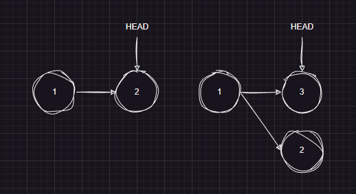
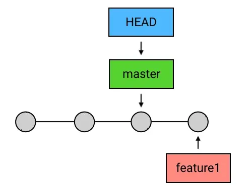
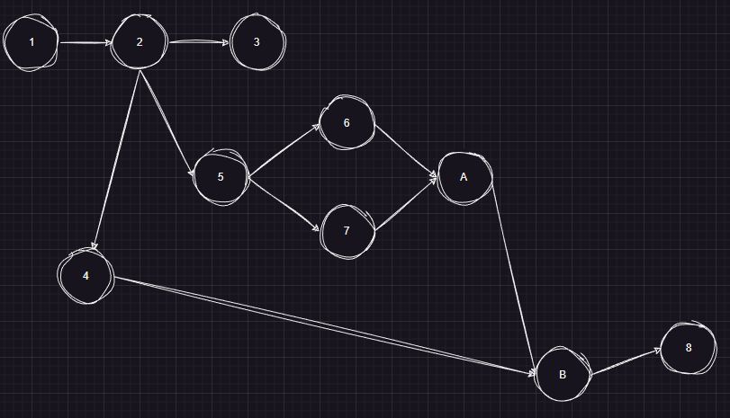
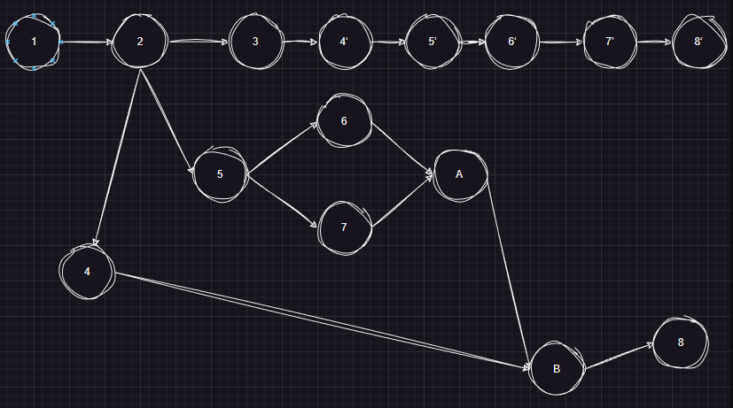
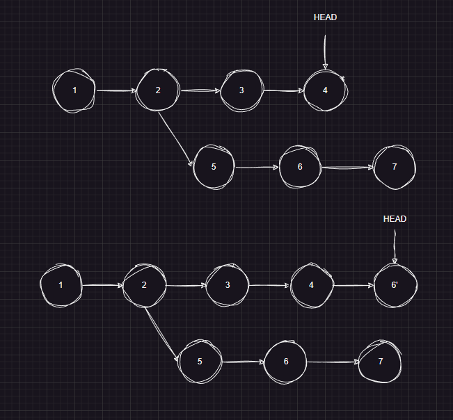
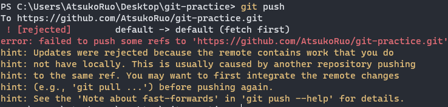
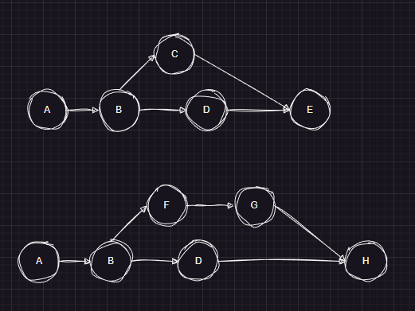
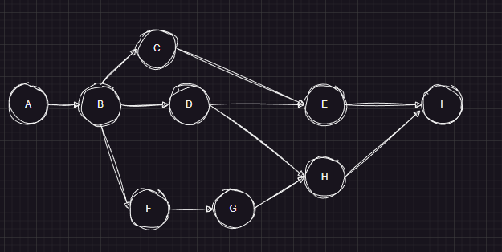

# Git

[TOC]

## 概述

Git是**分布式版本控制系统（Distributed Version Control System - DVCS）**。在分布式架构下，每一位开发人员在本地维护一份代码仓库，当需要同步数据（拉/推）时，就与中央仓库交互，期间可能要解决数据冲突的问题。显然这种设计保证了数据的最终一致性。由于每个机器都有完整的本地仓库，所以存储需求要比中央式 VCS 要高。因此DVCS只适合管理文件资产，对于多媒体资产，中央仓库是一种更好的选择。

Git 保存的不是文件的变化或者差异，而是一系列不同时刻的 **快照** 。Git的四大部分：

- **工作目录（Work Directory）**
- **暂存区（Stage）**
- **本地仓库（Repository）**
- **远程仓库（Remote）**


你工作目录下的每一个文件都不外乎这两种状态：

- **已跟踪** ：那些被纳入了版本控制的文件。
- **未跟踪** ：未被Git跟踪的文件。


Git中主要的对象分为以下四种类型


- `Blob`
- `Tree `
- `Commit`
- `Tag`

它们具有Immutable（不可修改）特性。在构建对象时，先将对象使用`Zlib`进行压缩，再用对象的内容作为`SHA-1`算法的输入，将该算法输出40个字符长度的`SHA-1`值作为该对象的引用，在不冲突情况下，可以用至少6个字符长度的`SHA-1`作为对象的引用。然后Git把对象存储在Git Object Database（在文件系统中存储），一般按以下规则组织存储：对象的`SHA-1`的前2位作为目录名，而后38位作为文件名。


## 基本命令

~~~shell
git config --global user.name "Your Name"
git config --global user.email "email@example.com"
git config --global -l		 #查看全局配置
~~~

初始化仓库：

- 创建一个仓库

  ~~~shell
  git init
  ~~~

  若在创建仓库时，当前目录下有文件或者子目录，那么Git将这些标记为未跟踪的。

- 克隆一个仓库

  ~~~shell
  git clone <repository_url> <new_directory_name>`
  ## <new_directory_name>可选
  ~~~

  

`git add `命令将文件更新到暂存区。如果文件处于特殊状态（未跟踪、冲突），那么相应地Git将其标记为已跟踪的或者冲突已解决的。

~~~Shell
git add
git add . 				#将工作目录下的所有文件以及文件夹添加到暂存区中
git add 1.c 2.c			#add多个文件
git add Note/ 			#add目录
~~~


`git commit`：

- `--amend`：重新提交一次。避免修补小错误时而使提交记录混乱。

  

- `-m`：说明提交信息，如果未添加该选项，那么自动跳转到VIM中来补充提交信息

- `-a`：将工作区中所有已跟踪文件提交，相当于跳过git add。


要删除文件时，不要简单的在工作目录中执行本地删除命令，否则暂存区中的文件得不到删除。使用`git rm`命令，Git会同时在工作区以及暂存区中删除该文件。`git rm --cached`命令将文件仅从暂存区中删除，且不再跟踪该文件文件移动或者重命名也是如此，要使用`git mv`命令，`git mv`指令当于运行了下面三条命令：

~~~shel
$ mv README.md README
$ git rm README.md
$ git add README
~~~


`git log`打印从初始节点到当前HEAD所指向的Commit所有路径上的提交记录

-  `--graph`打印当前分支到根节点的所有提交 。`--all`与`--graph`配合使用，以图的形式打印全部提交，不仅仅打印出当前分支到根节点这一条路径上的提交。
-  `--pretty=oneline` or `--oneline`：精简输出


`git diff`

- `git diff --staged`：查看暂存区和上一条 `commit` 的区别
- `git diff`：查看工作目录和暂存区的区别
- `git diff HEAD`：查看工作目录和上一条 `commit` 的区别


`git reset`可以进行撤回操作，即HEAD以及它所指向的Branch一起向前移动。git reset有三种工作模式，即`--soft`、`--mixed`（默认方式）与`--hard`。

-  `--soft`：不会改变工作目录和暂存区的内容。

   

- `--mixed`（默认参数）：改变暂存区内容，但不会改变工作目录。

  

- `--hard`：工作目录和暂存区内容全部改变 

  


我们可以在工作目录下创建一个`.gitignore`文件，说明要忽略的**未跟踪**文件。

~~~
*.txt			# 匹配工作目录中（包括子文件夹中的）所有以txt结尾的文件（夹）
/*.txt			# 在工作目录中（不包括子文件夹中的）所有以txt结尾的文件（夹）
!666.txt		# 不排除666.txt文件（夹）
test/			 # 也可以直接指定一个文件夹，文件夹下的所有文件将全部忽略
xxx/*.txt		 # xxx目录中所有以txt结尾的文件，但不包括子目录
xxx/**/*.txt 	 # 目录中所有以txt结尾的文件，包括子目录

~~~


清理无用的提交（没有一个分支的路径包含这个提交）

~~~shell
git gc --prune=now
~~~

## 分支


`HEAD` 是 一个指向 `commit` 或者 `branch` 的引用，并且是唯一的。当它指向某个 `branch` 的时候，会通过这个 `branch` 来间接地指向某个 `commit`；另外，当 `HEAD` 在提交时自动向前移动的时候，它所指向的分支也随之移动。`HEAD^`  `HEAD~1`指向上一个提交， `HEAD^^`  `HEAD~2`上上个提交，以此类推。如果`HEAD~N`遇到分叉，那么它会沿着「第一父提交」的路线去找。

注意：`branch` 包含了从初始 `commit` 到它所指向的`commit`的所有路径，而不是仅仅一条路径。


- **创建分支**

  - `git branch <name>`在HEAD位置上创建一个分支，但不会切换过去。这里的切换是指HEAD的移动

  - `git checkout -b <name>`创建并切换，它是以下两条命令的缩写：

    ~~~shell
    $git branch iss53
    $git checkout iss53
    ~~~

- **移动HEAD**：`git checkout <name>`。

  - `<name>`是分支名、SHA-1
  - 移动HEAD时，工作目录以及暂存区都替换为当时的版本快照。
  - HEAD所指向的分支并不会一起移动

- **移动分支**：`git branch -f <branch-name> <commit>`

  - `<commit>`可以是HEAD、分支名、SHA-1
  - `HEAD`所指向的分支不能移动

- **删除分支**：`git branch -d <name>`：删除指定分支。`-D`强制删除。

  - 删除 `branch` 的操作也只会删掉这个引用，并不会删除任何的 `commit`
  - `HEAD` 指向的 `branch` 不能删除
  - 出于安全考虑，如果某个分支的一些提交并没有出现在上游分支的任何一条路径上 ，那么在删除时会失败。此时，用`-D`代替`-d`，来强行删除

- **查看分支**

  - `git branch`：查看本地分支
  - `git branch -a`：查看所有的本地分支以及远程分支。

- **更名分支**：`git branch -M <oldname> <newname>`，可省略`oldname`，就对当前分支更名。


`git merge <name>`，将当前分支与指定分支合并，然后做一次提交，当前分支指向这次提交。

~~~shell
git checkout master
git merge iss53
~~~


下面来看三种特殊情况：

- 冲突：如果Git发现在两个提交中，相同路径下的文件内容是不一样的，那么Git暂停这次提交操作，进入「merge 冲突待解决」中间状态。此时，我们要根据Git给出的提示手动解决冲突，然后`git add`冲突文件，最后`git commit`，此时`git`继续完成合并操作。我们也可以`git merge --abort`来放弃这次合并。

- HEAD 领先于目标 commit：什么也不做

- HEAD 落后于目标 commit——`fast-forward`

  

`Feature Branching` 工作流：

1. 任何新的功能（feature）或 bug 修复全都新建一个 `branch` 来写；
2. `branch` 写完后，合并到 `master`，然后删掉这个 `branch`。


Git 仓库服务提供方提供了 `Pull Request` 功能

1. 首先 Fork 他人的仓库（不是Clone）
2. 本地修改，提交，Push到自己的仓库上
3. 发送Pull Request
4. 开始讨论
5. 作者觉得可以，合并到主分支上，并关闭这个Pull Request


`git rebase`变基：将当前分支变基到指定分支上。


它的原理是

1. 找到这两个分支（即当前分支 `experiment`、变基操作的目标基底分支 `master`）的最近共同祖先 `C2`
2. 对比当前分支相对于该祖先的历次提交，并提取出来临时保存
3. 将当前分支指向目标基底 `C3`
4. 将之前提取出来的commit依次提交

`git rebase`合并冲突的解决方式和`git merge`相同，不过在手动解决完冲突后，需调用 `git rebase --continue`，以便 Git 继续处理变基的其余部分。通过`git rebase --abort`停止 `rebase` 操作，并重置回 `rebase` 开始前的状态。

一个更复杂的案例：






`git cherry-pick <name>`：将指定分支所指向的版本复制到当前分支上。原理与`git rebase`类似。示例：

~~~shell
git cherry-pick 6
~~~



出现冲突后，可使用`git cherry-pick --continue`或者`git cherry-pick --abort` 

## 远程仓库

关于远程仓库的操作

- 创建：`git remote add <shortname> <url>`。注意还没有该仓库的数据，必须通过`git fetch`来下载数据。
- 查看：`git remote`，`-v` 同时列出对应的URL以及权限。
- 重命名：`git remote rename <old_name> <new_name>`。
- 删除：`git remote remove <name>`

注意：远程仓库的HEAD一直指向默认的分支上


推/拉数据

- `git pull` 其实就是 `git fetch` 和 `git merge` 的简写。

  ~~~shell
  git pull <远程主机名> <远程分支名>:<本地分支名>
  ~~~

  ~~~shell
  git pull origin master:brantest
  ~~~

  将远程主机 `origin` 的 `master` 分支拉取过来，与本地的 `brantest` 分支合并。

- ~~~shell
  git push <远程主机名> <本地分支名>:<远程分支名>
  ~~~
  
  - 删除主机的分支可以使用 `--delete` 参数，以下命令表示删除 `origin` 主机的 `master` 分支：`git push origin --delete master`
  - 如果在远程仓库中没有指定的远程分支名，那么就会创建一个远程分支。
  
  
  
  

当执行`git push`，如果本地仓库中分支上没有远程仓库对应分支上的某些提交时，那么`git push`被拒绝执行。这是因为`push` 会用本地仓库的提交记录去覆盖远端仓库的提交记录，如果此时强行提交，那么会远程仓库会丢失掉一些提交，这是Git不允许的行为。





我们可以使用`git pull`来解决该问题。当`git pull`发现提交冲突时，它就会把远端分支和本地分支进行合并，自动生成一个新的 `commit`




「上游分支」 是指与本地分支绑定的远程分支。它通常作为`pull/push`命令中缺省的目标分支。

- 创建绑定关系

  - `git checkout -b <branch> <remote>/<branch>`。创建一个跟踪分支


  - `git branch -u <remove>/<branch>`或者`git branch --set-upstream-to <remove>/<branch>`，令当前分支跟踪某个远程分支

  - `git push -u origin <branch>` 


  - 当克隆一个仓库时，它通常会自动地创建一个跟踪 `origin/defualt` 的 `defualt` 分支


- 查看所有跟踪分支：`git branch -vv`
- 解除绑定关系：·`git branch --unset-upstream branch_name`
- 删除远程分支：`git push origin --delete branch_name`


## 子模块

`git submodule add <submodule_url> <name>` 命令可以在项目中创建一个子模块。然后运行`update`命令，下载子模块的内容。

```bash
git submodule update --init --recursive
```

**子模块内部的版本控制体系是独立于父模块的**，但是子模块的添加与删除还是要在父模块中记录的。


 `git submodule foreach` 可批量在每个子模块中执行命令

~~~bash
git submodule foreach 'git pull origin default'
~~~


删除子模块：

~~~shell
git submodule deinit project-sub-1
git rm project-sub-1
git commit -m "delete submodule project-sub-1"
~~~

