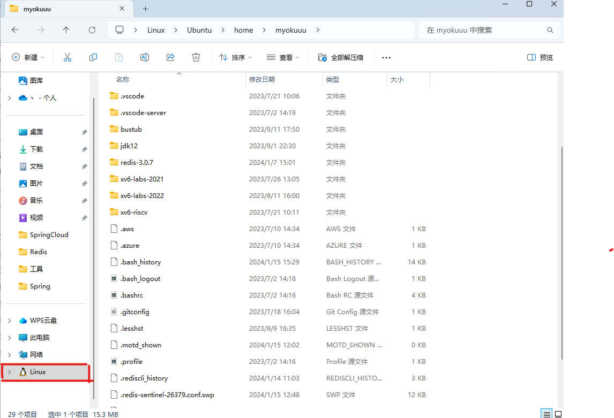
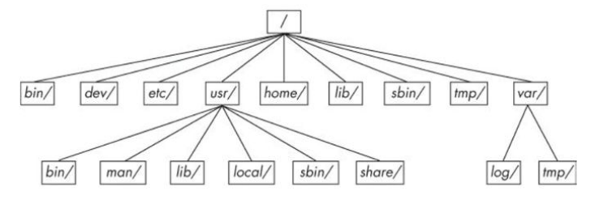
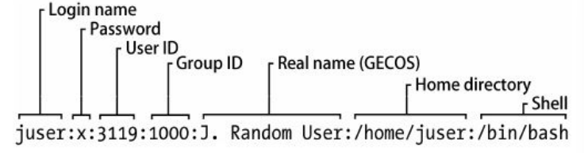
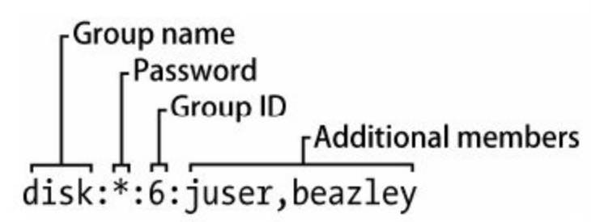
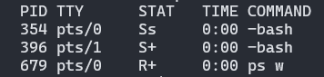
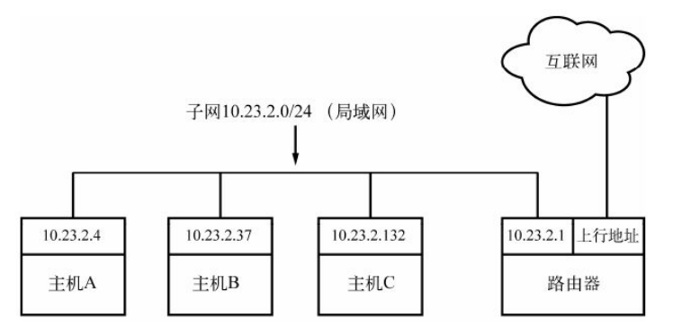
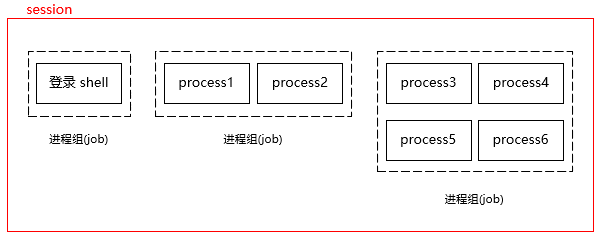

# Linux

[TOC]

## 概述

除了 init 以外，Linux 中的所有用户进程都是通过 `fork()` 来启动的。

虚拟设备对于用户进程而言是物理设备，但其实它们都是在内核上实现的，例如随机数生成器（/dev/random）

## 远程连接

~~~shell
$ scp 本地文件 -r root@124.70.201.56:~/tomcat
$ ssh root@117.88.47.10
~~~

可以在Windows下访问WSL2的文件系统

~~~
\\wsl.localhost\Ubuntu\home\myokuuu
~~~

## 基础命令

Unix的shell有很多种，它们都是基于 Bourne shell（/bin/sh）。而Linux使用了一个增强版本的 Bourne shell —— Bourne-again shell（BASH）

`CTRL-D`：终止当前终端的标准输入

`CTRL-C`：终止当前进程的运行

`CTRL-Z`：暂停当前进程运行

命令行

- `CTRL-B` 左移光标
- `CTRL-F` 右移光标
- `CTRL-A` 移动光标至行首
- `CTRL-E` 移动光标至行尾

`cat` 显示文件的内容

~~~bash
cat file1 file2 ...
~~~

当不指定参数时，cat适用内核的标准输入流（终端输入）来获取数据

`ls` 显示指定目录，缺省为当前目录：

- `-l`：显示详细的列表
- `-F`：显示文件类型信息

`cp` 复制文件

~~~bash
cp file1 file2

# 将多个文件(file1 ... fileN)复制到目录 dir
cp file1 ... fileN dir
~~~

`mv` 重命名文件/移动文件

~~~bash
# 重命名
mv file1 file2

# 将多个文件移动到某个目录
mv file1 ... fileN dir
~~~

`touch`  创建文件。如果文件已经存在，则会更新文件的时间戳

~~~bash
touch file1 file2 ...
~~~

`rm` 删除文件

`echo`  将它的参数（环境变量）显示到标准输出中。

~~~bash
echo Hello again.
# Hello again

echo $PATH
# 输出环境变量PATH
~~~

`cd` 设置当前工作目录。如果不指定参数，那么返回到个人主目录中（`~`）

`mkdir` 创建新目录

~~~bash
mkdir dir
~~~

`rmdir` 删除空目录

~~~bash
# 删除空目录
rmdir dir

# 删除目录
rm -rf
~~~

`*`匹配任意个字符，`?`匹配一个字符

`grep` 显示在文件或输入流中，与参数匹配的行

- `-i`：不区分大小写
- `-v`：反转匹配，显示所有不匹配的行

`less` 查看大文件

- 按空格键可查看下一屏，B 键查看上一屏，Q 键退出。
- 使用 /word 从当前位置向前搜索word这个词
- 使用 ?word 从当前位置向后搜索。
- 当找到一个匹配的时候，按 N 键可以跳到下一个匹配。

`pwd` 输出当前的工作目录名

- `-P`：显示当前目录符号链接实际指向的目录名

`diff` 查看两个文件之间的不同

~~~bash
diff file1 file2
~~~

`file` 显示文件的格式信息

`find dir -name file -print` 查找文件

- 使用模式匹配参数（如`*`），但是必须加引号（`'*'`），以免shell自动将它们展开

`locate` 与 `file` 类似，但是它在系统创建的文件索引中查找文件。这个索引由操作系统周期性地进行更新，查找速度比 `find` 更快。但是 `locate` 对于查找新创建的文件可能会无能为力，因为它们有可能还没有被加入到索引中。

`head` 显示显示文件的前 N 行内容，缺省为 10 行

- `-n`：指定要显示的行数

~~~bash
head -5 /etc/passwd
~~~

`tail` 显示文件后 N 行内容

在 Linux 和 Unix 系统中，以`.`开始的文件是隐藏文件。 这些被称为 dot 文件。 Shell 通配符（比如 `*`）默认情况下不会匹配这些点文件，除非明确指定`.*`

`ls -a` 可以显示出 dot 文件。

- 硬限制（Hard Limit）是用户或进程在任何时候都不能超过的资源限制。由 root 用户设置
- 软限制（Soft Limit）可以被用户或进程提高或降低，但不能超过硬限制。系统会按照软限制的值限制资源。

`ulimit` 命令：只对当前会话有效，而且不能超过硬限制

`limits.conf` 文件：在所有会话中有效，且重启系统后依然有效。

### 变量

shell 中可以保存一些临时变量，称作 shell 变量

~~~bash
VARIABLE_NAME="value"
echo $VARIABLE_NAME 

# 删除shell变量
unset VARIABLE_NAME
~~~

进程是不能访问到 shell 变量的，可以通过 `export` 命令，将 shell 变量提升为环境变量，这样就可以被进程访问到了：

~~~bash
export VARIABLE_NAME
~~~

~~~bash
# 创建了一个临时的环境变量
export VAR_NAME="value"
~~~

如果你想创建持久的环境变量（也就是在你每次登陆或重启后仍然存在的环境变量），你需要把 export 语句添加到你的 shell 配置文件中，如 `~/.bashrc`，`~/.bash_profile`，或 `~/.profile`。然后通过 `source` 命令开启新的 shell 会话来使改动生效。

PATH 是一个特殊的环境变量，它定义了命令路径。shell在执行一个命令的时候，会**从前往后**去这些目录中查找这个命令，直到在某个目录下**首次匹配**到这个命令。

当 shell 变量和环境变量同名时，大部分 shell 会优先考虑 shell 变量，忽略同名的环境变量。使用 unset 命令时，会同时删除同名的 shell 变量以及环境变量

### man手册

 man 获取在线帮助：

在线帮助手册章节列表

| 章节号 |            内容            |
| :----: | :------------------------: |
|   1    |          用户命令          |
|   2    |          系统调用          |
|   3    |     Unix高级编程库文档     |
|   4    | 设备接口和设备驱动程序信息 |
|   5    | 文件描述符（系统配置文件） |
|   6    |            游戏            |
|   7    |    文件格式、规范和编码    |
|   8    |      系统命令和服务器      |

~~~bash
man 5 passwd

man ls
~~~

### 重定向

重定向标准输出流 `>`

~~~bash
command > file
~~~

如果文件 file 不存在，shell 会创建一个新文件 file 。如果 file 文件已经存在，shell 会先清空文件的内容。如果不想把原文件覆盖，你可以使用 `>>` 将命令的输出结果加入到文件末尾：

重定向错误输出流 `2>`

~~~bash
ls /fffffffff > f 2> e
~~~

`2>&1` 将标准输出和标准错误输出重定向到同一个地方

~~~bash
ls /fffffffff > f 2>&1
~~~

标准输入重定向 `<`

~~~shell
head < /proc/cpuinfo
~~~

管道字符（`|`）将一个命令的执行结果输出到另一个命令:

~~~bash
head /proc/cpuinfo | tr a-z A-Z
~~~

对于重定向到 `/dev/null` 来说，内核会直接忽略输入/输出数据。

### 压缩

压缩文件

` tar -cvf archive.tar file1 file2 ...`

- `c`：压缩文件模式
- `v`：详细输出
- `f`：指定`tar`应该使用哪个文件

解压文件：

`tar -xvf archive.tar`

- `x`：解压文件模式

压缩文件：

`gzip filename`

解压文件：

`gunzip filename.gz`

## 设备管理

## 硬盘和文件系统

### 权限

-rw-r--r--

- 第一个字符`-`是文件类型 ，`-`代表常规文件
- 用户权限
- 用户组权限
- 其他权限

有些可执行文件的执行位是 `s` （setuid）而不是 `x` ，表示你必须以文件拥有者
的身份运行该文件

`chmod` 命令更改文件权限

- 数字形式：每个权限对应一个数字

  ~~~bash
  chmod 777 文件名
  ~~~

- 符号形式：使用字母 'u'、'g' 和 'o' 代表用户，群组和其他人。使用 '+'，'-' 和 '=' 表示添加，删除和设置权限。使用字母 'r'、'w' 和 'x' 代表读，写和执行权限

  ~~~bash
  # 删除群组的写权限
  chmod g-w 文件名
  
  chmod guo+rw bgDemo
  
  ~~~
  

`-R` 选项可以递归修改权限。

### 目录结构

Linux目录结构基础

- /bin 可执行文件

- /sbin 可执行系统文件

- /dev 设备文件

- /etc 系统配置文件

- /home 个人目录

- /lib  共享库代码库。

- /proc 通过一个可浏览的目录与文件接口，来存放系统相关信
  息，比如当前运行的进程和内核的信息

- /sys 类似 /proc，里面是设备和系统的信息

  - /sys/block目录中包含系统中的所有块设备文件，不过它们都是符号链接

- /tmp 临时文件。很多系统会在启动时清空/tmp目录

- /usr Linux系统文件

  - /include C编译器需要使用的头文件
  - /info GNU帮助手册
  - /local 管理员安装软件的地方

- /var 是程序存放运行时信息的地方，如系统日志、用户信息、
  缓存和其他信息。（这里有一个子目录 /var/tmp，和 /tmp 不同的是，系统不会在启动时清空它。）

- /root

  

/etc/sudoers 它定义了哪些用户或用户组可以对系统执行哪些操作，可以用来设置管理员。`user ALL=(ALL:ALL) ALL`

### 符号链接

符号链接为复杂的目录提供了便捷快速的访问方式

`ln -s target linkname`

### 设备文件

设备的类型

- 块设备
- 字符设备
- 管道设备
- 套接字设备

「主要设备号」和「次要设备号」，是内核用来识别设备的数字。相同类型的设备一般有相同的主设备号。

硬盘设备大部分都以 sd 为前缀来命名，如 `/dev/sda`，`/dev/sdb` 等。这些设备代表整块硬盘。硬盘分区用数字来标识，例如如 `/dev/sda1`、`/dev/sda2`。

终端设备 /dev/tty/*

dd 命令复制固定大小的数据块

~~~bash
dd if=/dev/zero of=new_file bs=1024 count=1
~~~

- if=file ：代表输入文件
- of=file ：代表输出文件
- bs=size ：代表数据块大小
- count=num ：代表复制块的总数
- skip=num ：代表跳过前面的num个

### 文件系统

在sdf2分区上，创建一个ext4类型的文件系统

`mkfs -t ext4 /dev/sdf2`

挂载文件系统：

- 文件系统所在设备
- 文件系统类型
- 挂载点

挂载/dev/sdf2设备到/home/extra

~~~bash
mount -t ext4 /dev/sdf2 /home/extra
~~~

### Swap

free 命令可以显示当前交换空间的使用情况

## 系统配置

### 用户信息

`/etc/passwd`

- 登录名
- 经过加密的用户密码，密码存放在 shadow 文件中。
  - `x` 代表加密过的密码存放在 shadow 文件中
  - `*` 代表用户不能登录
  - 空，表示登录不需要密码
- 用户ID
- 用户组ID
- 用户的真实名称（通常称为GECOS列）
- 用户的个人目录
- 用户使用的终端

`passwd` 可以更改用户密码，但你还可以使用 `-f` 选项来更改用户名，用 `-s` 选项来更改 shell。

### 用户组

`/etc/group` 文件中包含了用户组ID

- 用户组名
- 用户组密码
- 用户组ID
- 属于该组的用户列表

用户ID包括

- 实际用户ID（Real User ID）：实际用户ID指定了启动进程的用户是谁。基本上，这就是你登录时的ID。
- 有效用户ID（Effective User ID）：有效用户ID定义了进程执行期间的权限。系统通过这个ID来确定进程是否有权访问特定的资源。例如运行特权程序（如`sudo`）时，有效用户ID就会变为root。
- 保存的设置用户ID（Saved Set-user-ID）：

## 进程与资源

`ps` 列出所有正在运行的进程

- PID ：进程ID
- TTY ：进程所在的终端设备
- STAT ：进程状态
- TIME ：进程目前为止所用CPU时长
- COMMAND ：命令名

- `ps x` 显示当前用户的所有进程
- `ps ax` 显示系统的所有进程，包括其他用户的进程
- `ps u` 显示更详细的进程信息
- `ps w`  显示启动进程命令

`kill` 向进程发送信号，缺省为 `TERM` （或者 terminate ）

- `kill -STOP pid`  被暂停的进程仍然驻留在内存，等待被继续执行
- `kill -CONT pid` 继续执行被暂停的进程
- `kill -KILL` 强行终止进程

还可以使用数字来代替信号名，例如：`kill -9` 等同于`kill -KILL` 

`&`将任务放在后台执行。后台运行的任务可以标准输出，但无法从终端中获取输入。

`fg` 命令默认将最近一个转移到后台的任务放到前台执行。如果你有多个后台任务，你可以使用 `jobs` 命令来列出它们，然后选择你想要转移到前台的任务，用任务的编号作为 `fg` 命令的参数。

jobs 显示当前终端会话中的后台任务

将正在运行的前台任务放在后台

1.  `Ctrl + Z` 来将它暂停
2. 通过命令 `bg` 将其转移到后台执行

top 显示系统的当前状态，一些比较重要的键盘命令：

- M 按照当前内存使用量排序。

- T 按照CPU累计使用量排序。

- P 按照当前CPU使用量（默认）排序。

- u 仅显示某位用户的进程。

- f 选择不同的统计信息来显示。

- ? 为所有`top`命令显示使用情况统计。

`-p` 选项：监控指定进程

time 命令用于衡量某个命令或程序的运行时间

- user ：用户时间，指CPU用来运行程序代码的时间，以秒为单位
- system ：系统时间，指内核用来执行进程任务的时间
- elapsed ：消耗时间，指进程从开始到结束所用的全部时间，包括CPU执行其他任务的时间

`lsof` 命令列出打开的文件以及使用它们的进程

- COMMAND 
- PID ：PID
- USER ：运行进程的用户
- TYPE ：文件类型（如常规文件、目录、套接字等）
- DEVICE ：包含该文件的设备的主要代码和次要代码
- SIZE ：文件大小
- NODE ：文件的索引节点编号
- NAME ：文件名

可以提供一个文件名作为参数，这样只显示和参数匹配的条目。

`-i`参数是指查询所有网络连接，包括 TCP 和 UDP ，以下是一些典型的用法:

1. `lsof -i`：列出所有网络连接。
2. `lsof -i tcp`：列出所有TCP网络连接。
3. `lsof -i udp`：列出所有UDP网络连接。
4. `lsof -i :22`：列出所有在端口22（通常是SSH）上的网络连接。

PR （意思是优先级）字段显示内核当前赋予进程的调度优先级。这个数字越大，内核调用该进程的几率越小。

`nice` 命令：你可以使用 `nice` 命令来启动一个进程，并设定它的优先级

~~~bash
nice -n 19 tar -czvf archive.tar.gz /path/to/directory
~~~

`renice` 命令：如果一个进程已经在运行，你可以使用 `renice` 命令来改变它的优先级

~~~bash
renice +5 -p <pid>
~~~

在这个例子中，`+5`表示我们将 `nice` 值增加了5，这实际上降低了进程的优先级

uptime 命令显示系统的负载

~~~bash
uptime
# 16:02:18 up  2:00,  3 users,  load average: 0.70, 0.26, 0.09
~~~

当前时间是 16:02:18。系统已经运行了2小时。目前有3个用户登录。过去1分钟、5分钟和15分钟的平均系统负载分别是 0.70、0.26 和 0.09。 平均系统负载越低代表系统压力越小，性能越好。

## 网络配置

NAT转换技术

默认情况下，WSL 使用基于 NAT（网络地址转换）的网络体系结构。 使用基于 NAT 的网络体系结构时，请牢记以下注意事项：

1. 端口号都是共用的

2. 如果要在 Linux 分发版中构建网络应用，可以使用 `localhost` 从 Windows 应用访问Linux

3. 如果要从 Linux 分发版访问 Windows 上运行的网络应用，则需要使用主机的 IP 地址

   下图显示了一个示例，该示例说明如何通过 curl 连接到在 Windows 中运行的 Node.js 服务器。

   

`ifconfig` 查看主机使用中的 IP 地址

`route -n` 查看路由表

- Destination 列是网络前缀（目的地）
- Genmask 列是对应的掩码

`0.0.0.0/0`能匹配互联网中的所有IP，它是默认路由 ，其 Gateway 列的地址是默认网关

一个网卡上可以绑定多个IP:

~~~bash
ip addr add 192.168.1.2/24 dev eth0
ip addr del 192.168.1.2/24 dev eth0
~~~

`ping` 

`traceroute` 用于显示数据包从你的主机（源）到目的地主机（目标）的完整路由过程

`/etc/hosts` 做本地域名解析：

~~~shell
127.0.0.1 localhost
10.23.2.3 atlantic.aem7.net atlantic
10.23.2.4 pacific.aem7.net pacific
~~~

linux服务器配置DNS解析的三种方法：

1. 编辑**/etc/hosts**文件，利用hosts自动解析域名到ip

   ~~~bash
   vim /etc/hosts
   127.0.0.1 localhost
   10.23.2.3 atlantic.aem7.net atlantic
   10.23.2.4 pacific.aem7.net pacific
   ~~~

2. 编辑DNS客户端配置文件：**/etc/resolv.conf**

   ~~~bash
   vim /etc/resolv.conf
   nameserver 114.114.114.114
   nameserver 8.8.8.8
   ~~~

3. 假设网卡名为eth0，编辑网卡配置文件，增加DNS规则：

   ~~~bash
   vim /etc/sysconfig/network-scripts/ifcfg-eth0 
   # 添加规则
   DNS1=114.114.114.114
   DNS2=8.8.8.8
   service network restart #重启网络使配置生效
   ~~~

   

优先级：本地Hosts > 网卡配置 > 系统默认DNS配置

## Shell脚本

在执行 shell 时，会优先找出变量、通配符以及其他代词，并对它们进行替代。然后在执行命令

假设你想查找 /etc/passwd 中符合正则表达式 r.*t  

~~~shell
grep r.*t /etc/passwd
~~~

如果当前目录包含名字如 r.input 和 r.output 的文件，那么 shell 就会将 r.*t  扩展为 r.input  和 r.output ，命令就会变成：`$ grep r.input r.output /etc/passwd`

我们可以使用单引号来避免这个问题，shell 并不会单引号中的内容做替换。

双引号（"）跟单引号的效果差不多，只是shell会对双引号中的所有变量都进行扩展，对通配符不做替换。

在单引号中使用单引号：

- 将所有'（单引号）改成'\''（单引号、反斜杠、单引号、单引号）
- 用单引号包围整个字符串

Shell中的特殊变量

- `$1` ， `$2`，可获取命令中的单个参数

  ~~~bash
  #!/bin/sh
  echo First argument: $1
  echo Third argument: $3
  ~~~

  ~~~bash
  $ ./pshow one two -t
  First argument: one
  Third argument: -t
  ~~~

  shell 的内置命令 shift 能删除第一个参数`$1` ，并用后面的补上。说具体一
  点，就是`$2` 变成`$1` ，`$3` 变成`$2` ，如此类推

- `$#` 参数的数量

- `$@`，获取所有参数，参数用空格分割

- `$0` 持有脚本的名称

- `$$`：持有shell的进程号

-  `$?`：shell 执行上一个命令的退出码

`$()` 与反引号\`在功能上是一致的，都是用来完成命令替换的。命令替换是指 Shell 可以先执行`$()`，然后用标准输出替换`$()`

条件：

~~~bash
if [ $1 = hi ]; then
	echo 'The first argument was "hi"'
elif [ "$2" = "bye" ]; then
	...
else
	...
fi
~~~

上例的条件判断还有个小问题，即$1 可能会是空的，因为用户可能没有输入参数。没有参数的话，该脚本就会变成[ = hi ]，从而报错。可用以下方法来修复：

~~~bash
if [ "$1" = hi ]; then
~~~

test运算符：

- 文件运算符：
  - `-d FILE`：如果 FILE 存在且是一个目录，则为真。
  - `-f FILE`：如果 FILE 存在且是一个普通文件（不是目录或设备），则为真。
  - `-e FILE`：如果 FILE 存在，则为真。
  - ...
- 数字比较运算符：
  - `-eq`：等于。
  - `-ne`：不等于。
  - `-gt`：大于。
  - `-lt`：小于。
  - `-ge`：大于或等于。
  - `-le`：小于或等于
- 字符串运算符：
  - `=`或 `==`：比较两个字符串是否相等。
  - `!=`：比较两个字符串是否不相等。
  - `-n`：检查字符串长度是否非零。
- 逻辑运算符：
  - `! EXPRESSION`：逻辑 NOT。
  - `EXPRESSION1 -a EXPRESSION2`：逻辑 AND。
  - `EXPRESSION1 -o EXPRESSION2`：逻辑 OR。

~~~bash
if [ $a -eq $b ]; then
~~~

`command1 && command2` 这里，shel l 会执行 command1 ，如果其退出码是 0 ，就会接着执行 command2 。|| 结构也类似。如果 || 之前的命令返回了非 0 的退出码，|| 之后的命令就会被执行。

for循环：

~~~shell

# 数字
for((i=1;i<=10;i++)); do   
	echo $(expr $i \* 3 + 1);  
done  

for i in $(seq 1 10)  do   
	echo $(expr $i \* 3 + 1);  
done  

# 字符串
for i in `ls`;  do   
	echo $i is file name\! ;  
done  

for str in one two three four; do
	echo $str
done

# 路径查找
for file in /proc/*;  do  
	echo $file is file path \! ;  
done  

for file in $(ls *.sh)  do  
	echo $file is file path \! ;  
done  
~~~

~~~shell
while tail -10 $FILE | grep -q firstline; do
	echo newline >> $FILE
done
~~~

函数：

~~~bash
function demoFun() {
    echo "这是我的第一个 shell 函数!"
}

echo "-----函数开始执行-----"
demoFun
echo "-----函数执行完毕-----"
~~~

函数参数：

~~~bash
funWithParam(){
    echo "第一个参数为 $1 !"
    echo "第二个参数为 $2 !"
    echo "第十个参数为 $10 !"
    echo "第十个参数为 ${10} !"
    echo "第十一个参数为 ${11} !"
    echo "参数总数有 $# 个!"
    echo "作为一个字符串输出所有参数 $* !"
}

funWithParam 1 2 3 4 5 6 7 8 9 34 73
~~~

## 会话

当我们打开一个新的终端时，总会创建一个新的 shell Session。

Session 中的每个进程组被称为一个 job，有一个 job 会成为 session 的**前台 job(foreground)**，其它的 job 则是**后台 job(background)**。每个 session 连接一个控制终端（control terminal），控制终端中的输入被发送给前台 job，从前台 job 产生的输出也被发送到控制终端上。

当关闭终端时，内核中会将 SIGHUP 信号发送到整个 session。默认情况下，这会杀死 session 中的所有进程。但是我们可以通过nohup 命令避免这一点。

Linux后台运行命令有两种方式：

1. cmd & ： 后台运行，关掉终端会停止运行
2. nohup cmd & ： 后台运行，关掉终端不会停止运行

**Tmux 就是会话与终端窗口的"解绑"工具，将它们彻底分离。**

- 分屏（split），支持窗口任意的垂直和水平拆分。
- 保护现场（attach）：即使退出终端，tmux仍会为你保持住会话
- 会话共享

输入`tmux`命令，创建一个会话。默认情况下第一个启动的 Tmux 窗口，编号是`0`，第二个窗口的编号是`1`，以此类推。

~~~shell
tmux
~~~

下面命令**新建一个指定名称的会话**。

~~~shell
tmux new -s <session-name>
~~~

按下`Ctrl+b d`或者显式输入`exit`命令，就可以**退出 Tmux 窗口**，但会话中的进程仍然在后台运行。

`tmux ls`命令可以**查看当前所有的 Tmux 会话**。

`tmux attach`命令用于**重新接入某个已存在的会话**。

~~~shell
# 使用会话编号
$ tmux attach -t 0

# 使用会话名称
$ tmux attach -t <session-name>
~~~

`tmux kill-session`命令用于**杀死某个会话**。

~~~shell
# 使用会话编号
$ tmux kill-session -t 0

# 使用会话名称
$ tmux kill-session -t <session-name>
~~~

`tmux switch`命令用于**切换会话**。

~~~shell
# 使用会话编号
$ tmux switch -t 0

# 使用会话名称
$ tmux switch -t <session-name>
~~~

`tmux rename-session`命令用于**重命名会话**。

~~~shell
$ tmux rename-session -t 0 <new-name>
~~~

Tmux快捷键都必须键入在`ctrl + b`后才能使用。

Tmux 可以将窗口分成多个窗格（pane）.

~~~shell
# 划分上下两个窗格
$ tmux split-window

# 划分左右两个窗格
$ tmux split-window -h
~~~

`tmux select-pane`命令用来移动光标位置。

~~~shell
# 光标切换到上方窗格
$ tmux select-pane -U

# 光标切换到下方窗格
$ tmux select-pane -D

# 光标切换到左边窗格
$ tmux select-pane -L

# 光标切换到右边窗格
$ tmux select-pane -R
~~~

- `Ctrl+b %`：划分左右两个窗格。
- `Ctrl+b "`：划分上下两个窗格。
- `Ctrl+b <arrow key>`：光标切换到其他窗格。`<arrow key>`是指向要切换到的窗格的方向键，比如切换到下方窗格，就按方向键`↓`。 
- 按住 Ctrl + b，再不断按方向键可以调整大小
- `Ctrl+b {`：当前窗格与上一个窗格交换位置。
- `Ctrl+b }`：当前窗格与下一个窗格交换位置。
- `Ctrl+b Ctrl+o`：所有窗格向前移动一个位置，第一个窗格变成最后一个窗格。
- `Ctrl+b Alt+o`：所有窗格向后移动一个位置，最后一个窗格变成第一个窗格。
- `Ctrl+b x`：关闭当前窗格。
- `Ctrl+b !`：将当前窗格拆分为一个独立窗口。
- `Ctrl+b z`：当前窗格全屏显示，再使用一次会变回原来大小。
- `Ctrl+b Ctrl+<arrow key>`：按箭头方向调整窗格大小。
- `Ctrl+b q`：显示窗格编号。

