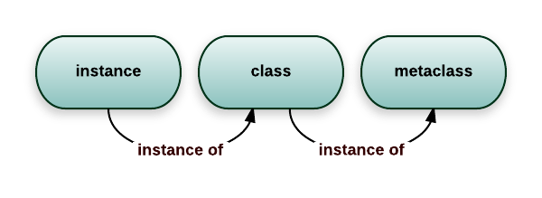

# Python速成

[TOC]

## 基础

### 变量

Python是一门动态类型的语言。我们可以在定义变量时，无需指定变量的类型。

~~~python
author = 'AtsukoRuo'				#定义了名为author的变量
print('Hello, {}!'.format(author))
~~~

我们可以在一行中同时操作多个变量：

~~~python
author, reader = 'AtsukoRuo', 'Myokuuu'			# 同时定义两个变量
author, reader = reader, author				    # 同时交换两个变量
~~~

**变量解包（unpacking）**是 Python 里的一种特殊赋值操作，允许我们把一个可迭代对象（比如列表）的所有成员，一次性赋值给多个变量：

~~~python
usernames = ['AtsukoRuo', 'Myokuuu'	]
author, reader = usernames
~~~

可以使用`()`语法，在解包时展开多层嵌套的数据

~~~python
attrs = [1, [2, 3]]
a, (b, c) = attrs
~~~

还可以使用`*`语法，贪婪地获取多个值：

~~~python
data = [1, 2, 3, 4, 5, 6]
a, *b, d = data								# 动态解包
a, b, c = data[1], data[1 : -1], data[-1]	   # 切片赋值
# 上面两个赋值语句都是等价的
# b = [2, 3, 4, 5]
# 在赋值语句中，最多出现一次*表达式
~~~

上面的变量解包操作也可以在任何循环语句里使用：

~~~python
for username, score in [('AtsukoRuo', 10), ('Myokuuu', 20)] :
    print(username)
~~~

### global / nonlocal

被`global`关键字修饰的变量，它会沿着作用域链向上查找该变量的定义，直到顶层作用域

被`nonlocal`关键字修改的变量，它只会考察上一级和本级的作用域。

### 命名与注解

在命名中，下划线`_`表示一个无意义的占位符

~~~python
# 忽略第一个和最后一个变量之间的所有变量
username, *_, score = data
~~~

有时候，我们不得不说明变量的类型，此时可以使用「**文档注释**」或者「**类型注解**」的方式来显式说明对象的类型。

~~~python
def remove_invalid(items):
    
# 文档注释    
def remove_invalid(items):
    """
    剔除 items 里面无效的元素
    :param items: 待剔除对象
    :type items: 包含整数的列表，[int, ...]
    """
    
# 类型注解
from typing import List   
def remove_invalid2(items: List[int]):
    """剔除 items 里面无效的元素"""
    
remove_invalid2("AtsukoRuo")		#OK Python不再编译器做类型检查
~~~

注意Python是动态语言，它无法限定变量的类型。所以两种方式都不能提供静态类型检查，得借助第三方工具 `mypy`来实现检查。

**在计算机科学领域，有一句广为流传的格言：「计算机科学领域只有两件难事：缓存失效和命名。」**。给变量起名主要有两种流派：

- 驼峰命名派 `CamelCase`
- 下划线命名派 `snake_case`

为了让不同开发者写出的代码风格尽量保持统一，Python 制定了官方的编码风格指南：`PEP 8`。其中包含变量的命名规范：

- 对于普通变量，使用蛇形命名法，比如 `max_value`
- 对于常量，采用全大写字母，使用下划线连接，比如`MAX_VALUE`
- 如果变量标记为“仅内部使用”（私有），为其增加下划线前缀，比如`_local_var`
- 类名应该使用驼峰风格（FooClass）、函数应该使用蛇形风格（bar_function）

如何在保证描述性的前提下，让名字尽量简短易读呢？要结合代码情境和上下文

**注释（comment）**是代码非常重要的组成部分。在Python中注释分为两种：

- **代码内注释**，通过输入`#`号来表示
- **接口注释（interface comment）**，通过`"""`注释块来表示

关于注释的几点建议：

- **不要用注释屏蔽代码**。对于不再需要的代码，应该直接把它们删掉。如果有人需要用到这些删掉的代码，那么就让他去Git仓库中找。毕竟版本控制系统就是专门干这个的。

- **不要用注释阐述细节**，而是做概括性总结，起到“代码导读”的作用。

## 基本类型

### 数值类型

在 Python 中，一共存在三种内置数值类型：**整型（int）**、**浮点型（float**）和复数类型**（complex）**：

~~~python
score = 100			# 定义一个整型
temp = 37.2			# 定义一个浮点型
com = 1 + 2j		# 定义一个复数
~~~

Python遵循`IEEE double precision floating-point`标准来实现浮点型的

`int`数值与`float`数值之间的转换：

~~~python
# 使用内置函数int，将浮点数转换为整型
int(temp)

# 使用内置函数float，将整型转换为浮点数
float(score)
~~~

可以使用下划线来分割字面值

~~~python
i = 1_000_000
~~~

在Python中，`bool`类型其实是整型的子类型。它们俩之间可以自动进行类型转换，可以显式调用内置函数`int()`以及`bool()`来完成转换

~~~python
int(True), int(False) 	# (1, 0)
True + 1				# 2
~~~

### 字符串

在Python中，字符串是一种序列类型。这意味着你可以对它进行遍历、切片等操作。

~~~python
str = 'Hello World'
~~~

多行字符串

~~~python
s = ("This is the first line of a long string, "
	 "this is the second line")

# 如果字符串出现在函数参数等位置，可以省略一层括号
def main():
logger.info("There is something really bad happened during the process. "
"Please contact your administrator.")
~~~

~~~python
message = """
	Welcome, today's movie list:
		- Jaw (1975)
	- The Shining (1980)
		- Saw (2004)
    """
#	Welcome, today's movie list:
#- Jaw (1975)
#	- The Shining (1980)
#- Saw (2004)
~~~

这种写法会破坏整段代码的缩进视觉效果，此时我们可以使用标准库textwrap中的dedent函数

~~~python
message = dedent("""\
    Welcome, today's movie list:
        - Jaw (1975)
    - The Shining (1980)
        - Saw (2004)""")

#Welcome, today's movie list:
#	- Jaw (1975)
#	- The Shining (1980)
#	- Saw (2004)
~~~

这和Java中的字符串块类似

**字符串格式化：**

- **C 语言风格**

  ~~~python
  username, score = 'piglei', 100
  
  print("Hello %s", %username)
  print('Welcome %s, your score is %d' % (username, score))
  ~~~

  占位符的语法如下：

  ~~~python
  %[(name)][flags][width][.precison]type
  ~~~

  - `%`:它标记占位符的开始。

  - | type  | 说明                                        |
    | ----- | ------------------------------------------- |
    | `s`   | 字符串（使用`str()`方法转换任何Python对象） |
    | `d`   | 十进制整数                                  |
    | `f`   | 十进制浮点数(小数), 自动保留六位小数        |
    | `...` |                                             |

  - `precison`：精度

- **新式字符串格式化（str.format）方式**

  ~~~python
  print('Welcome {}, your score is {:d}'.format(username, score))
  ~~~

  格式化的语法

  ~~~python
  {[index][:[[fill]align][sign][#][0][width][grouping_option][.precision][type]]}
  ~~~

  - `index`：支持用位置参数来格式化字符串，实现对参数的重复使用。这个时f-string所不支持的特性

    ~~~python
    username, score = 'piglei', 100
    print('{0}: name={0} score={1:d}'.format(username, score))
    ~~~

  - `fill`：填充时所用到的字符

    ~~~python
    print('{0:*^20}'.format('hello python'))
    # ****hello python****
    ~~~

  - `align`：对齐方式。配合着`width`使用

    | 符号 |   含义   |
    | :--: | :------: |
    |  <   |  左对齐  |
    |  >   |  右对齐  |
    |  ^   | 居中对齐 |

  - `precison`：精度

  

- **f-string 字符串字面量格式化表达式**

  ~~~python
  print(f'Welcome {username}, your score is {score:d}')
  ~~~

  

  

**字符串的常用操作**

- **逆转**

  ~~~python
  str[::-1]
  ''.join(reversed(str))
  
  # 上面两个是等价的
  # 注意reversed 会返回一个可迭代对象，通过字符串的 .join 方法可以将它转换为字符串
  ~~~

- **拼接**

  ~~~python
  '$'.join(["hello", "world"])
  # hello$world
  ~~~

  `join`函数接受一个可迭代对象，然后用对象来做分隔符。

- **切片**

  常用切片函数有两个`split()`、`partition()`

  ~~~python
  str.split(' ', 1 );
  ~~~

  第一个参数是分隔符（默认为空白符），第二个参数是最大分割次数（默认为-1，即分割所有）。返回一个列表

  

  ~~~python
  str.partition(splitor)
  ~~~

  splitor指定分隔符，它返回一个3元组，第一个为分隔符左边的子串，第二个为分隔符本身，第三个为分隔符右边的子串。

  ~~~python
  str = "www.runoob.com"
   
  print str.partition(".")		
  # ('www', '.', 'runoob.com')
  
  # 匹配到多个分隔符，第一个开始分割
  # 若没有匹配到分割符，那么元组的第二个、第三个元素都为空字符串''
  ~~~

  此外，还可以使用`+=`或者`append()`来追加字符串。

- **替换**

  ~~~
  str.translate(table);
  ~~~

  table就是一张映射表，从`maketrans()`方法获取
  ~~~python
  import string
  intab = "aeiou"
  outtab = "12345"
  str = "this is string example....wow!!!"
  table = str.maketrans(intab, outtab)
  print(str.translate(table))
  # th3s 3s str3ng 2x1mpl2....w4w!!!
  ~~~

- **编码与解码**

  ~~~python
  import string
  str = "Hello World"
  s = str.encode('gb2312')
  print(s.decode('UTF-8'))
  ~~~

  

## 容器类型

在 Python 中，最常见的内置容器类型有四种：

- **列表**：用来存放多个同类对象

- **元组**：和列表非常类似，但它不能被修改

- **字典**：存放的是键值对

- **集合**：
- 成员不能重复

### 可变性

Python 里的内置数据类型，大致上可分：

- **可变（mutable）**：列表、字典、集合
- **不可变（immutable）**：整数、浮点数、字符串、字节串、元组

下面我们通过一个例子来理解这个概念：

~~~python
def add_str(in_func_obj):
    print(f'In add [before]: in_func_obj = "{in_func_obj}')
    in_func_obj += ' suffix'
    print(f'In add [after]: in_func_obj="{in_func_obj}"')
~~~

~~~python
orig_obj = 'foo'
print(f'Outside [before]: orig_obj="{orig_obj}"')
add_str(orig_obj)
# 这里的 orig_obj 变量还是原来的值 foo
print(f'Outside [after]: orig_obj="{orig_obj}"')
~~~

~~~python
orig_obj = ['foo', 'bar']
print(f'Outside [before]: orig_obj="{orig_obj}"')
add_list(orig_obj)
# 这里的orig_obj已经被修改了
print(f'Outside [after]: orig_obj="{orig_obj}"')
~~~

### 列表

使用`[]`来创建一个列表字面量：

~~~python
numbers = [1, 2, 3]
~~~

使用list()内置函数，将任何一个可迭代对象转换为列表

~~~python
list('foo')		# ['f', 'o', 'o']
~~~

Python的列表既支持**「正向索引」**、也支持**「反向索引」**。而且正向索引是从`0`开始的；反向索引从`-1`开始，表示最后一个元素。

对于列表的遍历获取操作，可以使用列表切片来表述：

~~~python
# 从索引start_index开始，每次迭代索引步进step，直到end_index（不包括end_index）
list[start_index: end_index: step] 	

list[start_index : end_index]		

# step 默认为1
# start_index 默认为0
# end_index 默认为length
~~~

如果你想在遍历的同时，获取当前循环下标，可以选择用内置函数`enumerate()`：

~~~python
names = ['foo', 'bar']
for index, s in enumerate(names):
	print(index, s)
~~~

### 元组

元组是一种有序的不可变容器类型。

通过`()`来创建元组字面值，或者通过`tuple()`内置函数来创建

~~~python
t = (0, 1, 2)
t = tuple('foo')
~~~

由于不可变，不允许执行一些动态操作，例如append、del

在 Python 中，函数可以一次返回多个结果，这其实是通过返回一个元组来实现的：

~~~python
def get_rectangle():
    width = 100
    height = 20
    return width, height

result = get_rectangle()
print(result, type(result))
#(100, 20) <class 'tuple'>
~~~

将函数返回值一次赋值给多个变量时，其实就是对元组做了一次解包操作：

~~~python
width, height = get_rectangle()
~~~

具名元组在保留普通元组功能的基础上，允许为元组的每个成员命名，这样你便能通过名称而不止是数字索引访问成员。

可以使用`namedtuple`工厂函数来构造一个具名元组**类型**

~~~python
from collections import namedtuple

RectangleType = namedtuple('MyRectangle', 'width,height')	
RectangleType2 = namedtuple('MyRectangle', 'width height')
RectangleType3 = namedtuple('MyRectangle', ['width', 'height'])

rectangle = Rectangle(width=100, height=120)		#初始化具名元组
rectangle = RectangleType(100, 120)					#初始化具名元组
rectangle.width			#通过名称来访问成员
rectangle[0]			#通过数字索引访问成员

print(type(rectangle))
# <class '__main__.Rectangle1'>
~~~

### 字典

字典常见的方法有：

~~~python
# 创建一个字典
movie = {'name': 'Burning', 'type': 'movie', 'year': 2018}

#通过 key 来获取某个 value
movie['year']

#给字典添加一个新的属性
movie['rating'] = 10

#删除字典的某个键
del d[key]

#遍历获取字典所有的 key
for key in movie:
    
#一次获取字典的所有 key: value 键值对，items()方法返回一个元组
for key, value in movie.items():
    
#当用不存在的键访问字典内容时，程序会抛出 KeyError 异常

#get(key, default) 方法接收一个 default 参数，当访问的键不存在时，方法会返回 default 作为默认值
movie.get('rating', 0)

#setdefault(key, default=None)，当访问的键不存在时，那么就将default作为值插入到key中，并返回该值。如果已经存在，那么将直接返回key对应的值
d = {'title': 'foobar'}
d.setdefault('items', []).append('foo')	#{'title': 'foobar', 'items': ['foo']}
d.setdefault('items', []).append('bar') #{'title': 'foobar', 'items': ['foo', 'bar']}

#pop(key, default)，删除给定的键，并返回对应的值。如果键不存在，那么返回default
d.pop(key, None)
~~~

在 Python 3.6 版本以前，Python的字典是无序的。

~~~python
d = {}
d['FirstKey'] = 1
d['SecondKey'] = 2

for key in d :
    print(key)
# SecondKey
# FirstKey
~~~

这是因为字典的底层实现是一个HashTable。在3.6时，Python对其底层实现做了优化，一个副作用就是字典变为有序的了。并在3.7版本的语言规范中，明确规定了字典是有序的。

此外，在3.1版本中引入了`OrderedDict`，它保证了字典有序。但是它与3.7版本的字典有着微妙的区别：OrderedDict在比较时，「键的顺序」也会作为对比条件。

~~~Python
d1 = {'name': 'piglei', 'fruit': 'apple'}
d2 = {'fruit': 'apple', 'name': 'piglei'}
print(d1 == d2)
# True

from collections import OrderedDict
d1 = OrderedDict(name='piglei', fruit='apple')
d2 = OrderedDict(fruit='apple', name='piglei')
print(d1 == d2)
# False
~~~

## 集合

集合是一种**无序的**可变容器类型，它最大的特点就是**成员不能重复**。

~~~Python
#初始化一个集合
fruits = {'apple', 'orange', 'apple', 'pineapple'}
print(fruits)
# {'pineapple', 'apple', 'orange'}

# 要初始化一个空集合，只能调用 set() 方法，因为 {} 表示的是一个空字典，而不是一个空集合。
empty_set = set()

#frozenset()方法创建一个不可变集合
f_set = frozenset(['foo', 'bar'])

#.add() 方法可以向集合追加新成员
new_set = set(['foo', 'foo', 'bar'])
new_set.add('apple')

# 求集合的交集
fruits_1 & fruits_2
fruits_1.intersection(fruits_2)

# 求集合的并集
fruits_1 | fruits_2
fruits_1.union(fruits_2)

# 求集合的差集
fruits_1 - fruits_2
fruits_1.difference(fruits_2)
~~~

注意，集合里只能存放**「可哈希」（hashable）**的对象。假如把不可哈希的对象（例如，列表）放入集合，程序就会抛出 TypeError 异常。

那么可哈希对象有哪些呢？

- 所有的不可变内置类型，都是可哈希的
- 所有的可变内置类型，都是不可哈希
- 对于不可变容器类型 (tuple, frozenset)，仅当它的所有成员都不可变时，它自身才是可哈希的；
- 用户定义的类型默认都是可哈希的

## 推导式

**「推导式」**，可以方便的从一个数据序列构建另一个新的数据序列的结构体，格式为：

~~~python
out_exp_res for out_exp in input_list
out_exp_res for out_exp in input_list if condition
~~~

- `out_exp_res`：生成新元素的表达式
- `for out_exp in input_list`：通过`out_exp`给迭代出来的元素命名，可以在`out_exp_res`或者`condition`中使用
- `condition`：可以过滤列表中不符合条件的值

上述语法只能构造出一个**生成器 Generator**。

~~~python
numbers = [1, 2, 3, 4]
generator = (i % 2 == 0 for i in numbers)
print(generator)	#<generator object <genexpr> at 0x000001FFE3C18040>
~~~

但是，通过推导式创建的生成器，和通过`yield`创建的生成器，还是有些微妙差异的：

~~~python
def range(begin, end):
    while begin < end:
        yield begin
        begin += 1
print([range(1, 10)])
# [<generator object range at 0x000001CD2C8F8040>]

numbers = [1, 2, 3, 4]
generator = [i % 2 == 0 for i in numbers]
print(generator)
# [False, True, False, True]
~~~

列表的推导式

~~~python
numbers = [1, 2, 4, 5, 6]
count = 0
for i in numbers:
    if i % 2 == 0:
        count += 1
        
# 等价于
# 推导式
count = sum([i % 2 == 0 for i in numbers])
~~~

集合的推导式

~~~python
{key: value * 10 for key, value in d1.items() if key == 'foo'}
# {'foo': 30}

nums = [1, 2, 2, 4, 1]
{n for n in nums if n < 3}
~~~

字典的推导式

~~~python
names = ['Alice', 'Bob', 'Charlie']
name_lengths = {name: len(name) for name in names}
~~~

## 深复制

copy()方法、推导式、切片都是支持深复制的

~~~python
import copy
nums = [1, 2, 3, 4]
nums_copy = copy.copy(nums)	#copy库中的copy函数
nums[2] = 30
print(nums_copy)
# [1, 2, 3, 4]

nums_copy2 = nums.copy()	#有些对象支持copy方法

d = {'foo': 1}
d2 = {key : value for key, value in d.items()}
d['foo'] = 2
print(d, d2)
# {'foo': 2} {'foo': 1}

d2 = dict(d.items())		# 构造函数支持深复制
nums_copy = list(nums)

nums_copy = nums[:]			# 切片支持深复制
~~~

上述的深复制仅仅作用一层！多层嵌套对象是不支持的

~~~python
num = [1, 2, 3, 4]
num2 = [1, 2, num, 3]
num3 = [n for n in num2]

num3[1] = 100
print(num2)		#[1, 2, [1, 2, 3, 4], 3]

num3[2][2] = 1000
print(num2)		#[1, 2, [1, 2, 1000, 4], 3]
~~~

我们可以使用copy.deepcopy()来完成多层嵌套的复制

~~~python
num = [1, 2, 3, 4]
num2 = [1, 2, num, 3]
num4 = copy.deepcopy(num2)
num4[2][2] = 1000
print(num2) 	#[1, 2, [1, 2, 3, 4], 3]
~~~

## 分支

~~~python
if condition:

elif another_condition:

else :
~~~

当我们把某个对象用于分支判断时，解释器会对它进行「真值测试」。即Python解释器会自动对他们调用`bool()`内置函数：

~~~python
if fruits_list != []:
    
#等价于
if fruits_list

#等价于
if bool(fruits_list)
~~~

- 布尔值为假：None、0、False、[]、()、{}、set()、frozenset()，等等。
- 布尔值为真：上述情况的反例，以及用户定义的类和实例，等等。

Python 在计算对象的布尔值时，会考虑`__len__`以及`__bool__`方法。`__bool__`的优先级比`__len__`高。

~~~python
class UserCollection:
    """用于保存多个用户的集合工具类"""
    def __init__(self, users):
        self.items = users

    def __len__(self):
        return len(self.items)
    
    def __bool__(self):
        return True;
~~~

对象的`__eq__`方法可以重载`==`运算符：

~~~python
class EqualWithAnything:
    """与任何对象相等"""
    def __eq__(self, other):
    # 方法里的 other 方法代表 == 操作时右边的对象，比如
    # x == y 会调用 x 的 __eq__ 方法，other 的参数为 y
    return True
~~~

`is`运算符判断两个对象是否是内存里的同一个东西，无法被重载。换句话说，当你在执行 `x is y` 时，其实就是在判断 `id(x)` 和`id(y)` 的结果是否相等，二者是否是同一个对象。

~~~python
print(None is None) # True
~~~

Python解释器为整型类型使用「享元模式」，也就是说，对于从 -5 到 256 的这些常用小整数，Python 会将它们缓存在内存里的一个数组中。

~~~python
x = 100
y = 100
x is y  # True

x = 6300
y = 6300
x is y # False
~~~

`and`、`any`内置函数接受一个可迭代对象，并返回`bool`。

~~~python
all(n > 10 for n in numbers)
~~~

## 异常

~~~python
def safe_int(value):
   	try:
        return int(value)
    except TypeError:
    	print(f'type error: {type(value)} is invalid')
    except ValueError:
    	print(f'value error: {value} is invalid')
    finally:
        # finally 里的语句，无论如何都会被执行，哪怕已经执行了 return
		print('function completed')
    
        
~~~

如果一个 `try` 代码块里包含多条 `except`，异常匹配会按照从上而下的顺序进行，直到与一个类型匹配（考虑派生关系）。

我们有时会根据是否有异常，来决定调用路径

~~~python
sync_succeeded = False			# 额外使用一个标记变量
try:
    sync_profile(user.profile, to_external=True)
    sync_succeeded = True
except Exception as e:
	print("Error while syncing user profile")

if sync_succeeded:
	send_notification(user, 'profile sync succeeded')
~~~

通过`else`分支，可以简化上述代码的编写：

~~~python
try:
	sync_profile(user.profile, to_external=True)
except Exception as e:
     print("Error while syncing user profile")
else:
	send_notification(user, 'profile sync succeeded')
~~~

异常捕获语句里的 `else` 表示：仅当 `try` 语句块里没抛出任何异常时，才执行 `else` 分支下的内容。它和 `finally` 语句不同，假如程序在执行 `try`代码块时碰到了 `return` 或 `break` 等跳转语句，中断了本次异常捕获，那么即便代码没抛出任何异常，`else` 分支内的逻辑也不会被执行。

通过`raise`语句，可以抛出一个异常：

~~~python
def incr_by_key(d, key):
    try:
    	d[key] += 1
    except KeyError:
        print(f'key {key} does not exists, re-raise the exception')
        raise	# 重新抛出异常
~~~

当一个空 `raise` 语句出现在 `except` 块里时，它会原封不动地重新抛出当前异常。

`with`关键字可以在代码中开辟一段由它管理的上下文，并控制程序在进入和退出这段上下文时的行为。比如：

~~~python
with open('foo.txt') as fp:
	content = fp.read()
~~~

这个就表示，在进入时打开文件并返回文件对象`fp`，退出时关闭该文件对象`fp`。

只有满足「**上下文管理器（context manager）**」协议的对象才能使用`with`语法。它只要求实现对象`__enter__` 和 `__exit__` 两个方法即可。

~~~python
class DummyContext:
	def __init__(self, name):
		self.name = name
        
    def __enter__(self):
        # __enter__ 会在进入管理器时被调用，同时可以返回结果
        # 这个结果可以通过 as 关键字被调用方获取
        return f'{self.name}-{random.random()}'
    
    def __exit__(self, exc_type, exc_val, exc_tb):
    	# __exit__ 会在退出管理器时被调用
        print('Exiting DummyContext')
        return False
~~~

它可以用于代替`finally`语句中的清理资源语句：

~~~python
conn = create_conn(host, port, timeout=None)
try:
	conn.send_text('Hello, world!')
except Exception as e:
	print(f'Unable to use connection: {e}')
finally:
 	conn.close()
~~~

~~~python
class create_conn_obj:
	"""创建连接对象，并在退出上下文时自动关闭"""
    def __init__(self, host, port, timeout=None):
    	self.conn = create_conn(host, port, timeout=timeout)
        
    def __enter__(self):
    	return self.conn
    
    def __exit__(self, exc_type, exc_value, traceback):
        # __exit__ 会在管理器退出时调用
        self.conn.close()
        return False
    
# 使用上下文管理器创建连接
with create_conn_obj(host, port, timeout=None) as conn:
try:
	conn.send_text('Hello, world!')
except Exception as e:
	print(f'Unable to use connection: {e}')
~~~

`__exit__` 接收三个参数：`exc_type`、`exc_value` 和`traceback`。

1. `exc_type`：异常的类型。
2. `exc_value`：异常对象。
3. `traceback`：错误的堆栈对象。 

假如 `with` 管辖的上下文内没有抛出任何异常，那么当解释器触发 `__exit__` 方法时，上面的三个参数值都是`None`；但如果有异常抛出，这三个参数就会变成该异常的具体内容。

此时，程序的行为取决于 `__exit__` 方法的返回值。如果`__exit__` 返回了 `True`，那么这个异常就会被当前的 `with` 语句压制住，不再继续抛出，达到“忽略异常”的效果；如果 `__exit__`返回了 `False`，那这个异常就会被正常抛出，交由调用方处理。

> 如果你在真实项目中要忽略某类异常，可以直接使用标准库模块 contextlib 里的 suppress函数，它提供了现成的“忽略异常”功能。
>
> ~~~python
> from contextlib import suppress
> 
> with suppress(FileNotFoundError):
> 	os.remove('somefile.tmp')
> ~~~
>
> ~~~python
> try:
> 	os.remove('somefile.tmp')
> except FileNotFoundError:
> 	pass
> ~~~

`pass`关键字是用于修正Python中用代码缩进表示代码块的缺陷，是**为了语法完整性**。

可以使用`contextmanager` 装饰器，来减少创建上下文管理器对象的代码编写。

~~~python
from contextlib import contextmanager
    @contextmanager
    def create_conn_obj(host, port, timeout=None):
        """创建连接对象，并在退出上下文时自动关闭"""
        conn = create_conn(host, port, timeout=timeout)
        try:
        	yield conn 
        finally: 
        	conn.close()
~~~

以 `yield` 关键字为界，`yield` 前的**指令执行流**会在进入管理器时执行，`yield`后的**指令执行流**会在退出管理器时执行。如果要在上下文管理器内处理异常，必须用`try` 语句块包裹 `yield` 语句。

`assert` 是 Python 中用来编写断言语句的关键字。当 assert 后面的表达式运行结果为 False 时，断言语句会马上抛出 `AssertionError` 异常。

~~~python
assert value > 100
~~~

它用于开发者调试程序，可以在执行 Python 时使用 `-O` 选项直接跳过断言语句。

## 循环

在Python中，有两种循环语句：

- `for <item> in <iterable>`，需要配合一个可迭代对象 iterable 使用
- `while <expression>`

### 迭代器/可迭代对象

一个类如果实现了**「迭代器协议」**，就可以称之为**「迭代器」**。在 Python 中，实现迭代器协议就是实现以下 2 个方法：

- `__iter__`：这个方法返回对象本身，即 `self`
- `__next__`：这个方法每次返回迭代的值，在没有可迭代元素时，抛出 `StopIteration` 异常

下面给出`for`循环的等价表述：

~~~python
names = ['foo', 'bar', 'foobar']

for name in names :
    print(name)
    
    
iterator = iter(names)
while True:
    try:
        name = next(iterator)
        print(name)
    except StopIteration:
        break
~~~

下面我们就给出一个迭代器的实现：

~~~python
class A:
    """A 实现了迭代器协议 它的实例就是一个迭代器"""
    def __init__(self, n):
        self.idx = 0
        self.n = n

    def __iter__(self):
        print('__iter__')
        return self

    def __next__(self):
        if self.idx < self.n:
            val = self.idx
            self.idx += 1
            return val
        else:
            raise StopIteration()
~~~

由于索引变量`idx`生命周期，我们每次迭代时，都要新创建一个迭代器，才能符合迭代器的语义。

~~~python
a = A(10)
print(tuple(a))	#(0, 1, 2, 3, 4, 5, 6, 7, 8, 9)
print(tuple(a)) #()
a = A(10)
print(tuple(a)) #(0, 1, 2, 3, 4, 5, 6, 7, 8, 9)
~~~

那么有没有优雅的做法避免这种繁琐的写法呢？通过区分**「可迭代对象」**与**「迭代器」**，我们可以将迭代器创建和实现细节分离开来，使得迭代器的使用更加简洁。

如果一个`__iter__` 方法返回一个迭代器，那么这个对象就是「可迭代对象」。我们将上述迭代器重构下：

~~~python
class A:
    # A是迭代器 因为它实现了 __iter__ 和__next__方法
    def __init__(self, n):
        self.idx = 0
        self.n = n

    def __iter__(self):
        return self

    def __next__(self):
        if self.idx < self.n:
            val = self.idx
            self.idx += 1
            return val
        else:
            raise StopIteration()

class B:
    # B不是迭代器 但B的实例是一个可迭代对象
    # 因为它只实现了 __iter__
    # __iter__返回了A的实例 迭代细节交给了A
    def __init__(self, n):
        self.n = n

    def __iter__(self):
        return A(self.n)
~~~

### 生成器

事实上，生成器还是一种可迭代对象。通过`yield`关键字不断返回迭代值。它在简化迭代器编写的同时，也同时支持惰性求值的特性。

~~~python
def foo(start, end):
    while start < end:
        yield start
        start += 1

print(tuple(foo(3, 9)))
~~~

### 迭代工具库

`enumerate()`将一个可迭代对象和索引组合起来。在迭代时，同时给出数据和对应的索引。

~~~python
enumerate(sequence, [start=0])
~~~

- `sequence` ：一个序列、迭代器或其他支持迭代对象。
- `start` ：索引的起始值。

~~~python
index = 2
for name in names:
    print(index, name)
    index += 1
    
# 等价于
for i, name in enumerate(names, 2):
	print(i, name)
~~~

还有一些好用的迭代工具，请见`itertools`模块。

### for-else

最后，`for`循环语句还支持`else`分支，表示如果循环正常结束（不是通过break语句退出循环），便执行该分支内的语句。不太常用，了解即可

Python 语言不支持“带标签的 break”语句 ，即无法用一个break 跳出多层循环。要实现这种功能一般有两种做法：

- 标记变量：

  ~~~python
  def print_first_word(fp, prefix):
      first_word = None
      for line in fp:
          for word in line.split():
              if word.startswith(prefix):
                  first_word = word
                  # 注意：此处的 break 只能跳出最内层循环
                  break
                  
          # 一定要在外层加一个额外的 break 语句来判断是否结束循环
          if first_word:
              break
      if first_word:
          print(f'Found the first word startswith "{prefix}": "{first_word}"')
      else:
          print(f'Word starts with "{prefix}" was not found.')
  ~~~

- 封装为函数，通过`return`语句跳出循环

  ~~~python
  def find_first_word(fp, prefix):
      for line in fp:
          for word in line.split():
              if word.startswith(prefix):
                  return word
      return None
  
  def print_first_word(fp, prefix):
      first_word = find_first_word(fp, prefix)
      if first_word:
          print(f'Found the first word startswith "{prefix}": "{first_word}"')
      else:
          print(f'Word starts with "{prefix}" was not found.')
  ~~~

  

## 函数

### 定义

函数可以通过`def`关键字来定义：

~~~python
def add(x, y):
    return x + y
~~~

也可以使用一个`lambda`关键字来定义一个匿名函数：

~~~python
add = lambda x, y : x + y
~~~

函数在 Python 中是一等对象：

~~~python
sorted([1, 2, 3, 4], key=lambda i: i % 3)
~~~

### 传参

函数传参有两种形式：**位置传参**、**键值对传参**。其中「键值对传参」必须在「位置传参」之后，而默认参数必须在最后函数声明的最后。

~~~python
def foo(a, b, c, d, e = 10, f = 10):
    return

foo(2, 4, d = 10, c = 20);
~~~

我们可以在参数列表中插入 `*` 符号，这表示该符号后的所有参数都必须以键值对的形式来传参，否则程序就会抛出TypeError异常

~~~python
def query_users(limit, offset, *, min_followers_count, include_profile)

query_users(20, 0, 100, True)		# 抛出TypeError异常

query_users(20, 0, min_followers_count=100, include_profile=True) # 正确
~~~

插入`/`符号，表示之后的所有参数都必须以位置形式来传参，`/`和`*`可以混用：

~~~python
def query_users(limit, offset, *, min_followers_count, /, include_profile):
~~~

### 参数默认值

Python 函数的参数默认值只会在函数定义阶段被创建一次，之后不论再调用多少次，函数内拿到的默认值都是同一个对象：

~~~python
def append_value(value, items=[]):
    """向 items 列表中追加内容，并返回列表"""
    items.append(value)
    return items

print(append_value('foo')) # ['foo']
print(append_value('bar')) # ['foo', 'bar']
~~~

甚至你可以通过函数对象的`__defaults__`属性，直接读取这个默认值：

~~~python
print(append_value.__defaults__[0]) 	# ['foo', 'bar']
append_value.__defaults__[0].append('baz')
append_value('value')
print(append_value.__defaults__[0])	 	# ['foo', 'bar', 'baz', 'value'] 
~~~

所以，一般推荐使用不可变类型作为参数默认值。

### 可变长参数

作为函数定义时：

1. *参数收集所有未匹配的位置参数组成一个tuple对象，局部变量args指向此tuple对象

   ~~~python
   def foo(a, *args):
       print(args)
   
   foo(1)			# ()
   foo(1, 2, "3")	# (2, '3')
   ~~~

2. **参数收集所有未匹配的关键字参数组成一个dict对象，局部变量kwargs指向此dict对象

   ~~~python
   def func(x ,**kwargs):
       print(kwargs)
   
   func(1, a=2, b=3)	# {'a': 2, 'b': 3}
   func(1, 'a', 3)		# 报错
   ~~~

   

作为函数调用时：

1. *参数用于解包tuple对象的每个元素，作为一个一个的位置参数传入到函数中

   ~~~python
   my_tuple = ("wang","yuan","wai")
   temp(*my_tuple)
   
   #---等同于---#
   temp("wangyuan","yuan","wai")
   ~~~

2. **参数用于解包dict对象的每个元素，作为一个一个的关键字参数传入到函数中

   ~~~python
   my_dict = {"name":"wangyuanwai","age":32}
   temp(**my_dict)
   
   
   #----等同于----#
   temp(name="wangyuanwai",age=32)
   ~~~

   

## 装饰器

装饰器是一种通过包装目标函数来修改其行为的特殊高阶函数，**数装饰器是利用函数的闭包原理来实现的**

~~~
@cache
def function();
	...
	
def function();
# 等价于
function = cache(function)
~~~

装饰器仅仅是一种语法糖，简化对函数包装以及重新赋值的代码编写

下面我们来定义一个装饰器：

~~~python
def timer(func):						# 装饰器，接收一个目标函数func
    def decorated(*args, **kwargs):	   # 这样定义参数列表，可以接收任何形式的传参
        st = time.perf_counter();
        ret = func(*args, **kwargs)
        print("time cost : {} seconds".format(time.perf_counter() - st))
        return ret
    
	def foo(*args, **kwargs):
    def bar():
        
    return decorated		# 返回这个包装函数的引用，而foo、bar并不是包装函数，仅仅是一个普通闭包而已
~~~

使用装饰器：

~~~python
# random_sleep = timer(random_sleep)
@timer
def random_sleep():			# 这个函数的行为已经被改变
    time.sleep(random.random())
    
random_sleep()				# time cost : 0.6775921000007656 seconds
~~~

可以同时使用多个装饰器

~~~python
@foo
@bar
@cat
def dog():
    
# 等价于
dog = foo(bar(cat(dog)))
~~~

要定义带有参数的装饰器，需要两层包装函数

~~~python
def timer(print_args=False):
    def decorator(func): 				
        def wrapper(*args, **kwargs):		
            st = time.perf_counter();
            ret = func(*args, **kwargs)
            print("time cost : {} seconds".format(time.perf_counter() - st))
            return ret
        return wrapper
    return decorator
~~~

使用

~~~python
@timer(print_args=True)
def random_sleep(): ...

# 等价于
random_sleep = timer(print_args=True)(random_sleep)
~~~

在装饰器包装目标函数的过程中，函数元数据是包装函数的元数据，而不是目标函数的。

~~~python
def timer(func):		
    def decorated(*args, **kwargs):	   
        pass
    return decorated

@timer
def random_sleep():
    pass

print(random_sleep.__name__)	# decorated
~~~

这个丢失元数据的特性，在多个装饰器一起使用时，有些微妙的地方：

~~~python
def timer(print_args=False):	...

def calls_counter(func):
    counter = 0
    def decorated(*args, **kwargs):
        nonlocal counter
        counter += 1
        return func(*args, **kwargs)

    def print_counter():
        print(f'Counter: {counter}')

    decorated.print_counter = print_counter		# 给目标函数额外定义一个属性
    return decorated

@calls_counter
def random_sleep1():
    time.sleep(random.random())

@timer(print_args=True)
@calls_counter
def random_sleep2():
    time.sleep(random.random())

    
random_sleep1.print_counter()		# OK
random_sleep2.print_counter()		# 'function' object has no attribute 'print_counter'
~~~

`random_sleep2`并没有`print_counter()`属性。这是因为`random_sleep2`被Python解释器重新赋值为`timer(calls_counter(random_sleep2))`，而`timer`函数并没有`print_counter()`属性。要解决这个问题，我们需要在装饰器内包装函数时，使用`functools` 模块下的 `wraps()` 函数，来保留原始函数的额外属性。

~~~python
from functools import wraps

def timer(func):
    @wraps(func)
    def decorated(*args, **kwargs):
        ...
    return decorated
~~~

对`decorated()`添加 `@wraps(fun)` ，`wraps()` 首先会基于 `func` 来更新包装函数`decorated` 的名称、文档等内置属性，之后会将 `func`的所有额外属性赋值到 `decorated` 上.

当我们定义接收参数的装饰器时，即便所有参数都是有默认值的可选参数，你也必须在使用装饰器时加上括号：

~~~python
@delayed_start(duration=2)

@delayed_start()
~~~

那么有没有什么办法，能让我们省去那对括号，直接使用`@delayed_start` 这种写法呢？

~~~python
def delayed_start(func=None, duration=1):
    def decorator(_func):
		def wrapper(*args, **kwargs):
           
       	return wrapper
    
    if func is None:
        return decorator
    else :
        return decorator(func)
~~~

### 类装饰器

相比传统做法，用类来实现装饰器（实例替换）的主要优势在于，可以更方便地管理装饰器的内部状态，同时也可以更自然地为被装饰对象追加额外的方法和属性。

可以用类来实现装饰器，前提是该类实现了`__call__`方法，那么它的实例也会变成**可调用对象**

~~~python
class Foo:
    def __call__(slef, name):
        print(f'Hello, {name}')

foo = Foo()	
print(callable(foo))		# True
foo('Python')				# Hello, Python
~~~

实际上，类实现的装饰器可分为两种

- **「函数替换」**：

  ~~~python
  class Timer:
      def __init__(self, print_args):
          self.print_args = print_args
  
      def __call__(self, func):
          @wraps(func)
          def decorated(*args, **kwargs):
              pass
  
          return decorated
  
  # foo = Timer(print_args_False)(foo)
  @Timer(print_args=False)
  def foo():
      pass
  
  # foo = Timer()(foo)
  @Timer()
  def foo():
      
  # foo = Timer(foo)， 此时__init__必须有一个参数来接收foo函数
  @Timer
  def foo():   
      
      
  ~~~

- **「实例替换」**：

  ~~~python
  class DelayedStart:
      def __init__(self, func):
          update_wrapper(self, func)			# update_wrapper 与前面的 wraps 一样，都是把被包装函数的元数据更新到包装者(在这里是DelayedStart 实例上)
          self.func = func
  
      
      def __call__(self, *args, **kwargs):
          print(f'Wait for 1 second before starting...')
          time.sleep(1)
          return self.func(*args, **kwargs)
  
      def eager_call(self, *args, **kwargs):
          print('Call without delay')
          return self.func(*args, **kwargs)
  ~~~

  使用：

  ~~~python
  # 相当于 hello = DelayedStart(hello)
  @DelayedStart
  def hello():
      print('Hello World')
  
  print(hello)				# <__main__.DelayedStart object at 0x0000023C2C9F5150>
  print(type(hello))			# <class '__main__.DelayedStart'>
  hello()
  hello.eager_call()
  ~~~

  创建带有参数的修饰器

  ~~~python
  class DelayedStart:
      def __init__(self, func, duration=1):
          update_wrapper(self, func)
          self.func = func
          self.duration = duration
      def __call__(self, *args, **kwargs):
          print(f'Wait for {self.duration} second before starting...')
          time.sleep(self.duration)
          return self.func(*args, **kwargs)
  
      def eager_call(self, *args, **kwargs):
          pass
      
  # delayed_start = DelayedStart(delayed_start)
  @DelayedStart
  def delayed_start(**kwargs):
      return functools.partial(DelayedStart, **kwargs)
  
  
  # delayed_start是一个函数，可以用作装饰器通过 partial 构建一个新的可调用对象，这个对象接收的唯一参数是待装饰函数 func
  
  # hello = delayed_start(deration = 2)(hello)
  @delayed_start(duration=2)
  def hello():
      print("hello World")
      
  ~~~

## 类

在 Python 里，所有的类属性和方法默认都是公开的。通过添加双下划线前缀 `__` 的方式约定方法、属性为私有，但是还是可以访问到这些方法、属性的。这与Python的设计哲学有关**「We are all consenting adults here」**，

当你使用 `__{var}` 的方式定义一个私有属性时，Python解释器只是将它重新命名为`_{class}__{var}`:

~~~python
class Foo:
    def __init__(self):
        self.__bar = 'baz'
    def __foo__(self):
        pass

foo = Foo()
foo.__foo__()			# OK
print(foo.__bar)		# Foo object has no attribute '__bar'
print(foo._Foo__bar)	# OK
~~~

Python还有**「类属性」**，类似于Java中的静态变量，它被所有`类对象`的`实例对象`所共有，在内存中只存在一个副本

~~~python
class People:
    name = "Tom"
    __age = 16
~~~

实例和类都有一个`__dict__`属性，其中

- 实例的 `__dict__` 里，保存着当前实例的所有数据
- 类的 `__dict__` 里，保存着类的文档、方法等所有数据

~~~python
class Person:
    def __init__(self, name, age):
        self.name = name
        self.age = age
    def say(self):
        print(f"Hi, My name is {self.name}, I'm {self.age}")

p = Person('AtsukoRuo', 10)
print(p.__dict__) # {'name': 'AtsukoRuo', 'age': 10}

print(Person.__dict__)
# {'__module__': '__main__', '__init__': <function Person.__init__ at 0x0000024027FE6200>, 'say': <function Person.say at 0x0000024027FE62A0>, '__dict__': <attribute '__dict__' of 'Person' objects>, '__weakref__': <attribute '__weakref__' of 'Person' objects>, '__doc__': None}
~~~

类还有`__setattr__`方法，在修改属性时就会触发该方法，类似于`Java`中的`setter`方法。

~~~python
class Person:
    def __setattr__(self, name, value):
        if name == 'age' and value < 0:
            raise ValueError('Invalid age value')
        super().__setattr__(name，value)
        
p.age = -3 # Error
~~~

直接通过`__dict__`方法来修改可以避免触发`__setattr__`

通过`def`定义的方法，如果通过实例对象来调用，那么将实例对象本身传递给第一个参数。

~~~python
class Duck:
    def quack(self):
        pass
    def foo():		# Error
    
duck = Duck()
duck.quack()
Duck.quack(duck)
~~~

用`@classmethod`装饰的方法，为一个类方法。通过类或者实例对象来调用时，将对应的类类型传递给第一个参数

~~~python
class Duck:
    def __init__(self, color):
        self.color = color

    def quack(self):
        pass

    @classmethod
    def create_random(cls):
        print(cls)
        color = random.choice(['yellow', 'white', 'gray'])
        return cls(color = color)

Duck.create_random()		# <class '__main__.Duck'>
duck = Duck('red')
duck.create_random()		# <class '__main__.Duck'>
    
~~~

通过`@staticmethod`来定义一个静态方法：

~~~python
class Cat:

    @staticmethod
    def get_sound():
        pass

Cat.get_sound()
cat = Cat()
cat.get_sound()
~~~

通过`@property`将一个方法转换为一个属性，要求该方法只能接受`self`参数

~~~python
class FilePath:
    def __init__(self, path):
        self.path = path
    @property
    def get_basename(self):
        return self.path.split(os.sep)[-1]

file = FilePath("is")
file.get_basename
~~~

`@property` 除了可以定义属性的读取逻辑外，还支持自定义写入和删除逻辑：

~~~python
class FilePath:
    def __init__(self, path):
        self.path = path
    @property
    def basename(self):
        return self.path.split(os.sep)[-1]

    @get_basename.setter	
    def basename(self, name):				# 必须要同名
        new_path = self.path.rsplit(os.sep, 1)[:-1] + [name]
        self.path = os.sep.join(new_path)

    @get_basename.deleter
    def basename(self):
        raise RuntimeError('Can not delete basename!')

p = FilePath('/tmp/foo.py')
p.basename = 'bar.txt'
del p.basename
~~~

定义 `setter` 方法，该方法会在对属性赋值时被调用

定义 `deleter` 方法，该方法会在删除属性时被调用

### 鸭子类型

在鸭子类型编程风格中，编码者不应该关心对象的类型（类型检查），只应该关心对象是否支持某些操作（行为）。

鸭子类型里的所有接口和协议都是隐式的，它们全藏在代码和函数的注释中。过于灵活、缺少规范。

由于Python是动态语言，所以**所以不存在父类引用指向子类对象的多态体现**，但是可以通过鸭子类型，来实现多态的特性：

~~~python
class Cat:
  def say(self):
    print("meow")

class Dog:
  def say(self):
    print("woof")
  
def animal_say(animal):
  animal.say()

cat = Cat()
dog = Dog()

animal_say(cat) # meow
animal_say(dog) # woof
~~~

### 抽象类

抽象类作为一种特殊的基类，为我们提供了另一种更灵活的子类化机制。下面我们看一个例子：

~~~python
from collections.abc import Iterable

class ThreeFactory:
    def __init__(self, repeat):
        self.repeat = repeat

    def __iter__(self):
        for _ in range(self.repeat):
            yield 1

print(isinstance(ThreeFactory(3), Iterable)) # True
~~~

虽然 `ThreeFactory` 没有显式继承抽象类 `Iterable` ，但是`isinstance()`方法返回了`True`，这正是受到了抽象类的特殊子类化机制的影响。`Iterable` 抽象类对子类只有一个要求：实现了`__iter__` 方法即可。

要定义一个抽象类，你需要继承`ABC`模块中的 `ABC` 类或使用`abc.ABCMeta` 元类：

~~~python
class Validator(ABC):

    @classmethod
    def __subclasscheck__(self, C):
        if any("validate" in B.__dict__ for B in C.__mro__) :
            return True
        return NotImplemented

    def validate(self, value):
        raise NotImplementedError
~~~

在上述代码中，`__subclasshook__`方法的逻辑是，所有实现了 validate 方法的类都是我的子类。

`__subclasshook__` 是抽象类的一个特殊方法。当使用`isinstance` 检查对象是否属于某个抽象类时，这个`__subclasshook__` 方法就会被触发，然后：

- 实例所属类型会作为参数传入该方法（上面代码中的 C 参数）；
- 如果方法返回了布尔值，该值表示实例类型是否属于抽象类的子类；
- 如果方法返回 NotImplemented，本次调用会被忽略，继续进行正常的子类判断逻辑。

通过 `__subclasshook__` 类方法，我们可以定制抽象类的子类判断逻辑。这种子类化形式只关心结构，不关心真实继承关系，所以常被称为**「结构化子类」**。

抽象类还有内置的`register()`方法，它将指定的类注册成为它的子类。

~~~python
class Validator(ABC):
    pass

class Foo:
    pass

print(isinstance(Foo(), Validator))		# False
Validator.register(Foo)
print(isinstance(Foo(), Validator))		# True
~~~

总结一下，抽象类通过 `__subclasshook__` 钩子和`.register()` 方法，实现了一种比继承更灵活、更松散的子类化机制，并以此改变了 `isinstance()` 的行为。

除了更灵活的子类化机制外，抽象类还提供了一些其他功能。比如，利用 `abc` 模块的 `@ abstractmethod` 装饰器，你可以把某个方法标记为抽象方法。假如抽象类的子类在继承时，没有重写所有抽象方法，那么它就无法被正常实例化。

### 多重继承

在Python 里的一个类可以同时继承多个父类：

~~~python
class A:
    def say(self):
        print("I'm A")

class B(A):
    pass

class C(A):
    def say(self):
        print("I'm C")

class D(B, C):
    pass

D().say()
~~~

那么在复杂的继承关系下，如何确认子类的某个方法会用到哪个父类？Python 使用了一种名为
**MRO（method resolution order）**的算法。该算法会遍历类的所有基类，并将它们按优先级从高到低排好序。

调用类的 `mro()` 方法，就可以获取`MRO`算法排好序的基类列表：

~~~python
print(D.mro())
# [<class '__main__.D'>, <class '__main__.B'>, <class '__main__.C'>, <class '__main__.A'>, <class 'object'>]
~~~

当调用子类的某个方法时，Python 会按照上面的 MRO 列表从前往后寻找这个方法，假如某个类实现了这个方法，就直接返回。

实际上，`super()` 使用的其实不是当前类的父类，而是它在 `MRO` 链条里的上一个类。

### Mixin

`Mixin` 是一种把额外功能“混入”某个类的技术。在 Python中，我们可以用多重继承来实现 `Mixin` 模式。

首先定义一个`Mixin`类：

~~~python
class infoDumperMixin:
    def dump_info(self):
        d = self.__dict__
        print("Number of members: {}".format(len(d)))
        print("Details:")
        for key, value in d.items():
            print(f' - {key}: {value}')
        
~~~

Mixin 类通常很简单，只实现一两个功能，所以很多时候为了实现某个复杂功能，一个类常常会同时混入多个 Mixin 类。

再来使用它：

~~~python
class Person(InfoDumperMixin):
    def __init__(self, name, age):
        self.name = name
        self.age = age
p.dump_info() # 使用功能
~~~

 Python 中的 Mixin 模式基于多重继承实现，但令 `Mixin`模式 与普通多重继承的最大区别在于：`Mixin` 是一种有约束的多重继承。在 `Mixin` 模式下，虽然某个类会同时继承多个基类，但里面最多只会有一个基类表示真实的继承关系，剩下的都是用于混入功能的 `Mixin` 类。这条约束大大降低了多重继承的潜在危害性。

### 元类

元类是 Python 中的一种特殊对象，它控制着类的创建行为。

`type` 是 `Python` 中所有类的元类，`object`也是由`type`所创建的。它的语法是`type(name, bases, attrs)`

- `name：str`，需要创建的类名。
- `bases：Tuple[Type]`，包含其他类的元组，代表类的所有基
  类。
- `attrs：Dict[str, Any]`，包含所有类成员（属性、方法）
  的字典。

~~~python
Foo = type('Foo', (), {'bar': 3})
print(Foo)		# <class '__main__.Foo'>
~~~

更多情况下，我们会创建一个继承 type 的新元类，然后在里面定制一些与创建类有关的行为。

~~~python
class BaseClass(type):
    def __new__(cls, name, bases, attrs):
        return super().__new__(cls, name, bases, attrs)
~~~

- 

然后在定义类时，指定一个元类即可。

~~~python
class User(metaclass=BaseClass):
    def __init__(self, name, age):
        print("in User")
        self.name = name
    def foo(self):
        pass
    num = 10

user = User("AtsukoRuo", 18)
# in BaseClass
# ('User', (), {'__module__': '__main__', '__qualname__': 'User', '__init__': <function User.__init__ at 0x0000019D435ED120>, 'foo': <function User.foo at 0x0000019D43778B80>, 'num': 10})
# {}
# in User
~~~

当我们对普通类进行实例化时，实际是对一个元类的实例进行直接调用，所以会执行元类的 `__call__`。这里不再过多介绍

## 数据模型与描述符

重载运算符

| 方法名                | 相关操作             | 说明                         |
| --------------------- | -------------------- | ---------------------------- |
| `__getitem++`         | `obj[key]`           | 按索引读取行为               |
| `__setitem++`         | `obj[key] = value`   | 按索引写入行为               |
| `__delitem++`         | `del obj[key]`       | 按索引删除行为               |
| `__len__`             | `len(obj)`           | 对象的长度                   |
| `__bool__`            | `bool(obj)`          | 对象的布尔值真假             |
| `__eq__`              | `obj == another_obj` | == 运算时的行为              |
| `__enter__、__exit__` | `with obj:`          | 对象作为上下文管理器时的行为 |
| __`iter__、__next__`  | `for _ in obj`       | 对象被迭代时的行为           |
| `__call__`            | `obj()`              | 被调用时的行为               |
| `__new__`             | `obj_class()`        | 创建实例时的行为             |
| `__str__`             | `str(obj)`           | 对象的字符串化               |
| `__repr__`            | `repr(obj)`          | 对象的调试信息               |
| `__format__`          | `format(obj)`        | 格式化输出对象               |

~~~python
class Person:
    def __init__(self, name):
        self.name = name

    def __format__(self, format_spec):
        if format_spec == 'verbose':
            return f'{self.name}'
        if format_spec == 'simple':
            return f'{self.name}'
~~~

其中 `format_spec`参数，通过字符串模板里使用`{variable:format_spec}` 语法来传递

~~~python
print('{p:verbose}'.format(p))
print(f'{p:simple}')
~~~

比较运算符

| 方法名   | 相关运算       | 说明                              |
| -------- | -------------- | --------------------------------- |
| `__lt__` | `obj < other`  | 小于（less than）                 |
| `__le__` | `obj <= other` | 小于等于（less than or equal）    |
| `__eq__` | `obj == other` | 等于（equal）                     |
| `__ne__` | `obj != other` | 不等于（not equal）               |
| __`gt__` | `obj > other`  | 大于（greater than）              |
| `__ge__` | `obj >= other` | 大于等于（greater than or equal） |

类的实例化都一定包含两个步骤： 

1. 在内存中创建对象，即开辟一块内存空间来存放类的实例

2. 初始化对象，即给实例的属性赋予初始值；

在 `python` 中，第一步由 `__new__` 函数负责，第二步由 `__init__` 函数负责。

`__new__`对当前类进行了实例化，并将实例返回，传给`__init__`的`self`。若`__new__`没有正确返回当前类`cls`的实例，那`__init__`是不会被调用的。

下面给出一个例子

~~~python
class Singleton(object):
    __instance = None

    def __new__(cls, age, name):
        if not cls.__instance:
            cls.__instance = object.__new__(cls)
        return cls.__instance
    
    def __init__(self,age,name):
        self.age = age
        self.name = name
        

a = Singleton(18, "wk")
b = Singleton(8, "mm")
~~~

### 描述符

**描述符（descriptor）**是 Python 对象模型里的一种特殊协议，它主要和 4 个方法有关： `__get__`、`__set__`、`__delete__` 和`__set_name__`。它解决了`@property`难以复用的缺点。

首先我们来定义描述符的`__get__`方法：

~~~python
class InfoDescriptor:
    def __get__(self, instance, owner=None):
        print(f'Calling __get__, instance: {instance}, owner: {owner}')
        if not instance:
            print('Calling without instance')
            return self
        return 'informative descriptor'
~~~

- `self`：描述符对象本身
- `owner`：描述符对象所绑定的类类型
- `instance`：通过实例来访问描述符属性，该参数值为实例对象；如果通过类来访问，该值为 None。

使用描述符

~~~python
class Foo:
    bar = InfoDescriptor()	# 描述符绑定到Foo类上了
~~~

这样当访问Foo对象的bar属性时，就会执行`__get__`方法

~~~python
foo = Foo()
foo.bar
# Calling __get__, instance: <__main__.Foo object at 0x00000177F3224D10>, owner: <class '__main__.Foo'>
~~~

再来添加`__set__`方法

~~~python
def __set__(self, instance, value):
    print(f'Calling __set__, instance: {instance}, value: {value}')
~~~

- `instance`：属性当前绑定的实例对象。
- `value`：待设置的属性值。

还有`__del__`方法，不再介绍。注意区分`del`与`__del__`

- del是Python的一个内置语句，可以删除集合中的元素/属性，或者删除对象的引用
- 而`__del__`是一个对象的析构方法，在Python垃圾回收器销毁对象前，会调用该方法。

下面我们来看一个实例：

~~~python
class IntegerField:
    def __init__(self, min_value, max_value):
        self.min_value = min_value
        self.max_value = max_value

    def __get__(self, instance, owner=None):
        if not instance:
            return self
        return instance.__dict__['__integer_field']

    def __set__(self, instance, value):
        value = self._validate_value(value)
        instance.__dict__['_integer_field'] = value

    def _validate_value(self, value):
        try:
            value = int(value)
        except (TypeError, ValueError):
            raise ValueError("Value is not a valid integer!")

        if not (self.min_value <= value <= self.max_value):
            raise ValueError(
                f'value must between {self.max_value} and {self.max_value}'
            )
        return value
~~~

这里使用了`instance.dict['_integer_field'] = value` 这样的语句来保存整型数字的值。为什么不直接写`self._integer_field = value`，把值存放在描述符对象`self` 里呢？

因为我们经常通过属性，来保存描述符对象：

~~~python
class Person:
    age = IntegerField(min_value = 0, max_value=150)
~~~

这样，描述符对象会被Person的各个实例共享。为了避免覆盖冲突，我们将值放在了每个实例各自的`__dict__` 字典里。

但是，这也会有覆盖冲突的问题，请看下面例子

~~~python
class Rectangle:
    width = IntegerField(min_value=1, max_value=10)
    height = IntegerField(min_value=1, max_value=5)
~~~

这样`widget`、`height`属性都共享`_integer_field`字段，可以相互覆盖。我们可以通过`__set_name__`方法来解决这个问题，它的定义如下：

~~~python
__set_name__(self, owner, name)
~~~

- owner：描述符对象当前绑定的类
- name：描述符所绑定的**属性名称**

`__set_name__` 方法的触发时机是在 owner 类被创建时。

通过`name`来生成不同的字段，避免冲突。`IntegerField`的重构代码如下：

~~~python
class IntegerField:
    def __set_name__(slef, owner, name):
        self._name = name
    
    def __set__(self, instance, value):
        value = self._validate_value(value)
        instance.__dict__[slef._name] = value
~~~

## 多线程

Python通过两个标准库`thread`和`threading`提供对线程的支持

