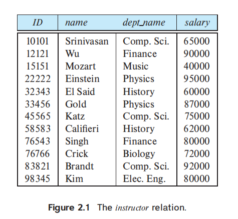
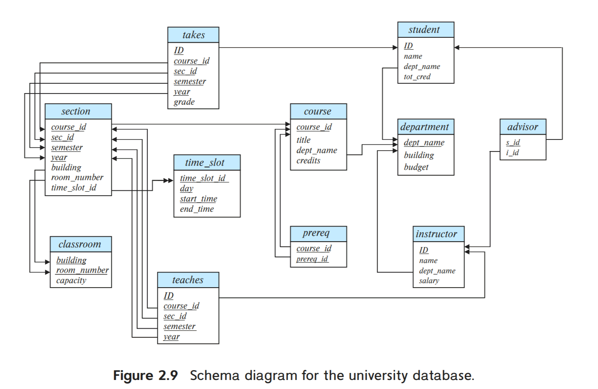
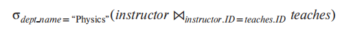
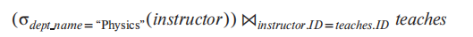
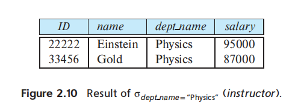
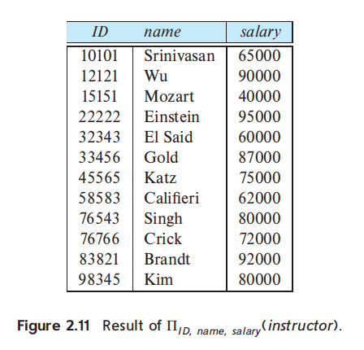
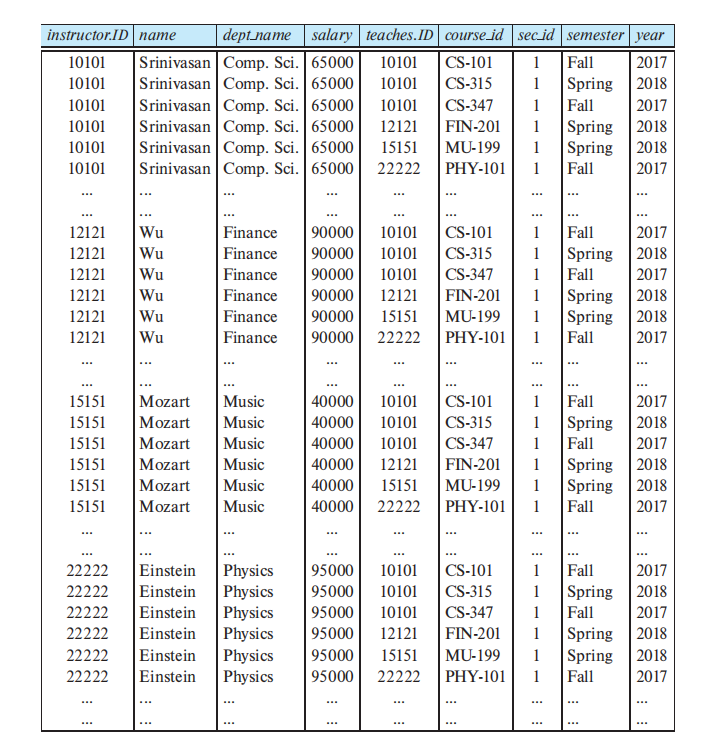
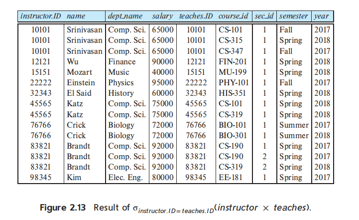
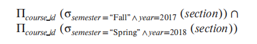
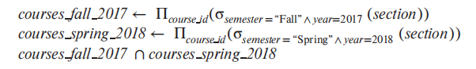

# SQL

[TOC]

## relation、tuple、attribute、domain

A relational database consists of a collection of **tables**, each of which is assigned a unique name. In general, a row in a table represents a **relationship** among a set of values. 

The schema for Figure 2.1  relation is `instructor(ID, name, dept_name, salary)`

Since a table is a collection of such relationships, there is a close correspondence between the concept of **table** and the mathematical concept of **relation**.  Thus, in the relational model the term **relation** is used to refer to a table, while the term **tuple** is used to refer to a row. Similarly, the term **attribute** refers to a column of a table.

> 二元关系的定义： Let A and B be two sets. A binary relation R from A to B is a subset of A × B

We use the term **relation instance** to refer to a specific instance of a relation, that is, containing a specific set of rows.

The order in which tuples appear in a relation is irrelevant, since a relation is a set of tuples

For each attribute of a relation, there is a set of permitted values, called the **domain** of that attribute. We require that, for all relations *r*, the domains of all attributes of *r* be atomic. A domain is **atomic** if elements of the domain are considered to be indivisible units. The **null value** is a special value that signifies that the value is unknown or does not exist. 

The relatively strict structure of relations results in several important practical advantages in the storage and processing of data. That strict structureis suitable for well-defined and relatively static applications, but it is less suitable forapplications where not only data but also the types and structure of those data change over time.

## Key

since relation is set, no two tuples in a relation are allowed to have exactly the same value for all attributes. Commercial database systems relax the requirement that a relation is a set and instead allow duplicate tuples.

A **superkey** is a set of one or more attributes allow us to identify uniquely a tuple in the relation. Formally, let *R* denote the set of attributes in the schema of relation *r*.  If we say that a subset *K* of *R* is a *superkey* for *r*, That is, if $t_1$ and $t_2$ are in $r$ and $t_1 \not = t_2$, then $t_1.K \not = t_2.K$

 If *K* is a superkey, then so is any superset of *K*. We are often interested in superkeys for which no proper subset is a superkey. Such minimal superkeys are called **candidate keys** or **primary key**. Primary key attributes are also underlined in schema：$classroom(\underline{building}, \underline{room\_number}, capacity)$. The primary key should be chosen such that its attribute values are never, or are very rarely, changed.

A **foreign-key constraint** from **attribute(s) *A* of relation *r*1** to **the primary-key *B* of relation *r*2** states that on any database instance, the value of *A* for each tuple in *r*1 must also be the value of *B* for some tuple in *r*2. Attribute set *A* is called a **foreign key** from *r*1, referencing *r*2. The relation *r*1 is also called the **referencing relation** of the foreign-key constraint, and *r*2 is called the **referenced relation**.

Note that in a foreign-key constraint, the referenced attribute(s) must be the primary key of the referenced relation. The more general case, a **referential-integrity constraint**, relaxes the requirement. It requires that the values appearing in specified attributes of any tuple in the referencing relation also appear in specified attributes of at least one tuple in the referenced relation. In fact, foreign-key constraints are a *special case* of referential integrity constraints.  Database systems today typically support foreign-key constraints, but they do not support referential integrity constraints where the referenced attribute is not a primary key.

A key (whether primary, foreign-key or super) is a property of the entire relation, rather than of the individual tuples.

## Schema Diagrams

A database schema, along with primary key and foreign-key constraints, can be depicted by **schema diagrams**

其中，双箭头表示的是参照完整性约束

## Relational Query Languages

A **query language** is a language in which a user requests information from the database.Query languages can be categorized as

- **imperative query language**, the user instructs the system to perform a specific sequence of operations on the database to compute the desired result
- **functional query language**, the computation is expressed as the evaluation of functions that may operate on data in the database or on the results of other functions; functions are side-effect free, and they do not update the program state
- **declarative query language**, the user describes the desired information without giving a specific sequence of steps or function calls for obtaining that information

There are a number of “pure” query languages

- The 「**relational algebra**」 is a functional query language and forms the theoretical basis of the SQL query language.
- The tuple relational calculus and domain relational calculus  are declarative

Relational Query Languages属于DML的**声明性查询语言（Declarative Query Language）**的范畴

### The Relational Algebra

The relational algebra consists of a set of operations that take one or two relations as input and produce a new relation as their result.

Although the two queries are not identical, they are in fact **equivalent**; that is, they give the same result. Query optimizers in database systems typically look at what result an expression computes and find an efficient way of computing that result, rather than following the exact sequence of steps specified in the query.

#### select

The **select** operation selects tuples that satisfy a given predicate：
$$
\sigma_{dept\_name = "Physics"}(instructor)
$$
In general, we allow comparisons using =, ≠, <, ≤, >, and ≥ in the selection predicate. Furthermore, we can combine several predicates into a larger predicate by using the connectives *and* (∧), *or* (∨), and *not* (¬)

#### project

The **project** operation is a unary operation that returns its argument relation, with certain attributes left out
$$
\Pi_{ID, name, salary}(instrctor)
$$

#### Cartesian-product

The **Cartesian-product** operation, denoted by a cross (×), allows us to combine information from any two relations.

Instead of *r*1 × *r*2 producing pairs (*t*1, *t*2) of tuples from *r*1 and *r*2, the relational algebra concatenates *t*1 and *t*2 into a single tuple,

#### join

 The **join** operation $r \bowtie_{\theta} s$ is defined as follows:
$$
r \bowtie_{\theta} s = \sigma_{\theta}(r \times s)
$$

#### set operation

The **Set Operation** includes $\cap$、$\cup$、$-$

we required that the relations which the set operation uses  is **compatible**

- relations have the same number of attributes; the number of attributes of a relation is referred to as its **arity**.
- When the attributes have associated types, the types of the *i*th attributes of both input relations must be the same, for each *i*.

#### assignment operaion

It is convenient at times to write a relational-algebra expression by assigning parts of it to temporary relation variables. The **assignment** operation, denoted by ←

赋值操作仅仅是把复杂的表达式命名为一个临时变量而已，并不会执行表达式的计算。

#### rename operation

**the results of relational-algebra expressions do not have a name** that we can use to refer to them. the **rename** operator denoted by lowercase Greek letter rho($\rho$) lets us give them names. 

the expression $\rho _x(E)$ returns the result of expression *E* under the name *x*. 

Assume that a relationalalgebra expression *E* has arity *n*. Then, the expression $\rho_x(A_1, A_2, ..., A_n)(E)$ returns the result of expression *E* under the name *x*, and with the attributes renamed to $A_1, A_2, ..., A_n$

####  aggregation operation

The aggregation operation allows a function to be computed over the set ofvalues returned by a query. These functions include average, sum, min, and max

