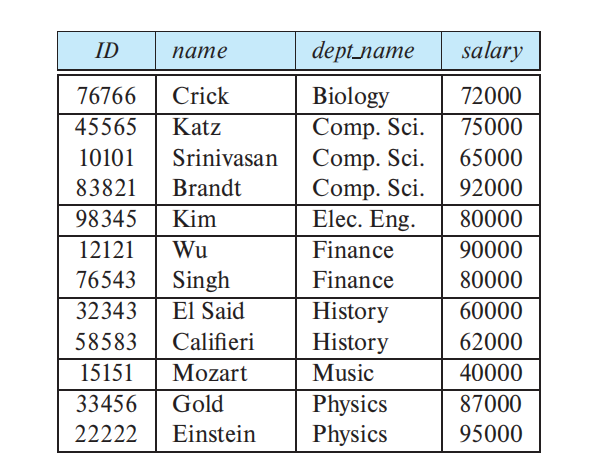

# Structured Query Language

[TOC]

## Overview

SQL, originally called Sequel,  has several parts:

- **Data-definition language** (**DDL**). 
  - **Relation**：The SQL DDL provides commands for defining relation schemas, deleting relations, and modifying relation schemas.
  - **Integrity**. The SQL DDL includes commands for specifying integrity constraints that the data stored in the database must satisfy
  - **View definition**：The SQL DDL includes commands for defining 
  - **Transaction control**：SQL DDL includes commands for specifying the beginning and end points of transactions.
  - **Authorization**. The SQL DDL includes commands for specifying access rights to relations and views.
- **Data-manipulation language** (**DML**). The SQL DML provides the ability to query information from the database and to insert tuples into, delete tuples from, and modify tuples in the database.
- **Embedded** **SQL** and **dynamic** **SQL**. Embedded and dynamic SQL define how SQL statements can be embedded within general-purpose programming languages, such as C, C++, and Java.

## Data Definition Language

###  Basic Types

The SQL standard supports a variety of built-in types, including:

- **char**(*n*): A fixed-length character string with user-specified length *n*
- **varchar**(*n*): A variable-length character string with user-specified maximum length *n*
- **int**: An integer (a finite subset of the integers that is machine dependent)
- **smallint**: A small integer (a machine-dependent subset of the integer type).
- **numeric**(*p*, *d*): A fixed-point number with user-specified precision. The number consists of *p* digits (plus a sign), and *d* of the *p* digits are to the right of the decimal point. Thus, **numeric**(3,1) allows 44.5
- **real, double precision**: Floating-point and double-precision floating-point numbers with machine-dependent precision.
- **float**(*n*): A floating-point number with precision of at least *n* digits.

Each type may include a special value called the **null** value. A null value indicatesan absent value that may exist but be unknown or that may not exist at all.

The **char** data type stores fixed-length strings. Consider, for example, an attribute *A* of type **char**(10). If we stored a string “Avi” in this attribute, seven spaces are appended to the string to make it 10 characters long. In contrast, if attribute *B* were of type **varchar**(10), and we stored “Avi” in attribute *B*, no spaces would be added. 

When comparing two values of type **char**, if they are of different lengths, extra spaces are automatically attached to the shorter one to make them the same size before comparison.

When comparing a **char** type with a **varchar** type, one may expect extra spaces to be added to make the lengths equal, before comparison; however, this may or may not be done, depending on the database system. As a result, even if the same value “Avi” is stored in the attributes *A* and *B* above, a comparison *A*=*B* may return false. We recommend you always use the **varchar** type instead of the **char** type to avoid these problems.

### Table

**create table** command defines an SQL relation

~~~sql
create table r(
	A1 D1,
    A2 D2,
    ...
    An Dn,
    <integrity-constraint1>
    <integrity constraint2>
)
~~~

where *r* is the name of the relation,  each $A_i$ is the name of an attribute in the schema of relation $r$, and $D_i$ is the domain of attribute $A_i$  ; that is, $D_i$ specifies the type of attribute $A_i$  along with optional constraints that restrict the set of allowed values for $A_i$ .

SQL supports a number of different integrity constraints：

- **primary key**$(A_{j_1}, ... ,A_{j_n})$. The primary-key attributes are required to be *nonnull* and *unique*
- **foreign key** $(A_{k_1}, ... ,A_{k_n})$ references *s*.
- **not null**: The **not null** constraint on an attribute specifies that the null value is not allowed for that attribute

SQL prevents any update to the database that violates an integrity constraint.

The **drop table** command `drop table r` deletes all information about the dropped relation from the database 

~~~ sql
DROP TABLE Shippers;
~~~

We use the **alter table** command `alter table r add A D;` to add attributes to an existing relation . We can drop attributes from a relation by the command `alter table r drop A;`

~~~sql
ALTER TABLE Customers
ADD Email varchar(255);

ALTER TABLE table_name
DROP COLUMN column_name;
~~~

 Many database systems do not support dropping of attributes

## Data-manipulation language

### Queries

A typical SQL query has the form:

~~~mysql
select A1, A2, ..., An
from r1, r2, ..., rm
where P;
~~~

The **from** clause by itself defines a Cartesian product of the relations listed in the clause

~~~mysql
select name
from instructor;
~~~

~~~mysql
select name, instructor.dept_name, building
from instructor, department
where instructor.dept_name = department.dept_name;
~~~

Note that the attribute dept_name occurs in both the relations instructor and department, and the relation name is used as a prefix to make clear to which attribute we are referring

In those cases where we want to force the elimination of duplicates, we insert the keyword **distinct** after **select**. We can rewrite the preceding query as:

~~~mysql
select distinct dept_name
from instructor;
~~~

 SQL allows us to use the keyword **all** to specify **explicitly** that duplicates are not removed

The **select** clause may also contain arithmetic expressions involving the operators+, −, ∗, and / operating on constants or attributes of tuples

~~~mysql
select ID, name, dept_name, salary * 1.1
from instructor
~~~

 if we use an arithmetic expression in the **select** clause, the resultant attribute does not have a name. Hence, SQL provides a way of renaming the attributes of a result relation. It uses the **as clause**, taking the form `old=name as new-name`. The **as** clause can appear in both the **select** and **from** clauses

~~~mysql
select T.name, S.course id
from instructor as T, teaches as S
where T.ID= S.ID;
~~~

An identifier, such as *T* and *S*, that is used to rename a relation is referred to as a **correlation name** in the SQL standard, but it is also commonly referred to as a **table alias**, or a **correlation variable**, or a **tuple variable**.

The **where** clause allows us to select only those rows in the result relation of the **from** clause that satisfy a specified predicate

~~~mysql
select name
from instructor
where dept_name = 'Comp. Sci.' and salary > 70000;
~~~

SQL allows the use of the logical connectives **and**, **or**, and **not** in the **where** clause. The operands of the logical connectives can be expressions involving the comparison operators <, <=, >, >=, =, and <>. SQL allows us to use the comparison operators to compare strings and arithmetic expressions, as well as special types, such as date types.

The asterisk symbol `* ` can be used in the **select** clause to denote “all attributes.”

~~~mysql
select instructor.*
from instructor, teaches
where instructor.ID= teaches.ID;
~~~

 The **order by** clause causes the tuples in the result of a query to appear in sorted order.

~~~mysql
select name
from instructor
where dept name = 'Physics'
order by name;
~~~

By default, the **order by** clause lists items in ascending order. we may specify **desc** for descending order or **asc** for ascending order

~~~mysql
select *
from instructor
order by salary desc, name asc;
~~~

If several instructors have the same salary, we order them in ascending order by name

SQL includes a **between** comparison operator to simplify **where** clauses

~~~mysql
select name
from instructor
where salary between 90000 and 100000;

select name
from instructor
where salary <= 100000 and salary >= 90000;
~~~

SQL permits us to use the notation $(v_1, v_2, ..., v_n)$ to denote a tuple of arity *n* containing values. the notation is called a **row constructor**. For example, (*a*1, *a*2) <= (*b*1, *b*2) is true if *a*1 <= *b*1 **and** *a*2 <= *b*2; similarly, the two tuples are equal if all their attributes are equal.

~~~mysql
select name, course id
from instructor, teaches
where instructor.ID= teaches.ID and dept name = 'Biology';

select name, course id
from instructor, teaches
where (instructor.ID, dept name) = (teaches.ID, 'Biology');
~~~

### String Operation

SQL specifies strings by enclosing them in single or double quotes. A single quote character that is part of a string can be specified by using two single quote characters; for example, the string “It’s right” can be specified by 'It''s right'.

The SQL standard specifies that the equality operation on strings is case sensitive; However,some database systems, such as MySQL and SQL Server, do not distinguish uppercase from lowercase when matching strings; as a result, “'comp. sci.' = 'Comp. Sci.'” would evaluate to true on these systems. This default behavior can, however, be changed, either at the database level or at the level of specific attributes.

SQL also permits a variety of functions on character strings, such as concatenating, extracting substrings, finding the length of strings, converting strings to uppercase, removing spaces at the end of the string.  See your database system’s manual for more details

Pattern matching can be performed on strings using the operator **like**

- **Percent (%):** The `%` character matches any **substring**
- **Underscore (_):** The `_` character matches any **character**

~~~mysql
select dept_name
from department
where building like '%Watson%';
~~~

` ___ `matches any string of exactly three characters. `___%` matches any string of at least three characters

SQL allows the specification of an escape character.

- `like 'ab∖%cd%'`： matches all strings beginning with “ab%cd”
- `like 'ab\\cd%'`：matches all strings beginning with “ab∖cd”

### Set Operations

The SQL operations **union**, **intersect**, and **except** operate on relations and correspond to the mathematical set operations ∪, ∩, and −.

The **union** operation automatically eliminates duplicates, unlike the **select** clause

~~~mysql
(select course id
from section
where semester = 'Fall' and year= 2017)
union
(select course id
from section
where semester = 'Spring' and year= 2018);
~~~

If we want to retain all duplicates, we must write **union all** in place of **union**. The number of duplicate tuples in the result is equal to the total number of duplicates that appear in both *c1* and *c2*.

~~~mysql
(select course id
from section
where semester = 'Fall' and year= 2017)
union all
(select course id
from section
where semester = 'Spring' and year= 2018);
~~~

The **intersect** operation automatically eliminates duplicates. If we want to retain all duplicates, we must write **intersect all** in place of **intersect**. The number of duplicate tuples that appear in the result is equal to the minimum number of duplicates in both *c1* and *c2*

> MySQL does not implement the **intersect** operation

The **except** operation outputs all tuples from its first input that do not occur in the second input. The operation automatically eliminates duplicates in the inputs before performing set difference. If we want to retain duplicates, we must write **except all** in place of **except**

> Some SQL implementations, notably Oracle, use the keyword **minus** in place of **except**, while Oracle 12c uses the keywords **multiset except** in place of **except all**. MySQL does not implement it at all

The number of duplicate copies of a tuple in the result is equal to the number of duplicate copies in *c1* minus the number of duplicate copies in *c2*, provided that the difference is positive.

### Null Values

The result of an arithmetic expression (involving, for example, +, −, ∗, or ∕) is null if any of the input values is null.

SQL therefore treats as **unknown** the result of any comparison involving a null value, other than predicates **is null** and **is not null**

the definitions of the Boolean operations are extended to deal with the value **unknown**.

- **and**: The result of *true* **and** *unknown* is *unknown*, *false* **and** *unknown* is *false*, while *unknown* **and** *unknown* is *unknown*.
- **or**: The result of *true* **or** *unknown* is *true*, *false* **or** *unknown* is *unknown*, while *unknown* **or** *unknown* is *unknown*.
- **not**: The result of **not** *unknown* is *unknown*.

If the **where** clause predicate evaluates to either **false** or **unknown** for a tuple, that tuple is not added to the result.

SQL allows us to test whether the result of a comparison is unknown, rather than true or false, by using the clauses **is unknown** and **is not unknown**.

~~~mysql
select name
from instructor
where salary > 10000 is unknown;
~~~

When a query uses the **select distinct** clause, duplicate tuples must be eliminated. For this purpose, **when comparing values of corresponding attributes from two tuples,the values are treated as identical if either both are non-null and equal in value, or both are null**. Thus, two copies of a tuple, such as `{('A',null), ('A',null)}`, are treated as being identical, even if some of the attributes have a null value. Using the **distinct** clause then retains only one copy of such identical tuples. Note that the treatment of null above is different from the way nulls are treated in predicates, where a comparison `null=null` would return unknown, rather than true. The approach of treating tuples as identical if they have the same values for all attributes, even if some of the values are null, is also used for the set operations union, intersection, and except and group by clause.

### Aggregate Functions

**Aggregate functions** are functions that take a collection (a set or multiset) of values as input and return a single value. SQL offers five standard built-in aggregate functions:

- Average: **avg**
- Minimum: **min**
- Maximum: **max**
- Total: **sum**
- Count: **count**

The input to **sum** and **avg** must be a collection of numbers, but the other operators can operate on collections of nonnumeric data types, such as strings, as well. 

Null values, when they exist, complicate the processing of aggregate operators.All aggregate functions except **count (\*)** ignore null values in their input collection.   As a result of null values being ignored, the collection of values may be empty. The **count** of an empty collection is defined to be 0, and all other aggregate operations return a value of null when applied on an empty collection

The aggregate functions **some** and **every** can be applied on a collection of Boolean values, and compute the disjunction (**or**) and conjunction (**and**), respectively, of the values.

~~~mysql
select avg (salary) as avg_salary 
from instructor
where dept name = 'Comp. Sci.';
~~~

The result of this query is a relation with a single attribute containing a single tuple with a numerical value

If we do want to eliminate duplicates, we use the keyword **distinct** in the aggregate expression：

~~~mysql
select count (distinct ID)
from teaches
where semester = 'Spring' and year = 2018;
~~~

We use the aggregate function **count** frequently to count the number of tuples in a relation. The notation for this function in SQL is **count** (*).

~~~mysql
select count (*)
from course;
~~~

SQL does not allow the use of **distinct** with **count** (*)

COUNT有三种用法`COUNT(常量)`、`COUNT(*)`、`COUNT(列名)`。但是`COUNT(列名)`不统计值为null的行，需要做非空判断。`COUNT(*)`、`COUNT(1)`统计值为null的行。在MySQL官方文档中说：InnoDB handles SELECT COUNT(*) and SELECT COUNT(1) operations in the same way. There is no performance difference. 但是推荐使用`COUNT(*)`，因为这是SQL92中的标准语法

There are circumstances where we would like to apply the aggregate function not only to a single set of tuples, but also to a group of sets of tuples; we specify this in SQL using the **group by** clause. The attribute or attributes given in the **group by** clause are used to form groups. Tuples with the same value on all attributes in the **group by** clause are placed in one group.

~~~mysql
select dept_name, avg (salary) as avg_salary
from instructor
group by dept_name;
~~~

When an SQL query uses grouping, it is important to ensure that the **only attributes that appear in the select statement without being aggregated are those that are present in the group by clause**.

~~~mysql
/* erroneous query */
select dept_name, ID, avg(salary)
from instructor
group by dept_name;
~~~

At times, it is useful to state a condition that applies to groups rather than to tuples. QL applies predicates in the **having** clause after groups have been formed, so aggregate functions may be used in the **having** clause.

~~~mysql
select dept_name, avg (salary) as avg_salary
from instructor
group by dept_name
having avg (salary) > 42000;
~~~

As was the case for the **select** clause, any attribute that is present in the **having** clause without being aggregated must appear in the **group by** clause,

### Nested Subqueries

A subquery is a **select**-**from**-**where** expression that is nested within another query. A common use of subqueries is to perform tests for set membership($\in$、$\not \in$), make set comparisons (some、every), and determine set cardinality  by nesting subqueries in the **where** clause

. The **in** connective tests for setmembership, where the set is a collection of values produced by a **select** clause. The **not in** connective tests for the absence of set membership.

~~~mysql
select distinct course_id
from section
where semester = 'Fall' and year= 2017 and
course_id in (
    select course_id
	from section
	where semester = 'Spring' and year= 2018);
~~~

The **in** and **not in** operators can also be used on enumerated sets：

~~~mysql
select distinct name
from instructor
where name not in ('Mozart', 'Einstein');
~~~

Note, however, that some SQL implementations do not support the row construction syntax “(*course id*, *sec id*, *semester*, *year*)” used below

~~~mysql
select count (distinct ID)
from takes
where (course id, sec id, semester, year) in (
    select course id, sec id, semester, year
	from teaches
	where teaches.ID= '10101');
~~~

SQL  allows  `< some`, `<= some`, `>= some`, `= some`, and `<> some` comparisons. The keyword **any** is synonymous to **some** in SQL.   `= some` is identical to **in**, whereas `<> some` is *not* the same as **not in**

~~~mysql
select name
from instructor
where salary > some (
    select salary
	from instructor
	where dept_name = 'Biology')
~~~

SQL  also allows `< all`, `<= all`, `>= all`, `= all,` and `<> all` comparisons. `<> all` is identical to not in, whereas `= all` is *not* the same as in.

The **exists** construct returns the value **true** if the argument subquery is nonempty

~~~mysql
select course id
from section as S
where semester = 'Fall' and year= 2017 and exists (
    select *
	from section as T
	where semester = 'Spring' and year= 2018 and S.course id= T.course id);
~~~

The above query also illustrates a feature of SQL where a **correlation name** from an outer query (*S* in the above query), can be used in a subquery in the **where** clause. A subquery that uses a correlation name from an outer query is called a **correlated subquery**.  a **scoping rule** applies for correlation names. If a correlation name is defined both locally in a subquery and globally in a containing query, the local definition applies.

We can test for the nonexistence of tuples in a subquery by using the **not exists**construct

the UNIQUE predicate evaluates to True only if no two rows returned by the subquery are identical

~~~mysql
select T.course_id
from course as T
where unique (
    select R.course_id
	from section as R
	where T.course_id= R.course_id and R.year = 2017);
	
# is equal to 

select T.course_id
from course as T
where 1 >= (
    select count(R.course_id)
	from section as R
	where T.course_id= R.course_id and R.year = 2017)
~~~

 the **unique** predicate would evaluate to true on the empty set.

Correlation Name对于性能的影响

~~~mysql
select S.ID, S.name
from student as S
where not exists (
    (select course_id
	from course
	where dept_name = 'Biology')
	except
	(select T.course id
	from takes as T
	where S.ID = T.ID));
~~~

对于第二个子查询来说，由于它使用了Correlation Name，所以每当外部查询迭代一个Tuple时，都要重新计算这个子查询。对于第一个来说，只需计算一次即可。

SQL allows a subquery expression to be used in the **from** clause. The key concept applied here is that any **select**-**from**-**where** expression returns a relation as a result and,therefore, can be inserted into another **select**-**from**-**where** anywhere that a relation can appear.

~~~mysql
select dept_name, avg_salary
from (select dept_name, avg (salary) as avg_salary
	from instructor
	group by dept name)
where avg salary > 42000;
~~~

We can give the subquery result relation a name, and rename the attributes, using the **as** clause, as illustrated below.

~~~mysql
select dept_name, avg_salary
from (
    select dept_name, avg (salary)
	from instructor
	group by dept_name)
	as dept_avg (dept_name, avg_salary)
where avg_salary > 42000;
~~~

Note that some SQL implementations, notably MySQL and PostgreSQL,require that each subquery relation in the **from** clause must be given a name, even if the name is never referenced;

We note that nested subqueries in the **from** clause cannot use correlation variables from other relations in the same **from** clause. However, the SQL standard, starting with SQL:2003, allows a subquery in the **from** clause that is prefixed by the **lateral** keyword to access attributes of preceding tables or subqueries in the same **from** clause.

~~~mysql
select name, salary, avg_salary
from instructor I1, lateral(
   	select avg(salary) as avg_salary
	from instructor I2
	where I2.dept_name= I1.dept_name);
~~~

The **with** clause provides a way of defining a temporary relation whose definition is available only to the query in which the **with** clause occurs. using nested subqueries would have made the query harder to read and understand. The **with** clause makes the query logic clearer;

~~~dart
with dept_total (dept_name, value) as
	(select dept_name, sum(salary)
	from instructor
	group by dept_name),
dept_total_avg(value) as
	(select avg(value)
	from dept_total)
    
select dept_name
from dept_total, dept_total_avg
where dept_total.value > dept_total_avg.value;
~~~

SQL allows subqueries to occur wherever an expression returning a value is permitted,provided the subquery returns only one tuple containing a single attribute; such subqueries are called **scalar subqueries**. 

~~~mysql
SELECT
	dept_name,
	( SELECT count(*) FROM instructor WHERE department.dept_name = instructor.dept_name ) AS num_instructors 
FROM
	department;
~~~

实际上，SELECT子句的执行逻辑是，遍历元组，对于给定的元组，先选定指定的列，再做计算，最后输出。

the type of a scalar subquery result is still a relation. However, when a scalar subquery is used in an expression where a value is expected, SQL implicitly extracts the value from the single attribute of the single tuple in the relation and returns that value.

### Modification

~~~mysql
delete from r
where P
~~~

~~~mysql
delete from instructor
where dept_name in (
    select dept_name
	from department
	where building = 'Watson')
~~~

Performing all the tests before performing any deletion is important—if some tuples are deleted before other tuples have been tested the final result of the **delete** would depend on the order in which the tuples were processed!

To insert data into a relation, we either specify a tuple to be inserted 

~~~mysql
insert into course
	values ('CS-437', 'Database Systems', 'Comp. Sci.', 4);
~~~

In this example, the values are specified in the order in which the corresponding at tributes are listed in the relation schema

SQL allows the attributes to be specified as part of the **insert** statement. For example
~~~mysql
insert into course (title, course_id, credits, dept_name)
	values ('Database Systems', 'CS-437', 4, 'Comp. Sci.');
~~~

 It is possible for inserted tuples to be given values on only some attributes of the schema. The remaining attributes are assigned a null value

More generally, we might want to insert tuples on the basis of the result of a query.

~~~mysql
insert into instructor
	select ID, name, dept_name, 18000
	from student
	where dept_name = 'Music' and tot_cred > 144;
~~~

It is important that the system evaluate the **select** statement fully before it performs any insertions. If it were to carry out some insertions while the **select** statement was being evaluated, a request such as:

~~~mysql
insert into student
	select *
	from student;
~~~

