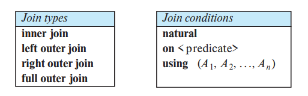
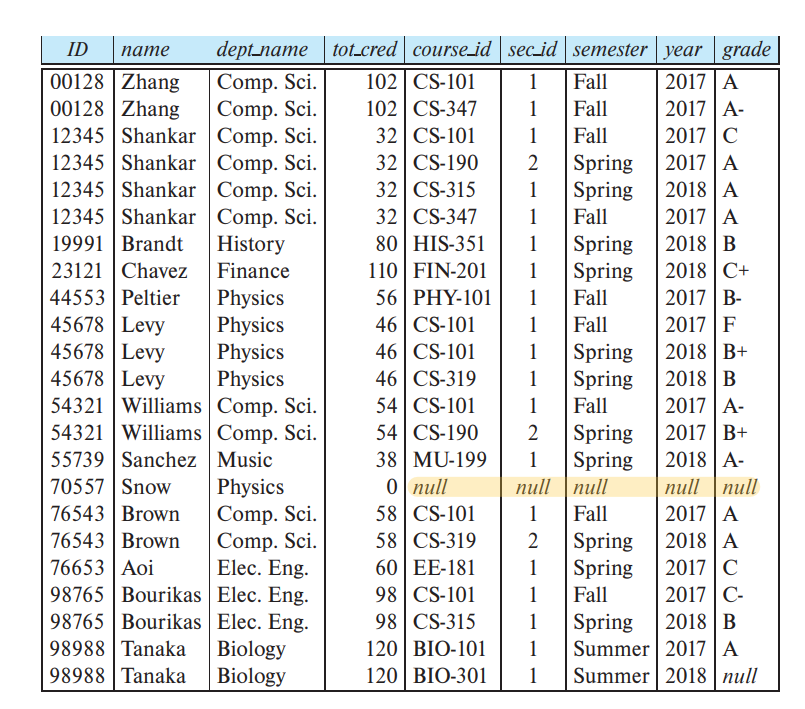
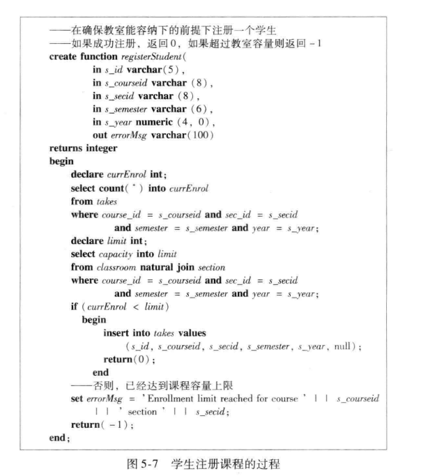
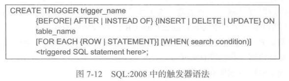
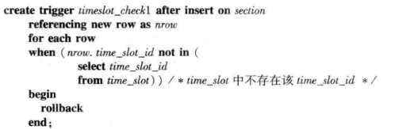
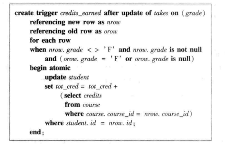

# Structured Query Language

[TOC]

## Overview

SQL, originally called Sequel,  has several parts:

- **Data-definition language** (**DDL**). 
  - **Relation**：The SQL DDL provides commands for defining relation schemas, deleting relations, and modifying relation schemas.
  - **Integrity**. The SQL DDL includes commands for specifying integrity constraints that the data stored in the database must satisfy
  - **View definition**：The SQL DDL includes commands for defining 
  - **Transaction control**：SQL DDL includes commands for specifying the beginning and end points of transactions.
  - **Authorization**. The SQL DDL includes commands for specifying access rights to relations and views.
- **Data-manipulation language** (**DML**). The SQL DML provides the ability to query information from the database and to insert tuples into, delete tuples from, and modify tuples in the database.
- **Embedded** **SQL** and **dynamic** **SQL**. Embedded and dynamic SQL define how SQL statements can be embedded within general-purpose programming languages, such as C, C++, and Java.

## Data Definition Language

###  Basic Types

The SQL standard supports a variety of built-in types, including:

- **char**(*n*): A fixed-length character string with user-specified length *n*
- **varchar**(*n*): A variable-length character string with user-specified maximum length *n*
- **int**: An integer (a finite subset of the integers that is machine dependent)
- **smallint**: A small integer (a machine-dependent subset of the integer type).
- **numeric**(*p*, *d*): A fixed-point number with user-specified precision. The number consists of *p* digits (plus a sign), and *d* of the *p* digits are to the right of the decimal point. Thus, **numeric**(3,1) allows 44.5
- **real, double precision**: Floating-point and double-precision floating-point numbers with machine-dependent precision.
- **float**(*n*): A floating-point number with precision of at least *n* digits.

Each type may include a special value called the **null** value. 

The **char** data type stores fixed-length strings. 如果所要存储的数据不足char所规定的长度，那么就用空格填充剩余的长度。

When comparing two values of type **char**, if they are of different lengths, extra spaces are automatically attached to the shorter one to make them the same size before comparison.

When comparing a **char** type with a **varchar** type, one may expect extra spaces to be added to make the lengths equal, before comparison; however, this may or may not be done, depending on the database system. As a result, even if the same value “Avi” is stored in the attributes *A* and *B* above, a comparison *A*=*B* may return false. We recommend you always use the **varchar** type instead of the **char** type to avoid these problems.

### Table

**create table** command defines an SQL relation

~~~sql
create table r(
	A1 D1,
    A2 D2,
    ...
    An Dn,
    <integrity-constraint1>
    <integrity constraint2>
)
~~~

where *r* is the name of the relation,  each $A_i$ is the name of an attribute , and $D_i$ is the domain of attribute $A_i$  ; that is, $D_i$ specifies the type of attribute $A_i$  along with optional constraints

SQL supports a number of different integrity constraints：

- **primary key**$(A_{j_1}, ... ,A_{j_n})$. The primary-key attributes are required to be *nonnull* and *unique*
- **foreign key** $(A_{k_1}, ... ,A_{k_n})$ references *s*.
- **not null**: The **not null** constraint on an attribute specifies that the null value is not allowed for that attribute

SQL prevents any update to the database that violates an integrity constraint.

The **drop table** command `drop table r` deletes all information about the dropped relation from the database 

~~~ sql
DROP TABLE Shippers;
~~~

We use the **alter table** command `alter table r add A D;` to add attributes to an existing relation . We can drop attributes from a relation by the command `alter table r drop A;`

~~~sql
ALTER TABLE Customers
ADD Email varchar(255);

ALTER TABLE table_name
DROP COLUMN column_name;
~~~

## Data-manipulation language

### Queries

A typical SQL query has the form:

~~~mysql
select A1, A2, ..., An
from r1, r2, ..., rm
where P;
~~~

The **from** clause by itself defines a Cartesian product of the relations listed in the clause

~~~mysql
select name
from instructor;
~~~

~~~mysql
select name, instructor.dept_name, building
from instructor, department
where instructor.dept_name = department.dept_name;
~~~

如果多个表之间的属性名有重复的，可以通过表名前缀来区分它们。

In those cases where we want to force the elimination of duplicates, we insert the keyword **distinct** after **select**.：

~~~mysql
select distinct dept_name
from instructor;
~~~

 SQL allows us to use the keyword **all** to specify **explicitly** that duplicates are not removed

The **select** clause may also contain arithmetic expressions involving the operators+, −, ∗, and / operating on constants or attributes of tuples

~~~mysql
select ID, name, dept_name, salary * 1.1
from instructor
~~~

 if we use an arithmetic expression in the **select** clause, the resultant attribute does not have a name. Hence, SQL provides a way of renaming the attributes of a result relation. It uses the **as** clause, taking the form `oldName as newMame`. The **as** clause can appear in both the **select** and **from** clauses

~~~mysql
select T.name, S.course id
from instructor as T, teaches as S
where T.ID = S.ID;
~~~

An identifier, such as T and S that is used to rename a relation is referred to as a **correlation name** in the SQL standard, but it is also commonly referred to as a **table alias**, or a **correlation variable**, or a **tuple variable**.

The **where** clause allows us to select only those rows in the result relation of the **from** clause that satisfy a specified predicate

~~~mysql
select name
from instructor
where dept_name = 'Comp. Sci.' and salary > 70000;
~~~

SQL allows the use of the logical connectives **and**, **or**, and **not** in the **where** clause. The operands of the logical connectives can be expressions involving the comparison operators <, <=, >, >=, =, and <>.  比较运算可以支持整数、字符串以及日期等类型

The asterisk symbol `* ` can be used in the **select** clause to denote “all attributes.”

~~~mysql
select instructor.*
from instructor, teaches
where instructor.ID= teaches.ID;
~~~

 The **order by** clause causes the tuples in the result of a query to appear in sorted order.

~~~mysql
select name
from instructor
where dept name = 'Physics'
order by name;
~~~

By default, the **order by** clause lists items in ascending order. we may specify **desc** for descending order or **asc** for ascending order

~~~mysql
select *
from instructor
order by salary desc, name asc;
~~~

If several instructors have the same salary, we order them in ascending order by name

SQL includes a **between** comparison operator to simplify **where** clauses

~~~mysql
select name
from instructor
where salary between 90000 and 100000;

select name
from instructor
where salary <= 100000 and salary >= 90000;
~~~

SQL permits us to use the notation $(v_1, v_2, ..., v_n)$ to denote a tuple of arity *n* containing values. the notation is called a **row constructor**. For example, (*a*1, *a*2) <= (*b*1, *b*2) is true if *a*1 <= *b*1 **and** *a*2 <= *b*2; similarly, the two tuples are equal if all their attributes are equal.

~~~mysql
select name, course id
from instructor, teaches
where instructor.ID= teaches.ID and dept name = 'Biology';

select name, course id
from instructor, teaches
where (instructor.ID, dept name) = (teaches.ID, 'Biology');
~~~

### String Operation

SQL specifies strings by enclosing them in single or double quotes. A single quote character that is part of a string can be specified by using two single quote characters; for example, the string “It’s right” can be specified by 'It''s right'.

The SQL standard specifies that the equality operation on strings is case sensitive; However, some database systems, such as MySQL and SQL Server, do not distinguish uppercase from lowercase when matching strings; . This default behavior can be changed

Pattern matching can be performed on strings using the operator **like**

- **Percent (%):** The `%` character matches any **substring**
- **Underscore (_):** The `_` character matches any **character**

~~~mysql
select dept_name
from department
where building like '%Watson%';
~~~

` ___ `matches any string of exactly three characters. `___%` matches any string of at least three characters

SQL allows the specification of an escape character.

- `like 'ab∖%cd%'`： matches all strings beginning with “ab%cd”
- `like 'ab\\cd%'`：matches all strings beginning with “ab∖cd”

### Set Operations

The SQL operations **union**, **intersect**, and **except** operate on relations and correspond to the mathematical set operations ∪, ∩, and −.

The **union** operation automatically eliminates duplicates

~~~mysql
(select course id
from section
where semester = 'Fall' and year= 2017)
union
(select course id
from section
where semester = 'Spring' and year= 2018);
~~~

If we want to retain all duplicates, we must write **union all** in place of **union**. The number of duplicate tuples in the result is equal to the total number of duplicates that appear in both *c1* and *c2*.

~~~mysql
(select course id
from section
where semester = 'Fall' and year= 2017)
union all
(select course id
from section
where semester = 'Spring' and year= 2018);
~~~

The **intersect** operation automatically eliminates duplicates. If we want to retain all duplicates, we must write **intersect all** in place of **intersect**. The number of duplicate tuples that appear in the result is equal to the minimum number of duplicates in both *c1* and *c2*

> MySQL does not implement the **intersect** operation

The **except** operation outputs all tuples from its first input that do not occur in the second input. The operation automatically eliminates duplicates in the inputs before performing set difference. If we want to retain duplicates, we must write **except all** in place of **except**

> MySQL does not implement it at all

The number of duplicate copies of a tuple in the result is equal to the number of duplicate copies in *c1* minus the number of duplicate copies in *c2*, provided that the difference is not negtive.

### Null Values

The result of an arithmetic expression (involving, for example, +, −, ∗, or ∕) is null if any of the input values is null.

SQL therefore treats as **unknown** the result of any comparison involving a null value, other than predicates **is null** and **is not null**

the definitions of the Boolean operations are extended to deal with the value **unknown**.

- **and**: The result of *true* **and** *unknown* is *unknown*, *false* **and** *unknown* is *false*, while *unknown* **and** *unknown* is *unknown*.
- **or**: The result of *true* **or** *unknown* is *true*, *false* **or** *unknown* is *unknown*, while *unknown* **or** *unknown* is *unknown*.
- **not**: The result of **not** *unknown* is *unknown*.

If the **where** clause predicate evaluates to either **false** or **unknown** for a tuple, that tuple is not added to the result.

SQL allows us to test whether the result of a comparison is unknown, rather than true or false, by using the clauses **is unknown** and **is not unknown**.

~~~mysql
select name
from instructor
where salary > 10000 is unknown;
~~~

 **when comparing values of corresponding attributes from two tuples, the values are treated as identical if either both are non-null and equal in value, or both are null**. Thus, two copies of a tuple, such as `{('A',null), ('A',null)}`, are treated as being identical,  Note that the treatment of null above is different from the way nulls are treated in predicates, where a comparison `null = null` would return unknown, rather than true. 

The approach of treating tuples as identical is used for the select distinct, set operations union, intersection, and except and group by clause.

### Aggregate Functions

**Aggregate functions** are functions that take a collection (a set or multiset) of values as input and return a single value. SQL offers five standard built-in aggregate functions:

- Average: **avg**
- Minimum: **min**
- Maximum: **max**
- Total: **sum**
- Count: **count**

The input to **sum** and **avg** must be a collection of numbers, but the other operators can operate on collections of nonnumeric data types, such as strings, as well. 

If we do want to eliminate duplicates, we use the keyword **distinct** in the aggregate expression：

~~~mysql
select count (distinct ID)
from teaches
where semester = 'Spring' and year = 2018;
~~~

COUNT有三种用法`COUNT(常量)`、`COUNT(*)`、`COUNT(列名)`。但是`COUNT(列名)`忽略null的行。`COUNT(*)`、`COUNT(1)`会统计为null的行。在MySQL官方文档中说：InnoDB handles SELECT COUNT(*) and SELECT COUNT(1) operations in the same way. There is no performance difference. 但是推荐使用`COUNT(*)`，因为这是SQL92中的标准语法

SQL does not allow the use of **distinct** with **count** (*)

~~~mysql
select count (*)
from course;
~~~

if there are no matching rows

- AVG() returns NULL.
- COUNT() returns 0.
- COUNT(DISTINCT) returns 0.
- MAX() returns NULL.
- MIN() returns NULL.
- SUM() returns NULL.

AVG、MAX、MIN、SUM都会忽略null

 The attribute or attributes given in the **group by** clause are used to form groups. Tuples with the same value on all attributes in the **group by** clause are placed in one group.

~~~mysql
select dept_name, avg (salary) as avg_salary
from instructor
group by dept_name;
~~~

When an SQL query uses grouping, it is important to ensure that the **only attributes that appear in the select statement without being aggregated are those that are present in the group by clause**.

~~~mysql
/* erroneous query */
select dept_name, ID, avg(salary)
from instructor
group by dept_name;
~~~

At times, it is useful to state a condition that applies to groups rather than to tuples. SQL applies predicates in the **having** clause after groups have been formed, so aggregate functions may be used in the **having** clause.

~~~mysql
select dept_name, avg (salary) as avg_salary
from instructor
group by dept_name
having avg (salary) > 42000;
~~~

As was the case for the **select** clause, any attribute that is present in the **having** clause without being aggregated must appear in the **group by** clause,

### Nested Subqueries

A subquery is a **select**-**from**-**where** expression that is nested within another query. A common use of subqueries is to perform tests for set membership($\in$、$\not \in$),  make set comparisons (some、every), and determine set cardinality  by nesting subqueries in the **where** clause

The **in** connective tests for setmembership, where the set is a collection of values produced by a **select** clause. The **not in** connective tests for the absence of set membership.

~~~mysql
select distinct course_id
from section
where semester = 'Fall' and year= 2017 and
course_id in (
    select course_id
	from section
	where semester = 'Spring' and year= 2018);
~~~

The **in** and **not in** operators can also be used on enumerated sets：

~~~mysql
select distinct name
from instructor
where name not in ('Mozart', 'Einstein');
~~~

~~~mysql
select count (distinct ID)
from takes
where (course id, sec id, semester, year) in (
    select course id, sec id, semester, year
	from teaches
	where teaches.ID= '10101');
~~~

SQL  allows  `< some`, `<= some`, `>= some`, `= some`, and `<> some` comparisons. The keyword **any** is synonymous to **some** in SQL.   `= some` is identical to **in**, whereas `<> some` is *not* the same as **not in**

~~~mysql
select name
from instructor
where salary > some (
    select salary
	from instructor
	where dept_name = 'Biology')
~~~

SQL  also allows `< all`, `<= all`, `>= all`, `= all,` and `<> all` comparisons. `<> all` is identical to not in, whereas `= all` is *not* the same as in.

The **exists** construct returns the value **true** if the argument subquery is nonempty

~~~mysql
select course id
from section as S
where semester = 'Fall' and year = 2017 and exists (
    select *
	from section as T
	where semester = 'Spring' and year = 2018 and S.course id = T.course id);
~~~

The above query also illustrates a feature of SQL where a **correlation name** from an outer query (*S* in the above query), can be used in a subquery in the **where** clause. A subquery that uses a correlation name from an outer query is called a **correlated subquery**.  a **scoping rule** applies for correlation names. If a correlation name is defined both locally in a subquery and globally in a containing query, the local definition applies.

We can test for the nonexistence of tuples in a subquery by using the **not exists** construct

the UNIQUE predicate evaluates to True only if no two rows returned by the subquery are identical

~~~mysql
select T.course_id
from course as T
where unique (
    select R.course_id
	from section as R
	where T.course_id = R.course_id and R.year = 2017);
	
# is equal to 

select T.course_id
from course as T
where 1 >= (
    select count(R.course_id)
	from section as R
	where T.course_id = R.course_id and R.year = 2017)
~~~

 the **unique** predicate would evaluate to true on the empty set.

Correlation Name对于性能的影响

~~~mysql
select S.ID, S.name
from student as S
where not exists (
    (select course_id
	from course
	where dept_name = 'Biology')
	except
	(select T.course id
	from takes as T
	where S.ID = T.ID));
~~~

对于第二个子查询来说，由于它使用了Correlation Name，所以每当外部查询迭代一个Tuple时，都要重新计算这个子查询。对于第一个来说，只需计算一次即可。

SQL allows a subquery expression to be used in the **from** clause. The key concept applied here is that any **select**-**from**-**where** expression returns a relation as a result and, therefore, can be inserted into another **select**-**from**-**where** anywhere that a relation can appear.

~~~mysql
select dept_name, avg_salary
from (select dept_name, avg (salary) as avg_salary
	from instructor
	group by dept name)
where avg salary > 42000;
~~~

We can give the subquery result relation a name, and rename the attributes, using the **as** clause, as illustrated below.

~~~mysql
select dept_name, avg_salary
from (
    select dept_name, avg (salary)
	from instructor
	group by dept_name)
	as dept_avg (dept_name, avg_salary)
where avg_salary > 42000;
~~~

We note that nested subqueries in the **from** clause cannot use correlation variables from other relations in the same **from** clause. However, the SQL standard, starting with SQL:2003, allows a subquery in the **from** clause that is prefixed by the **lateral** keyword to access attributes of preceding tables or subqueries in the same **from** clause.

~~~mysql
select name, salary, avg_salary
from instructor I1, lateral(
   	select avg(salary) as avg_salary
	from instructor I2
	where I2.dept_name = I1.dept_name);
~~~

The **with** clause provides a way of defining a temporary relation whose definition is available only to the query in which the **with** clause occurs. using nested subqueries would have made the query harder to read and understand. The **with** clause makes the query logic clearer;

~~~SQL
with dept_total(dept_name, value) as
        (select dept_name, sum(salary)
        from instructor
        group by dept_name),
    dept_total_avg(value) as
        (select avg(value)
        from dept_total)
select dept_name
from dept_total, dept_total_avg
where dept_total.value > dept_total_avg.value;
~~~

SQL allows subqueries to occur wherever an expression returning a value is permitted, provided the subquery returns only one tuple containing a single attribute; such subqueries are called **scalar subqueries**. 

~~~mysql
SELECT dept_name,
	(SELECT count(*) FROM instructor WHERE department.dept_name = instructor.dept_name ) AS num_instructors 
FROM department;
~~~

这个语句是先执行FROM语句，获取一张表。然后依次遍历表中的元组，对每个元组执行SELECT语句。

the type of a scalar subquery result is still a relation. However, when a scalar subquery is used in an expression where a value is expected, SQL implicitly extracts the value from the single attribute of the single tuple in the relation and returns that value.

### Modification

#### delete

~~~mysql
delete from r
where P
~~~

~~~mysql
delete from instructor
where dept_name in (
    select dept_name
	from department
	where building = 'Watson')
~~~

Performing all the tests before performing any deletion is important. if some tuples are deleted before other tuples have been tested the final result of the **delete** would depend on the order in which the tuples were processed!

#### insert

To insert data into a relation, we either specify a tuple to be inserted 

~~~mysql
insert into course
	values ('CS-437', 'Database Systems', 'Comp. Sci.', 4);
~~~

In this example, the values are specified in the order in which the corresponding at tributes are listed in the relation schema. SQL allows the attributes to be specified as part of the **insert** statement. For example

~~~mysql
insert into course (title, course_id, credits, dept_name)
	values ('Database Systems', 'CS-437', 4, 'Comp. Sci.');
~~~

 It is possible for inserted tuples to be given values on only some attributes of the schema. The remaining attributes are assigned a null value

More generally, we might want to insert tuples on the basis of the result of a query.

~~~mysql
insert into instructor
	select ID, name, dept_name, 18000
	from student
	where dept_name = 'Music' and tot_cred > 144;
~~~

It is important that the system evaluate the **select** statement fully before it performs any insertions. 

#### update

~~~sql
update instructor
set salary = salary * 1.05
where salary < 70000;
~~~

~~~sql
update instructor
set salary = salary * 1.05
where salary < (select avg (salary)
				from instructor);
~~~

As before, SQL first tests all tuples in the relation to see whether they should be updated, and it carries out the updates afterward

SQL provides a case construct that we can use to perform both updates with a single update statement, avoiding the problem with the order of updates.

~~~sql
update instructor
set salary = case
				when salary <= 100000 then salary * 1.05
				else salary * 1.03
			end
~~~

~~~sql
case
    when pred1 then result1
    when pred2 then result2
    …
    when predn then resultn
    else result0
end
~~~

## Intermediate SQL

### Join Expressions

之前出现的FROM子句，都是执行笛卡尔积运算。这里，我们介绍更多的连接操作（自然连接、外连接等等）

natural join considers only those pairs of tuples with the same value on those attributes that appear in the schemas of both relations

~~~sql
select name, course id
from student, takes
where student.ID = takes.ID;

-- is equal to

select name, course id
from student natural join takes;
~~~

在自然连接中，值为null的元组会被忽略掉

Notice ：

- we do not repeat those attributes that appear in the schemas of both relations;  rather they appear only once. 
- the order in which the attributes are listed:  first the attributes common to the schemas of both relations, second those attributes unique to the schema of the first relation, and finally, those attributes unique to the schema of the second relation.

~~~sql
select A1, A2, …, An
from r1 natural join r2 natural join ... natural join rm
where P;
~~~

More generally, a from clause can be of the form `from E1, E2,..., En ` where each Ei can be a single relation or an expression involving natural joins.

SQL provides a form of the natural join construct that allows you to specify exactly which columns should be equated. Both relations being joined must have attributes with the specified names

~~~sql
select name, title
from (student natural join takes) join course using (course id);
~~~

The on condition allows a general predicate over the relations being joined. 

~~~sql
select *
from student join takes on student.ID = takes.ID;

-- is equal to

select *
from student, takes
where student.ID = takes.ID;
~~~

The one difference is that the result has the ID attribute listed twice, in the join result, once for student and once for takes, even though their ID values must be the same.

a query using a join expression with an on condition can be replaced by an equivalent expression without the on condition, with the predicate in the on clause moved to the where clause. However, there are two good reasons for introducing the on condition:

1. an outer join, on conditions do behave in a manner different from where conditions
2.  an SQL query is often more readable by humans if the join condition is specified in the on clause

**The outer-join operation** preserves those tuples that would be lost in a join by creating tuples in the result containing null values. There are three forms of outer join:

- **The left outer join** preserves tuples only in the relation named before (to the left of) the left outer join operation.
- **The right outer join** preserves tuples only in the relation named after (to the right of) the right outer join operation.
- **The full outer join** preserves tuples in both relations.

In contrast the join operations we studied earlier that do not preserve nonmatched tuples are called **inner-join operations**

We can compute the left outer-join operation as follows: First, compute the result of the inner join as before. Then, for every tuple t in the left-hand-side relation that does not match any tuple in the right-hand-side relation in the inner join, add a tuple r to the result of the join constructed as follows:

1. The attributes of tuple r that are derived from the left-hand-side relation are filled in with the values from tuple t.
2. The remaining attributes of r are filled with null values.

~~~sql
select *
from takes natural left outer join student;
~~~

on and where behave differently for outer join. 

1. inner join
2. on
3. outer join
4. where

可见被on过滤掉的元组，会在outer join中添加回来，但是被where过滤掉的，却无能为力了

natural join is equivalent to natural inner join.

### Views

The virtual relation is not precomputed and stored but instead is computed by executing the query whenever the virtual relation is used. , if a view relation is computed and stored, it may become out of date if the relations used to define it are modified

~~~sql
create view v as <query expression>;
~~~

Views differ from the with statement. The named subquery defined by with is local to the query in which it is defined.

~~~sql
create view departments total salary(dept name, total salary) as
    select dept name, sum (salary)
    from instructor
    group by dept name;
~~~

Certain database systems allow view relations to be stored, but they make sure that, if the actual relations used in the view definition change, the view is kept up-to-date. Such views are called **materialized views.** The benefits to queries from the materialization of a view must be weighed against the storage costs and the added overhead for updates.

modifications are generally not permitted on view relations, except in limited cases. In general, an SQL view is said to be **updatable** (i.e., inserts, updates, or deletes) if the following conditions are all satisfied by the query defining the view:

- The from clause has only one database relation
- The select clause contains only attribute names of the relation and does not have any expressions, aggregates, or distinct specification.
- Any attribute not listed in the select clause can be set to null;
- The query does not have a group by or having clause.
- ...

~~~sql
create view history_instructors as
select *
from instructor
where dept_name = 'History';
~~~

这张表就是可更新的，我们可以插入('25566', 'Brown', 'Biology', 100000)，但这违反了`where dept_name = 'History';`的语义。我们可以通过with check option子句来修正这一点：

~~~sql
create view history_instructors as
select *
from instructor
where dept_name = 'History'
WITH CHECK OPTION;
~~~

### Transactions

A transaction consists of a sequence of query and/or update statements. The SQL standard specifies that a transaction begins implicitly when an SQL statement is executed. One of the following SQL statements must end the transaction:

- Commit work commits the current transaction. After the transaction is committed, a new transaction is automatically started.
- Rollback work causes the current transaction to be rolled back; that is, it undoes all the updates performed by the SQL statements in the transaction

In many SQL implementations, including MySQL and PostgreSQL, by default each SQL statement is taken to be a transaction on its own, and it gets committed as soon as it is executed. Such **automatic commit** of individual SQL statements must be turned off if a transaction consisting of multiple SQL statements needs to be executed. many databases support the command `set autocommit of`

A better alternative, which is part of the SQL:1999 standard is to allow multiple SQL statements to be enclosed between the keywords `begin atomic … end`. All the statements between the keywords then form a single transaction, which is committed by default if execution reaches the end statement

~~~sql
START TRANSACTION;
insert into runoob_transaction_test value(5);
Commit;		-- mysql不支持end语句
~~~

Transactions may consist of several steps, and integrity constraints may be violated temporarily after one step, but a later step may remove the violation. To handle such situations, the SQL standard allows a clause `initially deferred` to be added to a constraint specification; the constraint would then be checked at the end of a transaction and not at intermediate steps. **MySQL does not support deferred constraints**

此外，如果在事务中违反了约束，那么整个事务就会进行回滚操作。

### Integrity Constraints

**Integrity constraints** ensure that changes made to the database do not result in a loss of data consistency

In general, an integrity constraint can be an arbitrary predicate pertaining to the database. However, arbitrary predicates may be costly to test. Thus, most database systems allow one to specify only those integrity constraints that can be tested with minimal overhead.

管理Integrity constraints 

1.  Integrity constraints  are usually declared as part of the create table command. it can also be added to an existing relation by using the command `alter table table-name add constraint`. 

2. To name a constraint, we precede the constraint with the keyword constraint and the name we wish to assign it

   ~~~sql
   salary numeric(8,2), constraint minsalary check (salary > 29000),
   ~~~

3. if we decide we no longer want this constraint, we can write:

    ~~~sql
    alter table instructor drop constraint minsalary;
    ~~~

- In particular, SQL prohibits null values in the primary key of a relation schema. The `not null` constraint prohibits the insertion of a null value for the attribute.

- SQL also supports an integrity constraint: `unique (A1 , A2 , …, Am )` . The unique specification says that attributes A1 , A2 , …, Am form a superkey; However, attributes declared as unique are permitted to be null. Recall that a null value does not equal any other value

- the clause `check(P)` specifies a predicate P that must be satisfied by every tuple in a relation. A check clause is satisfied if it is not false, so clauses that evaluate to unknown are not violations.

- An assertion is a predicate expressing a condition that we wish the database always to satisfy

  ~~~sql
  create assertion <assertion-name> check <predicate>;
  ~~~

  Currently, none of the widely used database systems supports either subqueries in the check clause predicate or the create assertion construct

- **referential integrity constraint**

  ~~~sql
  foreign key (dept name) references department(dept name)
  ~~~

  The specified list of attributes must, however, be declared as a superkey of the referenced relation, using either a primary key constraint or a unique constraint

  When a referential-integrity constraint is violated, the normal procedure is to reject the action that caused the violation.  但是还有其他策略：

  - on delete cascade
  - on update cascade
  - set default
  - set null

  ~~~sql
  create table course( 
      …
      foreign key (dept name) references department
      on delete cascade
      on update cascade,
  );
  ~~~

  If there is a chain of foreign-key dependencies across multiple relations, a deletion or update at one end of the chain can propagate across the entire chain

  If any of the foreign-key columns is null, the tuple is defined automatically to satisfy the constraint. This definition may not always be the right choice, so SQL also provides constructs that allow you to change the behavior with null values

  

### SQL  Types

#### date

SQL standard supports several data types relating to dates and times:

- date: `YYYY-MM-DD`
- time: The time of day, in hours, minutes, and seconds. A variant, time(p), can be used to specify the number of fractional digits for seconds (the default being 0). 
- timestamp: A combination of date and time. A variant, timestamp(p), can be used to specify the number of fractional digits for seconds (the default here being 6). 
- datetime 

datetime与timestamp之间的区别:

- 支持范围
  - DATETIME支持范围：'1000-01-01 00:00:00'到'9999-12-31 23:59:59'
  - TIMESTAMP支持范围：格式一样，但不能早于1970或晚于2037
- 存储空间：
  - DATETIME存储8个字节，实际格式，与时区无关
  - TIMESTAMP存储4个字节，UTC格式，时区转化
- 存储方式 ，
  - 对于TIMESTAMP，它把客户端插入的时间从当前时区转化为UTC（世界标准时间）进行存储。查询时，将其又转化为客户端当前时区进行返回。
  - 对于DATETIME，不做任何改变，基本上是原样输入和输出。

SQL defines several functions to get the current date and time.

`CURRENT_TIMESTAMP()`are synonyms for `NOW()`. `NOW()`（`current_timestamp()`）函数获得的是语句开始执行时的时间，而`sysdate()`函数是这个函数执行时候的时间。

#### Default

SQL allows a default value to be specified

~~~sql
create table student(
	tot_cred numeric (3,0) default 0,
);
~~~

#### Blob

SQL provides large-object data types for character data (clob) and binary data (blob)

~~~sql
book_review clob(10KB)
image blob(10MB)
movie blob(2GB)
~~~

For result tuples containing large objects it is inefficient or impractical to retrieve an entire large object into memory. Instead, an application would usually use an SQL query to retrieve a “locator” for a large object

### Index

An index on an attribute of a relation is a data structure that allows the database system to find those tuples in the relation that have a specified value for that attribute efficiently, without scanning through all the tuples of the relation

We create an index with the create index command

~~~sql
create index <index-name> on <relation-name> (<attribute-list>);
~~~

The drop index command

~~~sql
drop index <index-name>;
~~~

### Authorization

## Advanced SQL

### Functions and Procedures

通过在例程中实现数据库的业务逻辑，可以在多个编程语言中复用这段逻辑，而无需在每个编程语言中重新实现该逻辑。

使用示例1：

~~~sql
create function dept_count(dept_name varchar(20)) returns integer
begin
	declare d_count integer;
		select count(*) into d_count
		from instructor
	return d_count;
end
~~~

使用示例2：

~~~sql
create function instrcutor_of(dept_name varchar(20)) returns table(
	ID varchar(5),
    name varchar(20),
)
return table(
	select ID, name
    from instructor
);

-- 例程在SQL语句中的使用
select *
from table(instructor_of("Myokuu");
~~~

函数的参数可以分为`in`、`out`类型

~~~sql
create procedure dept_count_proc(int dept_name varchar(20), out d_count integer)
begin
	select count(*) into d_count
	from instrcutor;
end
~~~

可以通过call语句，从一个例程中调用另一个例程：

~~~sql
declare d_count integer;
call dept_count_proc("Physics", d_count);
~~~

变量通过declare语句声明，通过set语句进行赋值

复合语句有`begin ... end`形式。而`begin atomic ... end`的复合语句作为单一事务来执行

循环逻辑：

~~~sql
while 布尔表达式 do
	语句序列;
end while

repeat
	语句序列;
until 布尔表达式
end repeat
~~~

for语句，允许对查询结果进行遍历：

~~~sql
declare n integer default 0;
for r as
	select budget from department
do
	set n = n - r.budget
end for
~~~

此外，leave语句可以退出循环，而iterate可以跳过本次循环，进入下一个元组

分支逻辑：

~~~sql
if 布尔表达式 then
     复合语句
elseif 布尔表达式 then
     复合语句
else 
    复合语句
endif
~~~

### Triggers

触发器可以实现复杂的CHECK逻辑，以及审计跟踪。一个触发器有三个部分：

- 事件
- 条件
- 动作

这里`referencing new row as nrow`，声明了一个过渡变量，用来存储刚刚修改（插入、删除、更新）的值。与之对应的是`referencing old row`

