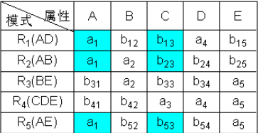
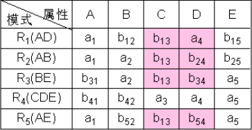
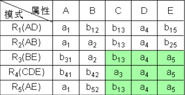
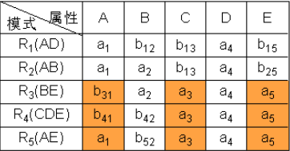
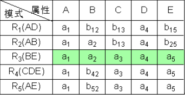
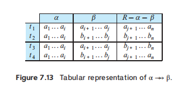
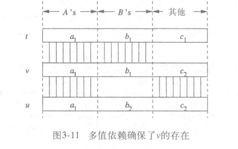
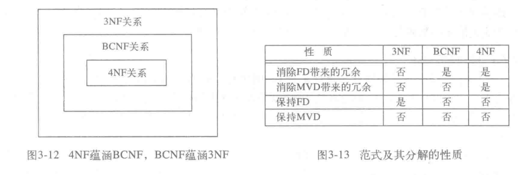

# 关系数据库设计理论

[TOC]

## 函数依赖

函数依赖$A_1 ...  A_n \rightarrow B_1 ... B_m$是指，如果关系$R$中的任意两个元素在属性$A_1, ... ,A_n$上相同，那么它们必定在属性$B_1, ... ,B_m$上也相同。

若满足函数依赖集合$T$的关系$R$，也满足函数依赖集合$S$，那么就说$S$是从$T$中推断（follow）而来。若$S$推理出$T$且$T$推理出$S$，那么我们称$S$与$T$等价。

若函数依赖$A_1...A_n \rightarrow B_1...B_m$满足$\{B_1, ... , B_m\} \subset \{A_1, ..., A_n\}$，则称该函数依赖是**平凡的**。

函数依赖的规则

- **分解规则（Splitting Rule）**：可以用函数依赖集$A_1A_2...A_n \rightarrow B_i \quad(i = 1, 2, ... m)$来代替$A_1A_2...A_n \rightarrow B_1B_2...B_m$
- **组合规则（Combining Rule）**：可以用$A_1A_2...A_n \rightarrow B_1B_2...B_m$来代替函数依赖集$A_1A_2...A_n \rightarrow B_i \quad(i = 1, 2, ... m)$
- **平凡依赖规则（Trivial-Dependency Rule）**：$A_1A_2...A_n \rightarrow B_1B_2...B_m$等价于$A_1A_2...A_n \rightarrow C_1C_2...C_k$，其中，$C = B - A$
- **增广律（Augmentation）**：如果有$A_1...A_n \rightarrow B_1...B_m$，那么$A_1...A_nC_1...C_k = B_1...B_mC_1...C_k$成立
- **传递律（Transitivity）**：若满足$A_1...A_n \rightarrow B_1...B_m$ 且 $B_1...B_m \rightarrow C_1...C_k$，那么我们有$A_1...A_n \rightarrow C_1...C_k$。

给定属性集$\{A_1, ... , A_m\}$，以及函数依赖集$T$，则属性集的**闭包（closure）**是由每一个从$T$推理出来的函数依赖$A_1A_2...A_m \rightarrow B$中的$B$所构成的集合，记为$\{A_1, ... , A_m\}^{+}$。

如何求闭包：

1. 分解函数依赖，使得每个函数依赖的右边只有一个属性
2. 设$X$为属性集，初始化为$\{A_1, ... , A_m\}$
3. 反复寻找这样的函数依赖$B_1B_2...B_m \rightarrow C$，满足$B_1,B_2...B_m$在$X$中，而$C$不在$X$中。此时将$C$添加到$X$中。
4. 当不能添加任何属性时，算法终止，此时$X$记为属性集$A$的闭包。

任何与函数依赖集$S$等价的$T$，称为$S$的基本集（Basis）。

满足下面三个条件的函数依赖集$T$，被称为**最小函数依赖集**：

1. T中每一个FD的右边只有一个属性
2. 从T中删除任何一个FD后，T不再是基本集
3. 对于T中的每一个FD，删除掉FD左边的任意个属性后，T不再是基本集。

如何求最小函数依赖集？

1. 应用分解规则，使得T中每一个FD的右边只有一个属性
2. 去掉各个FD左部多余的属性。以$XY \rightarrow A$为例，现在要判断Y是否多余，只需求$T$下的$X^+$，若$X^+$包含$A$，那么Y就是多余的。
3. 去掉多余的FD。从第一个FD（假设为$XY \rightarrow Z$）开始，从T中临时去除它，然后在剩下的依赖中求$\{X,Y\}^+$，若$\{X,Y\}^+$包含$Z$，那么永久地去除该FD。这样依次做下去

例题：关系模式$R(U，F)$中，$U=ABCDEG$，$F=\{B\rightarrow D，DG\rightarrow C,BD\rightarrow E,AG\rightarrow B,ADG\rightarrow BC\}$，求F的最小函数依赖集。

1. 单一化 $F=\{B\rightarrow D，DG\rightarrow C,BD\rightarrow E,AG\rightarrow B,ADG\rightarrow B, ADG\rightarrow C\}$

2. 去除多余左部

   $B^+ = \{ B, D, E\}$

   $D^+ = \{ D\}$

   $G^+ = \{ G\}$

   $A^+ = \{ A\}$

   $\{AD\}^+ = \{ A,D\}$

   $\{AG\}^+ = \{ A,G,B,C,D,E\}$

   $\{DG\}^+ = \{ D,G,C\}$

   综上，F化简为$\{B\rightarrow D, DG\rightarrow C, B\rightarrow E, AG\rightarrow B, AG\rightarrow C\}$

3. 去除多余的FD

   $\{B\}^+ = \{ B, E\}$ 保留

   $\{DG\}^+ = \{ D，G\}$保留

   $\{B\}^+ = \{ B，E\}$保留

   $\{AG\}^+ = \{ A，G\}$保留

   $\{AG\}^+ = \{A，G，B，D，C，E \}$ 去除

综上答案为$\{B\rightarrow D, DG\rightarrow C, B\rightarrow E, AG\rightarrow B\}$

   

函数依赖集投影回答了这个问题：若关系R满足函数依赖集S，那么有哪些从S推理而来的函数依赖，在R的投影$\pi(R)$上成立？

1. 令T为最终输出的集合，初始化为空集
2. 对于每一个$\pi(R)$属性集的子集$X$，求$X^+$。对于每个属于$X^+$且在$\pi(R)$的属性A，将$X\rightarrow A$添加到T中。若${X}^+$包含了所有$\pi(R)$中的属性，那么无需考虑$X$的任何超集的闭包。
3. 构造最小函数依赖集

## 分解

数据库的设计可能有以下问题：

1. 冗余
2. 更新异常
3. 删除异常

分解应当具有三个性质：

1. 消除异常（Elimination of Anomalie）
2. 信息可恢复（Recoverability of Information）
3. 依赖保持（Preservation of Dependencies）

BCNF分解可以保证（1）和（2），而3NF分解可以保证（2）和（3）。事实上，没有方法能够同时保证这三个性质。

### BCNF

Boyee Codd Normal Form（BCNF）要求每一个FD的左边必须包含键。如果R中非平凡FD $A_1...A_n \rightarrow B_1...B_m$成立，那么${A_1, ... , A_n}$是R的一个超键。

BCNF分解算法：

1. 检验R是否属于BCNF，如果是，直接返回R
2. 否则，对于违约的函数依赖$X\rightarrow Y$，计算$X^+$。令$R_1 = X^+$，而$R_2 = X \cup (R - X^+)$。并且根据函数依赖集投影，计算$R_1$以及$R_2$的FD集
3. 递归地分解$R_1$以及$R_2$，直到满足条件。

### 无损连接

如果各个分解后的关系，可以通过自然连接重构成原始关系，那么称该分解含有**无损连接（lossless join）**。也就是说，假设关系R被分解为若干关系，它们包含的属性集分别为$S_1, ... ,S_k$，是否有$\pi_{S_1}(R) \bowtie ... \bowtie \pi_{S_k}(R) = R$。

无损连接的chase检验

1. 构造一个$k$行$n$列的表格，每行对应一个关系$R_i$，每列对应一个属性$A_j$。若$R_i$具有属性$A_j$中，则在表格第$i$行第$j$列填上$a_{j}$，否则填上$b_{ij}$。
2. 检查每个FD，并修改表格中的元素。对于函数依赖$X\rightarrow Y$，若表格有多行在$X$分量上相等，在$Y$分量上不相等，则修改Y
   1. 若Y的分量中有一个$a_j$，则另一个也修改为$a_j$
   2. 如果没有$a_j$，则用其中一个$b_{ij}$替换另一个符号（$i $是所有$b_{ij}$中最小的行数） ，一直到表格不能修改为止
3. 若修改后，表格中有一行全是$a_i$，则是无损连接的分解

例题，我们有

- 关系：$R(A,B,C,D,E)$
- 分解$：R1(A,D), R2(A,B),R3(B,E),R4(C,D,E),R5(A,E)$
- 函数依赖：$F=\{A→C,B→C,C→D,DE→C,CE→A\}$

判断$R$的分解是否是无损连接的分解

### 3NF

如果一个属性是某个键的成员，则常被称为**主属性（prime）**。因此，3NF的条件可以表述成，对于每个非平凡FD，要么左边是超键，要么其右边仅由主属性构成。

3NF分解：

1. 找出F的一个最小函数依赖集G
2. 对于G中的每一个函数依赖，将两边出现的属性共同作为一个关系
3. 如果在第二步中，分解出的关系都不包含R的超键，那么增加一个关系，其属性为R的任意一个键。

例子：$U=\{A,B,C,D,E,G\}$, $F=\{B\rightarrow G,CE\rightarrow B,C\rightarrow A,CE\rightarrow G,B\rightarrow D,C\rightarrow D\}$，候选码为$AE$

求出的最小函数依赖集为$ \{B\rightarrow DG,CE\rightarrow B,C\rightarrow AD\}$

那么分解出关系$R_1(BDG)，R_2(CEB)，R_3(ACD)$，由于各个分解关系都不包含候选码的超集，那么添加关系$R_4(AE)$

## 多值依赖 

多值依赖A →→ B是指，对于任何在A上相等的两个元组$t$、$u$，总能找到元组$v$满足：

1. 在$A$属性上的取值与$t$和$u$相同
2. 在$B$属性上的取值与$t$相同
3. 在$R - A -B$属性上的取值与$u$相同

- 平凡MVD（trivial MVD）：如果$\{B_1, .. ,B_m\} \subset \{A_1, ... A_n\}$，则MVD $A_1...A_n →→ B_1...B_m$在任何关系中都成立
- 传递规则（transitive rule）：如果$A →→ B$且$B→→ C$，那么有$A→→ C$
- FD升级（FD promotion）规则。每个FD都是MVD。也就是说，若$A → B$，则$A→→B$
- 互补规则(complementation rule）规则，若$A→→B$，则$A→→R - A - B$

4NF要求每一个MVD的左边必须包含键。

4NF分解算法（与BCNF分解算法类似）

1. 检验R是否属于4NF，如果是，直接返回R
2. 否则，对于违约的MVD$A_1...A_n →→ B_1...B_m$，即$\{A_1, ... A_n\}$不是超键。将R分解为$R_1(AB)$以及$R_2(AC)$，其中$C = R - A - B$。找出在$R_1$和$R_2$上成立的FD和MVD
3. 递归地分解$R_1$以及$R_2$，直到满足条件。

**闭包与chase**、**将chase扩展到MVD**、**投影MVD**这三部分内容不再做介绍。
