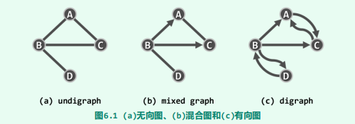
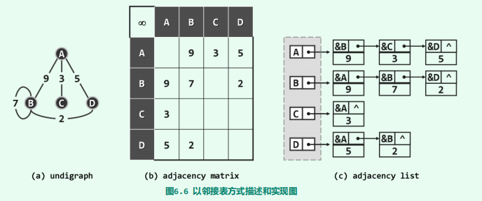
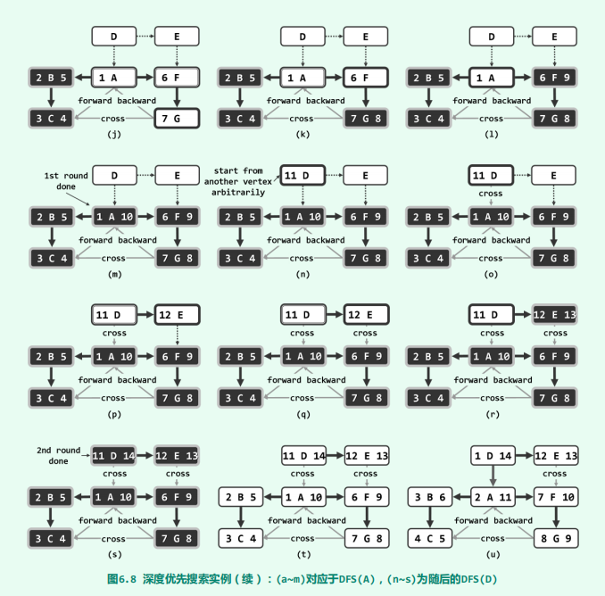
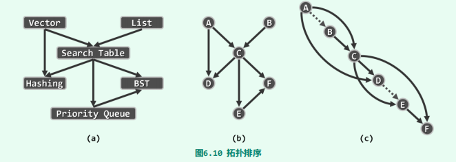
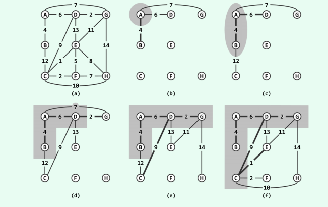

# 图

[TOC]

## 概念

图可以表示任意的二元关系，因此它属于**非线性结构（non-linear structure）**。

**图（graph）**，可定义为G = (V, E)。其中，集合V中的元素称作**顶点（vertex）**；集合E中的元素分别对应于V中的某一对顶点(u, v)，表示它们之间存在某种关系，故亦称作**边（edge）**。从计算的需求出发，我们约定V和E均为有限集，通常将其规模分别记n = |V|和e = |E|。

若边(u, v)所对应顶点u和v的次序无所谓，则称作**无向边（undirected edge）**反之若u和v不对等，则称**(u, v)为有向边（directed edge）**。有向边(u, v)从u指向v，其中u称作该边的**起点（origin）**或尾顶点（tail），而v称作该边的**终点（destination）**或头顶点（head）。

若E中各边均无方向，则G称作**无向图（undirected graph，简称undigraph）**。若E中只含有向边，则G称作**有向图（directed graph，简称digraph）**。若E同时包含无向边和有向边，则G称作**混合图（mixed graph）**。相对而言，有向图的通用性更强，因为无向图和混合图都可转化为有向图。

任何边e = (u, v)，称顶点u和v彼此**邻接（adjacent）**，互为邻居；而它们都与边e彼此**关联（incident）**。在无向图中，与顶点v关联的边数，称作v的**度数（degree）**，记作deg(v)。

对于有向边e = (u, v)，e称作u的**出边（outgoing edge）**、v的**入边（incoming edge）**。v的出边总数称作其**出度（out-degree）**，记作outdeg(v)；入边总数称作其**入度（in-degree）**，记作indeg(v)。

连接于同一顶点v之间的边(v, v)，称作**自环（self-loop）**，不含任何自环的图称作**简单图（simple graph）**，也是本书主要讨论的对象。

所谓**路径**或**通路（path）**，就是由m + 1个顶点与m条边交替而成的一个序列：
$$
\pi = \{v_0, e_1, v_1, e_2, ..., e_m, v_m\} \quad \forall0 < i \leq m,e_i=(v_{i-1}, v_i)
$$
其中沿途边的总数$m$，亦称作通路的长度，记作$|\pi| = m$。也可以简化表述为
$$
\pi = \{v_0, v_1, ... ,v_m\}
$$
沿途顶点互异的通路，称作**简单通路（simple path）**。

对于长度$m \geq1$的通路$\pi$，若起止顶点相同（即$v_0 = v_m$），则称作**环路（cycle）**。若沿途除$v_0 = v_m$外所有顶点均互异，则称作**简单环路（simple cycle）**。

不含任何环路的有向图，称作**有向无环图（directed acyclic graph, DAG）**。

经过图中各边一次且恰好一次的环路，称作**欧拉环路（Eulerian tour）**。经过图中各顶点一次且恰好一次的环路，称作**哈密尔顿环路（Hamiltonian tour）**

可以为每一条边$e$指定一个权重$W(e)$​。各边均带有权重的图，称作**带权图（weighted graph）**或带权网络（weighted network），有时也简称**网络（network）**，记作$G(V, E, W)$。

## 数据结构

图算法的时间、空间性能，却与图结构的具体实现方式紧密相关。

~~~java
class Vertex<T> {
    T data;             //数据域
    int inDegree;       //入度
    int outDegree;      //出度
    VStatus status;     //遍历时的状态
    int dTime;          //时间戳
    int fTime;          //时间戳
    int parent;         //在遍历树中的父节点
    int priority;       //在遍历树中的优先级

    private void init() {
        status = VStatus.UNDISCOVERED;
        dTime = -1;
        fTime = -1;
        parent = -1;
        priority = Integer.MAX_VALUE;
    }
    Vertex(T data) {
        this.data = data;
        init();
    }
    Vertex() {
        init();
    }
}
~~~

~~~java
class Edge<T> {
    T data;             // 数据域
    int weight;     	// 权重
    EType type;         // 边的类型
    int v;              // 关联节点，用于邻接表中

    Edge(T data, int weight) {
        this.data = data;
        this.weight = weight;
        type = EType.UNDETERMINED;
    }

    Edge(T data, int weight, int v) {
        this(data, weight);
        this.v = v;
    }
}
~~~

~~~java
//顶点状态
enum VStatus {
    UNDISCOVERED,				//还未被访问到
    DISCOVERED,					//被访问到，但是它至少有一个邻居未被访问到
    VISITED;					//被访问到，它所有的邻居也都被访问到
}

//边在遍历树中所属的类型
enum EType {
    UNDETERMINED,
    TREE,
    CROSS,
    FORWARD,
    BACKWARD;
}
~~~

### 邻接矩阵

**邻接矩阵（adjacency matrix）**是图ADT最基本的实现方式：使用方阵`A[n][n]`表示由n个顶点构成的图，其中每个单元，各自负责描述一对顶点之间可能存在的邻接关系

~~~java
public class GraphMatrix<VertexType, EdgeType>
    extends Graph<VertexType, EdgeType> {
    
    Vector<Vertex<VertexType>> V;       		//顶点集（向量）
    Vector<Vector<Edge<EdgeType>>> E;         	//边集（邻接矩阵）

    public GraphMatrix() {
        V = new Vector<Vertex<VertexType>>();
        E = new Vector<Vector<Edge<EdgeType>>>();
    }
	
    //顶点的get、set方法
    @Override public VertexType vertex(int i) { return V.get(i).data; }
    @Override public int inDegree(int i) { return V.get(i).inDegree; }
    @Override public int outDegree(int i) { return V.get(i).outDegree; }
    @Override public VStatus status(int i) { return V.get(i).status; }
    @Override public void status(int i, VStatus status) {V.get(i).status = status;}
    @Override public int dTime(int i) { return V.get(i).dTime; }
    @Override public void dTime(int i, int time) { V.get(i).dTime = time;}
    @Override public int fTime(int i) { return V.get(i).fTime; }
    @Override public void fTime(int i, int time) { V.get(i).fTime = time;}
    @Override public int parent(int i) { return V.get(i).parent; }
    @Override public void parent(int i, int parent) {V.get(i).parent = parent;}
    @Override public int priority(int i) { return V.get(i).priority; }
    @Override public void priority(int i, int priority) { V.get(i).priority = priority;}

    @Override
    public Iterator<Integer> getIteratorOfNode(int i) {
        return new Iterator<Integer>() {
            int index = 0;
            @Override
            public boolean hasNext() {
                return index != n;
            }
            @Override
            public Integer next() {
                while (!exists(i, index)) index += 1;
                return index++;
            }
        };
    }

    @Override public boolean exists(int i, int j) {return E.get(i).get(j) != null;}
    //edge的set、get方法
    @Override public EType type(int i, int j) {return E.get(i).get(j).type;}
    @Override public void type(int i, int j, EType type) {E.get(i).get(j).type = type;}
    @Override public EdgeType edge(int i, int j) {return E.get(i).get(j).data;}
    @Override public int weight(int i, int j) {return E.get(i).get(j).weight;}

	//插入一个顶点
    @Override
    public int insert(VertexType data) {
        for (int j = 0; j < n; j++)
            E.get(j).insert(null);
        n++;
        E.insert(new Vector<Edge<EdgeType>>(n, n));
        return V.insert(new Vertex<VertexType>(data));
    }

	//删除一个顶点
    @Override
    public VertexType remove(int i) {
        //先删(j, i)边
        for (int j = 0; j < n; j++) {
            if (exists(j, i)) {
                V.get(j).outDegree -= 1;
            }
            E.get(j).remove(i);
        }
        //再删(i, j)边
        for (int j = 0; j < n; j++) {
            if (exists(i, j)) {
                V.get(j).inDegree -= 1;
            }
        }
        E.remove(i);
        n -= 1;            
        return V.remove(i).data;
    }

	//插入一条边
    @Override
    public void insert(EdgeType edge, int w, int i, int j) {
        if (exists(i,j)) return;
        E.get(i).insert(new Edge<>(edge, w), j);

        //更新边计数与关联顶点的度数
        e++;
        V.get(i).outDegree += 1;
        V.get(j).inDegree += 1;
    }

	//删除一条边
    @Override
    public EdgeType remove(int i, int j) {
        if (!exists(i,j)) return null;
        EdgeType edge = E.get(i).get(j).data;
        E.get(i).set(null, i);
        //更新边计数与关联顶点的度数
        e--;
        V.get(i).outDegree--;
        V.get(j).inDegree--;
        return edge;
    }

}
~~~

得益于向量，边的静态和动态操作也仅需$O(1)$时间（删除一条边仅仅是将矩阵元素设置为`null`即可）。但是，顶点的动态操作接口均十分耗时。为了插入新的顶点，顶点集向量V[]需要添加一个元素；边集向量E[][]也需要增加一行，且每行都需要添加一个元素。顶点删除操作，亦与此类似。同时空间复杂度为$O(n^2 )$。

### 邻接表

然而实际应用所处理的图，所含的边通常远远少于$O(n^2 )$。比如在的**稀疏图（sparse graph）**中，边数渐进地不超过$O(n)$，仅与顶点总数大致相当。由此可见，邻接矩阵的空间效率之所以低，是因为其中大量单元所对应的边，通常并未在图中出现。我们可以使用向量来代替列表来解决这利用率低的问题。

~~~java
public class GraphAdjacencyList<VertexType, EdgeType>
    extends Graph<VertexType, EdgeType>{

    Vector<List<Edge<EdgeType>>> E;             //边集
    Vector<Vertex<VertexType>> V;               //点集
	
    //顶点的get、set方法
    @Override public VertexType vertex(int i) {return V.get(i).data;}
    @Override public int inDegree(int i) {return V.get(i).inDegree;}
    @Override public int outDegree(int i) {return V.get(i).outDegree;}
    @Override public VStatus status(int i) {return V.get(i).status;}
    @Override public void status(int i, VStatus status) {V.get(i).status = status;}
    @Override public int dTime(int i) {return V.get(i).dTime;}
    @Override public void dTime(int i, int time) {V.get(i).dTime = time;}
    @Override public int fTime(int i) {return V.get(i).fTime;}
    @Override public void fTime(int i, int time) {V.get(i).fTime = time;}
    @Override public int parent(int i) {return V.get(i).parent;}
    @Override public void parent(int i, int parent) {V.get(i).parent = parent;}
    @Override public int priority(int i) {return V.get(i).priority;}
    @Override public void priority(int i, int priority) {V.get(i).priority = priority;}

    @Override
    public Iterator<Integer> getIteratorOfNode(int i) {
        return new Iterator<Integer>() {
            Iterator<List.ListNode<Edge<EdgeType>>> iterator = E.get(i).iterator();
            @Override public boolean hasNext() {return iterator.hasNext();}
            @Override public Integer next() {return iterator.next().data().v;}
        };
    }

    @Override
    public boolean exists(int i, int j) {
        Iterator<Integer> iterator = getIteratorOfNode(i);
        while (iterator.hasNext()) {
            if (iterator.next() == j) return true;
        }
        return false;
    }

    @Override
    public EType type(int i, int j) {
        for (var temp : E.get(i)) {
            if (temp.data().v == j) {
                return temp.data().type;
            }
        }
        return null;
    }

    @Override
    public void type(int i, int j, EType type) {
        for (var temp : E.get(i)) {
            if (temp.data().v == j) {
                temp.data().type = type;
                break;
            }
        }
    }

    @Override
    public EdgeType edge(int i, int j) {
        for (var temp : E.get(i)) {
            if (temp.data().v == j) {
                return temp.data().data;
            }
        }
        return null;
    }

    @Override
    public int weight(int i, int j) {
        for (var temp : E.get(i)) {
            if (temp.data().v == j) {
                return temp.data().weight;
            }
        }
        return Integer.MIN_VALUE;
    }

    @Override
    public int insert(VertexType data) {
        n += 1;
        return V.insert(new Vertex<>(data));
    }

    @Override
    public VertexType remove(int i) {
        //先删边(j, i);
        for (int j = 0; j < V.size(); j++) {
            if (j == i) continue;
            for (var temp : E.get(j)) {
                if (temp.data().v == j) {
                    V.get(j).outDegree -= 1;
                    E.get(j).remove(temp);
                }
            }
        }

        //再删边(i, j)
        for (int j = 0; j < E.get(i).size(); i++) {
            V.get(j).inDegree -= 1;
        }
        E.remove(i);
        n -= 1;
        return V.remove(i).data;
    }

    //插入一条边
    @Override
    public void insert(EdgeType edge, int w, int i, int j) {
        e += 1;
        E.get(i).insertAsFirst(new Edge<>(edge, w, j));
    }

    //删除一条边
    @Override
    public EdgeType remove(int i, int j) {
        e -= 1;
        return E.get(i).remove(j).data;
    }
}
~~~

邻接表所含列表数等于顶点总数$n$，每条边在其中仅存放一次（有向图）或两次（无向图），故空间复杂度为故空间总量为$O(n + e)$。

当然，空间性能的这一改进，需以某些方面时间性能的降低为代价。exists(v, u)需在v对应的列表中顺序查找，共需$O(n)$时间。顶点的插入操作，可在$O(1)$完成。顶点的删除操作，仍需遍历所有邻接表，共需$O(e)$时间。

尽管邻接表访问单条边的效率并不算高，却十分擅长于以批量方式，即处理同一顶点的所有关联边。在以下图遍历等算法中，这是典型的处理流程和模式。比如，为枚举从顶点v发出的所有边，现在仅需$\Theta(1 + outDegree(v))$而非$\Theta(n)$时间。故总体而言，邻接表的效率较之邻接矩阵更高。

## 搜索

图算法是个庞大的家族，其中大部分成员的主体框架，都可归结于图的遍历（图搜索）。实际上，无论采用何种策略，图的遍历都可理解为，**将非线性结构转化为半线性结构的过程**。经遍历而确定的边类型中，最重要的一类即所谓的树边，它们与所有顶点共同构成了原图的一棵支撑树（森林），称作**遍历树（traversal tree）**。各种图搜索之间的区别，体现为边分类结果的不同，以及所得遍历树（森林）的结构差异。其决定因素在于，搜索过程中的每一步迭代，将依照何种策略来选取下一接受访问的顶点。

无论是深度优先、广度优先还是最佳优先，它们的时间复杂度为$\Omicron(n + e)$。

图遍历对于无向图必能覆盖s所属的**连通分量（connected component）**，对于有向图必能覆盖以s为起点的**可达分量（reachable component）**。倘若还有来自其它连通分量或可达分量的顶点，则不妨从该顶点出发，重复上述过程，这样就可以得到一个森林。

### 广度优先

**广度优先搜索（breadth-first search, BFS）**采用的策略：**越早被访问到的顶点，其邻居越优先被选用**。

在所有已访问到的顶点中，所有尚未访问其全部邻居的顶点构成所谓的**波峰集（frontier）**。于是，BFS搜索过程也可等效地理解为：**反复从波峰集中找到最早被访问到顶点v，若其邻居均已访问到，则将其逐出波峰集；否则，随意选出一个尚未访问到的邻居，并将其加入到波峰集中**。

不难发现，若将上述BFS策略应用于树结构，则效果等同于层次遍历。

~~~java
//上层主函数bfs()的作用，正在于处理多个连通分量或可达分量并存的情况
public void bfs(int s) {
    reset();
    int k = s;
    MutableInteger clock = new MutableInteger();
    do {
        if (status(k) == VStatus.UNDISCOVERED) {
            bfs(s, clock);
        }
    } while (s != (k = (k + 1) % n));
}

private void bfs(int s, MutableInteger clock) {
    Queue<Integer> queue = new Queue<>();
    queue.enqueue(s);
    status(s,VStatus.DISCOVERED);
    while (!queue.empty()) {
        s = queue.dequeue();
        dTime(s, clock.getAndAdd(1));
        for (var iterator = getIteratorOfNode(s);
             iterator.hasNext();) {
            int x = iterator.next();
            if (status(x) == VStatus.UNDISCOVERED) {
                status(x, VStatus.DISCOVERED);
                queue.enqueue(x);
                type(s, x, EType.TREE);
                parent(x, s);				//遍历树根节点的父亲并不会从这里设置，而是从reset中设置，即为-1
            } else {					   //已经被访问到了，状态为DISCOVERED或者VISITED
                type(s, x, EType.CROSS);
            }
        }
        status(s, VStatus.VISITED);
    }
}
~~~

~~~java
private void reset() {
    for (int i = 0; i < n; i++) {
        status(i, VStatus.UNDISCOVERED);
        dTime(i, -1);
        fTime(i, -1);
        parent(i, -1);
        priority(i, Integer.MAX_VALUE);
        for (int j = 0; j < n; j++) {
            if (exists(i, j)) {
                type(i, j, EType.UNDETERMINED);
            }
        }
    }
}
~~~

### 深度优先

深度优先搜索（Depth-First Search, DFS）选取下一顶点的策略：**优先选取最后一个被访问到的顶点的邻居**

故各顶点被访问到的次序，类似于树的先序遍历（5.4.2节）；而各顶点被访问完毕的次序，则类似于树的后序遍历（5.4.4节）。

~~~java
public void dfs(int s) {
    int v = s;
    status(s, VStatus.DISCOVERED);
    //这里将int封装成MutableInteger主要是为了平替C++中的 int& clock。
    //这样clock可以在多次调用dfs之间保持同步。
    MutableInteger clock = new MutableInteger();
    do {
        if (status(v) == VStatus.UNDISCOVERED)
            dfs(v, clock);
    } while (s != (v = (v + 1) % n));
}

private void dfs(int s, MutableInteger clock) {
    dTime(s, clock.getAndAdd(1));
    status(s, VStatus.DISCOVERED);
    for (var iterator = getIteratorOfNode(s);
         iterator.hasNext();) {
        int v = iterator.next();
        switch (status(v)) {
            case DISCOVERED :
                type(s, v, EType.BACKWARD);
                break;
            case VISITED :
                type(s, v, (dTime(s) < dTime(v) ? EType.FORWARD : EType.CROSS));
                break;
            case UNDISCOVERED :
                type(s,v,EType.TREE);
                parent(v, s);
                dfs(v, clock);
                break;
        }
    }
    status(s, VStatus.VISITED);
    clock.add(1);
    fTime(s, clock.value());
}
~~~

下面我们探讨一下这些边的类型在DFS遍历树中的意义：

这里为每个顶点v都记录了被发现的和访问完成的时刻，对应的时间区间$[dTime(v), fTime(v)]$称作v的**活跃期（active duration）**，也就是节点v在函数栈帧中的时间。由算法实现以及函数调用栈的性质，两个节点活跃期的关系要么是包含关系，要么交集为空。

命题：

1. $[dTime(u), fTime(u)] \subset [dTime(v), fTime(v)]$当且仅当v是u的祖先。
2. $[dTime(u), fTime(u)] \cap [dTime(v), fTime(v)] = \empty$当且仅当v与u无祖先关系（可能为兄弟关系）。（逆否命题）

证明1：

- 先证$\Rightarrow$，因为$dTime(u) > dTime(v)$，这说明当u处于DISCOVERED状态时，v已经处于DISCOVERED。所以既不可能v、u无祖先关系，也不可能v是u的孩子（由算法的实现确保这一点）
- 再证$\Leftarrow$，因为v是u的祖先，所以遍历次序应该是"v被发现 ... u被发现....u访问完毕....v访问完毕"（由算法的实现确保这一点）。这也就是说u的活跃期包含于v的活跃期。

考虑边(v, u)，v现在处于DISCOVRED状态，那么有以下边的分类：

1. 若顶点u处于UNDISCOVERED状态，则边(v, u)归类为**树边（tree edge）**。

2. 若顶点u处于DISCOVERED状态（），则边(v, u)归类为**后向边（back edge）**。$[dTime(u), fTime(u)] \supset [dTime(v), fTime(v)]$

3. 若顶点u处于VISITED状态：
   1. 若$[dTime(u), fTime(u)] \subset [dTime(v), fTime(v)]$，那么边(v,u)归类为**前向边（forward edge）**。
   2. 若$[dTime(u), fTime(u)] \cap [dTime(v), fTime(v)] = \empty$，那么边(v,u)归类为**跨边(cross edge)**。

注意在其他搜索中，没有前向边等的概念。

### 最佳优先

各种顶点的选取策略都可以理解为给所有顶点赋予不同的优先级，并且随着算法的执行不断调整。每次迭代所选取的顶点为当时优先级最高者。因此包括BFS和DFS在内的几乎所有图搜索，都可纳入统一的框架——**优先级搜索（priority-first search, PFS）**，或**最佳优先搜索（best-first search, BFS）**。

从实际应用的需求出发（资源所需最小数），这里不妨约定优先级数越大（小）顶点的优先级越低（高）。

~~~java
public interface PriorityUpdater<VertexType, EdgeType> {
    /**
     * 更新图中的优先级
     * @param graph 正在遍历的图
     * @param s 当前选取的节点，即优先级最高
     * @param w 当前节点的邻居
     */
    void update(Graph<VertexType, EdgeType> graph, int s, int w);
}

public void pfs(int s,
                    PriorityUpdater<VertexType, EdgeType> updater) {
        reset();
        int v = s;
        do {
            if (status(v) == VStatus.UNDISCOVERED) {
                //此时v是当前优先级最高的节点
                status(v, VStatus.VISITED);
                priority(v, 0);
                parent(v, -1);
                while (true) {
                    //更新节点v以及它的邻居的优先级
                    for (var iterator = getIteratorOfNode(v);
                        iterator.hasNext();) {
                        updater.update(this, v, iterator.next());
                    }

                    //从全图中选取一个优先级最高的且未被访问过的节点
                    for (int shortest = Integer.MAX_VALUE, w = 0; w < n; w++) {
                        if (status(w) == VStatus.UNDISCOVERED) {
                            if (priority(w) < shortest) {
                                v = w;
                                shortest = priority(v);
                            }
                        }
                    }
                    if (status(v) == VStatus.VISITED) break;                //已经都访问完成
                    status(v, VStatus.VISITED);
                    type(parent(v), v, EType.TREE);
                }
            }
        } while (s != (v = (v + 1) % n));
    }
~~~

下面给出BFS、DFS的优先级更新器：因为在PFS框架中点的类型只有UNDISCOVERED以及VISITED，所以无法将边的类型设置为前向边、后向边、跨边。也就是说，PFS会在搜索过程中会丢失边的信息。

~~~java
PriorityUpdater<VertexType, EdgeType> BFSPriorityUpdater = new PriorityUpdater<VertexType, EdgeType>() {
    @Override
    public void update(Graph<VertexType, EdgeType> graph, int s, int w) {
        //以
        if (status(w) == VStatus.UNDISCOVERED) {
            if (priority(w) > priority(s) + 1) {
                priority(w, priority(s) + 1);
                parent(w, s);
            }
        }
    }
};

//不要从线性的角度考虑PFS执行过程，而是从点的角度考虑。
PriorityUpdater<VertexType, EdgeType> DFSPriorityUpdater = new PriorityUpdater<VertexType, EdgeType>() {
    @Override
    public void update(Graph<VertexType, EdgeType> graph, int s, int w) {
        if (status(w) == VStatus.UNDISCOVERED) {
            if (priority(w) > priority(s) - 1) {
                priority(w, priority(s) - 1);
                parent(w, s);
            }
        }
    }
};
~~~

## 图算法

### Case1：拓扑排序

**拓扑排序（topological sorting）**就是一个线性序列，该线性序列中的每一个顶点都不会通过边指向其序列中的前驱顶点（相当于在原图的基础上，添加了几条的虚边以构成线性序列）。

命题：有向无环图一定存在拓扑排序

证明：有向无环图对应于偏序关系，而拓扑排序则对应于全序关系。在顶点数目有限时，与任一偏序相容的全序必然存在（然而这一个命题也需要证明，可惜不会 >_<）

下面给出一个经典算法，它的关注点在极值：

1. 任一有向无环图$G$都包括入度为0的顶点。否则，每个顶点都至少有一条入边，这意味着途中包含着环路
2. 将某一个入度为0的点$v_0$删除，剩余的$G'$仍然是有向无环图。根据上述命题$，G'$的拓扑排序存在。
3. 假设$G'$的拓扑排序为$v_1, v_2, ... ,v_n$，此时将$v_0$插入到$G'$的拓扑排序即可得到$G$的拓扑排序。

下面给出一个基于DFS的拓扑排序算法，它将关注点转移到极小值。

1. 有限偏序集中必然存在极小元素，该元素作为顶点，其出度必然为零。
2. 在DFS中，状态转为VISITED的顶点$m$，可以认为是出度为0的顶点，并且要从图中删除掉。同时紧接着下一个状态转为VISITED的顶点$n$，可以认为是在拓扑排序中顶点$m$的前驱。
3. 因此在搜索过程中，各顶点被标记为VISITED的次序，恰好（按逆序）给出了原图的一个拓扑排序。
4. 此外如果在DFS中发现后向边，那么就说明这是一个有环图，因此不存在拓扑排序：

~~~java
public Stack<VertexType> topologicalSort(int s) {
    Stack<VertexType> stack = new Stack<>();
    status(s,VStatus.UNDISCOVERED);
    int t = s;
    do {
        if (status(t) == VStatus.UNDISCOVERED) {
            if (!tSort(t, stack)) {
                stack.clear();
                break;
            }
        }
    } while (s != (t = (t + 1) % n));
    return stack;
}

private boolean tSort(int s, Stack<VertexType> stack) {
    status(s, VStatus.DISCOVERED);
    for (var iterator = getIteratorOfNode(s);
        iterator.hasNext();) {
        int t = iterator.next();
        switch (status(t)) {
            case DISCOVERED:
                //在有向图中发现回溯边
                return false;
            case UNDISCOVERED:
                if (!tSort(t, stack))
                    return false;
			//visited的节点对于接下来拓扑排序无影响，可以认为是已经从图中删除了，不再考虑
        }
    }
    status(s, VStatus.VISITED);
    stack.push(vertex(s));
    return true;
}
~~~

### Case2：双连通域分解

考查无向图G。若删除顶点v后G所包含的连通域增多，则v称作**切割节点（cut vertex）**或**关节点（articulation point）**。在资源总量有限的前提下，找出关节点并重点予以保障，是提高系统整体稳定性和鲁棒性的基本策略。

不含任何关节点的图称作双连通图。任一无向图都可视作由若干个极大的双连通子图组合而成，这样的每一子图都称作原图的一个**双连通域（bi-connected component）**。

如果寻找到一个关节点呢？下面给出一个基于DFS搜索框架的双连通域分解算法：

1. 无向图的DFS树中并不存在跨边、前向边（否则破坏了遍历语义）。所以，C的真子树只可能通过后向边与C的真祖先连通。注意无向图的树边都对应一条后向边，在处理时，要忽略这条平凡的后向边。
2. 现在考察一个顶点$C$，若顶点C的删除导致某一颗真子树与其真祖先之间无法连通，那么C必为关节点。显然，DFS树中的叶节点绝不可能是原图中的关节点，因为删除此类顶点并不影响DFS树的连通性。
3. 因此，只要在DFS搜索过程记录并更新各顶点v所能经由后向边$(v, u)$连通的**最高祖先（highest connected ancestor, HCA）**$hca[v] = min\{hca[v], dTime[u]\}$。
4. 然后在DFS搜索在顶点v的孩子u处返回之后，通过比较hca[u]与dTime[v]的大小，即可判断v是否关节
   1. 若$hca[u] \geq dTime[v]$，则说明$u$及其后代无法通过后向边与v的真祖先连通，故v为关节点。
   2. 若$hca[u] < dTime[v]$，则说明着u可经由后向边连通至v的真祖先。同时这一性质对v同样使用，故此时有$hca[v] = min\{hca[v], hca[u]\}$

~~~java
public List<Integer> bcc(int s) {
    //这里使用fTime代替hca
    reset();
    MutableInteger clock = new MutableInteger();
    List<Integer> ans = new List<>();
    int v = s;
    do {
        if (status(v) == VStatus.UNDISCOVERED) {
            bcc(s, ans, clock);
        }
    } while (s != (v = (v + 1) % n));
    return ans;
}

private void bcc(int s, List<Integer> list, MutableInteger clock) {
    status(s, VStatus.DISCOVERED);
    dTime(s, clock.value());
    fTime(s, clock.value());
    clock.add(1);
    for (var iterator = getIteratorOfNode(s);
         iterator.hasNext();) {
        int v = iterator.next();
        switch (status(v)) {
            case UNDISCOVERED :
                parent(v, s);
                bcc(s, list, clock);
                if (fTime(v) < dTime(s)) {
                    fTime(s, Math.min(fTime(s), fTime(v)));
                } else {
                    list.insertAsFirst(s);
                }
                break;
            case DISCOVERED:
                //发现一条后向边
                if (v != parent(s)) {
                    fTime(s, Math.min(fTime(s), dTime(v)));
                }
                break;
        }
    }
    status(s, VStatus.VISITED);
}
~~~

可以借助优先级队列等结构，进一步提高PFS搜索的效率。

### Case3：最短路径

给定带权网络$G = (V, E)$以及源点$s\in V$，对于所有其他顶点$v$，$s$到$v$的最短路径是什么？有多长？

最短路径的几条性质：

- 单调性：最短路径的任意前缀也是最短路径。反证法即可证明

  

- 歧义性：即便各边权重互异，从s到v的最短路径也未必唯一。另外，当存在非正权重的边，并导致某个环路的总权值非正时，最短路径甚至无从定义。因此以下不妨假定，带权网络G内各边权重均大于零。

- 无环性：由于单调性，从源点到其余顶点的最短路径的并集，必然不含任何回路。这就意味着，它们应如图(b)和图(c)所示，构成所谓的**最短路径树（shortest-path tree）**

  

由单调性即可证明Dijkstra算法的正确性。

算法实现：

~~~java
public void Dijkstra(int s) {
    pfs(s, new PriorityUpdater<VertexType, EdgeType>() {
        @Override
        public void update(Graph<VertexType, EdgeType> graph, int s, int w) {
            if (graph.status(w) == VStatus.UNDISCOVERED) {
                graph.priority(w,
                    Math.min(graph.priority(w), graph.priority(s) + graph.weight(s, w)));
            }
        }
    });
}
~~~

下面给出一个实例：

### Case4：最小支撑树

连通图G的某一无环连通子图T若覆盖G中所有的顶点，则称作G的一棵支撑树或**生成树（spanning tree）**。

若图G为一带权网络，则每一棵支撑树的成本（cost）即为其所采用各边权重的总和。在G的所有支撑树中，成本最低者称作**最小支撑树（minimum spanning tree, MST）**。

显然，有些图的最小支撑树具有**歧义性**，即最小生成树并不唯一，下面给出一个例子：

对于带权网络G，有两棵支撑树的总体成本均达到最低（44）。故严格来说，此类支撑树应称作**极小支撑树（minimal spanning tree）**。当然，通过强制附加某种次序即可消除这种歧义性。**合成数法（conposite number）**是消除图算法歧义性的一种通用方法，主要思想是在比较时用一个向量代替权重。一个常见的合成数就是$(w, min(v,u ), max(v,u))$

图$G = (V; E)$中，顶点集$V$的任一非平凡子集$U \subset V$及其补集$V / U \subset V$都构成G的一个**割（cut）**，记作$(U : V/U)$。若边$(u, v)$满足$u\in U$且$v\not\in U$，则称作该割的一条**跨越边（crossing edge）**或者**桥（bridge）**。

命题：考察图的任意一割，最小支撑树总是会采用其最短跨越边。**假定各边的权重互异**

证明：

1. 设$(u, v)$是割$(U : V/ U)$的最短跨越边
2. 假设最小支撑树$T$并未采用该最短跨越边，由于树的连通性要求，存在$s \in U, t \in V / U$使得边$(s,t)$为割$(U : V/U)$的跨越边，并且$T$采用该边$(s,t)$。注意s可能为u，t可能为v，但两者不能同时成立。
3. 同样由于树的连通性的要求，T中必有分别连接于u和s、v和t之间的两条通路
4. 由于树是极大的无环图，故倘若将边(u,v)加至T中，则必然出现穿过u、v、t和s的唯一环路。接下来，只要再删除边(s, t)，则该环路必然随之消失，将此时的图记为$T'$。
5. 显然，$T'$是边数为n-1，顶点个数为n的连通图，那么$T'$也是原图的一棵支撑树。但是$T'$的总权重低于$T$，这与假设矛盾。因此命题得证

注意，以上命题并不意味着同一割仅能为最小支撑树贡献一条跨越边，下面看一个例子

由上述命题，我们可以基于贪心策略导出一个迭代式算法。假设每一步迭代之前，假设已经得到最小支撑树T的一棵子树$T_k = (V_k; E_k)$，其中$V_k$包含k个顶点，$E_k$包含k - 1条边。于是，若将$V_k$及其补集视作原图的一个割，则在找到该割的最短跨越边$e_k = (v_k, u_k)（v_k\in V_k且u_k\not \in V_k）$之后，即可将$T_k$扩展为一棵更大的子树$T_{k+1} = (V_{k+1}; E_{k+1})$，其中$V_{k+1} = V_k \cup u_k，E_{k+1} = E_k \cup \{e_k\}$。最初的T1不含边而仅含单个顶点，故可从原图的顶点中任意选取。

该算法的正确性由上述命题保证

~~~java
public void prim(int s) {
    pfs(s, new PriorityUpdater<VertexType, EdgeType>() {
        @Override
        public void update(Graph<VertexType, EdgeType> graph, int s, int w) {
            if (graph.status(s) == VStatus.UNDISCOVERED) {
                graph.priority(w, Math.min(graph.priority(w), graph.weight(s, w)));
            }
        }
    });
}
~~~

