[TOC]

一个机器学习的工程流程大致如下：

1. Look at the big picture.
2. Get the data.
3. Explore and visualize the data to gain insights.
4. Prepare the data for machine learning algorithms.
5. Select a model and train it.
6.  Fine-tune your model.
7. Present your solution.
8. Launch, monitor, and maintain your system.

在本节中，我们通过有关California 房价的例子，来介绍如何搭建起一个机器学习工程。

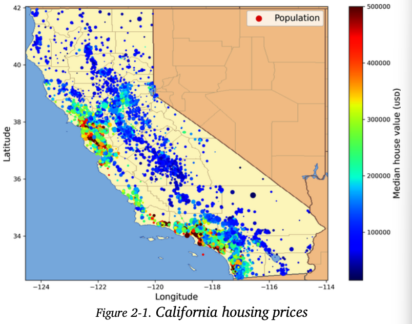

## Working with Real Data

真实数据集的获取来源：

- OpenML.org
- Kaggle.com
- PapersWithCode.com
- UC Irvine Machine Learning Repository
- Amazon’s AWS datasets
- TensorFlow datasets

## Look at the Big Picture

第一步就是明确你要达成何种目标，即要解决什么问题。

> A sequence of data processing components is called a **data pipeline.**Components typically run asynchronously. Each component pulls in a large amount of data, processes it, and spits out the result in another data store.the interface between components is simply the data store.
>
> Moreover, if a component breaks down, the downstream components can often continue to run normally (at least for a while) by just using the last output from the broken component. This makes the architecture quite robust.
>
> 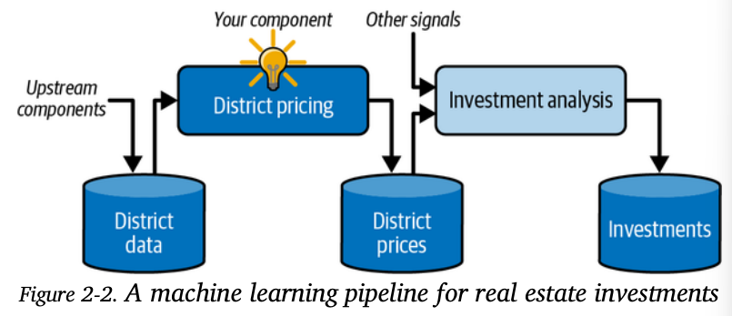

根据问题的性质，确定你要选用何种算法，监督算法？自监督算法等等

然后确定性能指标。

A typical performance measure for regression problems is the root mean square error (RMSE). It measures the standard deviation（标准方差） of the errors the system makes in its predictions

RMSE 等于 50000，意味着，68% 的系统预测值位于离实际值的50000 美元以内。即满足 “68-95-99.7”规则：大约68%的值落在 1σ 内，95% 的值落在 2σ 内，99.7% 的值落在 3σ 内，这里的 σ 等于50000
$$
RMSE(X, h) = \sqrt{\frac{1}{m}\sum^{m}_{i = 1}[h(x^{(i)}) - y^{i}] ^ 2}
$$

- m 是数据集中的实例数量

- $x^{(i)}$ is a vector of all the feature values (excluding the label) of the i th instance in the dataset， $y^{(i)}$ is its label (the desired output value for that instance).

- X is a matrix containing all the feature values (excluding labels) of all instances in the dataset

  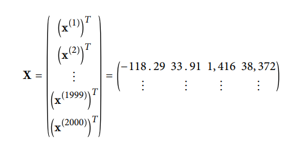

- $h$ is your system’s prediction function, also called a **hypothesis（假设）**.  When your system is given an instance’s feature vector $x^{(i)}$, it outputs a predicted value $\hat{y^{(i)}} = h(x^{(i)})$ for that instance

- RMSE(X,h) is the cost function measured on the set of examples using your hypothesis h

Even though the RMSE is generally the preferred performance measure for regression tasks, in some contexts you may prefer to use another function. For example, suppose that there are many outlier districts. In that case, you may consider using the mean absolute error(MAE, also called the **average absolute deviation**)
$$
MAE(X, h) = \frac{1}{m}\sum^{m}_{i = 1}|h(x^{(i)}) - y ^{(i)}|
$$

- Computing the root of a sum of squares (RMSE) corresponds to the Euclidean norm: this is the notion of distance you are familiar with. It is also called the ℓ2 norm, noted ∥ · ∥2 (or just ∥ · ∥) 欧几里得范数
- Computing the sum of absolutes (MAE) corresponds to the ℓ1 norm, noted ∥ · ∥1 . This is sometimes called the Manhattan norm 曼哈顿范数
- More generally, the ℓk norm of a vector v containing n elements is defined as $\Vert v \Vert_k = (|v_0|^k + |v_1|^k + ... +|v_n|^k)^{1/k}$. ℓ0 gives the number of nonzero elements in the vector, and ℓ∞ gives the maximum absolute value in the vector.
- The higher the norm index, the more it focuses on large values and neglects small ones. This is why the RMSE is more sensitive to outliers than the MAE.

## Get the Data

首先配置环境

~~~shell
$ python3 -m pip install -U jupyter matplotlib numpy pandas scipy scikit-learn
~~~

然后启动 jupyter notebook

~~~shell
$ jupyter notebook
~~~

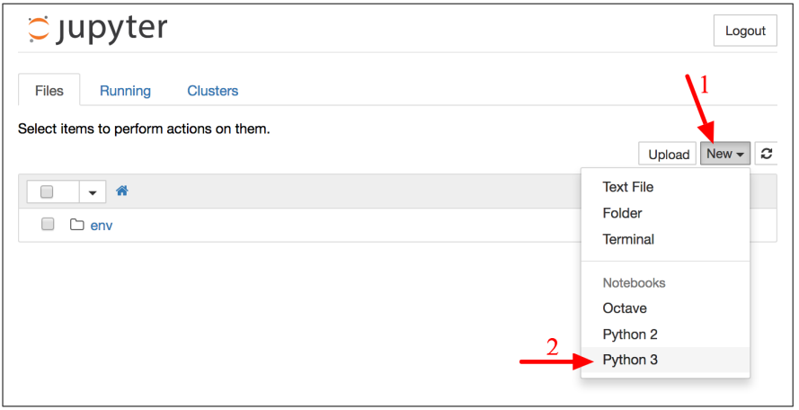

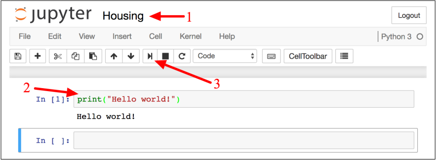

下载数据文件

~~~python
import os
import tarfile
import urllib
DOWNLOAD_ROOT = "https://raw.githubusercontent.com/ageron/handson-ml2/master/"
HOUSING_PATH = os.path.join("datasets", "housing")
HOUSING_URL = DOWNLOAD_ROOT + "datasets/housing/housing.tgz"

def fetch_housing_data(housing_url=HOUSING_URL, housing_path=HOUSING_PATH):
    os.makedirs(housing_path, exist_ok=True)
    tgz_path = os.path.join(housing_path, "housing.tgz")
    urllib.request.urlretrieve(housing_url, tgz_path)
    housing_tgz = tarfile.open(tgz_path)
    housing_tgz.extractall(path=housing_path)
    housing_tgz.close()
~~~

获取数据集中的样本

~~~python
import pandas as pd
def load_housing_data(housing_path=HOUSING_PATH):
    csv_path = os.path.join(housing_path, "housing.csv")
    # 根据指定的csv文件生成DataFrame对象
    return pd.read_csv(csv_path)

housing = load_housing_data()
housing.head()
~~~

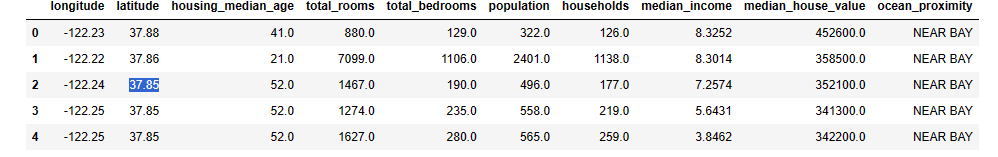

数据集的信息

~~~python
housing.info()
~~~

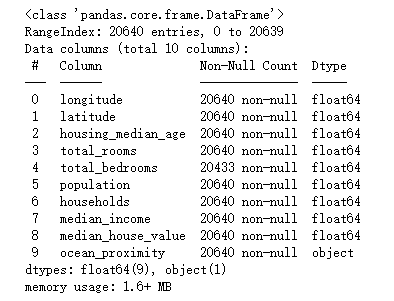

数据集的统计信息

~~~shell
housing.describe()
~~~

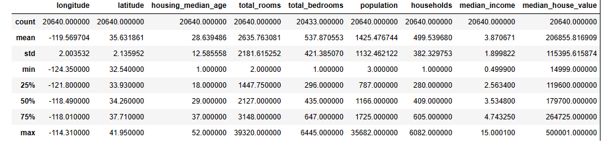

直方图的绘制

~~~python
%matplotlib inline
import matplotlib.pyplot as plt
housing.hist(bins=50, figsize=(20,15))
plt.show()
~~~

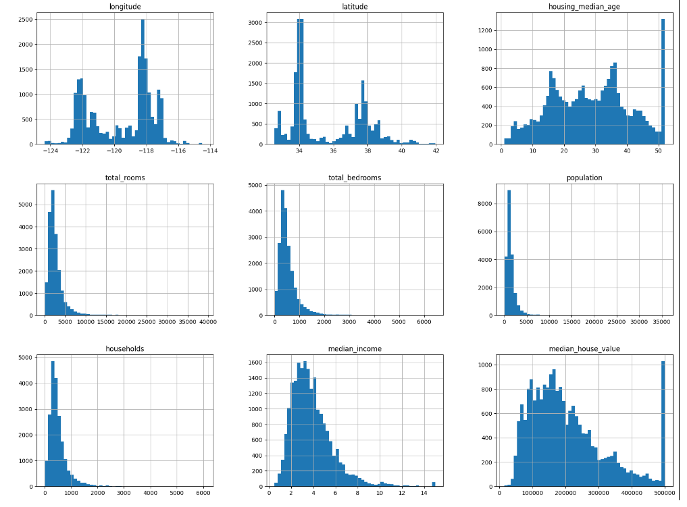

有两点需要说明：

- 会对数据进行封顶处理（median_house_value中的500000），以及缩放处理（median_income data has been scaled and capped at 15 for higher median incomes, and at 0.5 for lower median incomes）

- many histograms are tail-heavy: they extend much farther to the right of the median than to the left. This may make it a bit harder for some Machine Learning algorithms to detect patterns

## Create a Test Set

Creating a test set is theoretically simple: pick some instances randomly, typically 20% of the dataset (or less if your dataset is very large), and set them aside

~~~python
import numpy as np
def split_train_test(data, test_ratio):
    # 创建了一个伪随机序列
    shuffled_indices = np.random.permutation(len(data))
    test_set_size = int(len(data) * test_ratio)
    test_indices = shuffled_indices[:test_set_size]
    train_indices = shuffled_indices[test_set_size:]
    return data.iloc[train_indices], data.iloc[test_indices]

train_set, test_set = split_train_test(housing, 0.2)
~~~

通过`loc`、`iloc`函数，来读取`DataFrame`对象中的某列、某行数据。下面我们根据这个例子来说明用法：

~~~python
import numpy as np
import pandas as pd

data = pd.DataFrame(np.random.randn(4,4),
                    index=['Index1','Index2','Index3','Index4'],
                    columns=['Columns1','Columns2','Columns3','Columns4'])
print(data)
~~~

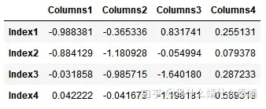

1. 单行或列数据选择：`df.loc['index1']`或`df.loc[:,'column1']`。
2. 多行或列选择：`df.loc[['index1','index2', 'index3']]`或`df.loc['index1' : 'index3']`。
3. 对应特定位置的元素选择：`df.loc['index1','column1']`
4. 同时选择特定的行和列：`df.loc[['index1','index2'],['column1','column2']]`
5. 给定布尔数组，过滤掉False对应索引的行

注意，如果不指定行名（例如，从csv文件中读取），那么使用0、1、2... 数字编号来命名行。

`loc`是基于行名来索引查询的，但是`iloc`是基于行索引来查询的，遵循左闭右开原则。

在机器学习中，**模型的测试集被用来评估模型对未知数据的预测性能，它应该完全独立于训练过程**。

Why do we need to have the test set remain consistent across multiple runs?

- You will judge the performance of the trained model based on certain performance metrics. If you keep updating your test set, then you will not know whether one run is better than the other.

保持训练集稳定的方案有两种

- 初次运行时，生成并保存这个随机生成的测试集。之后的运行中，直接使用这个已保存的测试集
- 给随机函数一个种子

但是，对于更新的数据集，上述两种方案就失效了。

 To have a stable train/test split even after updating the dataset, a common solution is to use each instance’s identifier to decide whether or not it should go in the test set (assuming instances have a unique and immutable identifier)

For example, you could compute a hash of each instance’s identifier and put that instance in the test set if the hash is lower than or equal to 20% of the maximum hash value. Here is a possible implementation:

~~~python
from zlib import crc32
def test_set_check(identifier, test_ratio):
    return crc32(np.int64(identifier)) & 0xffffffff < test_ratio * 2**32

def split_train_test_by_id(data, test_ratio, id_column):
    ids = data[id_column]
    in_test_set = ids.apply(lambda id_: test_set_check(id_, test_ratio))
    return data.loc[~in_test_set], data.loc[in_test_set]

housing_with_id["id"] = housing["longitude"] * 1000 + housing["latitude"]
train_set, test_set = split_train_test_by_id(housing_with_id, 0.2, "id")
~~~

Scikit-Learn provides a few functions to split datasets into multiple subsets in various ways

~~~python
from sklearn.model_selection import train_test_split

train_set, test_set = train_test_split(housing, test_size=0.2, random_state=42)
~~~

So far we have considered purely random sampling methods. This is generally fine if your dataset is large enough), but if it is not, you run the risk of introducing a significant **sampling bias**.

**分层抽样**（startified sampling），它将抽样单位按某种特征或某种规则划分为不同的层，然后从不同的层中独立、随机地抽取样本。从而保证样本的结构与总体的结构比较相近，从而提高估计的精度。在数据量特别大的情况下，随机抽样可以保证分层抽样的精确性。

分层的步骤：

~~~python
# 添加income_cat列，值根据median_income来确定
housing["income_cat"] = pd.cut(housing["median_income"],
    bins=[0., 1.5, 3.0, 4.5, 6., np.inf],
    labels=[1, 2, 3, 4, 5])
~~~

~~~python
housing["income_cat"].hist() # 打印图表
~~~

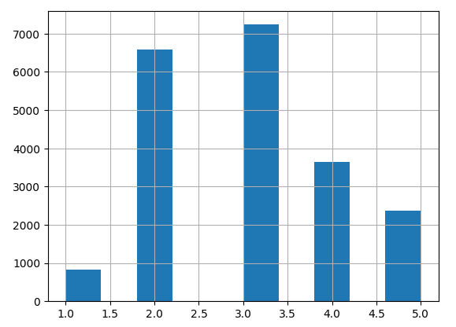

~~~python
from sklearn.model_selection import startifiedShuffleSplit
split = startifiedShuffleSplit(n_splits=1, test_size=0.2, random_state=42)

# 根据incoe_cat标签来分层切割
for train_index, test_index in split.split(housing, housing["income_cat"]):
    start_train_set = housing.loc[train_index]
    start_test_set = housing.loc[test_index]
~~~

~~~python
class sklearn.model_selection.StratifiedShuffleSplit(n_splits=10, *, test_size=None, train_size=None, random_state=None)
~~~

- `n_splits`：Number of re-shuffling & splitting iterations，设置为1即可

~~~python
split(X, y, groups=None)
~~~

- **X**：Training data,
- y：The target variable for supervised learning problems. Stratification is done based on the y labels.

验证

~~~python
 start_test_set["income_cat"].value_counts() / len(start_test_set)
~~~

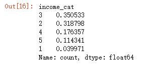

下面是随机抽样和分层抽样的对比结果

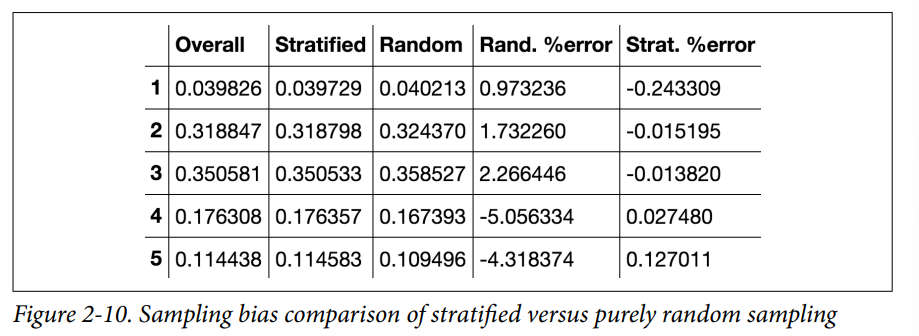

分层完后，就将仅仅用于分层的income_cat列丢弃掉：

~~~python
for set_ in (start_train_set, start_test_set):
    set_.drop("income_cat", axis=1, inplace=True)
~~~

## Discover and Visualize the Data to Gain Insights

~~~python
import matplotlib.pyplot as plt
housing = start_train_set.copy()
housing.plot(kind="scatter", x="longitude", y="latitude", alpha=0.4,
    s=housing["population"]/100, label="population", figsize=(10,7),
    c="median_house_value", cmap=plt.get_cmap("jet"), colorbar=True,
)
plt.legend()
~~~

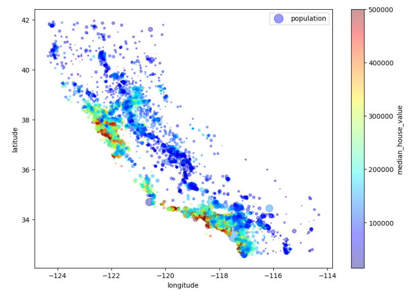

Since the dataset is not too large, you can easily compute the **standard correlation coefficient** (also called Pearson’s r) between every pair of attributes using the corr() method:

~~~python
numeric_columns = housing.select_dtypes(include=['int','float']).columns
corr_matrix = housing[numeric_columns].corr()
corr_matrix["median_house_value"].sort_values(ascending=False)
~~~

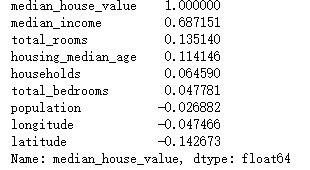

The correlation coefficient only measures linear correlations

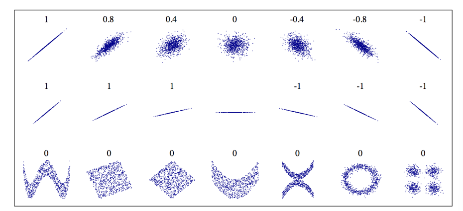

Another way to check for correlation between attributes is to use the pandas scatter_matrix() function,

~~~python
from pandas.plotting import scatter_matrix
attributes = ["median_house_value", "median_income", "total_rooms",
    "housing_median_age"]
scatter_matrix(housing[attributes], figsize=(12, 8))
~~~

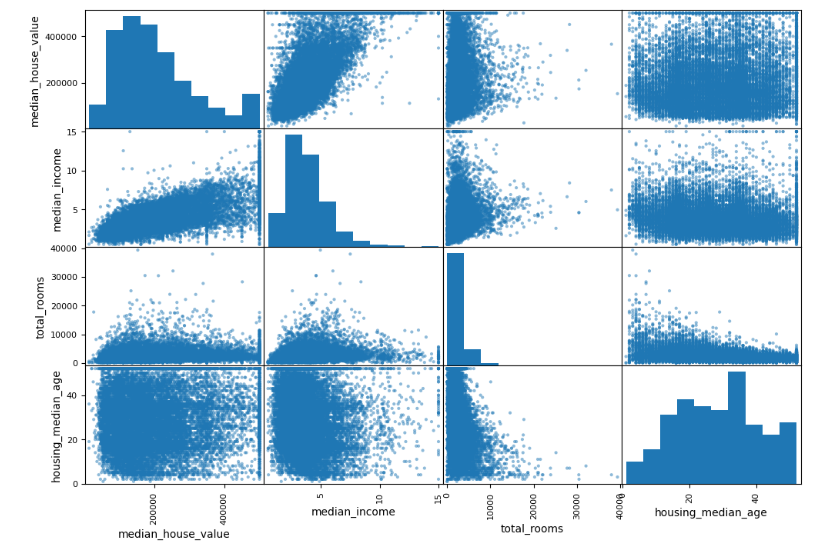

The main diagonal (top left to bottom right) would be full of straight lines if pandas plotted each variable against itself, which would not be very useful. So instead pandas displays a histogram of each attribute

单独两个变量之间的关系

~~~python
housing.plot(kind="scatter", x="median_income", y="median_house_value",
 	alpha=0.1)
~~~

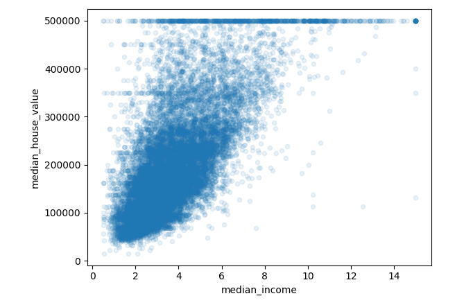

## Prepare the Data for Machine Learning Algorithms

房间总数，卧室总数，总人数对于房屋均价意义不大，创造新属性人均持有量更有意义。

~~~python
housing["rooms_per_household"] = housing["total_rooms"]/housing["households"]
housing["bedrooms_per_room"] = housing["total_bedrooms"]/housing["total_rooms"]
housing["population_per_household"]=housing["population"]/housing["households"]
~~~

在数据清理前，最好将标签属性分离出来：

~~~python
housing = start_train_set.drop("median_house_value", axis=1)
housing_labels = start_train_set["median_house_value"].copy()
~~~

大部分机器学习算法无法在缺失特征上工作，我们要处理这些缺失的特征，有以下三种方案：

- Get rid of the corresponding row.
- Get rid of the whole attribute (column)
- Set the values to some value

~~~python
housing.dropna(subset=["total_bedrooms"]) # option 1

housing.drop("total_bedrooms", axis=1) # option 2
# axis：轴。0或'index'，表示按行删除；1或'columns'，表示按列删除。

median = housing["total_bedrooms"].median() # option 3
housing["total_bedrooms"].fillna(median, inplace=True)
~~~

Scikit-Learn provides a handy class to take care of missing values: `SimpleImputer`.

~~~python
from sklearn.impute import SimpleImputer
imputer = SimpleImputer(startegy="median")
housing_num = housing.drop("ocean_proximity", axis=1)
imputer.fit(housing_num)			
~~~

The imputer has simply computed the median of each attribute and stored the result in its `statistics_` instance variable

~~~python
imputer.statistics_
~~~

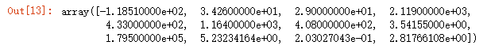

~~~python
housing_num = housing.drop("ocean_proximity", axis=1)
imputer.fit(housing_num)
X = imputer.transform(housing_num) # 填补缺失值
~~~

The result of `imputer.transform` is a plain NumPy array. If you want to put it back into a pandas DataFrame, it’s simple:

~~~python
housing_tr = pd.DataFrame(X, columns=housing_num.columns,
 	index=housing_num.index)
~~~

> These are the main design principles of Scikit-Learn’s API
>
> - **Consistency**：All objects share a consistent and simple interface:
>
>   - **Estimators**：Any object that can **estimate some parameters based on a dataset** is called an estimator (e.g., an imputer is an estimator，sorts of machine learning models). The estimation itself is performed by the fit() method, and it takes only a dataset as a parameter (or two for supervised learning algorithms; the second dataset contains the labels).
>
>     Any other parameter needed to guide the estimation process is considered a **hyperparameter** (such as an imputer’s startegy), and it must be set as an instance variable (generally via a constructor parameter).
>
>   - **Transformers**：Some estimators (such as an imputer) can also transform a dataset; these are called transformers.  The transformation is performed by the transform() method with the dataset to transform as a parameter. This transformation generally relies on the learned parameters
>
>     All transformers also have a convenience method called fit_transform() that is equivalent to calling fit() and then transform() (but sometimes fit_transform() is optimized and runs much faster).
>
>   - **Predictors**：some estimators, given a dataset, are capable of making predictions; they are called predictors. 
>
>     A predictor has a predict() method that takes a dataset of new instances and returns a dataset of corresponding predictions. It also has a score() method that measures the quality of the predictions, given a test set
>
> - **Inspection**：All the estimator’s hyperparameters are accessible directly via public instance variables (e.g., `imputer.startegy`), and all the estimator’s learned parameters are accessible via public instance variables with an underscore suffix (e.g., `imputer.statistics_`)
>
> - **Nonproliferation of classes**：Datasets are represented as NumPy arrays or SciPy sparse matrices
>
> - **Composition**
>
> - **Sensible defaults**

下面我们来看看如何处理文本属性`ocean_proximity`

~~~python
housing_cat = housing[["ocean_proximity"]] # 提取特定的列
~~~

It’s not arbitrary text: there are a limited number of possible values, each of which represents a category. So this attribute is a categorical attribute. Most Machine Learn‐ ing algorithms prefer to work with numbers, so let’s convert these categories from text to numbers. For this, we can use Scikit-Learn’s OrdinalEncoder class

~~~python
from sklearn.preprocessing import OrdinalEncoder
ordinal_encoder = OrdinalEncoder()
housing_cat_encoded = ordinal_encoder.fit_transform(housing_cat)
housing_cat_encoded[:10]
~~~

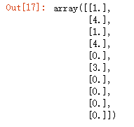

You can get the list of categories using the categories_ instance variable

~~~python
ordinal_encoder.categories_
~~~

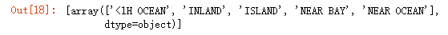

One issue with this representation is that ML algorithms will assume that two nearby values are more similar than two distant values.  but it is obviously not the case for the ocean_proximity column (for example, categories 0 and 4 are clearly more similar than categories 0 and 1). To fix this issue, Scikit-Learn provides a OneHotEncoder class to convert categorical values into one-hot vectors

~~~python
from sklearn.preprocessing import OneHotEncoder
cat_encoder = OneHotEncoder()
housing_cat_1hot = cat_encoder.fit_transform(housing_cat)
housing_cat_1hot.toarray()
~~~

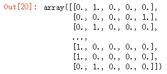

Once again, you can get the list of categories using the encoder’s categories_ instance variable:

~~~python
cat_encoder.categories_
~~~

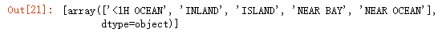

下面我们讲讲如何自定义`Transformers`

 Scikit-Learn relies on duck typing (not inheritance), all you need to do is create a class and implement three methods: fit() (returning self), transform(), and fit_transform().

~~~python
from sklearn.base import BaseEstimator, TransformerMixin
rooms_ix, bedrooms_ix, population_ix, households_ix = 3, 4, 5, 6

class  CombinedAttributesAdder(BaseEstimator, TransformerMixin):
    # In this example the transformer has one hyperparameter, add_bedrooms_per_room,
    def  __init__(self, add_bedrooms_per_room = True):
        self.add_bedrooms_per_room = add_bedrooms_per_room
        
    def fit(self, X, y=None):
        return self
    
    def transform(self, X):
        rooms_per_household = X[:, rooms_ix] / X[:, households_ix]
        population_per_household = X[:, population_ix] / X[:, households_ix]
        if self.add_bedrooms_per_room:
            bedrooms_per_room = X[:, bedrooms_ix] / X[:, rooms_ix]
            return np.c_[X, rooms_per_household, population_per_household, bedrooms_per_room]
        else:
            return np.c_[X, rooms_per_household, population_per_household]
~~~

One of the most important transformations you need to apply to your data is **feature scaling**. With few exceptions, Machine Learning algorithms don’t perform well when the input numerical attributes have very different scales，这样减少量纲的影响。

There are two common ways to get all attributes to have the same scale:

-  **min-max scaling** 

  Min-max scaling (many people call this normalization) is the simplest: values are shif‐ ted and rescaled so that they end up ranging from 0 to 1. We do this by subtracting the min value and dividing by the max minus the min.

  Scikit-Learn provides a trans‐ former called MinMaxScaler for this

-  **standardization**

  Standardization is different: first it subtracts the mean value (so standardized values always have a zero mean), and then it divides by the standard deviation so that the resulting distribution has unit variance（方差）

  Scikit-Learn provides a transformer called StandardScaler for standardization.

there are many data transformation steps that need to be executed in the right order. Fortunately, Scikit-Learn provides the Pipeline class to help with such sequences of transformations

~~~python
from sklearn.pipeline import Pipeline
from sklearn.preprocessing import StandardScaler

# the name will come in handy later for hyperparameter tuning.
num_pipeline = Pipeline([
     ('imputer', SimpleImputer(startegy="median")),
     ('attribs_adder', CombinedAttributesAdder()),
     ('std_scaler', StandardScaler()),
])
housing_num_tr = num_pipeline.fit_transform(housing_num)
~~~

All but the last estimator must be transformers (i.e., they must have a fit_transform() method)

When you call the pipeline’s `fit()` method, it calls `fit_transform()` sequentially on all transformers, passing the output of each call as the parameter to the next call until it reaches the final estimator, for which it calls the `fit()` method.

It would be more convenient to have a single transformer able to handle all col‐ umns, applying the appropriate transformations to each column. In version 0.20, Scikit-Learn introduced the ColumnTransformer for this purpose

~~~python
from sklearn.compose import ColumnTransformer
# we get the list of numerical col‐umn names and the list of categorical column names
num_attribs = list(housing_num)
cat_attribs = ["ocean_proximity"]

# (name, a transformer, a list of names (or indices) of columns that the transformer should be applied to)

full_pipeline = ColumnTransformer([
    ("num", num_pipeline, num_attribs),
    ("cat", OneHotEncoder(), cat_attribs),
])	

housing_prepared = full_pipeline.fit_transform(housing)
~~~

Note that the `OneHotEncoder` returns a sparse matrix, while the `num_pipeline` returns a dense matrix. When there is such a mix of sparse and dense matrices, the `ColumnTransformer` estimates the density of the final matrix (i.e., the ratio of nonzero cells), and it returns a sparse matrix if the density is lower than a given threshold (by default, `sparse_threshold`=0.3)

## Select and Train a Mode

 Let’s first train a Linear Regression model

~~~python
from sklearn.linear_model import LinearRegression

lin_reg = LinearRegression()
lin_reg.fit(housing_prepared, housing_labels)
~~~

Now that the model is trained, let’s evaluate it on the training set:

~~~python
# 前五个
some_data = housing.iloc[:5]
some_labels = housing_labels.iloc[:5]
some_data_prepared = full_pipeline.transform(some_data)

print("Predictions:", lin_reg.predict(some_data_prepared))
print("Labels:", list(some_labels))
~~~

计算它的`RMSE`

~~~python
from sklearn.metrics import mean_squared_error
housing_predictions = lin_reg.predict(housing_prepared)
lin_mse = mean_squared_error(housing_labels, housing_predictions)
lin_rmse = np.sqrt(lin_mse)
lin_rmse # 68628.19819848922
~~~

这个`RMSE`说明这个线性回归模型的训练效果并不好

Let’s train a DecisionTreeRegressor

~~~python
from sklearn.tree import DecisionTreeRegressor

tree_reg = DecisionTreeRegressor()
tree_reg.fit(housing_prepared, housing_labels)
~~~

Now that the model is trained, let’s evaluate it **on the training set**:

~~~python
housing_predictions = tree_reg.predict(housing_prepared)
tree_mse = mean_squared_error(housing_labels, housing_predictions)
tree_rmse = np.sqrt(tree_mse)
tree_rmse # 0.0
~~~

WTF!? No error at all? 😨 是不是过拟合了？

我们可以使用在验证集、测试集上继续验证。但是这里更推荐使用`K-fold cross-validation`方法来验证，它还是在训练集上进行评估。

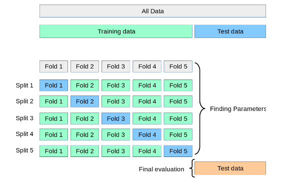

The following code randomly splits the training set into 10 distinct subsets called `folds`, then it trains and evaluates the Decision Tree model 10 times, picking a different fold for evaluation（评估） every time and training on the other 9 folds. The result is an array containing the 10 evaluation scores:

~~~python
from sklearn.model_selection import cross_val_score
scores = cross_val_score(tree_reg, housing_prepared, housing_labels,
scoring="neg_mean_squared_error", cv=10)
tree_rmse_scores = np.sqrt(-scores)

def display_scores(scores):
    print("Scores:", scores)
    print("Mean:", scores.mean())
    print("Standard deviation:", scores.std())
    
display_scores(tree_rmse_scores)
~~~

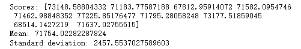

~~~python
scores = cross_val_score(model, X, y, cv=5, scoring='accuracy')
~~~

- `estimator`： 模型
- `X`： 输入样本数据
- `y`： 标签
- `cv`： 交叉验证折数
- `scoring`：它决定了模型评估指标的选择，https://scikit-learn.org/stable/modules/model_evaluation.html

Let’s try one last model now: the RandomForestRegressor

~~~python
from sklearn.ensemble import RandomForestRegressor
forest_reg = RandomForestRegressor()
forest_reg.fit(housing_prepared, housing_labels)
housing_predictions = forest_reg.predict(housing_prepared)
forest_mse = mean_squared_error(housing_labels, housing_predictions)
forest_rmse = np.sqrt(forest_mse)
forest_rmse	# 18589.930984789415
~~~

我们可以通过`joblib`来保存一个模型的训练参数以及它的超参数

~~~python
import joblib
joblib.dump(my_model, "my_model.pkl")
my_model_loaded = joblib.load("my_model.pkl")
~~~

## Fine-Tune Your Model

One option would be to fiddle with the hyperparameters manually, until you find a great combination of hyperparameter values. 

Instead, you should get Scikit-Learn’s GridSearchCV to search for you

~~~python
from sklearn.model_selection import GridSearchCV
param_grid = [
    {'n_estimators': [3, 10, 30], 'max_features': [2, 4, 6, 8]},
    {'bootstrap': [False], 'n_estimators': [3, 10], 'max_features': [2, 3, 4]},
]
forest_reg = RandomForestRegressor()

grid_search = GridSearchCV(forest_reg, param_grid, cv=5,
 	scoring='neg_mean_squared_error',
	return_train_score=True)

grid_search.fit(housing_prepared, housing_labels)
~~~

This param_grid tells Scikit-Learn to first evaluate all 3 × 4 = 12 combinations of n_estimators and max_features hyperparameter values specified in the first dict. then try all 2 × 3 = 6 combinations of hyperparameter values in the second dict

The grid search will explore 12 + 6 = 18 combinations of RandomForestRegressor hyperparameter values, and it will train each model 5 times (since we are using fivefold cross validation). In other words, all in all, there will be 18 × 5 = 90 rounds of training!

 when it is done you can get the best com‐ bination of parameters like this:

~~~python
grid_search.best_params_
# {'max_features': 8, 'n_estimators': 30}
~~~

You can also get the best estimator directly:

~~~python
grid_search.best_estimator_
# RandomForestRegressor(bootstrap=True, criterion='mse', max_depth=None,
# 	 max_features=8, max_leaf_nodes=None, min_impurity_decrease=0.0,
# 	 min_impurity_split=None, min_samples_leaf=1,
# 	 min_samples_split=2, min_weight_fraction_leaf=0.0,
# 	 n_estimators=30, n_jobs=None, oob_score=False, random_state=None,
# 	 verbose=0, warm_start=False)
~~~

And of course the evaluation scores are also available:

~~~python
cvres = grid_search.cv_results_
for mean_score, params in zip(cvres["mean_test_score"], cvres["params"]):
    print(np.sqrt(-mean_score), params)
 
# 63669.05791727153 {'max_features': 2, 'n_estimators': 3}
# 55627.16171305252 {'max_features': 2, 'n_estimators': 10}
# 53384.57867637289 {'max_features': 2, 'n_estimators': 30}
# 60965.99185930139 {'max_features': 4, 'n_estimators': 3}
# 52740.98248528835 {'max_features': 4, 'n_estimators': 10}
# 50377.344409590376 {'max_features': 4, 'n_estimators': 30}
# 58663.84733372485 {'max_features': 6, 'n_estimators': 3}
# 52006.15355973719 {'max_features': 6, 'n_estimators': 10}
# 50146.465964159885 {'max_features': 6, 'n_estimators': 30}
# 57869.25504027614 {'max_features': 8, 'n_estimators': 3}
# 51711.09443660957 {'max_features': 8, 'n_estimators': 10}
# 49682.25345942335 {'max_features': 8, 'n_estimators': 30}
# 62895.088889905004 {'bootstrap': False, 'max_features': 2, 'n_estimators': 3}
# 54658.14484390074 {'bootstrap': False, 'max_features': 2, 'n_estimators': 10}
# 59470.399594730654 {'bootstrap': False, 'max_features': 3, 'n_estimators': 3}
# 52725.01091081235 {'bootstrap': False, 'max_features': 3, 'n_estimators': 10}
# 57490.612956065226 {'bootstrap': False, 'max_features': 4, 'n_estimators': 3}
# 51009.51445842374 {'bootstrap': False, 'max_features': 4, 'n_estimators': 10}
~~~

when the hyperparameter search space is large, it is often preferable to use RandomizedSearchCV. This class can be used in much the same way as the GridSearchCV class, but instead of trying out all possible combi‐ nations, it evaluates a given number of random combinations by selecting a random value for each hyperparameter at every iteration

Another way to fine-tune your system is to try to combine the models that perform best. The group (or “ensemble”) will often perform better than the best individual model

## Evaluate Your System on the Test Set

There is nothing special about this process; just get the predictors and the labels from your test set, run your full_pipeline to transform the data and evaluate the final model on the test set:

~~~python
final_model = grid_search.best_estimator_
X_test = strat_test_set.drop("median_house_value", axis=1)
y_test = strat_test_set["median_house_value"].copy()
X_test_prepared = full_pipeline.transform(X_test)
final_predictions = final_model.predict(X_test_prepared)

final_mse = mean_squared_error(y_test, final_predictions)
final_rmse = np.sqrt(final_mse) # => evaluates to 47,730.2
~~~

you can compute a 95% confidence interval（置信区间） for the generalization error using `scipy.stats.t.interval()`:

~~~python
from scipy import stats
confidence = 0.95
squared_errors = (final_predictions - y_test) ** 2
np.sqrt(stats.t.interval(confidence, len(squared_errors) - 1,
	loc=squared_errors.mean(),
	scale=stats.sem(squared_errors)))
# array([45685.10470776, 49691.25001878])
~~~

If you did a lot of hyperparameter tuning, the performance will usually be slightly worse than what you measured using cross-validation (because your system ends up fine-tuned to perform well on the validation data and will likely not perform as well on unknown datasets).

 when this happens you must resist the temptation to tweak the hyperparameters to make the numbers look good on the test set; the improvements would be unlikely to generalize to new data.

## Launch, Monitor, and Maintain Your System

you can deploy your model to your production environment. 

One way to do this is to save the trained Scikit-Learn model (e.g., using joblib), including the full preprocessing and prediction pipeline, then load this trained model within your production envi‐ ronment and use it to make predictions by calling its predict() method

