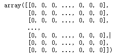
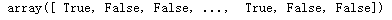
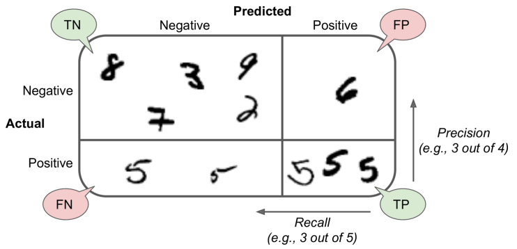
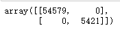
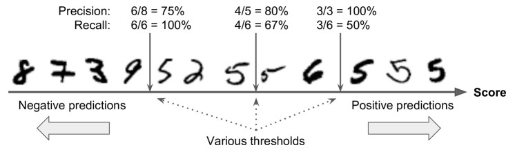
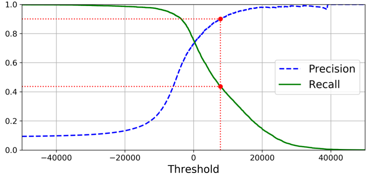
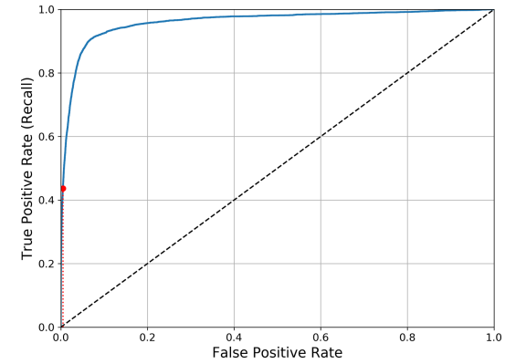

# Classification

[TOC]

## MNIST

在本节中，我们使用MNIST dataset来介绍分类算法，它就是机器学习领域的HelloWorld。这个数据集包含7,0000张手写数字的图片。

Scikit-Learn provides many helper functions to download popular datasets.

~~~python
from sklearn.datasets import fetch_openml
mnist = fetch_openml('mnist_784', version=1, as_frame=False)
mnist.keys()
# dict_keys(['data', 'target', 'feature_names', 'DESCR', 'details', 'categories', 'url'])
~~~

Datasets loaded by Scikit-Learn generally have a similar dictionary structure, includ‐ ing the following:

- **A DESCR key** describing the dataset
- **A data key** containing an array with one row per instance and one column per feature
- **A target key** containing an array with the labels

~~~python
X, y = mnist["data"], mnist["target"]
X
~~~

~~~python
X.shape # (70000, 784)
~~~

There are 70,000 images, and each image has 784 features. This is because each image is 28 × 28 pixels, and each feature simply represents one pixel’s intensity, from 0 (white) to 255 (black)

~~~python
import matplotlib as mpl
import matplotlib.pyplot as plt
some_digit = X[0]
some_digit_image = some_digit.reshape(28, 28)
plt.imshow(some_digit_image, cmap=mpl.cm.binary)
plt.axis("off")

save_fig("some_digit_plot")
plt.show()
~~~

~~~python
 y = y.astype(np.uint8) # 将字符串转换为Int类型
~~~

The MNIST dataset is actually already split into a training set (the first 60,000 images) and a test set (the last 10,000 images):

~~~python
X_train, X_test, y_train, y_test = X[:60000], X[60000:], y[:60000], y[60000:]
~~~

 Moreover, some learning algorithms are sensitive to the order of the training instances, and they perform poorly if they get many similar instances in a row（连续地）. Shuffling the dataset ensures that this won’t happen

## Training a Binary Classifier

现在我们训练一个二元识别器，即判断这个数字是不是5.

~~~python
y_train_5 = (y_train == 5) # True for all 5s, False for all other digits
y_test_5 = (y_test == 5)
~~~

A good place to start is with a Stochastic Gradi‐ ent Descent (SGD) classifier, using Scikit-Learn’s SGDClassifier class

~~~python
from sklearn.linear_model import SGDClassifier
sgd_clf = SGDClassifier(random_state=42)
sgd_clf.fit(X_train, y_train_5)
~~~

Now we can use it to detect images of the number 5:

~~~python
sgd_clf.predict([some_digit])
~~~

## Performance Measures

### Measuring Accuracy Using Cross-Validation

A good way to evaluate a model is to use cross-validation

我们可以自己实现一个交叉验证

~~~python
from sklearn.model_selection import StratifiedKFold
from sklearn.base import clone

# The StratifiedKFold class performs stratified sampling to produce folds that contain a representative ratio of each class.
skfolds = StratifiedKFold(n_splits=3, random_state=42)

for train_index, test_index in skfolds.split(X_train, y_train_5):
    clone_clf = clone(sgd_clf)
    
    X_train_folds = X_train[train_index]
    y_train_folds = y_train_5[train_index]
    
    X_test_fold = X_train[test_index]
    y_test_fold = y_train_5[test_index]
    
    clone_clf.fit(X_train_folds, y_train_folds)
    y_pred = clone_clf.predict(X_test_fold)
    n_correct = sum(y_pred == y_test_fold)
    print(n_correct / len(y_pred)) # prints 0.9502, 0.96565, and 0.96495
~~~

Let’s use the cross_val_score() function

~~~python
from sklearn.model_selection import cross_val_score

# cv=3 指明了交叉验证的折叠数量
cross_val_score(sgd_clf, X_train, y_train_5, cv=3, scoring="accuracy")
# array([0.96355, 0.93795, 0.95615])
~~~

Wow! Above 93% accuracy, but let’s look at a very dumb classifier that just classifies every single image in the “not-5” class:

~~~python
from sklearn.base import BaseEstimator

# 定义一个模型
class Never5Classifier(BaseEstimator):
    def fit(self, X, y=None):
    	return self
    def predict(self, X):
    	return np.zeros((len(X), 1), dtype=bool)	# 返回了一个len(X)行1列的矩阵，元素全为False
~~~

~~~python
never_5_clf = Never5Classifier()

cross_val_score(never_5_clf, X_train, y_train_5, cv=3, scoring="accuracy")
# array([0.91125, 0.90855, 0.90915])

~~~

That’s right, it has over 90% accuracy! This is simply because only about 10% of the images are 5s, so if you always guess that an image is not a 5, you will be right about 90% of the time. 

This demonstrates why accuracy is generally not the preferred performance measure for classifiers, especially when you are dealing with **skewed datasets** (i.e., when some classes are much more frequent than others).

### Confusion Matrix

A much better way to evaluate the performance of a classifier is to look at the **confusion matrix**

The general idea is to count the number of times instances of class A are classified as class B

要计算混淆矩阵，需要先有一组预测，这样才能将其与实际目标进行比较

~~~python
from sklearn.model_selection import cross_val_predict
y_train_pred = cross_val_predict(sgd_clf, X_train, y_train_5, cv=3)
y_train_pred
~~~

Just like the cross_val_score() function, cross_val_predict() performs K-fold cross-validation, but instead of returning the evaluation scores, it returns the predictions made on each test fold

现在可以使用`confusion_matrix()`函数来获取混淆矩阵了。只需 要给出目标类别（y_train_5）和预测类别（y_train_pred）即可：

~~~python
 from sklearn.metrics import confusion_matrix
 confusion_matrix(y_train_5, y_train_pred)
~~~

从中我们可以获知：

1. 混淆矩阵中的行表示**实际类别（actual class）**
2. 列表示**预测类别（predicted class）**
3. 本例中第一行表 示所有“非5”**（负类，the negative class）**的图片中
4. 53 892张被正确地分为“非5”类别 **（真负类， true negatives）**
5. 687张被错误地分类成了“5”**（假正类，false positives）**
6. 第二行表示 所有“5”**（正类，positives class）**的图片中
7. 1891张被错误地分为“非5”类别**（假负类，false  negative）**
8. 3530张被正确地分在了“5”这一类别**（真正类， true positives）**。

一个完美的分类器只有真正类和真负类

~~~python
y_train_perfect_predictions = y_train_5 # pretend we reached perfection
confusion_matrix(y_train_5, y_train_perfect_predictions)
~~~

正类预测的准确率（ accuracy of the positive pre‐ dictions）是一个有意思的指标，它也称为分类器的精度（precision of the classifier）
$$
precision = \frac{TP}{TP+FP}
$$
TP是真正类的数量，FP是假正类的数量。

但是这个指标并没有把假负类的情况考虑进去，因此，精度通常与召回率（ **recall**, also called **sensitivity** or the **true positive rate**）一起使用
$$
recall = \frac{TP}{TP + FN}
$$
Scikit-Learn提供了计算多种分类器指标的函数，包括精度和召回率

~~~python
from sklearn.metrics import precision_score, recall_score
precision_score(y_train_5, y_train_pred) # 0.8370879772350012
recall_score(y_train_5, y_train_pred) # 0.6511713705958311
~~~

上述结果说明，当它说一张图片是5时，只有65.1%的概率是正确的。

我们可以将精度和召回率组合成一个新的指标：$F_1$分数（score）

The F1 score is the harmonic mean of precision and recall. the harmonic mean gives much more weight to low values. As a result, the classifier will only get a high F1 score if both recall and precision are high.
$$
F_1 = \frac{2}{\frac{1}{precision} + \frac{1}{recall}} = 2 *\frac{precision * recall}{ precision + recall} = \frac{TP}{TP + \frac{FN + FP}{2}}
$$

~~~python
from sklearn.metrics import f1_score
f1_score(y_train_5, y_train_pred) # 0.7325171197343847
~~~

in some contexts you mostly care about precision, and in other contexts you really care about recall.  For example, if you trained a classifier to detect vid‐ eos that are safe for kids, you would probably prefer a classifier that rejects many good videos (low recall) but keeps only safe ones (high precision)

遗憾的是，鱼和熊掌不可兼得，你不能同时增加精度又减少召回率，反之亦然。这称为精度/召回率权衡（ **precision/recall trade-off**）

要理解这个权衡过程，我们来看看SGDClassifier如何进行分类决策。对于每个实例，它会基于决策函数计算出一个分值，如果该值大于阈值，则将该实例判为正类，否则便将其判为负类

Scikit-Learn不允许直接设置阈值，但是可以访问它用于预测的决策分值

~~~python
y_scores = sgd_clf.decision_function([some_digit])
y_scores	# array([2164.22030239])
threshold = 0
y_some_digit_pred = (y_scores > threshold) 	# array([ True])
~~~

How do you decide which threshold to use? First, use the `cross_val_predict()` function to get the scores of all instances in the training set, but this time specify that you want to return decision scores instead of predictions:

~~~python
y_scores = cross_val_predict(sgd_clf, X_train, y_train_5, cv=3,
 	method="decision_function")

# array([  1200.93051237, -26883.79202424, -33072.03475406, ..., 13272.12718981,  -7258.47203373, -16877.50840447])
~~~

有了这些分值，可以使用`precision_recall_curve()`函数来计算 所有可能的阈值的精度和召回率：

~~~python
from sklearn.metrics import precision_recall_curve

precisions, recalls, thresholds = precision_recall_curve(y_train_5, y_scores)
~~~

最后，使用Matplotlib绘制精度和召回率相对于阈值的函数

~~~python
def plot_precision_recall_vs_threshold(precisions, recalls, thresholds):
    plt.plot(thresholds, precisions[:-1], "b--", label="Precision")
	plt.plot(thresholds, recalls[:-1], "g-", label="Recall")
    
plot_precision_recall_vs_threshold(precisions, recalls, thresholds)
plt.show()
~~~

假设你决定将精度设为90%

~~~python
threshold_90_precision = thresholds[np.argmax(precisions >= 0.90)]
# (np.argmax() will give you the first index of the maximum value, which in this case means the first True value
~~~

To make predictions (on the training set for now), instead of calling the classifier’s predict() method, you can run this code:

~~~python
y_train_pred_90 = (y_scores >= threshold_90_precision)
~~~

然后再去调用模型去预测。

Let’s check these predictions’ precision and recall:

~~~python
precision_score(y_train_5, y_train_pred_90)	# 0.9000380083618396
recall_score(y_train_5, y_train_pred_90)	# 0.4368197749492714
~~~

### ROC Curve

The r**eceiver operating characteristic** (ROC，受试者工作特征) curve is another common tool used with binary classifiers

the ROC curve plots the true positive rate (another name for recall) against the false positive rate (FPR). The FPR is the ratio of negative instances that are incorrectly classified as positive. It is equal to $1 –  TNR$, which is the ratio of negative instances that are correctly classified as negative. The TNR is also called **specificity**(特异度). Hence, the ROC curve plots sensitivity (recall) versus $1 – specificity$

要绘制ROC曲线，首先需要使用`roc_curve()`函数计算各个阈值的 TPR和FPR

~~~python
from sklearn.metrics import roc_curve
fpr, tpr, thresholds = roc_curve(y_train_5, y_scores)
~~~

然后，使用Matplotlib绘制FPR对TPR的曲线

~~~python
def plot_roc_curve(fpr, tpr, label=None):
    plt.plot(fpr, tpr, linewidth=2, label=label)
    plt.plot([0, 1], [0, 1], 'k--')
    
plot_roc_curve(fpr, tpr)
plt.show()
~~~

同样这里再次面临一个折中权衡：召回率（TPR）越高，分类器所产生的假正类（FPR）就越多

Once again there is a trade-off: the higher the recall (TPR), the more false positives (FPR) the classifier produces. The dotted line represents the ROC curve of a purely random classifier; a good classifier stays as far away from that line as possible

One way to compare classifiers is to measure the area under the curve (AUC). A per‐ fect classifier will have a ROC AUC equal to 1, whereas a purely random classifier will have a ROC AUC equal to 0.5. Scikit-Learn provides a function to compute the ROC AUC:

~~~python
from sklearn.metrics import roc_auc_score
roc_auc_score(y_train_5, y_scores)	# 0.9604938554008616
~~~

Since the ROC curve is so similar to the precision/recall (PR) curve, you may wonder how to decide which one to use. As a rule of thumb, you should prefer the PR curve whenever the positive class is rare or when you care more about the false positives than the false negatives. Otherwise, use the ROC curve

## Multiclass Classification

Whereas binary classifiers distinguish between two classes, multiclass classifiers (also called multinomial classifiers) can distinguish between more than two classes.

Some algorithms (such as SGD classifiers, Random Forest classifiers, and naive Bayes classifiers) are capable of handling multiple classes natively. Others (such as Logistic Regression or Support Vector Machine classifiers) are strictly binary classifiers.

但是，有多种策略可以让你用几个二元分类器实现多类分类的目的

- train 10 binary classifiers, one for each digit. Then when you want to classify an image, you get the decision score from each classifier for that image and you select the class whose classifier out‐ puts the highest score

  This is called the **one-versus-the-rest (OvR)** strategy (also called one-versus-all).

- Another strategy is to train a binary classifier for every pair of digits.  If there are N classes, you need to train N × (N – 1) / 2 classifiers. When you want to classify an image, you have to run the image through all 45 classifiers and see which class wins the most duels. The main advan‐ tage of OvO is that each classifier only needs to be trained on the part of the training set for the two classes that it must distinguish

Scikit-Learn detects when you try to use a binary classification algorithm for a multi‐ class classification task, and it automatically runs OvR or OvO, depending on the algorithm
