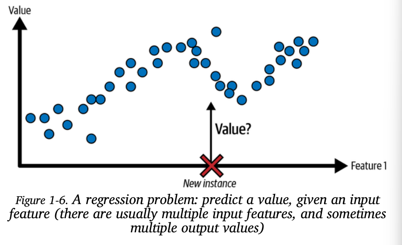
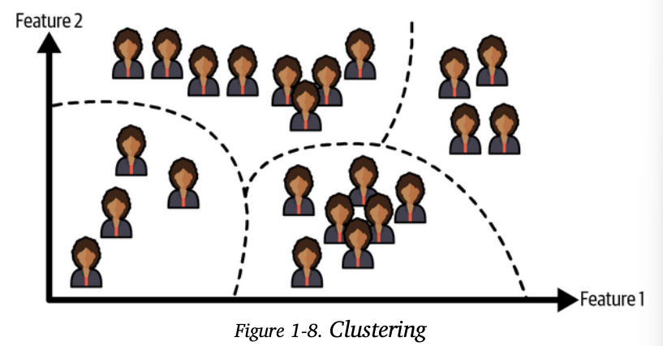
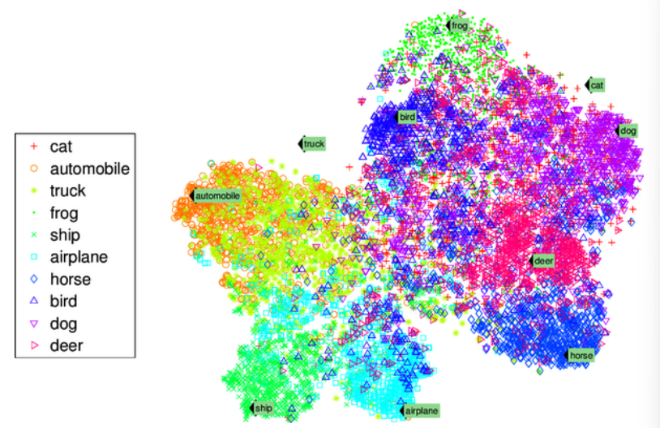
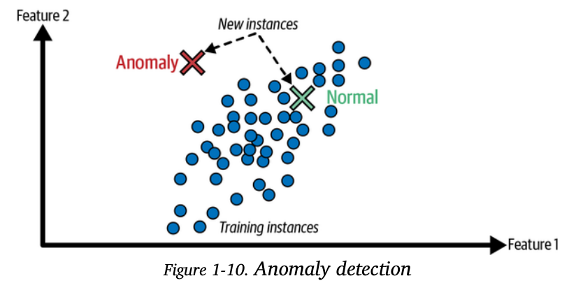
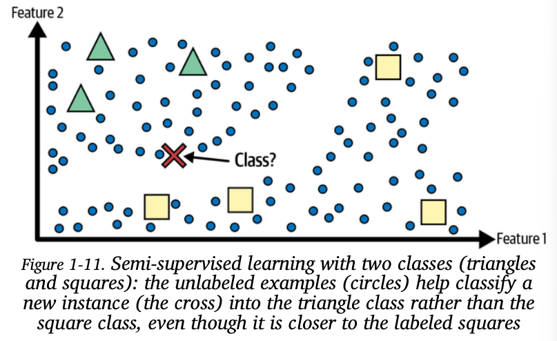
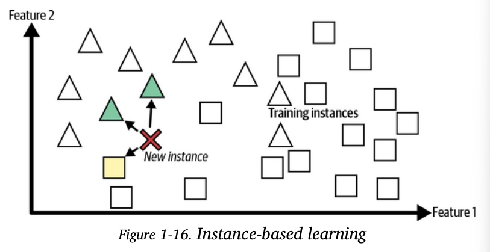
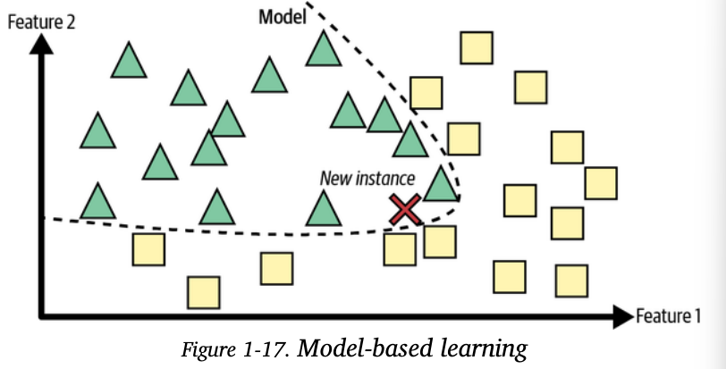
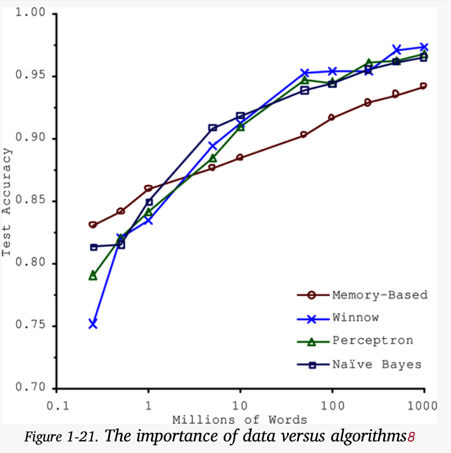
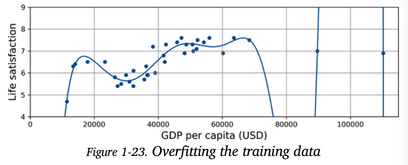
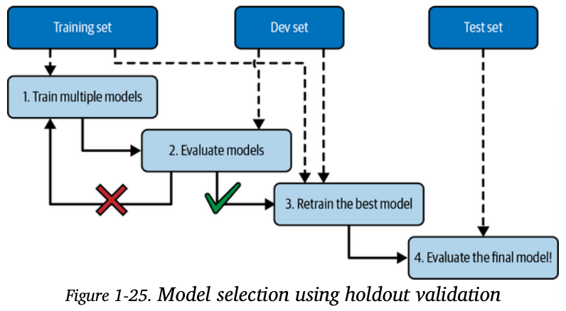

# 机器学习初步

[TOC]

## 什么是机器学习

What Is Machine Learning?

Here is a slightly more general definition

> [Machine learning is the] field of study that gives computers the ability to learn
> without being explicitly programmed.
>
> Arthur Samuel, 1959

and a more engineering-oriented one:

> A computer program is said to learn from experience E with respect to some task T
> and some performance measure P, if its performance on T, as measured by P,
> improves with experience E.

> Machine learning is about making machines get better at some task by learning from data, instead of having to explicitly code rules.

The examples that the system uses to learn are called the **training set**. Each training example is called a **training instance** (or **sample**). The part of a machine learning system that learns and makes predictions is called a **model**. Neural networks and random forests are examples of models.

machine learning is great for:

- Problems for which existing solutions require a lot of fine-tuning or long lists of rules (a machine learning model can often simplify code and perform better than the traditional approach)
- Complex problems for which using a traditional approach yields no good solution
- Fluctuating environments (a machine learning system can easily be retrained on new data, always keeping it up to date)
- Getting insights about complex problems and large amounts of data. Digging into large amounts of data to discover hidden patterns is called **data mining**, and machine learning excels at it.

## 机器学习的分类

机器学习系统可以按照以下依据来进行分类：

- How they are supervised during training (supervised, unsupervised, semi-supervised, self-supervised, and others)
- Whether or not they can learn incrementally on the fly (online versus batch learning)
- Whether they work by simply comparing new data points to known data points, or instead by detecting patterns in the training data and building a predictive model, much like scientists do (instance-based versus model-based learning)

### Training Supervision

- supervised learning
- unsupervised learning
- self-supervised learning
- semi-supervised learning
- reinforcement learning

#### supervised learning

In supervised learning, the training set you feed to the algorithm includes the desired solutions, called **labels**

A typical supervised learning task is **classification**

Another typical task is to predict a target numeric value, given a set of features. This sort of task is called **regression**

Note that some regression models can be used for classification as well, and vice versa

> The words target and label are generally treated as synonyms in supervised learning, but target is more common in regression tasks and label is more common in classification tasks. 
>
> Moreover, features are sometimes called **predictors** or **attributes.**

#### Unsupervised learning

In unsupervised learning, the training data is unlabeled

For example, say you have a lot of data about your blog’s visitors. You may want to run a clustering algorithm to try to detect groups of similar visitors (Figure 1-8). At no point do you tell the algorithm which group a visitor belongs to: it finds those connections without your help. For example, it might notice that 40% of your visitors are teenagers who love comic books

A related task is **dimensionality reduction**, in which the goal is to simplify the data without losing too much information. One way to do this is to merge several correlated features into one. For example, a car’s mileage may be strongly correlated with its age, so the dimensionality reduction algorithm will merge them into one feature that represents the car’s wear and tear. This is called **feature extraction.**

Yet another important unsupervised task is **anomaly detection**

Finally, another common unsupervised task is association rule learning, in which the goal is to dig into large amounts of data and discover interesting relations between attributes

#### Semi-supervised learning

Since labeling data is usually time-consuming and costly, you will often have plenty of unlabeled instances, and few labeled instances. Some algorithms can deal with data that’s partially labeled. This is called semi-supervised learning

#### Self-supervised learning

Another approach to machine learning involves actually generating a fully labeled dataset from a fully unlabeled one. Again, once the whole dataset is labeled, any supervised learning algorithm can be used. This approach is called self-supervised learning.

Some people consider self-supervised learning to be a part of unsupervised learning, since it deals with fully unlabeled datasets. But self-supervised learning uses (generated) labels during training, so in that regard it’s closer to supervised learning. In short, it’s best to treat self-supervised learning as its own category.

#### Reinforcement learning

The learning system, called an agent in this context, can observe the environment, select and perform actions, and get rewards in return (or penalties in the form of negative rewards) 

### Batch  Versus  Online Learning

#### Batch 

In batch learning, the system is incapable of learning incrementally: it must be trained using all the available data. This will generally take a lot of time and computing resources, so it is typically done offline.

Unfortunately, a model’s performance tends to decay over time, simply because the world continues to evolve while the model remains unchanged. This phenomenon is often called model rot or data drift. The solution is to regularly retrain the model on up-to-date data.

If you want a batch learning system to know about new data, you need to train a new version of the system from scratch on the full dataset, then replace the old model with the new one.

####  Online Learning

In online learning, you train the system incrementally by feeding it data instances sequentially, either individually or in small groups called **mini-batches**. Online learning is useful for systems that need to adapt to change extremely rapidly. It is also a good option if you have limited computing resources

One important parameter of online learning systems is how fast they should adapt to changing data: this is called the **learning rate**. If you set a high learning rate, then your system will rapidly adapt to new data, but it will also tend to quickly forget the old data. Conversely, if you set a low learning rate, the system will have more inertia; that is, it will learn more slowly, but it will also be less sensitive to noise in the new data or to sequences of nonrepresentative data points (outliers)

A big challenge with online learning is that if bad data is fed to the system, the system’s performance will decline, possibly quickly (depending on the data quality and learning rate)

### Instance-Based Versus Model-Based Learning

#### Instance-based learning

This is called instance-based learning: the system learns the examples by heart, then generalizes to new cases（推广到新的情况） by using a similarity measure（相似性度量） to compare them to the learned examples (or a subset of them).

For example, in Figure the new instance would be classified as a triangle because the majority of the most similar instances belong to that class.

#### Model-Based Learning

Another way to generalize from a set of examples is to build a model of these examples and then use that model to make predictions. This is called **model-based learning**

In summary:

- You studied the data.
- You selected a model.
- You trained it on the training data (i.e., the learning algorithm searched for the model parameter values that minimize a cost function).
- Finally, you applied the model to make predictions on new cases (this is called inference), hoping that this model will generalize well.

## 挑战

- **Insufficient Quantity of Training Data**（训练量不足）

  The idea that data matters more than algorithms for complex problems was further popularized by Peter Norvig et al. in a paper titled “The Unreasonable Effectiveness of Data”, published in 2009

  

- **Nonrepresentative Training Data**

  In order to generalize well, it is crucial that your training data be representative of the new cases you want to generalize to.

   if the sample is too small, you will have **sampling noise** (i.e., nonrepresentative data as a result of chance), but even very large samples can be nonrepresentative if the sampling method is flawed（抽样方法是有着缺陷的）. This is called **sampling bias.**

  例如，如果模型是在特定年龄群体或地区的数据上进行训练的，但是要在更广泛的人群或地区应用，那么训练数据可能就是非代表性的。

- **Poor-Quality Data**：

  Obviously, if your training data is full of errors, outliers, and noise, it will make it harder for the system to detect the underlying patterns, so your system is less likely to perform well. It is often well worth the effort to spend time cleaning up your training data.

  The following are a couple examples of when you’d want to clean up training data:

  - If some instances are clearly outliers, it may help to simply discard them
  - If some instances are missing a few features, you must decide whether you want to ignore
    this attribute altogether, ignore these instances, fill in the missing values

- **Irrelevant Features**

  A critical part of the success of a machine learning project is coming up with a good set of features to train on. This process, called **feature engineering**, involves the following steps:

  - Feature selection (selecting the most useful features to train on among existing features)
  - Feature extraction (combining existing features to produce a more useful one⁠—as we saw earlier, dimensionality reduction algorithms can help)
  - Creating new features by gathering new data

- **Overfitting the Training Data**

  In machine learning this is called overfitting: it means that the model performs well on the training data, but it does not generalize well.

  

  Overfitting happens when the model is too complex relative to the amount and noisiness of the training data. Here are possible solutions:

  - Simplify the model by selecting one with fewer parameters  (e.g., a linear model rather than a high-degree polynomial model), by reducing the number of attributes in the training data, or by constraining the model（例如，限制参数的范围，或者减少模型的自由度）

    Constraining a model to make it simpler and reduce the risk of overfitting is
    called **regularization.**

  - Gather more training data

  - Reduce the noise in the training data (e.g., fix data errors and remove outliers).

  

- **Underfitting the Training Data**

  underfitting is the opposite of overfitting: it occurs when your model is too simple to learn the underlying structure of the data

  Here are the main options for fixing this problem:

  - Select a more powerful model, with more parameters.
  - Feed better features to the learning algorithm (feature engineering).
  - Reduce the constraints on the model (for example by reducing the regularization hyperparameter).

## 测试和验证

The only way to know how well a model will generalize to new cases is to actually try it out on new cases.

A better option is to split your data into two sets: the **training set** and the **test set**. As these names imply, you train your model using the training set, and you test it using the test set. The error rate on new cases is called the **generalization error** (or **out-of-sample error**), This value tells you how well your model will perform on instances it has never seen before.

If the training error is low (i.e., your model makes few mistakes on the training set) but the generalization error is high, it means that your model is overfitting the training data.

you want to apply some regularization to avoid overfitting. The question is, how do you choose the value of the regularization hyperparameter? One option is to train 100 different models using 100 different values for this hyperparameter. Suppose you find the best hyperparameter value that produces a model with the lowest generalization error⁠—say, just 5% error. You launch this model into production, but unfortunately it does not perform as well as expected and produces 15% errors. What just happened?

The problem is that you measured the generalization error multiple times on the test set, and you adapted the model and hyperparameters to produce the best model for that particular set. This means the model is unlikely to perform as well on new data.

A common solution to this problem is called **holdout validation**

you simply hold out part of the training set to evaluate several candidate models and select the best one. The new held-out set is called the **validation set** (or the **development set**, or **dev set**)

More specifically, you train multiple models with various hyperparameters on the reduced training set (i.e., the full training set minus the validation set), and you select the model that performs best on the validation set. After this holdout validation process, you train the best model on the full training set (including the validation set), and this gives you the final model. Lastly, you evaluate this final model on the test set to get an estimate of the generalization error.

 if the validation set is too small, then the model evaluations will be imprecise. Conversely, if the validation set is too large, then the remaining training set will be much smaller than the full training set. this is bad since the final model will be trained on the full training set, it is not ideal to compare candidate models trained on a much smaller training set. It would be like selecting the fastest sprinter to participate in a marathon.

One way to solve this problem is to perform **repeated cross-validation**, using many small validation sets. Each model is evaluated once per validation set after it is trained on the rest of the data. By averaging out all the evaluations of a model. There is a drawback, however: the training time is incremented by the number of validation sets.