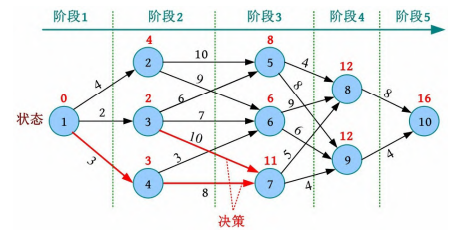
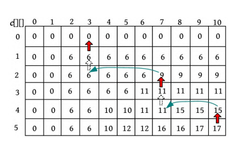
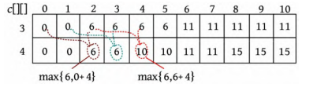
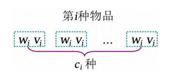
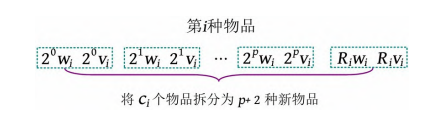
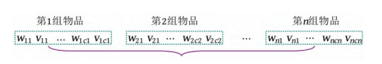
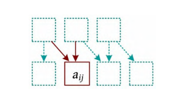

# 动态规划

[TOC]

## 原理

在动态规划中会将原问题分解为若干子问题，将每个子问题的求解过程都作为一个阶段，在完成前一阶段后，根据前一阶段的结果，求解后一阶段。

动态规划的求解原理：

- 最优子结构。最优子结构指问题的最优解包含其子问题的最优解
- 子问题重叠。子问题重叠指求解过程中每次产生的子问题并不总是新问题，有大量子问题是重复的（子问题结构的一致性）
- 无后效性。对当前阶段的求解只与之前阶段有关，与之后阶段无关，这叫作“无后效性”。

状态、阶段、决策 就是动态规划的三个要素。动态规划有一定的设计模式，一般分为以下步骤：

1. 状态表示*
2. 阶段划分
3. 状态转移方程*，根据状态、决策方向，边界条件来确定方程
4. 边界条件：状态转移方程是一个递归式，需要确定初始条件或边界条件。
5. 求解目标，根据状态转移方程的递推结果得到求解目标。

## 01背包

### 原理

给定n 种物品，每种物品都有重量wi 和价值vi ，每种物品都只有 一个。另外，背包容量为W 。求解在不超过背包容量的情况下将哪些物品放入背包，才可以使背包中的物品价值之和最大。

- 阶段划分：假设第 i 阶段表示处理第 i 种物品

- 状态表示：`c[i][j]`表示将前 i 种物品放入容量为 j  的背包中，获得的最大价值。

- 状态转移方程：
  $$
  c[i][j] = \left \{
  	\begin{array}{lr}
  		c[i - 1][j] &, j < w[i]\\
  		max\{c[i - 1][j], c[i - 1][j - w[i]] + v[i]\} &, j\geq w[i]
  	\end{array}
  \right.
  $$
  按照状态转移方程处理第1种物品，得到$c[1][j]，j = 1,2, ... , W$，然后以此类推，得到$c[n][j]$

  ~~~c++
  for (int i = 1; i <= n; i++) {
      for (int j = 1; j <= W; j++) 
  		if (j < w[i])
              c[i][j] = c[i - 1][j]
          else 
              c[i][j] = max(c[i - 1][j], c[i - 1][j - w[i]] + v[i])
  }
  ~~~

  

- 构造解：

  

  若`c [i][j] > c [i −1][j]`，则说明第i 种物品被放入背包，令`x[i] = 1，j −= w [i ]` 若`c[i][j] ≤ c[i −1][j]`，则说明第i 种物品没被放入背包，令`x[i] = 0`。

  ~~~c++
  for (int i = n; i > 0; i--) {
  	if (c[i][j] > c[i - 1][j]) {
          x[i] = 1;
          j -= w[i];
      } else {
          x[i] = 0;
      }
  }
  ~~~

  

优化，若不构造最优解，那么第i -1种物品之前的处理结果已经没用了，因此可以将优化为：
$$
dp[j] = max\{dp[j], dp[j - w[i]] + v[i]\}
$$

**但这需要倒推。**

~~~c++
for (int i = 1; i <= n; i++) {
    for (int j = W; j >= w[i]; j--) {
        dp[j] = max(dp[j], dp[j - w[i]] + v[i]);
    }
}
~~~

**注意，这仅仅优化存储空间，并不优化时间复杂度**

## 完全背包

给定n 种物品，每种物品都有重量wi 和价值vi ，**其数量没有限制**。背包容量为W ，求解在不超过背包容量的情况下如何放置物品，使背包中物品的价值之和最大。

状态转移方程：
$$
c[i][j] = \left \{
	\begin{array}{lr}
		c[i - 1][j] &, j < w[i]\\
		max\{c[i - 1][j], c[i - 1][j - w[i]] + v[i], c[i][j - w[i]] + v[i]\} &, j\geq w[i]
	\end{array}
\right.
$$
优化后的
$$
dp[j] = max\{dp[j], dp[j - w[i]] + v[i]\}
$$
正推即可

~~~java
for (int i = 1; i <= n; i++) {
    for (int j = w[i]; j <= W; j++) {
        dp[j] = max(dp[j], dp[j - w[i]] + v[i]);
    }
}
~~~

### 存钱罐 HDU1114

核心代码：

~~~c++
memset(dp, 0x3f, sizeof dp);
for (int i = 1; i <= n; i++) {
	for (int j = w[i]; j < W: j++) {
		...
    }
}
if (dp[W] < INF)
    // 有解
~~~

这里必须要把dp初始化为较大的值，因为题意要求**恰好装满**。

## 多重背包

给定n 种物品，每种物品都有重量wi 和价值vi ，每种物品的数量是有限制的，即第i 种物品有ci 个。背包容量为W

暴力拆分指将第i 种物品看作ci 种独立的物品，每种物品只有一 个，转化为01背包问题。

~~~c
for (int i = 1; i <= n; i++) {
    for (int k = 1; k <= c[i]; k++) {
        for (int j = W; j >= w[i]; j--) {
            dp[j] = max(dp[j], dp[j - w[i]] + v[i])
        }
    }
}
~~~

当物品满足$c [i] × w[i ] \geq W$ 时，可以认为这种物品是不限数量的，按照完全背包的方法求解即可。否则，一定存在一个最大的整数$p$ ，使得$2^0 +2^1 +2^2 +…+2^p \leq c [i ]$，并记$R_i = c[i] - 2^0 +2^1 +2^2 +…+2^p$。将c [i ]个物品拆分为p + 2种新物品，每种新物品对应的重量和价值都如下图所示。

~~~c++
void multi_bag(int n, int W) {
    for (int i = 1; i <= n; i++) {
        if (c[i] * w[i] >= W) {
            for (int j = w[i]; j < W; j++) {
                dp[j] = min(dp[j], dp[j - w[i]] + v[i]);
            }
        } else {
            for (int k = 1; c[i] > 0; k <<= 1) {
                int x = min(k, c[i]);
                for (int j = W; j >= w[i] * x; j--) {
					dp[j] = min(dp[j], dp[j - w[i] * w] + k * v[i]);
                }
                c[i] -= x;
            }
		}
    }
}
~~~

数组优化（推荐）

~~~java
// 用num[j ]数组记录容量为j 时. 放入了多少个第i 种物品
for (int i = 1; i <= n; i++) {
	memset(num, 0, sizeof num);
    for (int j = w[i]; j <= W; j++) {
		if (dp[j] < dp[j - w[i]] + v[i] && num[j - w[i]] < c[i]) {
            dp[j] = dp[j - 2[i]] + v[i];
            num[j] = num[j - w[i]] + 1;
        }
    }
}
~~~

## 分组背包

给定n 组物品，第i 组有ci 个物品，第i 组的第j 个物品有重量 wij 和价值vij ，背包容量为W。在不超过背包容量的情况下，每组最多选择一个物品。

递推式如下：
$$
c[i][j] = 
\left \{ \begin{array}{lr}
	 c[i - 1][j]   &, j < w_{ik} \\
max_{1 \leq k \leq c_i}\{c[i - 1][j], c[i-1][j-w[i][k]] + v[i][k]\}  &, j\geq w_{ik}

\end{array}
\right .
$$
优化后的递推式：
$$
dp[j] = max(dp[j], dp[j - w[i][k] + v[i])
$$
要倒推

~~~c++
for (int i = 1; i <= n; i++) {
    // 这里不使用j >= w[i]优化措施， 是因为w是一个二维数组
    for (int j = W; j >= 0; j--) {
        // 开始枚举组内的各个物品
        //枚举组内各个物品的个数k 一定在最内层循环中，若将其放在j 的外层，则变为多重背包的暴力拆分算法，因为这会出现组内物品被多次放入的情况，就变成了多重背包问题。
        for (int k = 1; k <= c[i]; k++) {
            dp[j] = max(dp[j], dp[j - w[i][k]] + v[i][k]);
        }
    }
}
~~~

## 混合背包

如果在一个问题中有些物品只可以取一次（01背包），有些物品可以取无限次（完全背包），有些物品可以取的次数有一个上限（多重背包），则该种问题属于混合背包问题。

~~~java
for i = 1..N
    if 第i中物品属于01背包问题
    else if 第i中物品属于完全背包问题
    else if 第i中物品属于多重背包问题
~~~

### 最少的硬币 POJ3260

这道题有两个关键的地方：

- 上界的计算
- 两个背包的组合（不是混合背包的解法）

首先，上界为$V_{max}^2 + T$。假设商家要找零$V_{max}^2$，那么找零所需的硬币数必定大于$V_{max}$。设卖家找的钱的序列为$p(\forall p_i , p_{i + 1})$，我们作一个前缀数组$s$ ，使$s_i = \sum^{j \leq i}_{j = 1}p_j$，根据同余的性质，必有两个（或两个以上）的 $s_i$ 是在 $mod \quad v_{max}$ 意义下是同余的，（因为 s 序列长度大于 $v_{max}$且最小面值为$1$，而取模后的数最多有$v_{max}$，），那么必然有$s_i - s_j = k * v_{max}(i > j)$，即这部分的数可以替换成 $k$个$v_{max}$。

**此外，题目中的重量就是货币的价值，价值就是货币的数量！**

~~~c++
#include <iostream>
#include <string.h>
using namespace std;

const int MAXN = 101;
int v[MAXN];
int c[MAXN];
const int MAX = 10'000 + 120 * 120 + 1;
int dp_pay[MAX];
int dp_change[MAX];

int main() {
    int N, T;
    cin >> N >> T;
    int maxv = 0;
    for (int i = 1; i <= N; i++) {
        cin >> v[i];
        maxv = max(maxv, v[i]);
    }
    for (int i = 1; i <= N; i++) {
        cin >> c[i];
    }
    
    memset(dp_pay, 0x3f, sizeof dp_pay);
    dp_pay[0] = 0;
    int W = maxv * maxv + T;
    for (int i = 1; i <= N; i++) {
        if (c[i] * v[i] >= W) {
            for (int j = v[i]; j <= W; j++) {
                dp_pay[j] = min(dp_pay[j], dp_pay[j - v[i]] + 1);
            }
        } else {
            for (int k = 1; c[i]; k << 1) {
                int x = min(k, c[i]);
                for (int j = W; j >= v[i] * x; j--) {
                    dp_pay[j] = min(dp_pay[j], dp_pay[j - v[i] * x] + x);
                } 
                c[i] -= x;
            }
        }
    }
    
    memset(dp_change, 0x3f, sizeof dp_change);
    dp_change[0] = 0;
    for (int i = 1; i <= N; i++) {
        for (int j = v[i]; j <= W; j++) {
            dp_change[j] = min(dp_change[j], dp_change[j - v[i]] + i);
        }
    }

    int ans = 0x3f3f3f3f;
    for (int i = 0; i < W; i++) {
        ans = min(ans, dp_pay[i + T] + dp_change[i]); 
    }
    if (ans == 0x3f3f3f3f)
        ans = -1;
    cout << ans;
}

~~~

## 线性DP

### 超级梯子 （HDU2041）

状态转移方程：$f[n] = f[n - 1] +f[n - 2]$

### 数字三角形 POJ1163

状态转移方程：$dp[i][j] = max\{dp[i - 1][j], dp[i - 1][j - 1]\} + a[i][j]$ 

边界：$dp[1][1] = a[1][1]$

求解目标：$max_{1\leq j \leq n}(dp[n][j])$

### 最长上升子序列

例子，序列3、4、2、1、7、8的最长上升子序列为3、4、7、8

状态表示： dp[i ]表示以a [i ]结尾的最长上升子序列长度。

状态转移： 对于1<j<i，若a [j ] < a[i]，则可以将a [i ]放 在以a [j ]结尾的最长上升序列后面，得到的长度为dp[j ]+1。

状态转移方程：$dp[i] = max(dp[i], dp[j] + 1)$

实现：

优化：

## 区间DP

区间DP属于线性DP的一种，以区间长度作为DP的阶段，以区间的左右端点作为状态的维度

## 树形DP

## 数位DP

## 状态压缩DP

## 插头DP

