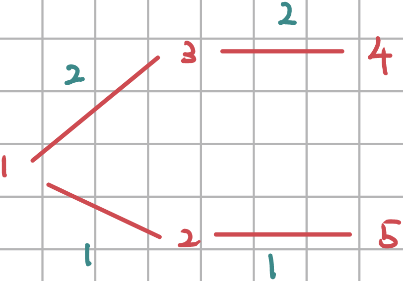
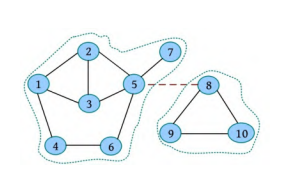
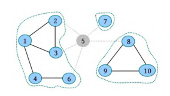
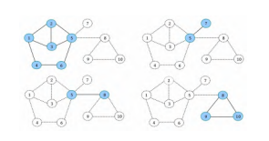
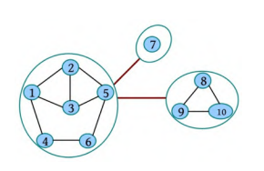
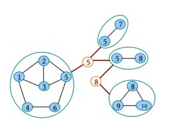
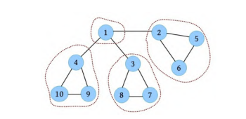
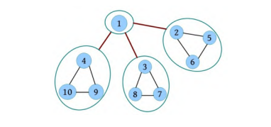
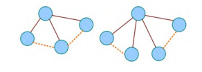

# 图论

[TOC]

在无向图中，所有节点的度数之和等于边数的两倍，而且入度等于出度
$$
\sum^{n}_{i=1}D(v_i) = 2e
$$
## 图的存储

- 顺序存储

  - 邻接矩阵

    ~~~c
    typedef struct {
        VexType Vex[MAX];
       	EdgeType Edge[MAX];
        int v;					// 顶点数
        int e;					// 边数
    } Graph
    ~~~

  - 边集数组

    ~~~c
    struct Edge {
        int u,
        int v,
        int w;
    }e[N * N]
    ~~~

- 链式存储

  - 邻接表

    ~~~c
    typedef struct {
        VexType data;
        AdjNode *first;
    } VexNode;
    
    typedef strcut {
        int v;
        struct AdjNode *next;
    } AdjNode;
    
    int main() {
        int N, M;
        cin >> N >> M;
        vector<Node> nodes(N + 1);
    
        for (int i = 0; i < M; i++) {
            int u, v;
            cin >> u >> v;
            Adj *adj = new Adj{v, nodes[u].first};
            nodes[u].first = adj; 
        }
    
        for (int i = 0; i <= N; i++) {
            cout << i << ": ";
            for (Adj *p = nodes[i].first; p != nullptr; p = p->next) {
                cout << p->v << " ";
            }
            cout << "\n";
        }
    }
    ~~~

  - 链式前向星

    ~~~c
    struct node {
        int to, next, w;
    } edge[MAXV];			// 边集数组
    
    int head[MAXN]			// 头节点数组
     
    int cnt = 0;
    //如果是有向图，则每输入一条边，都执行一次add(u ,v w )即可；如果是无向图，则需要添加两条边add(u ,v ,w ); add(v ,u ,w)。W
    void add(int u, int v, int w) {
        edge[cnt].to = v;
        edge[cnt].w = w;
        dege[cnt].next = head[u];
        head[u] = cnt++;
    }
    ~~~
  
    
  
    
  
  - 十字链表
  
  - 邻接多重表

### 最大的节点 P3916

思路（逆向思维）：反向图 + 倒序DFS

### 有向图D和E  UVA11175

这个是错误的，因为缺少边 0 -> 3

核心代码：

~~~c
bool flag1 = false, flag2 = false;
for (int i = 0; i < n; i++) {
    for (int j = 0; j < n; j++) {
        flag1 = flag2 = false;
        for (int k = 0; k < n; k++) {
            if (g[i][k] && g[j][k]) flag1 = true;
            if (g[i][k] ^ g[j][k]) flag2 = true;
        }
        if (flag1 && flag2) return false;
    }
}
return true;
~~~

### 奶牛排序  POJ3275

已知$n(n-1)$个偏序关系，便可以推出全序关系。由于这里不存在双向边，所以知道$\frac{n(n-1)}{2}$个偏序关系即可。

核心代码

~~~c++
bitset<MAX> p [NAX];

for (int i = 0; i < n; i++) {
    bitset[i][i] = 1;
}

for (int i = 0; i < n; i++) {
    int v, u;
    cin >> v >> u;
    bitset[v][u] = 1; 
}

for (...) {
    for (...) {
        if (p[i][k])
            p[i] |= p[k];
    }
}

for (int i = 1; i <= n; i++) 
    ans += p[i].count();

// 因为初始化时自己到自己为1，所以 ans 多算了n 种关系
cout << n * (n - 1) / 2 - (ans - n);
~~~

## 图的遍历

DFS、BFS记得维护`visited[i]`

### 油田 UVA572

反向BFS是有必要的，因为正向BFS要处理这种情况，必须进行回溯。而反向BFS后，只需正向BFS即可。

q1、q2是表示同一层的、符合条件的元素。此外，q1,q2可以用pair合并在一起，

BFS一般不好记录答案，但是由于约束条件，可以确保答案与搜索路径是匹配的

### 抓住那头牛 POJ3278

方法一：分治思想

~~~c
// 约翰从x到达t所需的步数
int dfs(int t) {
    if (x >= t) {
        return x - t;
    }
    if (t % 2 == 0) {
        return min(dfs(t / 2) + 1, t - x);
    } else {
        return min(dfs(t + 1), dfs(t - 1)) + 1;
    }
}

int main() {
    int t;
    cin >> t;
    while (t--) {
        cin >> x >> y;
        cout << dfs(y) << "\n";
    }
    return 0;
}
~~~

BFS

~~~c
#include <iostream>
#include <string.h>
#include <queue>
using namespace std;
int x, y;
const int N = (int)10e5 + 10;

int dis[N];
bool vis[N];
// 约翰从x到达t所需的步数
int bfs() {
    queue<int> q;
    q.push(x);
    memset(dis, 0, sizeof dis);
    memset(vis, 0, sizeof vis);
    vis[x] = true;
    while (!q.empty()) {
        int v = q.front();
        q.pop();
        if (v == y) {
            return dis[y];
        }
        int delta[] = {v - 1, v + 1, v * 2};
        for (int i = 0; i < 3; i++) {
            int t = delta[i];
            if (t >= 0 && t <= N && !vis[t]) {
                dis[t] = dis[v] + 1;
                vis[t] = true;
                q.push(t);
            }
        }
    }    
    return 0;
}

int main() {
    int t;
    cin >> t;
    while (t--) {
        cin >> x >> y;
        cout << bfs() << "\n";
    }
    return 0;
}
~~~

## 图连通性

在有向图中，如果图中的任意两个节点从vi 到vj 都有路径，且从 vj 到vi 也有路径，则称图G 为强连通图。

割点和割边（桥）的概念

桥一定是割点依附的边。

如果在无向图中不存在桥，则称它为边双连通图。在边双连通图中，在任意两个点之间都存在两条及以上路径，且路径上的边互不重复。

 如果在无向图中不存在割点，则称它为点双连通图。在点双连通图中，如果节点数大于2，则在任意两个点间都存在两条或以上路径，且路径上的点互不重复。

无向图的极大边双连通子图被称为边双连通分量，记为`e -DCC`。无向图的极大点双连通子图被称为点双连通分量，记为`v -DCC`。二者被统称为双连通分量`DCC`。

在图G 中有两个割点（5和8）及4个点双连通分量

把每一个边双连通分量e -DCC都看作一个点，把桥看作连接两个缩点的无向边，可得到一棵树，这种方法被称为e -DCC缩点。

把每一个点双连通分量v -DCC都看作一个点，把割点看作一个点， 每个割点都向包含它的v -DCC连接一条边，得到一棵树，这种方法被称为v -DCC缩点。

### Tarjan算法

- 时间戳：dfn[u]表示节点u在深度优先遍历中的次序。

- 追溯点：low[u]，节点u或者u的子孙通过非遍历边所能追溯到的最小dfn[u]的点。属于同一个强连通分量的，它们的low都是相等的

  

  

  

若孩子的low值比自己的dfn值大，则从该节点到这个孩子的边为桥。

~~~c
void tarjan(int u, int fa) {
	dfn[u] = low[u] = ++num;
    for (int i = head[u]; i; i = e[i].next) {
        int v = e[i].to;
        
        // 处理无向边的反向情况（平凡情况）
        if (v == fa) continue;
        if (!dfn[v]) {
           tarjan(v, u);
            low[u] = min(low[u], low[v]);
            if (low[v] >= dfn[u])
                cout << u <<"-" << v << " is bridge\n"; 
        } else {
            low[u] = min(low[u], dfn[v]);
        }
    }
}
~~~

若x 不是根节点，则x是割点，当且仅当存在x 的一个子节点y ，满足low[y ]≥dfn[x ]；若x 是根节点， 则x是割点，当且仅当至少存在两个子节点。

~~~c
void tarjan(int u, int fa) {
	dfn[u] = low[u] = ++num;
    int cnt = 0;
    for (int i = head[u]; i; i = e[i].next) {
        int v = e[i].to;
        // 处理无向边的反向情况（平凡情况）
        if (v == fa) continue;
        if (!dfn[v]) {
           tarjan(v, u);
            low[u] = min(low[u], low[v]);
            if (low[v] >= dfn[u]) {
                cnt++;
                if (u != fa || cnt > 1) {
					cout << u << " is cutpoint\n";
                }
            }
        } else {
            low[u] = min(low[u], dfn[v]);
        }
    }
}
~~~

有向图的强连通分量：

~~~java
void tarjan(int u) {
    low[u] = dfn[u] = ++num;
    
    // u的状态为DISCOVERED，而不是VISITED
    ins[u] = true;
    s.push(u);
    
    for (int i = head[u]; i; i = e[i].next) {
        int v = e[i].to;
        if (!dfn[v]) {
            tarjan(v);
            low[u] = min(low[u], low[v]);
        } else if (ins[v]) {
            low[u] = min(low[u], dfn[v]);
        }
    }
    
    if (low[u] == dfn[u]) {
		int v;
        do {
            v = s.top();
            v.pop();
            cout << v << " ";
            ins[v] = false;
        } while (v != u);
        cout << "\n";
    }
}
~~~

###  道路建设  POJ3352

将每个连通分量都缩成一个点

如果在v-DCC中度为1的节点数为k ，则至少添加$(k +1)/2$条边

那么如何统计叶子数呢？

~~~c
for (int u = 1; u <= n; u++) {
    for (int i = head[u]; i; i = e[i].next) {
        int v = e[i].to;
        if (low[u] != low[v])
            degree[low[u]]++;
    }
}
int leaf = 0;
for (int i = 1; i <= n; i++) {
	if (degree[i] == 1)
        leaf++;
}
cout << (leaf + 1) / 2 << endl;
~~~

### 图的底部 POJ2553

思路，求缩点的出度

核心代码

~~~c++
//这里belong是记录点所属的连通分量
// low[v] = low[u]只能判断两点是否属于同一个连通分量，是一个局部特性。
void tarjan(int u) {
    dfn[u] = low[u] = cnt++;
    ins[u] = true;
    for (int i = head[u]; i; i = edge[i].next) {
        int v = edge[i].to;
        if (!dfn[v]) {
            tarjan(v);
            low[u] = min(low[u], low[v]);
        } else if (ins[v]) {
            low[u] = min(low[u], dfn[v]);
        }
    }

    if (low[u] == dfn[u]) {
        int v;
        do {
            v = q->front();
            q->pop();
            belong[v] = id;
            ins[v] = false;
        } while (v != u);
        id++;	
    }
}
~~~

~~~c++
for (int i = 1;i <= v; i++) {
    if (dfn[i] == 0) {
        tarjan(i);
    }
}

for (int i = 1; i <= v; i++) {
    for (int k = head[i]; k; k = edge[i].next) {
        int a = edge[i].to;
        if (belong[i] != belong[a]) {
            out[belong[i]]++;
        }
    }
}

for (int i = 1; i <= v; i++) {
    if (!out[belong[i]]) {
        cout << i << " ";
    }
}
~~~

### 校园网络 POJ1236

核心思路：求强连通分量并缩点后

1. 每个入度为0的强连通分量，需要添加一个入度
2. 对入度为0的强连通分量，至少添加一个入度；对出度为0的强连通分量，至少添加一个出度。添加的边数为max(p ,q )。这是因为要构成一个环才行。
3. 特殊情况： 若只有一个强连通分量，则至少分发给1个学校，需要添加的边数为0。

核心代码：
~~~c++
for (int i = 1; i <= v; i++) {
    for (int k = head[i]; k; k = edge[i].next) {
        int a = edge[i].to;
        if (belong[i] != belong[a]) {
            out[belong[i]]++;
            in[belong[a]]++;
        }
    }
}
if (id == 1) {	// 特殊情况判断
    cout << 1 << "\n";
    cout << 0 << "\n";
    return 0;
}

int ans1 = 0, ans2 = 0;
for (int i = 1; i <= id; i++) {
	if (!in[i])
        ans1++;
    if (!out[i])
        ans2++;
}
~~~

## 最短路径

### Dijkstra

