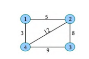
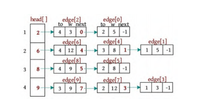
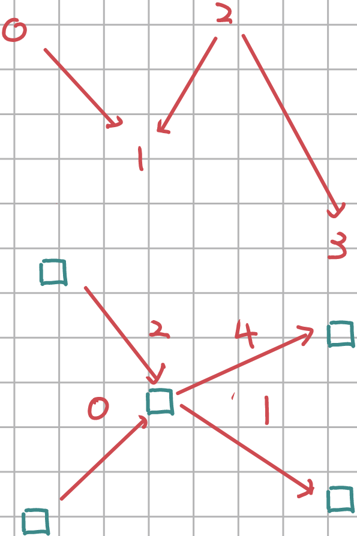

# 图论

在无向图中，所有节点的度数之和等于边数的两倍，而且入度等于出度
$$
\sum^{n}_{i=1}D(v_i) = 2e
$$
图的存储：

- 顺序存储

  - 邻接矩阵

    ~~~c
    typedef struct {
        VexType Vex[MAX];
       	EdgeType Edge[MAX];
        int v;					// 顶点数
        int e;					// 边数
    } Graph
    ~~~

  - 边集数组

    ~~~c
    struct Edge {
        int u,
        int v,
        int w;
    }e[N * N]
    ~~~

- 链式存储

  - 邻接表

    ~~~c
    typedef struct {
        VexType data;
        AdjNode *first;
    } VexNode;
    
    typedef strcut {
        int v;
        struct AdjNode *next;
    } AdjNode;
    
    int main() {
        int N, M;
        cin >> N >> M;
        vector<Node> nodes(N + 1);
    
        for (int i = 0; i < M; i++) {
            int u, v;
            cin >> u >> v;
            Adj *adj = new Adj{v, nodes[u].first};
            nodes[u].first = adj; 
        }
    
        for (int i = 0; i <= N; i++) {
            cout << i << ": ";
            for (Adj *p = nodes[i].first; p != nullptr; p = p->next) {
                cout << p->v << " ";
            }
            cout << "\n";
        }
    }
    ~~~

  - 链式前向星

    ~~~c
    struct node {
        int to, next, w;
    } edge[MAXV];			// 边集数组
    
    int head[MAXN]			// 头节点数组
     
    int cnt = 0;
    //如果是有向图，则每输入一条边，都执行一次add(u ,v w )即可；如果是无向图，则需要添加两条边add(u ,v ,w ); add(v ,u ,w)。W
    void add(int u, int v, int w) {
        edge[cnt].to = v;
        edge[cnt].w = w;
        dege[cnt].next = head[u];
        head[u] = cnt++;
    }
    ~~~
  
    
  
    
  
  - 十字链表
  
  - 邻接多重表

### 最大的节点 P3916

思路（逆向思维）：反向图 + 倒序DFS

### 有向图D和E  UVA11175

这个是错误的，因为缺少边 0 -> 3

核心代码：

~~~c
bool flag1 = false, flag2 = false;
for (int i = 0; i < n; i++) {
    for (int j = 0; j < n; j++) {
        flag1 = flag2 = false;
        for (int k = 0; k < n; k++) {
            if (g[i][k] && g[j][k]) flag1 = true;
            if (g[i][k] ^ g[j][k]) flag2 = true;
        }
        if (flag1 && flag2) return false;
    }
}
return true;
~~~

### 奶牛排序  POJ3275

已知$n(n-1)$个偏序关系，便可以推出全序关系。由于这里不存在双向边，所以知道$\frac{n(n-1)}{2}$个偏序关系即可。

核心代码

~~~c++
bitset<MAX> p [NAX];

for (int i = 0; i < n; i++) {
    bitset[i][i] = 1;
}

for (int i = 0; i < n; i++) {
    int v, u;
    cin >> v >> u;
    bitset[v][u] = 1; 
}

for (...) {
    for (...) {
        if (p[i][k])
            p[i] |= p[k];
    }
}

for (int i = 1; i <= n; i++) 
    ans += p[i].count();

// 因为初始化时自己到自己为1，所以 ans 多算了n 种关系
cout << n * (n - 1) / 2 - (ans - n);
~~~

