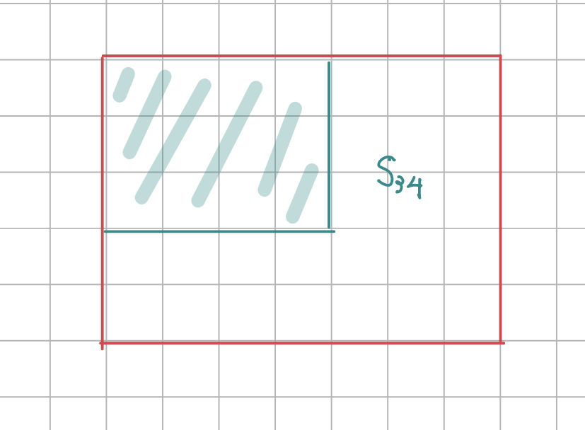
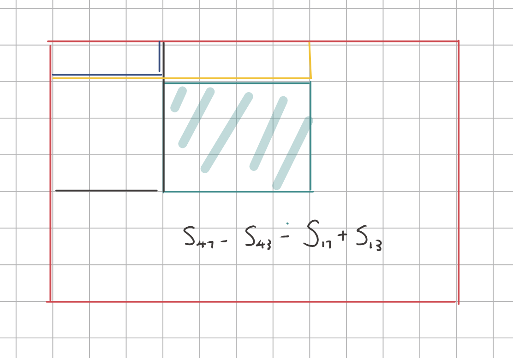
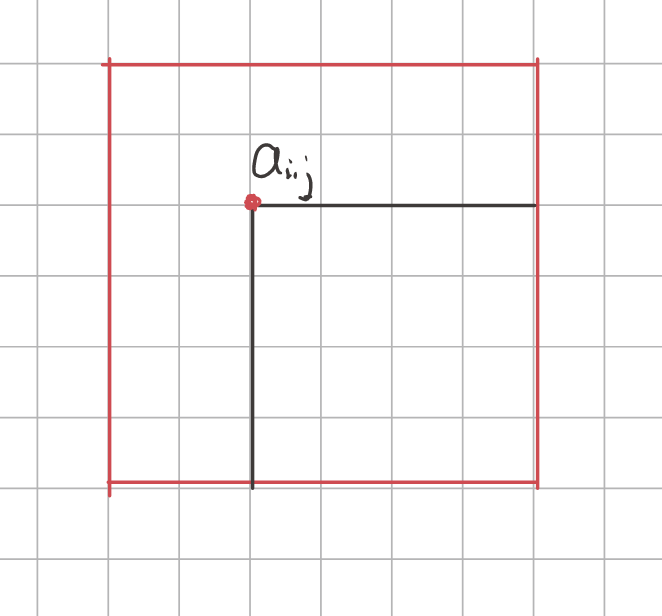

# 基础算法

[TOC]


## 输入与输出的优化

~~~c++
ios::sync_with_stdio(false);
cin.tie(0);		// cin（输入流）和nullptr（空输出流）绑定，即与cout解除链接。
~~~

这个函数是一个「是否兼容 stdio」的开关，C++ 为了兼容 C，保证程序在使用了 `printf` 和 `std::cout` 的时候不发生混乱，将输出流绑到了一起。同步的输出流是线程安全的。

这其实是 C++ 为了兼容而采取的保守措施，也是使 `cin`/`cout` 速度较慢的主要原因。我们可以在进行 IO 操作之前将 stdio 解除绑定，但是在这样做之后要注意不能同时使用 `std::cin` 和 `scanf`，也不能同时使用 `std::cout` 和 `printf`，但是可以同时使用 `std::cin` 和 `printf`，也可以同时使用 `scanf` 和 `std::cout`。

在默认的情况下 `std::cin` 绑定的是 `std::cout`，每次执行 `<<` 操作符的时候都要调用 `flush()` 来清理 stream buffer，这样会增加 IO 负担。可以通过 `std::cin.tie(0)`（0 表示 NULL）来解除 `std::cin` 与 `std::cout` 的绑定，进一步加快执行效率。

但需要注意的是，在解除了 `std::cin` 和 `std::cout` 的绑定后，程序中必须手动 `flush` 才能确保每次 `std::cout` 展现的内容可以在 `std::cin` 前出现


%c 并不会忽略空格，而%s会预消耗额外的空格。

在scanf中，非格式字符会被认为分割符。默认情况，将输入的空白字符视为分隔符。对于scanf模式串中的空白字符，对应任意个空白分隔符。而对于模式串中的其他可见字符，会严格进行匹配。

cin 会忽略空格。

## 快速排序

1. 确定分界点x：左边界、中间点、随机
2. 调整区间：左边所有的数小于x，右边所有的数大于x
3. 递归：对左区间、右区间分别递归


双指针法

1. 左指针前进，直到遇到大于或等于x的数
2. 右指针前进，直到遇到小于或等于x的数
3. 交换左指针指向的数和右指针指向的
4. 重复1 - 3，直到左指针超过右指针（包括重叠情况）

可以用不变式，验证上述算法的正确性。


~~~c++
//对区间[l, r]进行排序
void quick_sort(int q[], int l, int r) {
    if (l >= r) return;     //区间最多有一个数
    
    //int x = q[r]	最坏情况下退化到O(n^2)
    
    int x = q[(l + r) / 2];           //分界点
    int i = l - 1;          //左指针
    int j = r + 1;          //右指针

    while (i < j) {
        while (q[++i] < x)
            ;
        while (q[--j] > x)
            ;
        if (i < j) swap(q[i], q[j]);
    }
	// 1. i  == j，此时q[i] = q[j] = x
    // 2. j < i, 此时
    //		左指针之前的数（不包括左指针）都小于等于x，
    //		右指针之后的数（不包括右指针）都大于等于x。
    
    quick_sort(q, l, j);
    quick_sort(q, j + 1, r);
}
~~~

在递归调用时，如果要将j替换为i，那么要注意边界情况

~~~c++
//对区间[l, r]进行排序
void quick_sort(int q[], int l, int r) {
    if (l >= r) return;     

    int x = q[(l + r + 1) / 2];		//边界一           
    int i = l - 1;          
    int j = r + 1;          

    while (i < j) {
        while (q[++i] < x)
            ;
        while (q[--j] > x)
            ;
        if (i < j) swap(q[i], q[j]);
    }

    quick_sort(q, l, i - 1);	//边界二
    quick_sort(q, i, r);		//边界三
}
~~~


## 归并排序

1. 确定分界点 $mid = (l + r)/2$
2. 递归排序
3. 归并

~~~c++
//对区间[l, r]的数据进行排序
void mergeSort(int p[], int l, int r) {
    if (l >= r) return;

    int mid = (l + r) >> 1;

    mergeSort(p, l, mid);
    mergeSort(p, mid + 1, r);

    int k = 0,i = l, j = mid + 1;
    while (i <= mid && j <= r) {
        if (p[i] <= p[j]) tmp[k++] = q[i++];
        else  tmp[k++] = p[j++];
    }

    while (i <= mid) tmp[k++] = p[i++];
    while (j <= r) tmp[k++] = p[j++];

    for (int i = l, j = 0; i <= r; i++, j++) {
        p[i] = tmp[j];
    }
}
~~~


## 整数二分

二分的本质是「边界」，而不是「单调性」。

我们定义了一个性质，使得区间的右边是满足该性质的，而左边是不满足的。此时二分可以找到这个边界。

~~~c++
bool check(int num) {
    return true;
}
//这两个二分，对应着check成功时，不同的更新策略
//注意边界情况

//对区间[l, r]二分
int binarySearch(int l, int r) {
    int mid = (l + r) >> 1;
    while (l < r) {
        if (check(mid)) r = mid;	
        else l = mid + 1;
    }
    //l为满足该性质的边界
    return l;
}

//对区间[l, r]二分
int binarySearch2(int l, int r) {
    //mid = （l + r） >> 1 的话 
    //此时若l == r - 1 并且 check(mid) == true，则会死循环

    //所以当更新策略为l = mid时，mid计算就要补上+1
    int mid = (l + r + 1) >> 1;
    while (l < r) {
        if (check(mid)) l = mid;
        else r = mid - 1;
    }
    //l为满足该性质的边界
    return l;
}
~~~

二分要求问题是有解的。如果问题是无解的，需要一些技巧来处理。


## 浮点二分

浮点二分比整数二分容易，因为不需要+1，所以边界情况很好判断。

下面我们来计算「数的三次方根」（没有使用二分法）

由牛顿迭代法知：
$$
y_{n+1} = y_n - \frac{f(y_n)}{f'(y_n)}
$$
因此对于求$x$的立方根$y = x^{\frac{1}{3}}$来说，我们令$f(y) = y^3 - x$

因此有
$$
y' = y - \frac{f(y)}{f'(y)} = y - \frac{y^3 - x}{3y^2} = \frac{1}{3}(2y + \frac{x}{y^2})
$$

~~~c++
int main() {
    double x;
    cin >> x;
    double y = x;
    while (fabs(x - (y * y * y)) >= 1e-6) {
        y = (2 * y + x / (y * y)) / 3.0;
    }
    printf("%lf", y);
}
~~~

使用浮点二分的方法：

~~~c++
double x;
int main () {
    cin >> x;
    double l = -1000,r = 1000;
    while (r - l >= 1e-7) {
        double mid = (l + r) / 2;
        if (mid * mid * mid <= x) l = mid;  //如果是小于等于的话，就可以说明答案会更大
        else r = mid;
    }
    printf ("%.6lf",l);
    return 0;
}
~~~


## 大整数高精度

这里高精度乘法和除法的两个操作数满足

- 被乘数/被除数的位数上限为$10^6$
- 除数/乘数 小于$10 ^9$


用一个数组以小端方式来保存高精度数。这样方便进位/补位。

这里操作数都为正数。若为负数，可以在输入时，等价转换为正数来处理。


### 加法

$C[i] = (A[i] + B[i] + t_i) \% 10 \quad \quad 0 \leq i < N$

$t_{i + 1}= (A[i] + B[i] + t_i) / 10$

$t_0 = 0$

~~~c++
vector<int> add(vector<int> &A, vector<int> &B) {
    vector<int> C;
    int t = 0;
    for (int i = 0; i < A.size() || i < B.size(); i++) {
        if (i < A.size()) t += A[i];
        if (i < B.size()) t += B[i];
        C.push_back(t % 10);
        t /= 10;
    }

    if (t) C.push_back(1);
    return C;
}

int main(int argc, char* argv[]) {
    string a, b;
    vector<int> A, B;
    cin >> a >> b;

    for (int i = a.size() - 1; i >= 0; i--)
        A.push_back(a[i] - '0');

    for (int i = b.size() - 1; i >= 0; i--)
        B.push_back(b[i] - '0');

    auto C = add(A, B);

    for (int i = C.size() - 1; i >= 0; i--) {
        printf("%d", C[i]);
    }
    return 0;
}
~~~

### 减法

设$A > B$
$$
\begin{equation}
C[i] = \left\{
		\begin{aligned}
		&A[i] - B[i]  &A[i] - B[i] - t_i \geq 0\\
		&A[i] - B[i] + 10 &otherwise\end{aligned}
		\right.
		
\end{equation}
$$

~~~c++
vector<int> sub(vector<int> &A, vector<int> &B) {
    vector<int> C;
    for (int i = 0, t = 0; i < A.size(); i++) {
        t = A[i] - t;
        if (i < B.size()) t -= B[i];
        C.push_back((t + 10) % 10);
        if (t < 0) t = 1;
        else t = 0;
    }
    //去除掉前导0
    while (C.size() > 1 && C.back() == 0)
        C.pop_back();
    return C;
}

bool cmp(vector<int> &A, vector<int> &B) {
    if (A.size() != B.size()) return A.size() > B.size();
    for (int i = A.size() - 1; i >= 0; i--) {
        if (A[i] != B[i]) {
            return A[i] > B[i];
        }
    }
    return true;
}

int main(int argc, char* argv[]) {
    string a, b;
    vector<int> A, B;
    cin >> a >> b;

    for (int i = a.size() - 1; i >= 0; i--)
        A.push_back(a[i] - '0');

    for (int i = b.size() - 1; i >= 0; i--)
        B.push_back(b[i] - '0');

    vector<int> C;
    if (cmp(A, B)) {
        C = sub(A, B);
    } else {
        C = sub(B, A);
        printf("-");
    }

    for (int i = C.size() - 1; i >= 0; i--) {
        printf("%d", C[i]);
    }

    return 0;
}
~~~

### 乘法

通过观察乘法的竖式计算，就可以理解该算法了。被乘数是小的那个数。

```c++
vector<int> mul(vector<int> &A, int b) {
    vector<int> C;
    int t = 0;
    for (int i = 0; i < A.size() || t != 0; i++) {
        if (i < A.size()) t += A[i] * b;
        C.push_back(t % 10);
        t /= 10;
    }
    while (C.size() > 1 && C.back() == 0) C.pop_back();
    return C;
}

int main(int argc, char* argv[]) {
    string a;
    int b;
    cin >> a >> b;
    
    vector<int> A;
    for (int i = a.size() - 1; i >= 0; i--) {
        A.push_back(a[i] - '0');
    }

    auto C = mul(A, b);

    for (int i = C.size() - 1; i >= 0; i--) {
        printf("%d", C[i]);
    }

    return 0;
}
```


### 除法

通过除法竖式的计算，可以直接得出该算法：

~~~c++
vector<int> div(vector<int> &A, int b, int& r) {
    vector<int> C;
    r = 0;          //r为余数

    //从最高位开始算
    for (int i = A.size() - 1; i >= 0; i--) {
        r = r * 10 + A[i];
        C.push_back(r / b);
        r %= b;
    }
    reverse(C.begin(), C.end());
    
    //去掉前导零
    while (C.size() > 1 && C.back() == 0) C.pop_back();
    return C;
}

int main(int argc, char* argv[]) {
    string a;
    int b;

    cin >> a >> b;

    vector<int> A;
    for (int i = a.size() - 1; i >= 0; i--) {
        A.push_back(a[i] - '0');
    }

    int r;
    auto C = div(A, b, r);

    for (int i = C.size() - 1; i >= 0; i--) {
        printf("%d", C[i]);
    }
    cout << "\n" << r << endl;
    return 0;
}
~~~


## 前缀和 & 差分

给定$n$个数，$a_1, a_2, a_3, ... a_n$。 定义前缀和为$S_i = a_1 + a_2 + ... a_i$，其中$S_0 = 0$。

这个前缀和很容易扩展到二维的情况：






计算区间的核心思想就是「鸽巢原理」。

~~~c++
const int N = 1010;

int n, m, q;
int a[N][N], s[N][N];

int main(int argc, char* argv[]) {
    scanf("%d%d%d", &n, &m, &q);

    for (int i = 1; i <= n; i++) {
        for (int j = 1; j <= m; j++) {
            scanf("%d", &a[i][j]);
        }
    }

    //求前缀和
    for (int i = 1; i <= n; i++) {
        for (int j = 1; j <= m; j++) {
            s[i][j] = s[i - 1][j] + s[i][j - 1] - s[i - 1][j - 1] + a[i][j];
        }
    }

    while (q--) {
        int x1, y1, x2, y2;
        scanf("%d%d%d%d", &x1, &y1, &x2, &y2);
        int sum = s[x2][y2] - s[x1 -1][y2] - s[x2][y1 - 1] + s[x1 - 1][y1 - 1];
        printf("%d", sum);
    }
    return 0;
}

~~~


给定$a_1, a_2, ... ,a_n$，构造$b_1, b_2, ... ,b_n$，使得$a_i = b_1 + ... + b_i$。那么称$b_1, b_2, ... ,b_n$为$a_1, a_2, ... ,a_n$的一个**「差分」**。差分实际上是前缀和的逆运算。


如果需要对$[l, r]$区间内的元素$a_l,a_{l+1}, ... ,a_r$都加上$c$，我们只需将$b_l + c$，$b_{r+1}-c$即可。时间复杂度从$O(n)$下降到$O(1)$。我们将这个操作称为「插入」。最后我们只需计算差分数列的前缀和，反构造出更新完后的原数组。

其中一种常用的构造方法就是$b_i = a_i - a_{i-1}$。但是通过插入操作，我们可以将任意维度的差分构造算法纳入到统一的框架中。原理是这样的，我们首先视原数列为$0,0,0 ... ,0$，那么对应的差分数列为$0,0,0,0...,0$，此时再增量向原数列放入元素即可。


~~~c++
#include <iostream>
using namespace std;

const int N = 100010;

int a[N], b[N];
int n, m;

void insert(int l, int r, int c) {
    b[l] += c;
    b[r + 1] -= c;
}

int main(int argc, char* argv[]) {
    scanf("%d%d", &n, &m);
    for (int i = 1; i <= n; i++) scanf("%d", &a[i]);

    //构造差分
    for (int i = 1; i <= n; i++) insert(i, i, a[i]);
    
    while (m--) {
        int l, r, c;
        scanf("%d%d%d", &l, &r, &c);
        insert(l, r, c);
    }

    //获取更新后的a1， a2, ... ,an , 相当于差分b的前缀和
    for (int i = 1; i <= n; i++) b[i] += b[i - 1];

    for (int i = 1; i <= n; i++)
        printf("%d", b[i]);
}
~~~


下面我们扩展到二维差分：



对$a_{i,j}$对应的差分$+c$，相当于对于上述子矩阵中的所有元素$+c$

~~~c++
//
// Created by AtsukoRuo on 2023/11/3.
//


#include <iostream>
using namespace std;

const int N = 1010;

int n, m, q;
int a[N][N], b[N][N];


void insert(int x1, int y1, int x2, int y2, int c) {
    b[x1][y1] += c;
    b[x2 + 1][y1] -= c;
    b[x1][y2 + 1] -= c;
    b[x2 + 1][y2 + 1] += c;
}
int main(int argc, char* argv[]) {
    scanf("%d%d%d", &n, &m, &q);

    for (int i = 1; i <= n; i++) {
        for (int j = 1; j <= m; j++) {
            scanf("%d", &a[i][j]);
        }
    }

    for (int i = 1; i <= n; i++) {
        for (int j = 1; j <= m; j++) {
            insert(i, j, i, j, a[i][j]);
        }
    }

    while (q--) {
        int x1, y1, x2, y2, c;
        cin >> x1 >> y1 >> x2 >> y2 >> c;
        insert(x1, y1, x2, y2, c);
    }

    for (int i = 1; i <= n; i++) {
        for (int j = 1; j <= m; j++) {
            b[i][j] += b[i - 1][j] + b[i][j - 1] - b[i - 1][j - 1];
        }
    }

    for (int i = 1; i <= n; i++) {
        for (int j = 1; j <= m; j++) {
            printf("%d ", b[i][j]);
        }
        printf("\n");
    }

    return 0;
}
~~~

## 双指针

~~~c++
for (int i = 0, j = 0; i < n; i++) {
    while (j < i && check(i, j))
        j++;
    
    //每道题目的具体逻辑
}
~~~

双指针就是将下述的暴力朴素算法优化到$O(n)$

~~~c++
for (int i = 0; i < n; i++) {
    for (int j = 0; j < n; j++) {
        
    }
}
~~~

例题：

- 799 最长不重复子序列


## 位操作

`lowbit(x)`：返回`x`二进制串的以最后`1`开头的子串。例如，`x = 1110110`，那么`lowbit(x)  = 10`

`lowbit(x) = x &  -x =  & (~x + 1)`

原理是这样的，设$a = xxxxxx100..000$，那么
$$
\begin{align}
a &= 1010...100...000 \\
\overline{a} &= 0101...011...111\\
\overline{a} + 1 &= 0101...100...000\\ 
\end{align}
$$
我们可以使用`lowbit`来统计二进制串中1的个数

~~~c++
cin >> x;
int res = 0;
while (x) {
    x -= lowbit(x);
    res++;
}
cout << res << '\n';
~~~


## 离散化

这里介绍的是整数离散化。给定一个**有序**数列，该数列中元素的个数比较少，例如$10^5$个；但是差值比较大，例如$10^9$，即数据分布很稀疏。模板代码如下：

~~~c++
// 基本思想，在元素的位置和新数组的下标之间建立映射
vector<int> alls;				
sort(alls.begin(), alls.end());		// 确保alls有序
alls.erase(unique(alls.begin(), alls.end()), alls.end())	// 去重，这样alls就保存了下标与元素位置之间的映射关系

// 映射
int find(int x) {
    int l = 0, r = alls.size() - 1;
    while (l < r) {
		int mid = l + r >> 1;
        if (alls[mid] >= x) r = mid;
        else l = mid + 1;
    }
   	// +1 随意
    return r + 1;
}
~~~

例题：

- 802 区间和

## 区间合并

对存在交集关系的区间进行合并。

1. 按区间左端点进行排序
2. 扫描

就是一个贪心的思路

~~~c++
#include <algorithm>
#include <vector>
#include <iostream>
using namespace std;

typedef pair<int, int> PII;
vector<PII> sets;

int main(int argc, char* argv[]) {
    int n = 0;
    cin >> n;
    for (int i = 0; i < n; i++) {
        int l, r;
        cin >> l >> r;
        sets.push_back({l, r});
    }

    sort(
            sets.begin(),
            sets.end(),
            [](const PII &x, const PII &y) {
                return x.first < y.first;
            });

    int ans = 1;
    int l = sets[0].first, r = sets[0].second;
    for (int i = 1; i < n; i++) {
        if (sets[i].first > r) {
            ans++;
            l = sets[i].first;
        }
        r = max(r, sets[i].second);
    }
    cout << ans;
}
~~~

