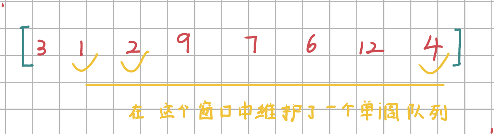
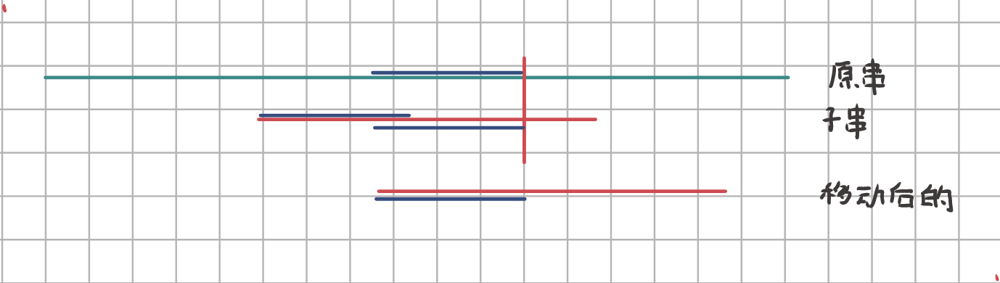
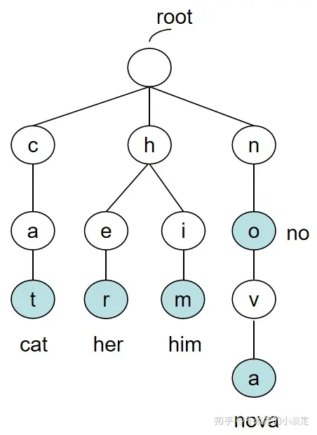
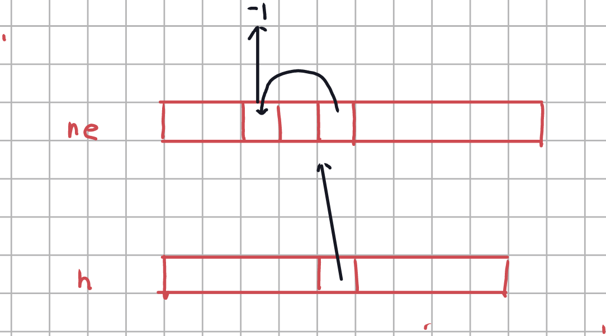

# 数据结构

## 链表

动态链表（Struct + 指针 + new）时间开销很大，因此我们采用数组来维护一个静态链表。

### 单链表

~~~c++
int head;       // 头节点的index
int e[N];       // e[i]，表示第i个插入元素的值
int ne[N];      // ne[i]，表示第i个插入元素的next元素的下标
int idx;        // 用于维护插入操作（下一个可以插入的index）

void init() {
    head = -1;
    idx = 0;
}

void add_to_head(int x) {
    e[idx] = x;
    ne[idx] = head;
    head = idx++;
}

// 假设k合法，k的含义是第k个插入的数
void add(int k, int x) {
    e[idx] = x;
    ne[idx] = ne[k];
    ne[k] = idx;
    idx++;
}

// 将节点k的next所指向的节点删除
// 假设k合法，k的含义是第k个插入的数
// 如果要删除头节点，传入-1即可
void remove(int k) {
    if (k == -1)
        head = ne[head];        // 删除头节点的特判
    else if (ne[k] != -1) {
        ne[k] = ne[ne[k]];
    }
}
~~~

例题：826 单链表

### 双链表

~~~dart
int e[N], l[N], r[N], idx;

void init() {
    //节点0，1分别是头尾哨兵
    r[0] = 1, l[1] = 0;
    idx = 2;
}

// 在节点k的右边插入一个新节点
void add(int k, int x) {
    e[idx] = x;
    r[idx] = r[k];
    l[idx] = k;

    l[r[k]] = idx;
    r[k] = idx;
    idx++;
}

// 删除第k个点
void remove(int k) {
    r[l[k]] = r[k];
    l[r[k]] = l[k];
}

~~~

## 栈

~~~c++
// tt以及相关操作要灵活变化
// 这里tt指向栈顶元素，栈元素的下标从1开始
int stk[N], tt = 0;

// push操作
stk[++tt] = x;

// pop操作
tt--;

// 判空操作
if (tt > 0) return false;
~~~

### 单调栈

题型：给定一个序列，求序列中每一个元素左边最近比它小的元素。

~~~dart
#include <iostream>
using namespace std;

const int N = 100010;

int n;
int stk[N], tt;

int main() {
    ios::sync_with_stdio(false);
    cin >> n;
    for (int i = 0; i < n; i++) {
        int x;
        cin >> x;
        while (tt && stk[tt] >= x)
            tt--;
        if (tt) cout << stk[tt] << " ";
        else cout << - 1 << " ";

        stk[++tt] = x;
    }
}
~~~

## 队列

~~~c++
//hh、tt的含义以及相关操作要灵活变换
//hh，tt分别指向下一个要出队的元素、队尾元素
// 这样hh、tt岔开定义有助于判空操作
int q[N], hh = 0, tt = -1;

// 入队
q[++tt] = x;

// 出队
hh++;

if (hh <= tt) return false;
~~~

### 单调队列

题型：求固定滑动窗口中的最值

~~~c++
#include <iostream>
using namespace std;

const int N = 1000010;
int a[N], q[N];
int n, k;

int main(int argc, char* argv[]) {
    ios::sync_with_stdio(false);
    cin.tie(nullptr);

    cin >> n >> k;
    for (int i = 0; i < n; i++) {
        cin >> a[i];
    }

    int hh = 0, tt = -1;
    for (int i = 0; i < n; i++) {
        // 判断队头是否已经滑出窗口了
        if (hh <= tt && i - k + 1 > q[hh]) {
            hh++;
        }
        // 队尾的元素大于当前元素，需要将队尾元素摘除掉
        while (hh <= tt && a[q[tt]] >= a[i]) {
            tt--;
        }
        q[++tt] = i;

        if (i >= k - 1)
            cout << a[q[hh]] << " ";
    }
    cout << "\n";
}
~~~

## KMP

KMP的核心思路就是计算出蓝段的长度：

`next[i] = j` 表示长度为`i`的模式串子串的后缀与前缀相匹配的长度，这正是上图中蓝段的长度。

~~~c++
#include <iostream>
using namespace std;

const int N = 10010, M = 100010;

int n, m;
char p[N], s[M];
int ne[N];

int main(int argc, char* argv[]) {
    cin >> n >> p + 1 >> m >> s + 1;

    // 求next[i]
    for (int i = 2, j = 0; i <= n; i++) {
        while (j > 0 && p[i] != p[j + 1])
            j = ne[j];
        if (p[i] == p[j + 1])
            j++;
        ne[i] = j;
    }

    // 注意下标是从1开始的
    for (int i = 1, j = 0; i <= m; i++) {
        // 如果不匹配，那么一直尝试后退
        while (j > 0 && s[i] != p[j + 1])
            j = ne[j];

        // 如果模式串从一开始就不匹配(j = 0)，那么无需更新，直接开始下一个字符的判断
        if (s[i] == p[j + 1])
            j++;

        // 匹配成功
        if (j == n) {
            cout << i - n + 1;
            j = ne[j];
        }
    }
}
~~~

## Trie

Trie Tree 高效地存储和查找字符串集合的数据结构。

~~~c++
const int N = 100010;

// son[i][1] 第i个插入元素的第二个孩子为谁（下标多少）
int son[N][26];
int cnt[N];				// 从根节点到此节点能匹配多少个字符串
int idx = 0; 			// 下标为0的节点，既是根节点也是空节点

void insert(char str[]) {
    int p = 0;
    for (int i = 0; str[i]; i++) {
        int u = str[i] - 'a';
        if (!son[p][u])
            son[p][u] = ++idx;			// 插入
        p = son[p][u];
    }
    cnt[p]++;
}

int query(char str[]) {
    int p = 0;
    for (int i = 0; str[i]; i++) {
        int u = str[i] - 'a';
        if (!son[p][u]) return 0;
        p = son[p][u];
    }

    return cnt[p];
}
~~~

例题：

- 835 Trie字符串统计
- 143 最大异或对（待做）

## 并查集

并查集

1. 将两个集合合并
2. 询问两个元素是否在一个集合中

### 基本

有两个关键的优化：

- 路径压缩
- 按秩合并（几乎不用）

~~~c++
const int N = 100010;

int p[N];

int find(int x) {
    if (p[x] != x)
        p[x] = find(p[x]);  // 用了路径压缩的优化
    return p[x];
}

// 合并集合，a的祖宗节点的父节点等于b的祖宗节点
int merge(int a, int b) {
	p[find(a)] = find(b);
}

// 判断是否在同一个集合中
find(a) == find(b)
    
// 初始化
for (int i = 1; i <= n; i++) {
    p[i] = i;
}
~~~

### 扩展

如果要维护集合中元素的个数，仅需对`merge`进行改动即可

~~~c++
int sz[N];      // 只有根节点的size是有意义的
sz[find(a)];

int merge(int a, int b) {
    int pa = find(a);
    int pb = find(b);
    p[pa] = pb;
    sz[pb] += sz[pa];
}
~~~

## 堆

求集合中的最值

最小堆：每一个节点都小于或等于每个子孩子

~~~c++
int heap[N];			// 注：下标是从1开始的
int size = 0;

// 插入一个数
heap[++size] = x;
up(size);

// 访问最小值
heap[1];

// 删除最小值
heap[1] = heap[size--];
down(1);

// 删除任意一个元素
heap[k] = heap[size--];
// 这里down、up只有一个起作用
// 如果heap[size] < heap[k] ，那么就up
// 否则就down
down(k);
up(k);

// 修改该任意一个元素
heap[k] = x;
down(k);
up(k);
~~~

~~~c++
void down(int u) {
    int t = u;
    if (u * 2 <= sz && h[u * 2] < h[t]) t = u * 2;
    if (u * 2 + 1 <= sz && h[u * 2 + 1] < h[t]) t = u * 2 + 1;
    if (u != t) {
        swap(h[u], h[t]);
        down(t);
    }
}
~~~

~~~c++
void up(int u) {
    while (u / 2 && h[u / 2] > h[u]) {
        swap(h[u / 2], h[u]);
        u /= 2;
    }
}
~~~

例题 839 模拟堆。这里操作第k个插入的数，因此要维护两个互为逆映射的数据：

~~~c++
int h[N], sz;
int ph[N], hp[N];
// ph[j] = k 第j个插入元素在hp中的坐标为k
// hp[k] = j 坐标为k的元素是第j个插入元素

void heap_swap(int a, int b) {
    swap(ph[hp[a]], ph[hp[b]]);
    swap(hp[a], hp[b]);
    swap(h[a], h[b]);
}

~~~

## Hash

### 散列法

~~~c++
const int N = 100'003;

int h[N], e[N], ne[N], idx;

void insert(int x) {
    int k = (x % N + N) % N;        // +N确保结果是正数
    e[idx] = x;
    ne[idx] = h[k];
    h[k] = idx++;
}

bool find(int x) {
    int k = (x % N + N) % N;
    for (int i = h[k]; i != -1; i = ne[i]) {
        if (e[i] == x)
            return true;
    }
    return false;
}
~~~

### 开放寻址法

~~~c++
const int N = 200'003;
int hash_null = 0x3f3f3f3f;

int h[N];

int _find(int x) {
    int k = (x % N + N) % N;

    while (h[k] != hash_null && h[k] != x) {
        k++;
        if (k == N) k = 0;
    }
    return k;
}

bool find(int x) {
    return h[_find(x)] != hash_null;
}

void insert(int x) {
    int k = _find(x);
    h[k] = x;
}

~~~

### 字符串前缀Hash法

给定一个字符串$S = s_1s_2...s_n$，我们定义
$$
idx(s_i) = s_i - 'a' + 1
$$
然后我们再定义：
$$
\begin{align}
h[0] &= 0\\
h[1] &= idx(s_1) * p^0\\
h[2] &= idx(s_1) * p  + idx(s_2)\\
h[3] &= idx(s_1) * p^2 + idx(s_2) *p + idx(s_3)
...
\end{align}
$$

如果我们想求出子串$s_l...s_r$的hash值，那么可以使用以下公式
$$
(hash[r] - hash[l-1] * p^{r - l + 1} )\%Q
$$
按照经验，p一般取131或者13331，而Q取$2^{64}$，则可以尽量避免冲突。

例题：841 字符串哈希

~~~c++
#include <iostream>
using namespace std;

typedef unsigned long long ULL;

const int N = 100010;
const int P = 131;

ULL h[N], p[N];

ULL get(int l, int r) {
    return h[r] - h[l - 1] * p[r - l + 1];
}

int main() {
    int n, m;
    string str;
    cin >> n >> m >> str;
    p[0] = 1;
    for (int i = 1; i <= n; i++) {
        p[i] = p[i - 1] * P;
        h[i] = h[i - 1] * P + str[i - 1];
    }

    while (m--) {
        int l1, r1, l2, r2;
        cin >> l1 >> r1 >> l2 >> r2;
        cout << ((get(l1, r1) == get(l2, r2)) ? "Yes\n" : "No\n");
    }
    return 0;
}
~~~

## STL技巧

系统为程序分配空间所需的时间，与空间大小无关O(1)，只与分配的次数有关。Vector基于这样的思想（倍增）：以浪费空间为代价，减少分配的次数，以提升运行时执行效率，而且复制的分摊时间复杂度为O(1)的。

~~~c++
// vector 动态数组
vector<int> a(10, -3)		// 定义10个元素，每个元素都是-3
a.size();		// O(1)
a.empty();		// O(1)

a.clear();		// 清空
a.push_bakc();	// 在末尾压入一个元素

~~~

~~~c++
// string
~~~

~~~c++
// queue  priority_queue(堆)
~~~

~~~c++
// stack  deque
~~~

~~~c++
// set map multiset multimap
// 平衡树
~~~

~~~c++
// unordered_set, unorered_map
// unordered_multiset
// unordered_multimap
// 哈希表
~~~

~~~c++
// bitset
~~~

