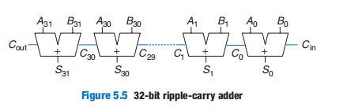
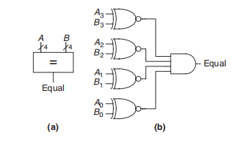
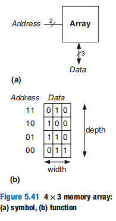
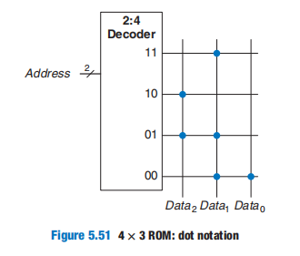
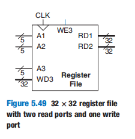

# Digital Building Blocks

[TOC]

## Arithmetic Circuits

Computer arithmetic could be the subject of an entire text. *Digital* *Arithmetic*, by Ercegovac and Lang, is an excellent overview of the entire field. *CMOS VLSI Design*, by Weste and Harris, covers highperformance circuit designs for arithmetic operations.

### Addition

**Adders also illustrate trade-offs between speed and complexity**

#### 1-bit half adder

#### 1-bit full adder

#### Carry Propagate Adder

An *N*-bit adder sums two *N*-bit inputs, *A* and *B*, and a carry in *C*in to produce an *N*-bit result *S* and a carry out *C*out. It is commonly called a **carry propagate adder(CPA)**

Three common CPA implementations are called **ripple-carry adders**, **carry-lookahead adders**, and **prefix adders**.

#### Ripple-Carry Adders

The delay of the adder, $t_{ripple}$ , grows directly with the number of bits, as given in Equation. 5.1, where $t_{FA}$ is the delay of a 1-bit full adder
$$
t_{ripples} = Nt_{FA}
$$

#### Carry-Lookahead Adder

The fundamental reason that large ripple-carry adders are slow is that the carry signals must propagate through every bit in the adder. A **carry lookahead adder (CLA)** is another type of carry propagate adder that solves this problem by dividing the adder into *blocks* and providing circuitry to quickly determine the carry out of a block as soon as the carry in is known

每个4-bit CLA块分为两个部分：一个是计算$C_{out}$的组合电路，另一个是4-bit的Ripple-Carry Adders

下面我们从数学出发，看看如何从抽象的公式中导出上述电路结构。

1. 设两个输入分别为$A_{31:0}$和 $B_{31:0}$，第$i$位的进位为$C_i$，因此我们有

2. 如果$A_i$与$B_i$同时为$1$，那么必会产生进位$C_i$。我们定义$G_i$来说明这个事实，即 $G_i = A_i  B_i$

3. 如果$C_{i-1}$为$1$，那么当$A_i = 1$或$B_i = 1$时，就会产生进位$C_i$。我们定义$P_i$来说明这个事实，即$P_i = A_i + B_i$

4. 根据进位的含义，进位$C_i$可以表示为
   $$
   C_i = A_iB_i + (A_i + B_i)C_{i-1}
   $$
   即
   $$
   C_i = = G_i + P_iC_{i-1}
   $$
   
5. 对上述等式进行4次递归得
   $$
   \begin{align}
   C_i &= G_i + P_iC_{i-1} \\
   &= G_i + P_i(G_{i -1} + P_{i-1}C_{i-2})\\
   &= G_i + P_i(G_{i -1} + P_{i-1}(G_{i-2} + P_{i-2}C_{i-3}))\\
   &= G_i + P_i(G_{i -1} + P_{i-1}(G_{i-2} + P_{i-2}(G_{i-3} + P_{i-3}C_{i-4})))\\
   &= (G_i + P_iG_{i - 1} + P_iP_{i-1}G_{i-2} + P_iP_{i-1}P_{i-2}G_{i-3}) + (P_iP_{i-1}P_{i-2}P_{i-3}C_{i-4})
   \end{align}
   $$

根据最后一个等式可以构建如下电路：

可以计算出它的延迟为
$$
t_{CLA} = t_{pg} + t_{pg\_block} + (\frac{N}{K} - 1)t_{AND\_OR} + kt_{FA}
$$
其中，$t_{pg}$表示计算$Pi$与$G_i$的时间，$t_{pg\_block}$表示计算$G[i:j]$、$P[i:j]$的时间，$t_{AND\_OR}$表示最后计算进位$C_{out}$的时间，而$kt_{FA}$就是一个块（4-bit Ripple-Carry Adders）所需的计算时间。

#### Prefix Adder

**Prefix adders** extend the generate and propagate logic of the carrylookahead adder to perform addition even faster. They first compute G and P for pairs of columns, then for blocks of 4, then for blocks of 8, then 16, and so forth until the generate signal for every column is known. The sums are computed from these generate signals.

1. 显然，$S_i$可以根据下式计算出来：
   $$
   S_i = (A_i \oplus B_i) \oplus C_i
   $$

2. 在Carry-Lookahead Adder讨论中，我们有一个递推式，应用在这里有：
   $$
   \begin{align}
   C_i &= (G_i + P_iG_{i - 1} + P_iP_{i-1}G_{i-2} + ... +P_{i}P_{i-1}...P_{1}G_{0}) + (P_iP_{i-1}...P_{0}C_{in})
   \end{align}
   $$

3. 为了简化符号，我们记$G_{i:j} = (G_i + P_iG_{i - 1} + P_iP_{i-1}G_{i-2} + ... +P_{i}P_{i-1}...P_{j+1}G_{j})$、$P_{i:j} = P_{i}P_{i-1}...P_{j+1}P_{j}$

4. 我们不妨约定$G_{-1} = C_{in}$，那么我们有
   $$
   \begin{align}
   C_i &= (G_i + P_iG_{i - 1} + P_iP_{i-1}G_{i-2} + ... +P_{i}P_{i-1}...P_{1}G_{0}) + (P_iP_{i-1}...P_{0}C_{in}) \\
   &= G_i + P_iG_{i - 1} + P_iP_{i-1}G_{i-2} + ... +P_{i}P_{i-1}...P_{1}G_{0} + P_iP_{i-1}...P_{0}G_{-1}  \\
   &= G_{i:-1} 
   \end{align}
   $$

   因此
   $$
   S_i =  (A_i \oplus B_i) \oplus G_{i:-1}
   $$

  5. 同时令$P_{-1} = 0$，因此对$i,j \in \mathbb{Z} \and i, j \geq-1$有：
     $$
     P_{i:j} = P_{i:k}P_{k-1:j}
     $$

     $$
     G_{i:j} = G_{i:k} + P_{i:k}G_{k-1:j}
     $$

prefix adder的延迟为
$$
t_{PA} = t_{pg} + log_2N(t_{pg\_prefix}) + t_{XOR}
$$

In summary, the prefix adder achieves a delay that grows logarithmically rather than linearly with the number of columns in the adder.  but it comes at the expense of more hardware than a simple carry lookahead adder. The network of black cells is called a **prefix tree**.

### Subtraction

减法器的原理
$$
Y = A - B = A + (\overline{B} + 1)
$$

### Comparators

A **comparator** determines whether two binary numbers are equal or if one is greater or less than the other：

-  **equality comparator** produces a single output, indicating whether *A* is equal to *B* (*A* == *B*)

  

-  **magnitude comparator** produces one or more outputs, indicating the relative values of *A* and *B*.Magnitude comparison of signed numbers is usually done by computing *A* *−* *B* and looking at the sign (most significant bit) of the result 

  在不溢出的情况下，比较的结果才有意义。例如，比较两个4bit的有符号数（补码表示）：-8、1，那么我们有$1000_2 - 0001_2 = 1000 + 1110 + 1 = 10111_2 = 0111_2$，该结果说明$-8 > 1$。这显然是不对的。

  

### ALU

An **Arithmetic/Logical Unit** (*ALU*) combines a variety of mathematical and logical operations into a single unit

 **ALUControl** that specifies which function to 'perform'. 值得注意的是：执行加法操作时，还得执行其他算术操作，最后通过一个Mux将加法的结果输出。

Some ALUs produce extra outputs, called **flags**, that indicate extra information about the ALU output.

- **N**egative：asserted when most significant bit of the ALU output, $Result_{31}$

- **Z**ero：asserted when all of the bits of *Result* are 0

- **C**arry Out：asserted when the adder produces a carry out *and* the ALU is performing addition or subtraction

  这个CarryOut只能检测出无符号加法的溢出。

- o**V**erflow： asserted when all three of the following conditions are true

  - the ALU is performing addition or subtraction 
  - *A* and *Sum* have opposite signs
  - *A* and *B* have the same sign and the adder is performing addition (*ALUControl*0 = 0) or *A* and *B* have opposite signs and the adder is performing subtraction

  这个溢出判断对无符号数是不成立的，例如两个4bit的无符号数：8，1，那么我们有$8 - 1 = 1000 - 0001 = 1000 + 1110 + 1 = 10111 = 0111$。该结果说明$8 -1$溢出了，这显然是不对的。

The ALU flags can also be used for comparisons：

首先执行减法运算，然后再根据上表做出判断。

ALUs also implement an instruction called **set if less than (SLT)** When *A* < *B*, *Result* *=* 1. Otherwise, *Result* *=* 0。SLT typically treats inputs as signed. Another flavor (SLTU) treats inputs as unsigned

### Shifters & Rotators

a shifter shifts a binary number left or right by a specified number of positions. Several kinds of commonly used shifters exist：

- **Logical shifter**：shifts the number to the left or right and fills empty spots with 0’s. 

  Example: 11**001** >> 2 = 0011**0**; 11**001** << 2 = **001**00

- **Arithmetic shifter**：on right shifts fills the most significant bits with a copy of the old most significant bit (msb). This is useful for multiplying and dividing signed numbers. Arithmetic shift left is the same as logical shift left.

- **Rotator**：rotates a number in a circle such that empty spots are filled with bits shifted off the other end

An *N*-bit shifter can be built from *N N:*1 multiplexers：

### Multiplication

In general, an *N* × *N* multiplier multiplies two *N*-bit numbers and produces a 2*N*-bit result. but **Signed and unsigned multiplication differ**.

Figure 5.21 shows the symbol, function, and implementation of an unsigned 4 × 4 multiplier

A **multiply accumulate** operation multiplies two numbers and adds them to a third number—typically, the accumulated value（$x \leftarrow a + b * c$）. These operations, also called **MACs**, are often used in **digital signal processing** (DSP) algorithms such as the Fourier transform

### Division

Binary division can be performed using the following algorithm for *N*-bit unsigned numbers in the range $[0, 2^N-1]$：

~~~algorithm
R‘ = 0
for i = N - 1 to 0
	R = {R' << 1, Ai}
	D = R - B
	if (D < 0) then Qi = 0, R' = R
	else			Qi = 1, R' = D
R = R'
~~~

- The partial remainder R is initialized to 0 ($R' = 0$)
- the most significant bit of the dividend A becomes the least significant bit of R  ($R = \{R' << 1, A_i\}$)
- The divisor B is subtracted from this partial remainder to determine whether it fits ($D = R − B$)
-  If the difference D is negative (i.e., the sign bit of D is 1), then the quotient bit $Q_i$ is 0 and the difference is discarded
-  Otherwise, $Q_i$ is 1, and the partial remainder is updated to be the difference

实际上就是十进制除法算法的二进制版本。

The delay of an *N*-bit array divider increases proportionally to $N^2$ . Division is a slow and expensive operation in hardware; therefore, it should be used as infrequently as possible.

## Sequential Building Blocks

### Counters

An *N*-bit *binary counter*, shown in Figure 5.32, is a sequential arithmetic circuit with clock and reset inputs and an *N*-bit output *Q. Reset*initializes the output to 0. The counter then advances through all $2^N$possible outputs in binary order, incrementing on the rising edge of the clock.

The most significant bit of an *N*-bit counter toggles every $2^N$ cycles. Thus, it reduces the frequency of the clock by a factor of $2^N$. This is called a **divide-by-$2^N$ counter**

A further counter generalization to produce arbitrary frequencies is called a **digitally controlled oscillator (DCO)**,Consider an *N*-bit counter that adds *p* on each cycle, rather than 1. If the counter receives a clock with frequency $f_{clk}$, the most significant bit now toggles at $f_{out} = f_{clk} × p/2^N$

### Sift Registers

A **shift register** has a clock, a serial input $S_{in}$, a serial output $S_{out}$, and *N* parallel outputs $Q_{N−1:0}$, as shown in Figure 5.35. On each rising edge of the clock, a new bit is shifted in from $S_{in}$ and all the subsequent contents are shifted forward. The last bit in the shift register is available at$S_{out}$. 

Shift registers can be viewed as **serial-to-parallel converters**. The input is provided serially (one bit at a time) at $S_{in}$. After *N* cycles, the past *N* inputs are available in parallel at *Q*.

A related circuit is a **parallel-to-serial** converter that loads *N* bits in parallel, then shifts them out one at a time. A shift register can be modified to perform both serial-to-parallel and parallel-to-serial operations by adding a parallel input $D_{N−1:0}$ and a control signal *Load*, as shown in Figure 5.37. When *Load* is asserted, the flip-flops are loaded in parallel from the *D* inputs. Otherwise, the shift register shifts normally

注意：Load信号升起时，会将所有$D_i$加载到shift register中。如果还想要继续从$S_{out}$一个一个串行输出$D_i$，那么在下一个上升沿之间将Load信号取消即可。

Shift registers are often used to test sequential circuits, using a technique called **scan chains**.

Testing combinational circuits is relatively straightforward. Known inputs called *test vectors* are applied, and the outputs are checked against the expected result. 

Testing sequential circuits is more difficult because the circuits have state. Starting from a known initial condition, a large number of cycles of test vectors may be needed to put the circuit into a desired state.

To solve this problem, designers like to be able to directly observe and control all of the machine’s state. This is done by adding a test mode in which the contents of all flip-flops can be read out or loaded with desired values. Most systems have too many flip-flops to dedicate individual pins to read and write each flip-flop（翻译：大多数系统都有太多的触发器，无法使用单独的引脚来读取和写每个触发器）.  Instead, all flip-flops in the system are connected together into a shift register called a **scan chain**

In normal operation, the flip-flops load data from their *D* input and ignore the scan chain. In test mode, the flip-flops serially shift their contents out and shift in new contents using $S_{in}$ and $S_{out}$. The load multiplexer is usually integrated into the flip-flop to produce a **scannable flip-flop**. 

对于一个N-bit的寄存器来说，通过类似serial-to-parallel converters的工作方式，将状态加载到寄存器中。

## Memory Arrays

·	

Memory arrays are built as an array of *bit cells*, each of which stores 1 bit of data.each bit cell is connected to a **wordline** and a **bitline**. For each combination of address bits, the memory asserts a single wordline that activates the bit cells in that row.

To read a bit cell, the bitline is initially left floating (Z). Then, the wordline is turned ON, allowing the stored value to drive the bitline to 0 or 1. To write a bit cell, the bitline is strongly driven to the desired value. Then, the wordline is turned ON, connecting the bitline to the stored bit. 

All memories have one or more *ports*. Each port gives read and/or write access to one memory address. 

**Multiported** memories can access several addresses simultaneously. Figure 5.45 shows a three-ported memory with two read ports and one write port. Port 1 reads the data from address *A1* onto the read data output *RD1*. Port 2 reads the data from address *A2* onto *RD2*. Port 3 writes the data from the write data input *WD3* into address *A3* on the rising edge of the clock if the write enable *WE3* is asserted.

Memories are classified based on how they store bits in the bit cell. The broadest classification is 

- **random access memory (RAM)** ：RAM is **volatile**, meaning that it loses its data when the power is turned off. The two major types of RAMs are：

  - **dynamic RAM (DRAM)**：stores a bit as the presence or absence of charge on a capacitor

    

    When the wordline is asserted, the nMOS transistor turns ON, and the stored bit value transfers to or from the bitline.

    

    Reading destroys the bit value stored on the capacitor, so the data word must be restored (rewritten) after each read. Even when DRAM is not read, the contents must be refreshed (read and rewritten) every few milliseconds, because the charge on the capacitor gradually leaks away

  - **static RAM (SRAM)**：stores data using a pair of cross-coupled inverters.stored bits do not need to be refreshed

    

    Each cell has two outputs, bitline and bitline. When the wordline is asserted, both nMOS transistors turn on, and data values are transferred to or from the bitlines

    

- **read only memory (ROM)**：ROM is *nonvolatile*, meaning that it retains its data indefinitely, even without a power source. ROM stores a bit as the presence or absence of a transistor. the bitline is weakly pulled HIGH. Then, the wordline is turned ON. If the transistor is present, it pulls the bitline LOW

  

  The contents of a ROM can be indicated using **dot notation**：

  

  可以使用逻辑门来构造ROM器件（不可修改）

  

  

  A **programmable ROM (*PROM*)**  places a transistor in every bit cell but provides a way to connect or disconnect the transistor to ground

  Figure 5.53 shows the bit cell for a **fuse-programmable ROM**. This is also called a **one-time programmable ROM**, because the fuse cannot be repaired once it is blown.

  

  **Erasable PROMs (EPROM)** replace the nMOS transistor and fuse with a **floating-gate transistor**. The floating gate is not physically attached to any other wires. When suitable high voltages are applied, electrons tunnel through an insulator onto the floating gate, turning on the transistor and connecting the bitline to the wordline (decoder output). When the EPROM is exposed to intense ultraviolet (UV) light for about half an hour, the electrons are knocked off the floating gate, turning the transistor off. These actions are called **programming** and **erasing**, respectively

  

  **Electrically erasable PROMs(EEPROMs) **and **Flash memory** use similar principles but include circuitry on the chip for erasing as well as programming, so no UV light is necessary. EEPROM bit cells are individually erasable; Flash memory erases larger blocks of bits and is cheaper because fewer erasing circuits are needed

  

  Memory arrays used to perform logic are called **lookup tables(LUTs)**. Each address corresponds to a row in the truth table, and each data bit corresponds to an output value.

  

  

> RAM and ROM received their names for historical reasons that are no longer very meaningful. RAM is called *random* access memory because any data word is accessed with the same delay as any other. In contrast, a *sequential* access memory, such as a tape recorder, accesses nearby data more quickly than faraway data (e.g., at the other end of the tape). ROM is called *read only* memory because, historically, it could only be read but not written. These names are confusing, because ROMs are also randomly accessed. Worse yet, most modern ROMs can be written as well as read!

Generally, the more transistors a device has, the more area, power, and cost it requires. The best memory type for a particular design depends on the speed, cost, and power constraints.

DRAM must wait for charge to move (relatively) slowly from the capacitor to the bitline. DRAM also fundamentally has lower throughput than SRAM, because it must refresh data periodically and after a read. DRAM technologies such as **synchronous DRAM (SDRAM)** and **double data rate (DDR) SDRAM** have been developed to overcome this problem. SDRAM uses a clock to pipeline memory accesses. DDR SDRAM  uses both the rising and falling edges of the clock to access data, thus doubling the throughput for a given clock speed

Digital systems often use a number of registers to store temporary variables. This group of registers, called a **register file**, is usually built as a small, multiported SRAM array because it is more compact than an array of flip-flops. The register file has two read ports (*A1/RD1* and *A2/RD2*) and one write port (*A3/WD3*/WE3).

## Number System

Fixed-point numbers are analogous to decimals; some of the bits represent the integer part, and the rest represent the fraction. Floating-point numbers are analogous to scientific notation, with a mantissa and an exponent.

### Fixed-Point Number

Signed fixed-point numbers can use either **two’s complement** or **sign/magnitude** notation

-  In sign/magnitude form, the most significant bit is used to indicate the sign
-  The two’s complement representation is formed by inverting the bits of the absolute value and adding a 1 to the least significant (rightmost) bit

There is no way of knowing the existence of the binary point except through agreement of those people interpreting the number.*Ua.b* to denote an unsigned fixed-point number with *a* integer bits and *b* fraction bits. *Qa.b* denotes a signed (two’s complement) fixed point number with *a* integer bits (including the sign bit) and *b* fractional bits.

Compute 0.75 + (−0.625) using Q4.4 fixed-point numbers：

### Floating-Point Number

**floating-point unit(FPU)**, is typically distinct from the **central processing unit (CPU)**. 

The IEEE floating-point standard represents a number in a form $V = (−1)^s × M * 2^E$:

The value encoded by a given bit representation can be divided into three different cases (the latter having two variants), depending on the value of exp：

- **Normalized Values**：

  It occurs when the bit pattern of exp is neither all zeros (numeric value 0) nor all ones (numeric value 255 for single precision, 2047 for double). 

  In this case, the exponent field is interpreted as representing a signed integer in biased form. That is, the exponent value is E = e − Bias where e is the unsigned number and Bias is a bias value equal to $2^{k−1} − 1$ (127 for single precision and 1023 for double).This yields exponent ranges from −126 to +127 for single precision and −1022 to +1023 for double precision

  The fraction field frac is interpreted as representing the fractional value f , where $0 ≤ f < 1$, having binary representation$ 0.f_{n−1}... f_1f_0$​.The significand is defined to be $M = 1 + f $. This is sometimes called an **implied leading 1** representation. because in binary floating-point, the first bit of the mantissa (to the left of the binary point) is always 1 and therefore need not be stored

  

   32bit floating-point representation of the decimal number 228：$228_{10} = 11100100_2 = 1.11001_2 \times 2^7$

  

- **Denormalized Values**

  When the exponent field is all zeros, the represented number is in denormalized form

  In this case, the exponent value is $E = 1 − Bias$, and the significand value is $M = f$

  Denormalized numbers serve two purposes.

  - First, they provide a way to represent numeric value 0, since with a normalized number we must always have M ≥ 1, and hence we cannot represent 0
  - A second function of denormalized numbers is to represent numbers that are very close to 0.0. They provide a property known as gradual underflow in which possible numeric values are spaced evenly near 0.0

-  **Special Values**

  A final category of values occurs when the exponent field is all ones

  When the fraction field is all zeros, the resulting values represent infinity, either +∞ when s = 0, or −∞ when s = 1. Infinity can represent results that overflow

  When the fraction field is nonzero, the resulting value is called a “NaN,” short for “Not a Number.” Such values are returned as the result of an operation where the result cannot be given as a real number or as infinity, as when computing $\sqrt{-1}$ or $log_2(−5)$.

32bit float numbers have a precision of about seven significant decimal digits because $10^7 < 2^{24}=16777216 < 10^8$（23位尾数 + 小数点前省略的1位）. double-precision numbers  have a precision of about 15 significant decimal digits. Quads have 34 decimal digits of precision but are not yet widely supported in hardware or software.

Arithmetic results that fall outside of the available precision must round to a neighboring number. The rounding modes are **round down**, **round up**, **round toward zero**, and **round to nearest**. The default rounding mode is round to nearest. In the round-to-nearest mode, if two numbers are equally near, the one with a 0 in the least significant position of the fraction is chosen.

Recall that a number **overflows** when its magnitude is too large to be represented. Likewise, a number **underflows** when it is too tiny to be represented. In round-to-nearest mode, overflows are rounded up to ±∞and underflows are rounded down to 0.

The steps for adding floating-point numbers with the same sign are as follows：

1. Extract exponent and fraction bits.
2. Prepend leading 1 to form the mantissa.
3. Compare exponents.
4. Shift smaller mantissa if necessary
5. Add mantissas.
6. Normalize mantissa and adjust exponent if necessary.
7. Round result.
8. Assemble exponent and fraction back into floating-point number.

the floating-point addition of 7.875 ($1.11111 × 2^2$ ) and 0.1875 ($1.1 × 2^{−3}$ ). The result is 8.0625 ($1.0000001 × 2^3$ )

浮点数的分布是十分不均匀的，下面给出一个图例来说明：

