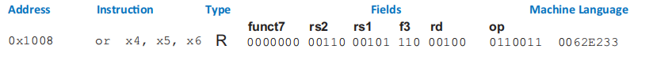
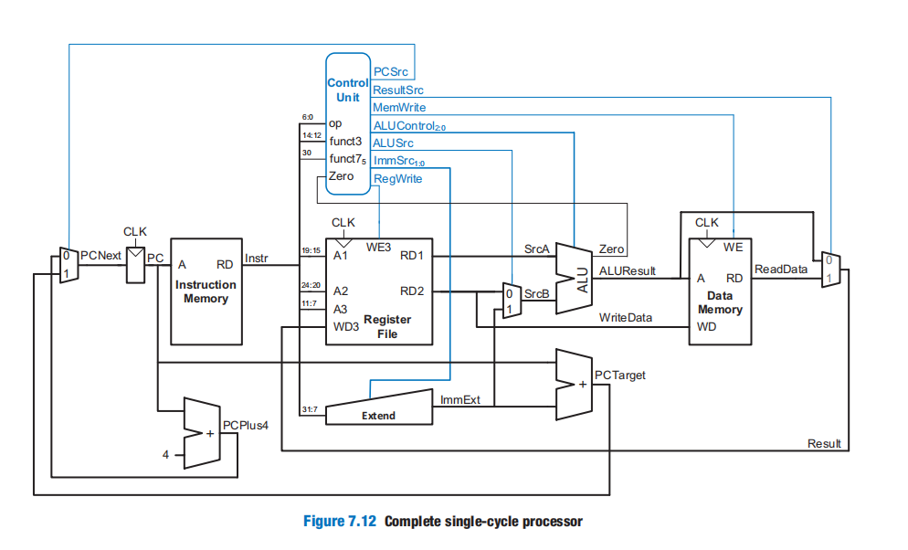
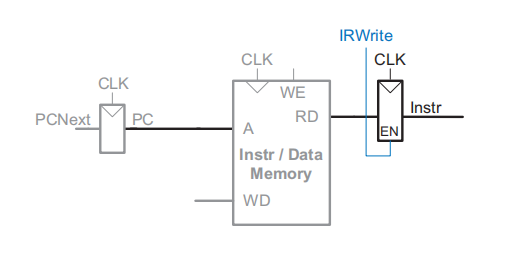
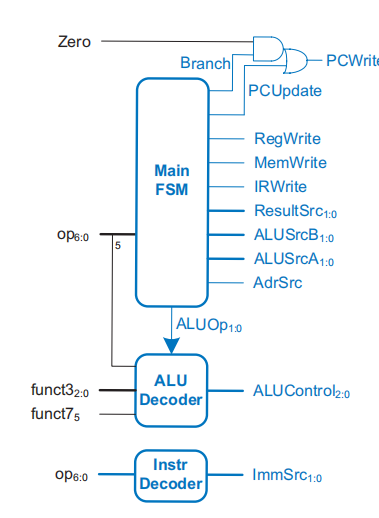
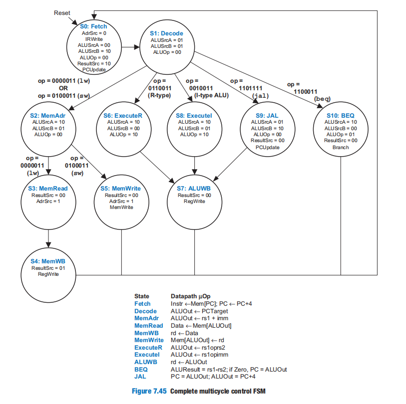
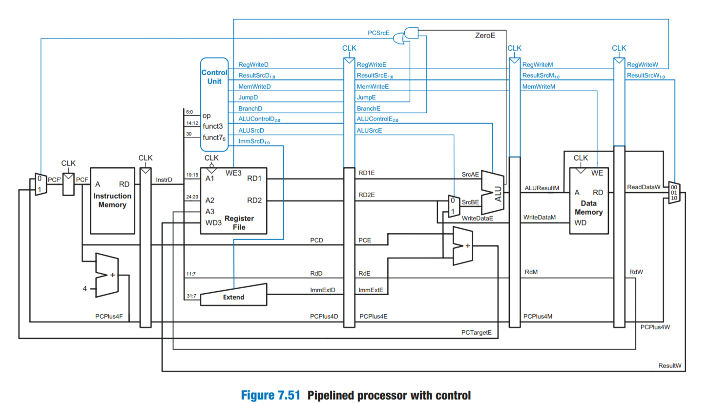
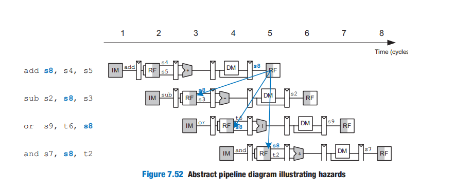
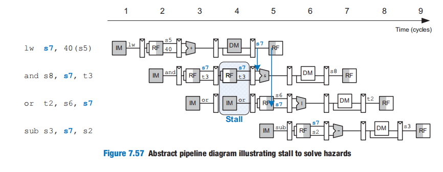
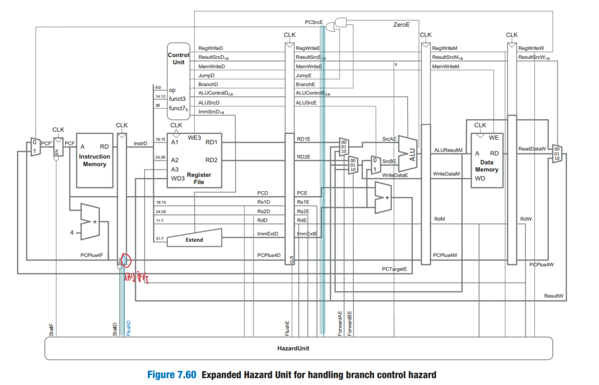

# Microarchitecture

> 我们通过三个案例（单周期、多周期、流水线），渐进式地构建RISC-V处理器，来学习微架构这一块内容。

[TOC]

## Introduction

**Microarchitecture is the specific arrangement of registers, arithmetic logic units (ALUs), finite state machines (FSMs), memories, and other logic building blocks.**

RISC-V, may have many different microarchitectures, each with different trade-offs of performance, cost, and complexity. 

**a computer architecture is defined by its instruction set and architectural state. The architectural state for the RISC-V processor consists of the program counter and the 32 32-bit registers**.Based on the current architectural state, the processor executes a particular instruction with a particular set of data to produce a new architectural state. Some microarchitectures contain additional **nonarchitectural state** to either simplify the logic or improve performance; （**实际上，处理器就是一个有限状态机**）

We divide our microarchitectures into two interacting parts: 

- **datapath**：it operates on words of data. It also contains structures such as memories, registers, ALUs, and multiplexers.
-  **control unit**：it produces multiplexer select, register enable, and memory write signals to control the operation of the datapath

In this note, we develop three microarchitectures for the RISC-V architecture: **single-cycle**, **multicycle**, and **pipelined**. They differ in how the state elements are connected and in the amount of nonarchitectural state needed.

| ···············                              | single-cycle microarchitecture | multicycle microarchitecture | pipelined microarchitecture |
| -------------------------------------------- | :----------------------------: | :--------------------------: | :-------------------------: |
| 指令的执行周期                               |           one cycle            |  a series of shorter cycles  |          one cycle          |
| 数据和指令是否存放在同一个内存中             |               否               |              是              |             否              |
| 是否需要非架构状态（nonarchitectural state） |               否               |              是              |             是              |

## Performance Analysis

在市场营销中，买家经常用频率（Hz）去评测处理器的性能，但这是片面的。只有在具体的**工作负载（workload）**下，比较各个处理器的性能才有意义。因此，推荐使用`benchmark`基准测试程序（例如，**Dhrystone**、**CoreMark**以及**SPEC**）去评测一个处理器的能力（跑分）。这类程序是基于下述公式来测评CPU的：

$$
ExecutionTime = (\#instructions) (\frac{cycles}{instruction})(\frac{seconds}{cycle})
$$
The number of instructions in a program depends on the processor architecture. Some architectures have complicated instructions that do more work per instruction, thus reducing the number of instructions in a program. However, these complicated instructions are often slower to execute in hardware, which decreases the CPI.

The **cycles per instruction (CPI)** is the number of clock cycles required to execute an average instruction. It is the reciprocal of the throughput (**instructions per cycle**, or **IPC**). 

还有其他因素影响着计算机系统总体的性能，例如IO、缓存、网络、总线带宽等等，而且在互联网、云原生的时代，往往是`IO`、网络为整个系统的性能瓶颈。

## Single-Cycle Processor

我们先关注每个指令的数据通路的设计，控制通路单独说明

我们先从下面部件开始，来逐步构建单周期处理器。

先来设计`lw`指令

得益于指令格式的规整性，译码逻辑的实现简单，而且数据通路、控制通路的布局也很直观简洁。

再设计`sw`指令

还需要说明一下，并不是所有的指令格式都有相同的立即数格式。因此，我们要根据指令码`op`，来解码指令对应的立即数格式。这里用`ImmSrc`控制信号来决定如何处理$Imm_{31:7}$，来生成对应的立即数`ImmExt`。

再设计`or`指令

在这里我们需要说明一些事实：

- 得益于指令格式的规整性，指令的译码很简单。仅需将32位的总线，按位分为多个子总线即可。
- 控制信号 + Mux，可以选择性关闭掉无关的数据通路，避免影响到最终的结果。

再来设计`beq`指令

这里：$PCSrc = Zero * Branch$，在Control Unit会解释这一点的。

再来设计`jal`指令

`jal rd offset`：`[rd] = PC + 4` then `PC = PC + offset`

下面我们来说明一下控制单元的实现。

控制通路的核心思想就是状态机。其中，状态就是指令的操作码op、fun3、fun7，而PC控制着状态转移。就不再过多阐述，直接给出真值表

控制通路如下：

注意：这张图中并没有包括`jal`指令的数据通路。

## Multi-Cycle Processor

The single-cycle processor has three notable weaknesses：

- First, it requires **separate memories** for instructions and data, whereas most processors have only a single external memory holding both instructions and data. 
- Second, it requires a **clock cycle long enough to support the slowest instruction**  even though most instructions could be faster
-  Finally, **it requires three adders** (one in the ALU and two for the PC logic); adders are relatively expensive circuits

The multicycle processor addresses these weaknesses by breaking an instruction into multiple shorter steps. But we also add nonarchitectural state elements to hold intermediate results between the steps

we begin our design with the memory and architectural state of the processor,

由于一条指令的执行需要多周期，所以指令状态必须保持住。我们引入**非架构指令寄存器（nonarchitectural  instruction register，IR）**来保存从内存中取出的指令。

The IR receives an enable signal, called `IRWrite`, which is asserted when the IR should be loaded with a new instruction.

下面我们来实现`lw`指令

`ImmExt` is a combinational function of `Instr` and will not change while the current instruction is being processed, so there is no need to dedicate a register to hold the constant value.

注意，这里复用了`Instr/Data Memory`，第一阶段是从这里取指令，而第四阶段是从这里取数据。而`AdSrc`控制信号以及`Mux`实现了这种复用。

这里为什么不直接将`Data`传入到`WD3`，而是通过一个`Mux`再传入`WD3`？因为，如果直接将`Data`连接到`WD3`的话，当有些指令需要将`ALUOut`传入`WD3`，就会产生数据通路的冲突。

这里我们要使用指令中的`Rd`，而`IR`从一开始就保存了指令状态，所以这里直接从`IR`中获取`Rd`即可。`IR`的作用在此就体现了出来。

最后，我们来计算`PC`。这里我们给`PC`额外提供了一个`PCWrite`使能信号。这是因为`PCResult`和`ALUOut`共用一条数据通路，而`PCWrite`确保PC在恰当时刻被写入，而不是被写入其他无关数据。**实际上，在第一阶段取指令的时候，下一条指令的地址就计算出来了。**这样便充分复用这些部件，减少指令的时钟周期数。

**这些非架构状态寄存器缓存了处理器的一些中间状态，可以在需要时去读取这些状态。这为时分复用部件提供了支持。**由于数据通路和部件的复用，寄存器在不同阶段中的状态可能发生变化。可以通过使能信号来控制寄存器的状态变化，而不是在时钟上升沿被动地更新状态。

下面我们设计`sw`指令：

此时，处理器也支持R-type指令。

我们来看一下`beq rs1 rs2 offset`指令。

在第一阶段译码时，将分支成功所要跳转的地址计算出来，并保存在`ALUResult`中。

在第二个阶段，比较两个`rs1`与`rs2`，根据比较结果来决定是否将`ALUResult`写入到`PCNext`中。

再来看看如何设计控制单元。我们在单周期控制单元的基础上，将`Main Decoder`替换成`Main FSM`即可。这样就可以在每个一个阶段产生恰当的控制信号。

接下来我们来设计这个Main FSM，**设计思路就是根据指令的数据流反推它的状态流**。在状态图中，我们只列出我们感兴趣的控制信号以及使能信号。未列出的使能信号默认为0。**状态转移条件就是时钟上升沿**。

第一个阶段是将指令从内存中取出来（Fetch），并保存在`IR`中：

然后开始译码指令。在这个阶段后，FSM根据指令的`op`、`funct3`、`funct7`转移到不同的状态

也就是说，所有指令都复用`S0:Fetch`以及`S1:Decode`状态。

首先来看看`lw`指令的状态转移流。在解码`lw`指令之后，便计算出数据的内存地址，然后将数据从内存中读出，最后写回到指定的寄存器。

别忘了，我们在取指令的同时，要计算出下一条指令的地址。故将S0状态更改为

我们来看看`sw`指令的状态转移流，它复用之前的`S2`状态，然后便向内存写入计算结果。

下面就直接给出`R-type`、`I-type`、`jal`、`beq`的状态转移流：

## Pipelined  Processor

在绝大多数的工作负载中，吞吐量远比延迟重要的多。多周期处理器只能同时处理一条指令；而流水线处理器可以同时处理多条，在吞吐量上更具有优势，因此所有现代高性能处理器都使用了流水线技术。

We design a pipelined processor by subdividing the single-cycle processor into five pipeline stages. we call the five stages ***Fetch***, ***Decode***, ***Execute***, ***Memory***, and ***Writeback***.

下面直接给出流水线的数据通路

我们注意到，Register File既用于一个指令的Decode阶段，又用于另一个指令的Writeback阶段。所以在下降沿时，允许从Register File读取；在上升沿时，允许向Register File写入。为什么不在上升沿时允许读取呢？这与之后介绍的解决数据冒险的「前向」技术相关。

实际上，上述数据通路是错误的。因为当执行到指令`A`的`Writeback`阶段时，需要获取指令`A`的`Rd`，但是当前`InstrD`为后面的指令`B`。为此，我们需要同步指令的`Rd`状态。

此外，`PCF`（Next PC）既可以是预取阶段的`PCPlus4F`，也可以是执行阶段的`PCTargetE`。如果`PCF`确定为`PCTargetE`，那么此时处于`Decode`阶段的指令是无效的，这时候该怎么办呢？这个问题先留着。

控制信号也必须流水线化，与对应的指令数据流同步。

一条指令的执行依赖于另一条尚未完成指令的结果，这种情况称为**冒险（hazard）**。冒险分为

- **数据冒险（data hazard）**。这种冒险只会发生在**写后读（read after write）**的情况，也就是说，指令尝试读取前面指令还未写回结果的寄存器。
- **控制冒险（control hazard）**。尚未决定获取哪一条指令时，就已经预取指令了。

数据冒险的例子：

指令`sub`、`or`、`and`的源操作数`s8`，要等待着`add`的目的操作数`s8`的更新后，才能获取，这样才能保证正确的行为。换句话说，`sub`等指令在`Decode`阶段等待，直到`add`指令完成了`Writebakc`阶段。

如何进行等待呢？一种解决方案就是在软件层面上层面上添加`nop`指令。

显然，这会浪费处理器的计算资源。

对于这种数据冒险——执行阶段的源寄存器匹配，访存阶段或者写回阶段的目的寄存器，可以通过**「前向」（forwarding）**技术来解决。直接将计算出的目的寄存器的结果，传递给执行阶段中的源寄存器。就拿上述例子来说：

「前向」技术的实现：

设计要点如下：

- Hazard Unit接受Rs1E、Rs2E、RdM、RdW、RegWriteM、RegWriteW作为输入，输出ForwardAE以及ForwardBE。

- ALUResultM和ResultW连回到执行阶段的SrcAE和SrcBE

- ForwardAE控制着SrcAE的来源——ALUResultM、ResultW、RD1E？

  

在Hazard Unit中，计算ForwardAE的算法如下：

~~~c
if ((Rs1E == RdM) && RegWriteM == 1 && Rs1E != 0) {
    // 当前执行阶段的源寄存器与访存阶段的目的寄存器匹配
    // 并且访存阶段的指令是要写入寄存器中的
    // 并且源寄存器不是0号寄存器（硬编码为0）
    ForwardAE = 0b10;
} else if ((Rs1E == RdW) && RegWriteW == 1 && Rs1E != 0) {
    ForwardAE = 0b01;
} else {
    ForwardAR = 0b00;
}
~~~

显然，`lw`指令直到访存阶段结束后，才能获取到可用的数据，它具有**两周期的延迟（two-cycle latency）**。如果紧跟着`lw`后面的一条指令`and`，需要依赖`lw`的结果，此时「前向」就束手无策了。

我们可以**「暂停」（stall）**流水线，直到数据是可用的。

实现暂停操作是很简单的，只需给寄存器添加一个使能信号即可，这样便可以控制指令状态的传播。

暂停后，依赖指令的状态还会向后传播。此时由于`lw`还未获取到有用的数据，依赖指令会获取到错误的数据，结果就理所应当地出错了。为了避免这种问题，我们要在暂停后，立马**「刷新」（flush）**要传播的状态。通过将控制信号或者数据通路，设置为对非架构状态无影响的值，来实现刷新操作。

Hazard Unit中实现Stall的算法为

~~~c
//如果执行阶段的指令为lw，并且它的目的寄存器匹配上了解码阶段的源寄存器，那么就stall
IwStall = ResultSrcE0 && (Rs1D == RdE || Rs2D == RdE);	
StallF = StallD = FlushE = IwStall
~~~

`beq`指令就是一个控制冒险的典型例子。一个简单的解决方案就是，暂停流水线直到做出了决定，即`beq`完成了执行阶段。显然，这十分浪费处理器的计算资源。我们可以采用另一种方法——分支预测。

就是根据先前的经验对决策做出预判。如果预判成功，那么就避免了控制冒险；如果预判失败，那么我们就要刷新状态，并重新执行指令。这些浪费的时钟周期就称为**「分支预测错误惩罚」（branch misprediction penalty）**。

这里我们预判策略很简单，就是直接预取一下条指令而已。

## Advanced Microarchitecture

### Deep Pipelines

现在商业处理器基本上使用8-20个阶段的流水线设计。

The maximum number of pipeline stages is limited by pipeline hazards, sequencing overhead, and cost(成本).  Longer pipelines introduce more dependencies and more registers

### Micro-Operations

Complex instruction set computer (CISC) architectures generally include instructions requiring more registers, more additions, or more than one memory access per instruction. 

For example, the x86 instruction` ADD [ESP],[EDX+80+EDI*2] `. involves reading the **three registers** (ESP, EDX, and EDI), **adding** the base (EDX), displacement (80), and scaled index (EDI*2), **reading two** memory locations, **summing** their values, and **writing** the result back to memory

~~~risc-v
slli t2, EDI, 1 	# t2 = EDI*2
add t1, EDX, t2 	# t1 = EDX + EDI*2
lw t1, 80(t1) 		# t1 = MEM[EDX + EDI*2 + 80]
lw t2, 0(ESP) 		# t2 = MEM[ESP]
add t1, t2, t1 		# t1 = MEM[ESP] + MEM[EDX + EDI*2 + 80]
sw t1, 0(ESP) 		# MEM[ESP] = MEM[ESP] + MEM[EDX + EDI*2 + 80]
~~~

Computer architects of CISC processors make the common case fast by defining a set of simple ***micro-operations***  that can be executed on simple datapaths. Each CISC instruction is decoded into one or more **micro-ops**

### Branch Prediction

The branch misprediction penalty is a major reason for increased CPI.  most pipelined processors use a ***branch predictor*** to guess whether the branch should be taken

对于循环来说，**后向跳转（backward branches）**是经常发生的。

~~~
// c programm
for (init; condition; step) {
	statement
}

// risc-v
init
FOR:
	branch to DONE when !condition		# 前向跳转
	statement
	step
	jump FOR						  # 后向跳转
DONE:
~~~

因此，针对这个工作负载来说，我们有**静态分支预测（static branch prediction）**的方案，即预测总是采用向后分支。这种方案并不依赖于工作负载的经验。但是如果不考虑这种经验，那么几乎不可能预测到向前分支。因此，许多处理器使用了**「动态分支预测器」（dynamic branch predictors）**来解决这一问题。

Dynamic branch predictors maintain a table of the last several hundred branch instructions that the processor has executed. The table, called a ***branch target buffer***,  includes the destination of the branch and a history of whether the branch was taken.

当分支指令的地址和分支目标缓冲中的某条指令的地址匹配时，那么就根据history来进行预测。history有one-bit 和 two-bit 等等实现方案。下面我们会一一介绍。

**A *one-bit dynamic branch predictor*** remembers whether the branch was taken the last time and predicts that it will do the same thing the next time. 

下面我们通过一个例子来说明这个ont-bit ：

~~~risc-v
    addi s1, zero, 0 	# s1 = sum = 0
    addi s0, zero, 0 	# s0 = i = 0
    addi t0, zero, 10 	# t0 = 10
for:
    bge s0, t0, done 	# i >= 10?
    add s1, s1, s0 		# sum = sum + i
    addi s0, s0, 1 		# i = i + 1
    j for 			    # repeat loop
done:
~~~

While the loop is repeating, it remembers that the beq was not taken last time and predicts that it should not be taken next time. This is a correct prediction until the last branch of the loop, when the branch does get taken. 

Unfortunately, if the loop is run again, the branch predictor remembers that the last branch was taken. Therefore, it incorrectly predicts

**A *two-bit dynamic branch predictor*** solves this problem by having four states: **Strongly Taken**, **Weakly Taken**, **Weakly Not Taken**, and **Strongly Not Taken**

### Super-Scalar Processors

***superscalar processor*** contains multiple copies of the datapath hardware to execute multiple instructions simultaneously.

Commercial processors may be three-, four-, or even six-way superscalar. 

Executing many instructions simultaneously is difficult because of dependencies. Unfortunately, real programs have many dependencies, so wide superscalar processors rarely fully utilize all of the execution units. Moreover, the large number of execution units and complex forwarding networks consume vast amounts of circuitry and power.

超标量技术实现了指令集并行。The **instruction-level parallelism (ILP， 指令集并行) ** is the number of instructions that can be executed simultaneously.

由于指令之间的依赖相关性很高，指令集并行度往往很低。

### Out-of-Order Processors

The instructions can issue in a different order than that written by the programmer as long as dependencies are honored so that the program produces the intended result. this is principle of **out-of-order processor** 

我们下面举一个例子来说明：

可以看到`add`依赖于`lw`，`and`依赖于`sub`等等。

我们可以使用乱序技术来降低这种数据依赖关系所带来的影响

可以看到处理器在等待`lw`的`s8`依赖时，提前发射了`or`、`sw`指令，以消除等待的影响。

sub指令和add指令对于s8寄存器的依赖关系，是一种**读后写冒险（write after read）**。也就是说，如果sub先于add执行，那么结果必然会出错。这种冒险并不会出现在我们之前介绍的简单流水线中，但是可能会出现在不正确的乱序操作中。此外还有**写后写冒险（write after write）**，同样只会出现在不正确的乱序操作中。

Out-of-order processors use a table to keep track of instructions waiting to issue. The table, sometimes called a ***scoreboard***， contains information about the dependencies

### Register Renaming

Out-of-order processors use a technique called ***register renaming*** to eliminate WAR and WAW hazards. Register renaming adds some nonarchitectural renaming registers to the processor 

For example, a processor might add 20 renaming registers, called r0 to r19. The programmer cannot use these registers directly,because they are not part of the architecture. However, the processor is free to use them to eliminate hazards.

In the previous example,  a WAR hazard occurred between the `sub s8,t2,t3` and `add s9,s8,t1` instructions based on reusing `s8`. The out-of-order processor could rename `s8` to `r0` for the sub instruction. Then, sub could be executed sooner, because `r0` has no dependency on the add instruction. The processor keeps a table of which registers were renamed so that it can consistently rename registers in subsequent dependent instructions. In this example, `s8` must also be renamed to `r0` in the `and` instruction, because it refers to the result of sub

### Multithreading

我们用**「多线程」**表示软件层面上的线程，用**「超线程」**表示硬件层面上的线程。

1. **核心(Core)：**处理器的一个物理执行单元,包含运算器、缓存等资源。多个核心构成多核处理器。
2. **硬件线程(Hardware Thread)：**一种超标量技术,通过复制部分处理器资源,在一个核心内模拟多个线程。
3. **逻辑线程(Logical Thread)：**操作系统使用的逻辑处理单元，承载着软件线程。一个逻辑线程唯一对应一个硬件线程。
4. **超标量(Superscalar)：**一种指令级并行的技术,通过复制功能单元,使单核心在一个时钟周期内可以执行多条指令。
5. **软件线程**：程序的执行流，由操作系统负责将这些线程加载到逻辑线程上。软件线程分为**「内核级线程」**和**「用户级线程」**。
6. **用户线程**：对用户级线程来讲，内核也并不知道它的存在，所有对用户级线程的管理和调度都是在用户空间来进行的。不仅无需通过中断进入操作系统的内核，而且调度算法也比较简单。但是用户线程也有它自身的缺点，如果一个用户级线程执行了同步阻塞调用方法，那么其他在内核级线程上的用户级线程也会被阻塞。而内核级线程被阻塞后，操作系统会切换到其他线程上。

注意

- 硬件线程的切换对于软件来说是完全透明的，软件只能看到逻辑线程。
- 超标量是对一个硬件线程来说的。也就是说，处理器在每个核心中都分别应用超标量技术。而且在同一时刻，核心中的多个硬件线程只有一个在执行。并**不是**使用超标量，同时执行多个硬件线程。

A program running on a computer is called a ***process*.**  Each process consists of one or more ***threads*** that also run simultaneously.The degree to which a process can be split into multiple threads that can run simultaneously defines its level of ***thread-level parallelism* (TLP).**

 The threads actually take turns being executed on the processor under control of the operating system (OS). When one thread’s turn ends, the OS saves its architectural state, loads the architectural state of the next thread, and starts executing that next thread. This procedure is called ***context switching***. 

A ***hardware multithreaded***  processor contains more than one copy of its architectural state (PC and Register File). if one software thread lacks sufficient parallelism to keep all execution units busy, then another thread could issue instructions to the idle units. Switching between threads can either be 

- **fine-grained**：*Fine-grained* multithreading switches between threads on each instruction and must be supported by hardware multithreading. 
- **coarse-grained.**：*Coarse-grained* multithreading switches out a thread only on expensive stalls, such as long memory accesses due to cache misses.

Multithreading does not improve the performance of an individual thread, because it does not increase the ILP. However, it does improve the overall throughput of the processor, because multiple threads can use processor resources that would have been idle when executing a single thread. Multithreading is also relatively inexpensive to implement because it replicates only the PC and register file, not the execution units and memories.

### Multiprocessors

A *multiprocessor* system consists of multiple processors and a method for communication between the processors. Three common classes of multiprocessors include 

- **symmetric (or *homogeneous*) multiprocessors（同构/对称性处理器）**。无论是多个CPU，还是多核CPU，它们都是对称多处理器。在SMP架构中，又可以分为

  - **NUMA架构**：内存的访问时间是依赖于处理器和内存之间的相对位置的。 这种设计里存在和处理器相对近的内存，通常被称作**本地内存**；还有和处理器相对远的内存， 通常被称为**远端内存**。下图就是一个典型的 x86 的 NUMA 架构：
  - **UMA架构**：所以处理器对共享内存的访问距离和时间是相同的。

  

  

- **heterogeneous multiprocessors（异构处理器）**： general-purpose processors are designed to provide good average performance, they are generally not the most power-efficient option for performing a given operation. This energy inefficiency is especially important in highly power-constrained systems, such as mobile phones.Heterogeneous multiprocessors aim to address these issues by incorporating different types of cores and/or specialized hardware in a single system. Each application uses those resources that provide the best power-performance ratio,

  Heterogeneous systems are not without their drawbacks. They add complexity in terms of both designing the different heterogeneous elements and the additional programming effort to decide when and how to make use of the varying resources.

  Symmetric multiprocessors are good for situations like large data centers that have lots of threadlevel parallelism available. Heterogeneous systems are good for systems that have more varying or special-purpose workloads, such as mobile devices.

  

- **lusters（集群）**：processors in clustered multiprocessor systems each have their own local memory system instead of sharing memory. One type of cluster is a group of personal computers connected on a network and running software to jointly solve a large problem.

