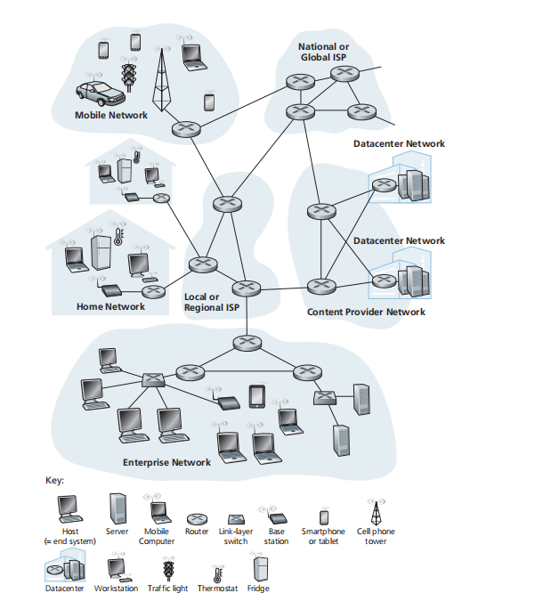
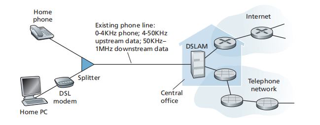
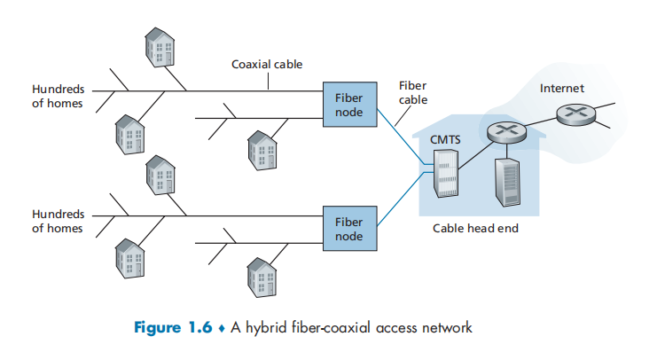
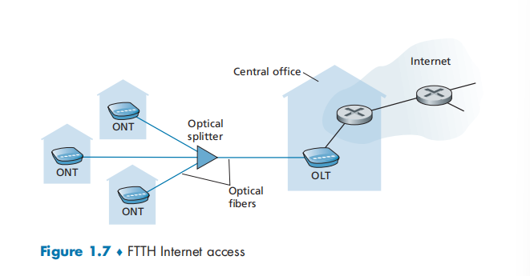
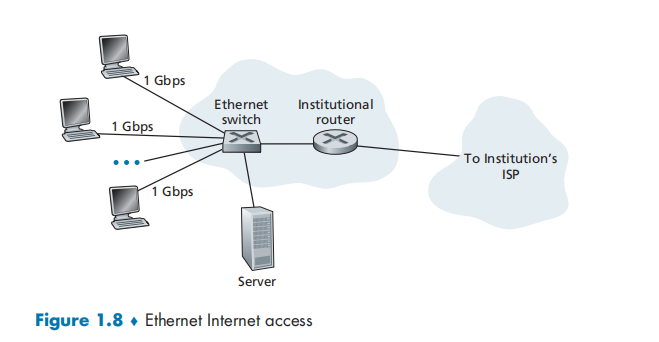
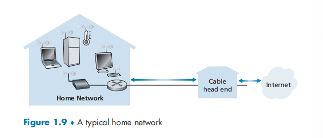
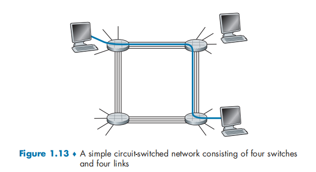
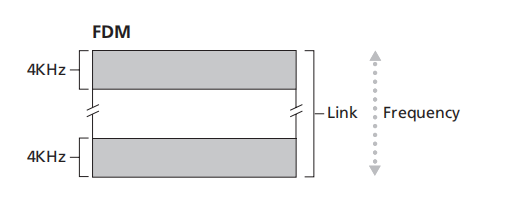
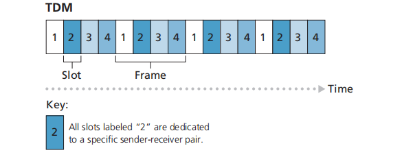

# Introduction

**Today’s Internet is arguably the largest engineered system ever created by mankind**

 **Welcome to the world of modern computer networking!** 🎉🎉🎉

[TOC]

## 概述

The Internet is a computer network that interconnects billions of computing devices  throughout the world.  In Internet jargon, all of these devices (such as  desktop computers, Linux workstations,  gaming consoles) are called **hosts** or **end systems**.

End systems are connected together by a network of

- **communication links** : there are many types of communication links, which are made up of different types of physical media, including coaxial cable, copper wire, optical fiber, and radio spectrum
-  **packet switches**: the two most prominent types of packet switch in today’s Internet are **routers** and **link-layer switches**.  Link-layer switches are typically used in access networks, while routers are typically used in the network core.

The sequence of communication links and packet switches traversed by a packet from the sending end system to the receiving end system is known as a **route** or **path** 

> Cisco predicts annual global IP traffic will reach nearly five zettabytes by 2022

End systems access the Internet through **Internet Service Providers (ISPs)**. ISPs provide a variety of types of network access  to the end systems, including residential broadband access, high-speed local area network access, and mobile wireless access. high-speed local area network access, and mobile wireless access. Each ISP network, whether upper-tier or lower-tier, is managed independently, 

End systems, packet switches, and other pieces of the Internet run **protocols** that control the sending and receiving of information within the Internet. The **Transmission** **Control Protocol (TCP)** and the **Internet Protocol (IP)** are two of the most important protocols in the Internet.

*A* **protocol** defines the **format** and the **order** of messages exchanged between two or more communicating entities, as well as the **actions** taken on the transmission and/or receipt of a message or other event.

 **Internet standards** are developed by the **Internet Engineering Task Force (IETF)** . The IETF standards documents are called **requests for comments (RFCs)**. RFCs started out as general requests for comments to resolve network and protocol design problems

Other bodies also specify standards for network components, most notably for network links. **The IEEE 802 LAN Standards Committee** specifies the Ethernet and wireless WiFi standards.

We give two descriptions of the Internet

- *an infrastructure that provides services to applications*.

  End systems attached to the Internet provide a **socket interface** that specifies how a program running on one end system asks the Internet infrastructure to deliver data to a specific destination program running on another end system. 

- *its hardware and software component*：see the network edge & core

The applications are said to be **distributed applications**, since they involve multiple end systems that exchange data with each other

## The Network Edge

**access network**—the network that physically connects an end system to the first router (also known as the “**edge router**”) 

Hosts are sometimes further divided into two categories: **clients** and **servers**.

>data centers are not only connected to the Internet, but also internally include complex computer networks that interconnect the datacenter’s hosts. 
>
>Broadly speaking, data centers serve three purposes：
>
>- **分布式存储**
>- **分布式计算**
>- **云服务**

### Home Access

Today, the two most prevalent types of broadband residential access are **digital subscriber line (DSL)** and **cable**:

- **DSL** makes use of the telco’s existing local telephone infrastructure
- **cable Internet access** makes use of the cable television company’s existing cable television infrastructure

#### DSL

A residence typically obtains DSL Internet access from the same local telephone company (telco) that provides its wired local phone access. each customer’s DSL modem uses the existing telephone line exchange data with a **digital subscriber line access multiplexer (DSLAM)** located in the telco’s local **central office (CO)**. The home’s DSL modem takes digital data and translates it to high-frequency tones for transmission over telephone wires to the CO; the analog signals from many such houses are translated back into digital format at the DSLAM.The residential telephone line carries both data and traditional telephone signals simultaneously, which are encoded at different frequencies（ **frequency-division multiplexing** ）:

- **A high-speed downstream channel**, in the 50 kHz to 1 MHz band

- **A medium-speed upstream channel**, in the 4 kHz to 50 kHz band

-  **An ordinary two-way telephone channel**, in the 0 to 4 kHz band

The DSL standards define multiple transmission rates, including downstream transmission rates of 24 Mbs and 52 Mbs, and upstream rates of 3.5 Mbps and 16 Mbps; the newest standard provides for aggregate upstream plus downstream rates of 1 Gbps [ITU 2014]. Because the downstream and upstream rates are different, the access is said to be **asymmetric**. The maximum rate is also limited by the distance between the home and the CO, the gauge of the twisted-pair line and the degree of electrical interference. 

#### cable Internet access 

A residence obtains cable Internet access from the same company that provides its cable television. fiber optics connect the **cable head end** to **neighborhood-level junctions**, from which traditional coaxial cable is then used to reach individual houses. Each neighborhood junction typically supports 500 to 5,000 homes. Because both fiber and coaxial cable are employed in this system, it is often referred to as **hybrid fiber coax (HFC).**

 At the cable head end, the **cable modem termination system (CMTS)** serves a similar function as the DSL network’s DSLAM—turning the analog signal sent from the cable modems in many downstream homes back into digital format.

**cable modems **, as with a DSL modem,   is typically an external device and connects to the home PC through an Ethernet port. 

 Cable modems divide the HFC network into two channels, a downstream and an upstream channel. As with DSL, access is typically asymmetric, with the downstream channel typically allocated a higher transmission rate than the upstream channel. The DOCSIS 2.0 and 3.0 standards define downstream bitrates of 40 Mbps and 1.2 Gbps, and upstream rates of 30 Mbps and 100 Mbps, respectively

One important characteristic of cable Internet access is that it is a **shared broadcast medium**. a distributed multiple access protocol is needed to coordinate transmissions and avoid collisions

#### Fiber to the home

the **FTTH** concept is simple—provide an optical fiber path from the CO directly to the home

There are several competing technologies for optical distribution from the CO to the homes:

-  **direct fiber**, one fiber leaves the CO for each home.

- More commonly, each fiber leaving the central office is actually shared by many homes; it is not until the fiber gets relatively close to the homes that it is split into individual customer-specific fibers. There are two competing optical-distribution network architectures that perform this splitting:

  - **active optical networks (AONs)**

  - **passive optical networks (PONs)** 

    

    Each home has an **optical network terminator (ONT)**, which is connected by dedicated optical fiber to a neighborhood **splitter**. The splitter combines a number of homes (typically less than 100) onto a single, shared optical fiber, which connects to an **optical line terminator (OLT)** in the telco’s CO.all packets sent from OLT to the splitter are replicated at the splitter（shared broadcast）

#### 5G fixed wireless

With **5G fixed wireless**, using **beam-forming** technology, data is sent wirelessly from a provider’s **base station** to the a **modem** in the home. A **WiFi** wireless router is connected to the modem (possibly bundled together),

### Access in the Enterprise (and the Home): Ethernet and WiFi

**a local area network (LAN)** is used to connect an end system to the edge router. Although there are many types of LAN technologies, **Ethernet** is by far the most prevalent access technology 

 Ethernet users use **twisted-pair copper wire** to connect to an **Ethernet switch**. The Ethernet switch, or a network of such interconnected switches, is then in turn connected into the larger Internet.

In a wireless LAN setting, wireless users transmit/receive packets to/from an **access point** that is connected into the enterprise’s network (most likely using wired Ethernet), which in turn is connected to the wired Internet. 

**Wireless LAN access** based on IEEE 802.11 technology, more colloquially known as **WiFi**

Many homes combine broadband residential access (that is, cable modems or DSL) with these inexpensive wireless LAN technologies to create powerful home networks 

## The Network Core

There are two fundamental approaches to moving data through a network of links and switches: 

- **circuit switching(reserved)** : In circuit-switched networks, the resources needed along a path (buffers, link transmission rate) to provide for communication between the end systems are **reserved** for the duration of the communication session between the end systems. Before the sender can send the information, the network must establish a connection between the sender and the receiver

  

  A circuit in a link is implemented with 

  - **frequency-division multiplexing (FDM)**  ：the frequency spectrum of a link is divided up among the connections established across the link. 

    The width of the band is called the **bandwidth**.

    

  - **time-division multiplexing (TDM)**: For a TDM link, time is divided into frames of fixed duration, and each frame is divided into a fixed number of time slots. When the network establishes a connection across a link, the network dedicates one time slot in every frame to this connection. 

    

- **packet switching(on demand)**: In packet-switched networks, these resources are *not* reserved; a session’s messages use the resources on demand

  To send a message from a source end system to a destination end system, the source breaks long messages into smaller chunks of data known as **packets**.  Packets are transmitted over each communication link at a rate equal to the *full* transmission rate of the link. 

  Most packet switches use **store-and-forward transmission** at the inputs to the links. Store-and-forward transmission means that the packet switch must receive the entire packet before it can begin to transmit the first bit of the packet onto the outbound link. 

现在网络应用的流量特点是突发性的，分组交换网络就十分切合这一特点；而电路交换网络会在静默期中资源会空闲下来而浪费掉。因此现在计算机网络基本上采用的是分组交换技术。然而分组交换网络相比电路交换网络不适合实时性服务（视频会议、电话），令人惊奇的是由于协议的设计以及分组交换网络的基础设施的高性能，它仍然能够胜任这项任务。

## Physical Media

Physical media fall into two categories: 

- **guided media** : the waves are guided along a solid medium
- **unguided** **media**: the waves propagate in the atmosphere and in outer space,

### Twisted-Pair Copper Wire

**Twisted pair** consists of two insulated **copper wires**, each about 1 mm thick, arranged in a regular spiral pattern. The wires are twisted together to reduce the electrical interference from similar pairs close by. Typically, a number of pairs are bundled together in a cable by wrapping the pairs in a protective shield. A wire pair constitutes a single communication link. **Unshielded twisted pair (UTP)** is commonly used for computer networks within a building, that is, for LANs. Data rates or LANs using twisted pair today range from 10 Mbps to 10 Gbps.

Modern twisted-pair technology, such as category **6a cable**, can achieve data rates of 10 Gbps for distances up to a hundred meters. 

### Coaxial Cable

coaxial cable consists of two copper conductors, but the two conductors are concentric rather than parallel. With this construction and special insulation and shielding, coaxial cable can achieve high data transmission rates. 

### Fiber Optics

An optical fiber is a thin, flexible medium that conducts pulses of light, with each pulse representing a bit.  They are immune to electromagnetic interference, have very low signal attenuation up to 100 kilometers, and are very hard to tap. These characteristics have made fiber optics the preferred long-haul guided transmission media. Fiber optics is also prevalent in the backbone of the Internet. The **Optical Carrier (OC)** standard link speeds range from 51.8 Mbps to 39.8 Gbps; these specifications are often referred to as OC-*n*, where the link speed equals *n* × 51.8 Mbps. Standards in use today include OC-1, OC-3, OC-12, OC-24, OC-48, OC-96, OC-192, OC-768.

### Terrestrial Radio Channels

Radio channels carry signals in the electromagnetic spectrum. The characteristics of a radio channel depend significantly on the propagation environment and the distance over which a signal is to be carried. Environmental considerations determine path loss, shadow fading, multipath fading and interference

Terrestrial radio channels can be broadly classified into three groups:

- those that operate over very short distance (e.g., with one or two meters);
- those that operate in local areas, typically spanning from ten to a few hundred meters
- those that operate in the wide area, spanning tens of kilometers

### Satellite Radio Channels

A communication satellite links two or more Earth-based microwave transmitter/receivers, known as **ground stations**. The satellite receives transmissions on one frequency band, regenerates the signal using a repeater, and transmits the signal on another frequency. Two types of satellites are used in communications: 

- **geostationary satellites** : Geostationary satellites permanently remain above the same spot on Earth. This stationary presence is achieved by placing the satellite in orbit at 36,000 kilometers above Earth’s surface. This huge distance from ground station through satellite back to ground station introduces a substantial signal propagation delay of 280 milliseconds. Nevertheless, satellite links, which can operate at speeds of hundreds of Mbps,

- **low-earth orbiting (LEO)** **satellites**.LEO satellites are placed much closer to Earth and do not remain permanently above one spot on Earth. They rotate around Earth (just as the Moon does) and may communicate with each other, as well as with ground stations. To provide continuous coverage to an area, many satellites need to be placed in orbit

  

## ISP

接入ISP以DSL、FTTH、Wi-Fi、cellular等技术，向用户提供接入网络的服务。隶属于不同接入ISP的客户想要通信的话，必须要求这些接入ISP之间是相互连接的。而这种连接形式就形成了**网络的网络（*network of networks*）**，这就是当前互联网的核心设计理念。

网络结构的演化并不是出于技术的考量，而是受到经济、政策的影响。下面就介绍下当前互联网的结构：

## Delay, Loss & Throughput in Packet-Switched Networks

## Protocol Layers and Their Service Models

## Networks Under Attack

网络安全仅在技术层面上尽可能地防范攻击，而在社交层面却无能为力

