# 计算机网络 传输层

[TOC]

网络层所提供的服务是主机之间的逻辑通信，而传输层提供的是进程间的逻辑通信。网络层提供的服务是不可靠的，但是传输层的TCP增强了此项服务——可靠传输。但是传输层无法增强有关延迟、带宽这方面的服务，即无法保证延迟与带宽。

## 多路复用/解复用

概念上很简单，不再阐述

## 拥塞控制原理

我们先分析三个模型来说明拥塞的原因以及代价！

假设每条链路的传输速率为$R$

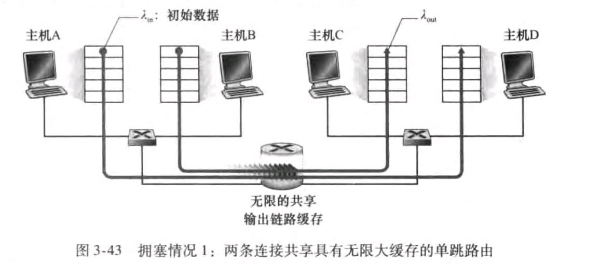

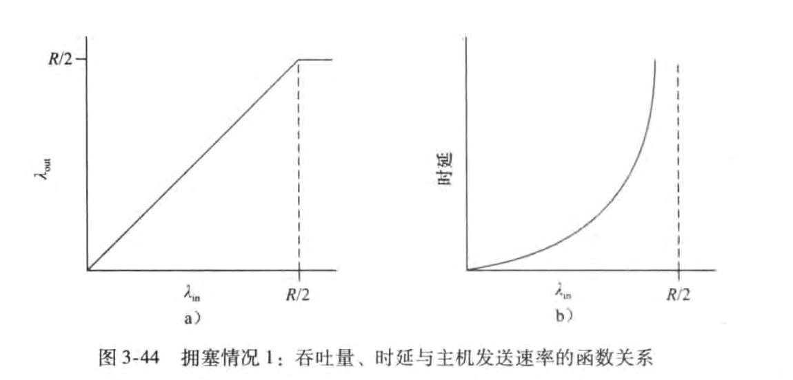

这里的时延为平均时延！虽然不丢失，但是缓冲区的大小越来越大，进而平均时延会趋向无穷。这里我们看到网络拥塞的代价——时延增大

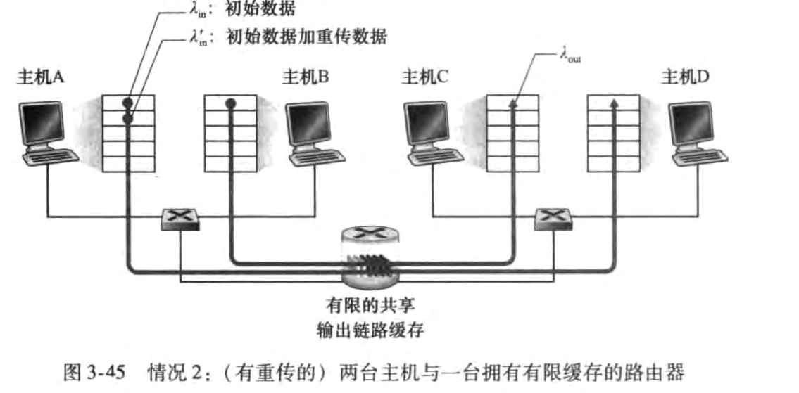

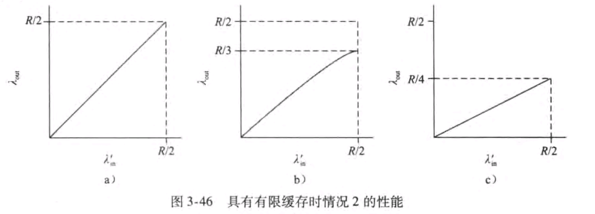

- a：客户端获知路由器的当前缓冲大小，只在缓冲空闲时传输
- b：客户端在确认分组丢失后，才会重传
- c：客户端可能过早超时重传，此时会有冗余的分组在传输。

这里我们看到网络拥塞的代价——发送方必须重传，从而浪费了链路资源

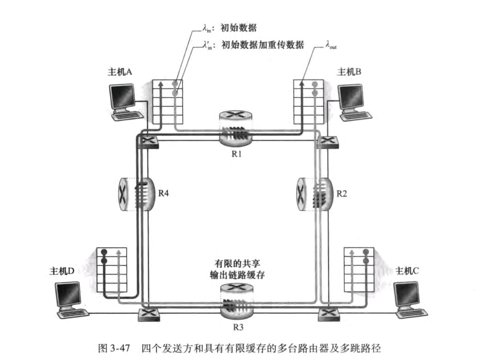

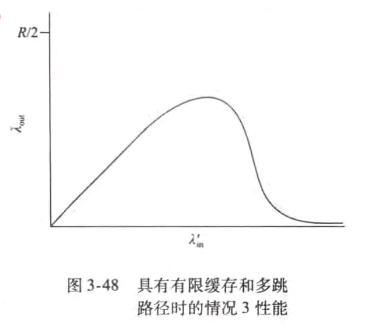

当路由器R1发送拥塞时，因为D的流量还要经过R4，所以A的流量比D的大。进而D的分组在这个路由器上大概率丢失。同理A的分组在R2上大概率丢失。而当分组被丢失时，浪费了上游节点的传输资源。整个网络会陷入瘫痪！

可以通过观察$\lambda_{in}$与$\lambda_{out}$的关系来判断网络是否发生了拥塞！

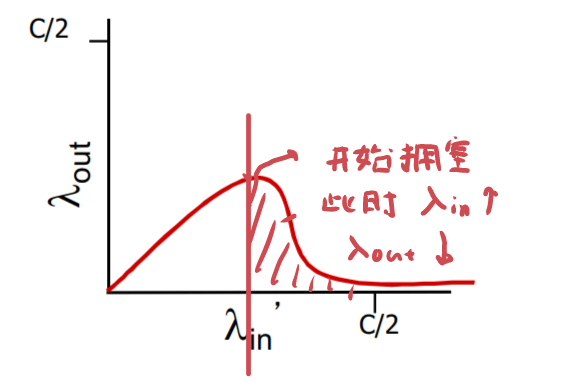

有两种拥塞控制的方法：

- 端到端的控制：没有来自网络的显式反馈，端系统根据延迟和丢失事件来推断拥塞是否发送
- 网络辅助的拥塞控制：路由器给端系统反馈信息

## 可靠数据传输原理 RDT

信道的不可靠性决定了RDT协议的复杂性！

RDT原理的一个简单模型：

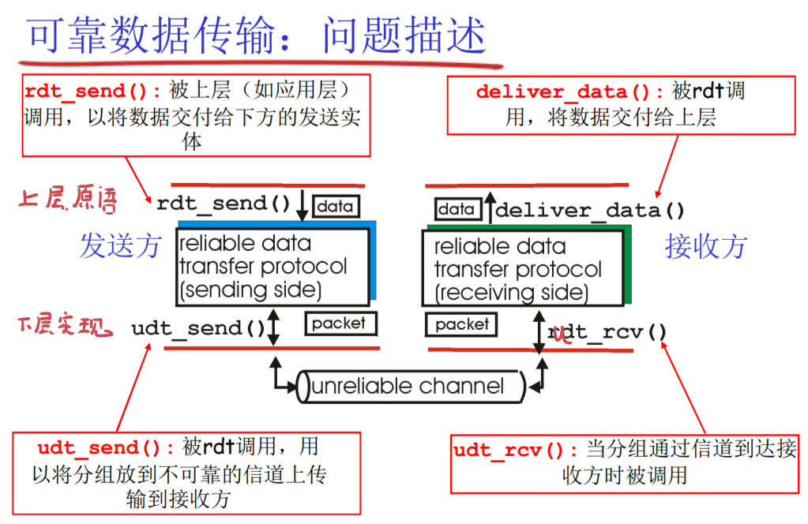

现在只考虑单向传输，而且RDT1.0 - RDT3.0均为停等协议

### RDT 1.0

基本假设：下层信道是完全可靠的

- 比特无差错
- 分组无丢失

状态机：

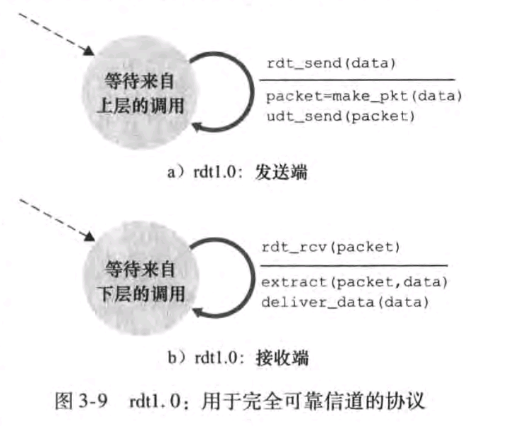

### RDT 2.0

基本假设：

- 比特可能出错
- 分组无丢失

新机制：

- 使用校验和进行差错检测
- 接收方发送控制报文（ACK、NAK）进行反馈
- 发送方接收到NAK后，进行重传

状态机：

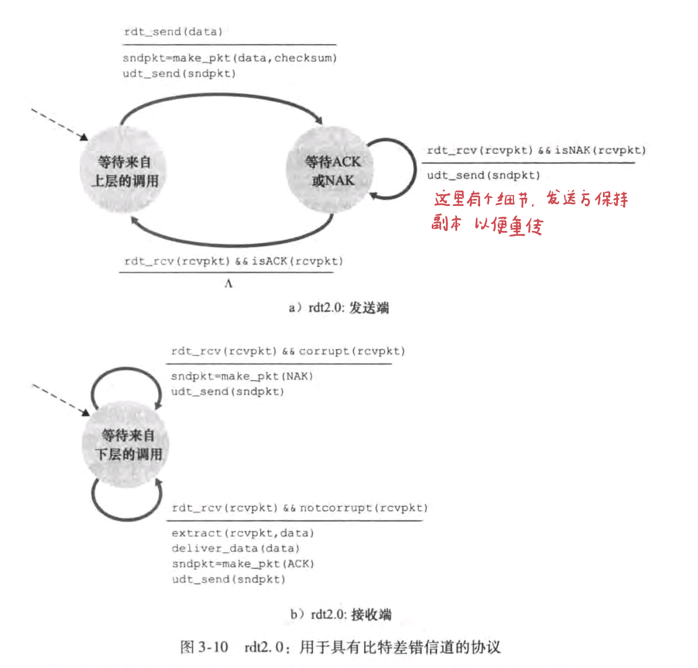

### RDT 2.1

RDT2.0没有考虑控制报文（ACK、NAK）出错的情况

因此RDT2.1对此进行改进：

- 引入序号（0，1）对发送报文进行标识。

为什么发送方不发送对ACK的确认，即确认的确认？因为这种行为不是完备的，即确认的确认仍有可能出错。

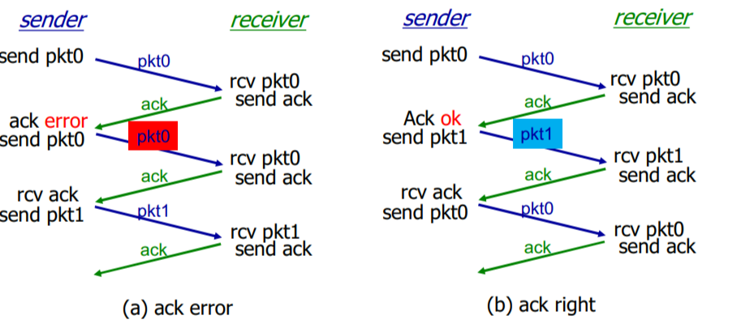

### RDT2.2

在RDT2.1基础上用序号（0，1）对ACK报文进行标识，抛弃NAK。这是因为ACK0的含义与NAK1的含义是相同的，即对最后一个正确接收的分组发送确认。**最为重要的一点是：为流水线协议做准备**

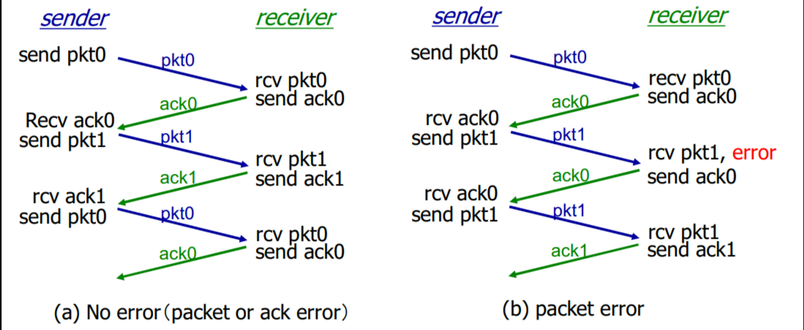

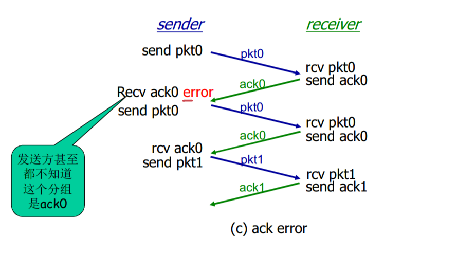

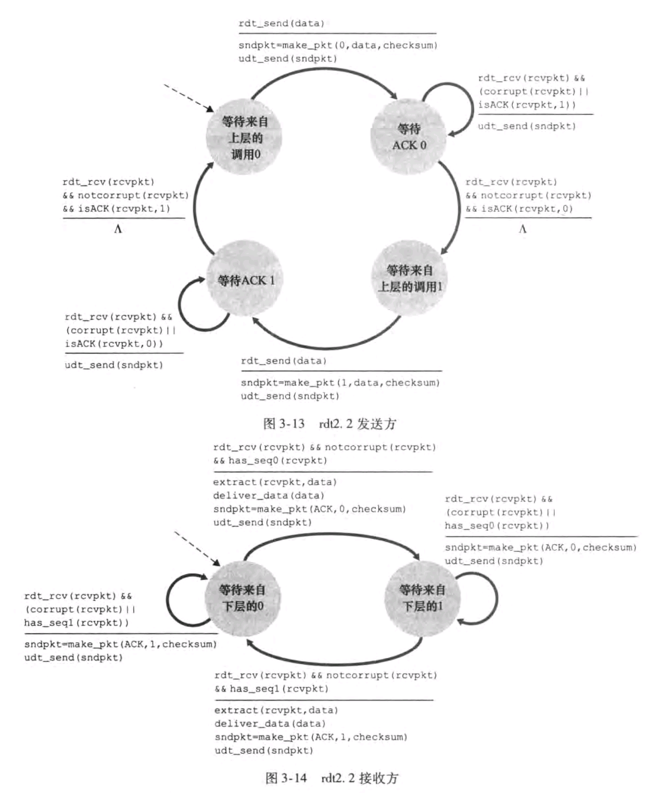

### RDT 3.0

基本假设：

- 比特可能出错
- 分组会丢失

新机制：

- 超时重传：无论是发送报文丢失，还是ACK丢失（可以将ACK出错、分组出错包括在里面）。只要发送方在一定时间内未收到ACK，则重传这一报文。这引入了冗余数据分组的可能性，但是序号机制可以解决这一问题。

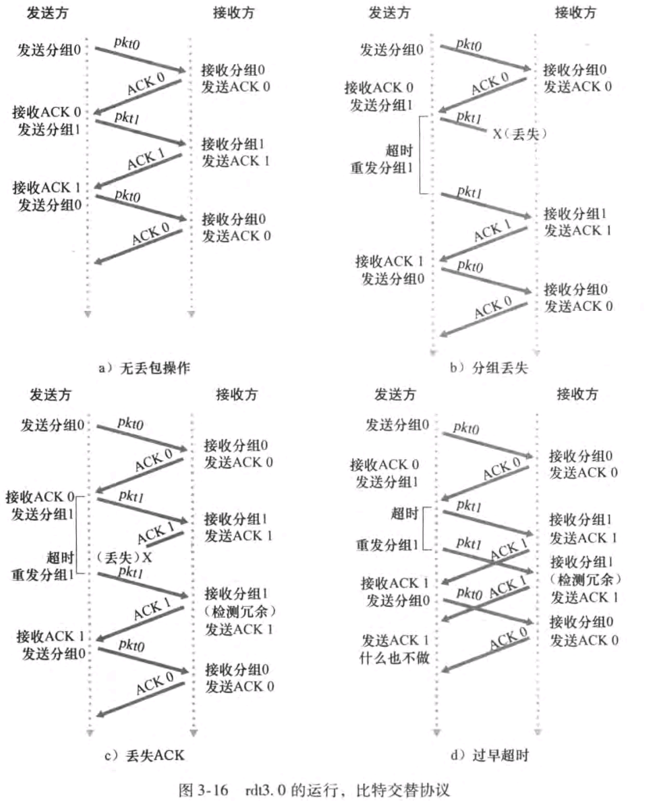

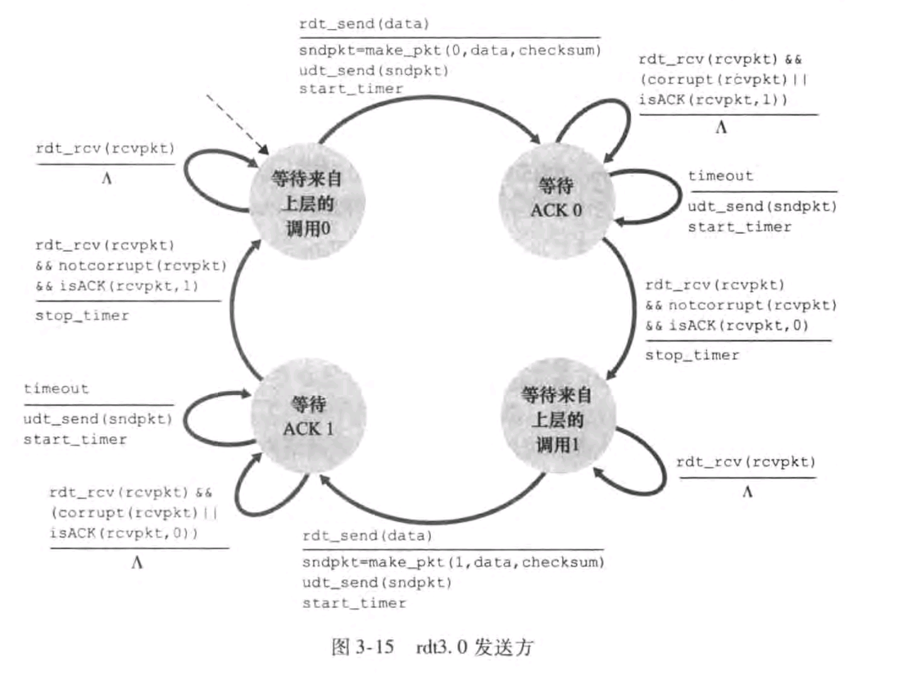

这里超时定时器如何设置呢？链路层与传输层的延迟分布如下：

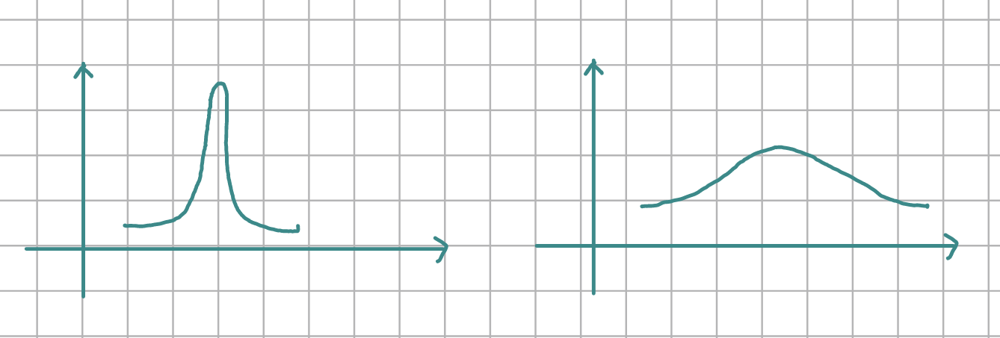

因此链路层的超时是确定的，而传输层的是适应性的，之后会介绍的。

###	GBN & SR（流水线协议）

rdt3.0能正常工作，但是在链路容量比较大的情况下，性能很差。瓶颈在于网络协议限制了物理资源的利用！

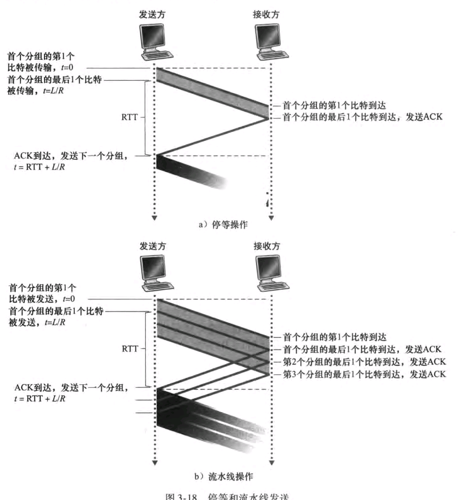

停等操作的利用率为$U_{sender}=\frac{L/R}{RTT+L/R}=0.00027$

采用流水线后，$U_{sender}=\frac{3L/R}{RTT+L/R}=0.008$

当利用率到达100%之后，瓶颈就是链路容量了

流水线协议有两种**GBN（Go Back N）**以及**SR（Selective Repeat）**。

GBN、SR的发送窗口是应用缓冲区的一个子集，它的大小（前沿减后沿）是不能超过该缓冲区的大小。

若接收窗口大小：

- =1：GBN
- \>1：SR

GBN与SR正常接收ACK

- GBN：累计确认，表明接收方正确接收到序号为n以前的以及包括n在内的所有分组
- SR：单独确认，表明正确接收到序号为n的分组

GBN与SR的超时重传机制：

- GBN：将整个发送窗口重发。

- SR：单独发送已超时的分组。

	> 理论上很简单。但在工程上，为每一个报文段维护一个定时器是十分消耗性能的工作

在空间大小为$2^{n}$下，对GBN与SR的要求

- GBN：$2^n-1$
- SR：$2^{n-1}$

GBN适用于出错率低的场景，它实现简单。而SR适用于链路容量大的场景，因为GBN在这种情景下出错代价太大。

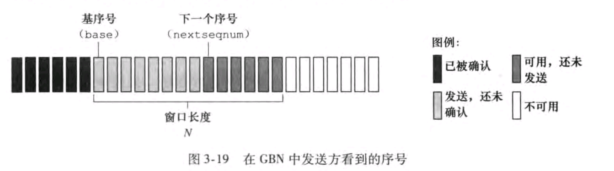

- base：最早未确认的序号
- nextseqnum：最小未使用的序号

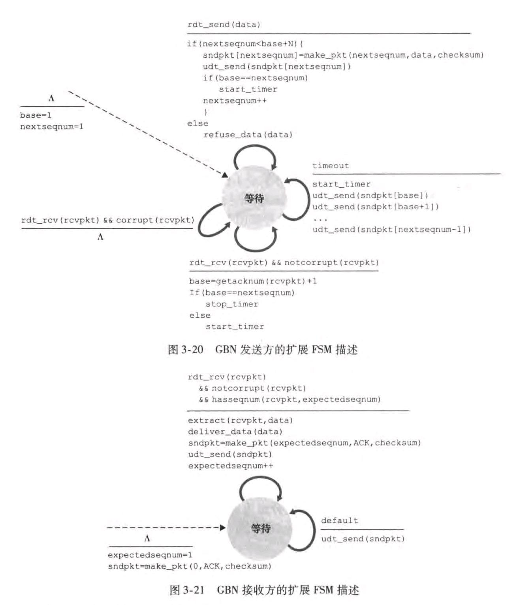

- 发送方只使用一个定时器，即最早发送但未被确认的分组所使用的定时器。如果接收到一个ACK，但仍有已发送但未被确认的分组，则重启定时器。否则关闭该定时器
- 如果序号为n的分组被正确的接收到，并且按序，那么接受方发送ACKn。在所有其他情况下，接收方丢弃该分组，并为最近按序接收的分组重新发送ACK。因此累计确认是GBN一个自然的选择。
- 在Go-Back-N协议中，如果接收方检测到接收到的分组出错（例如校验和错误），它将丢弃该分组并不发送ACK

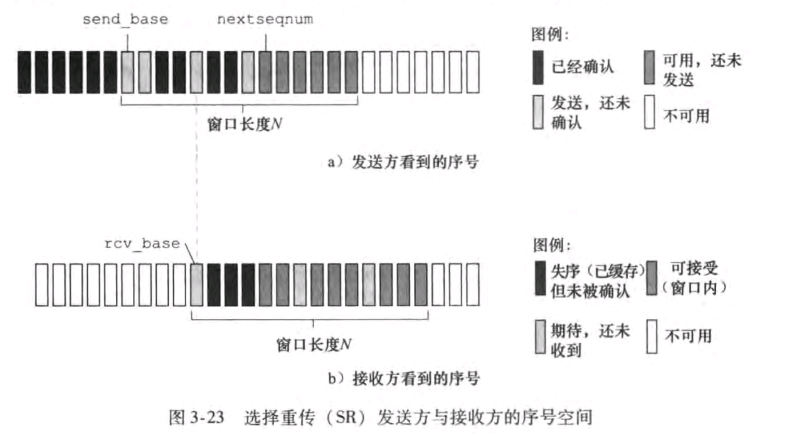

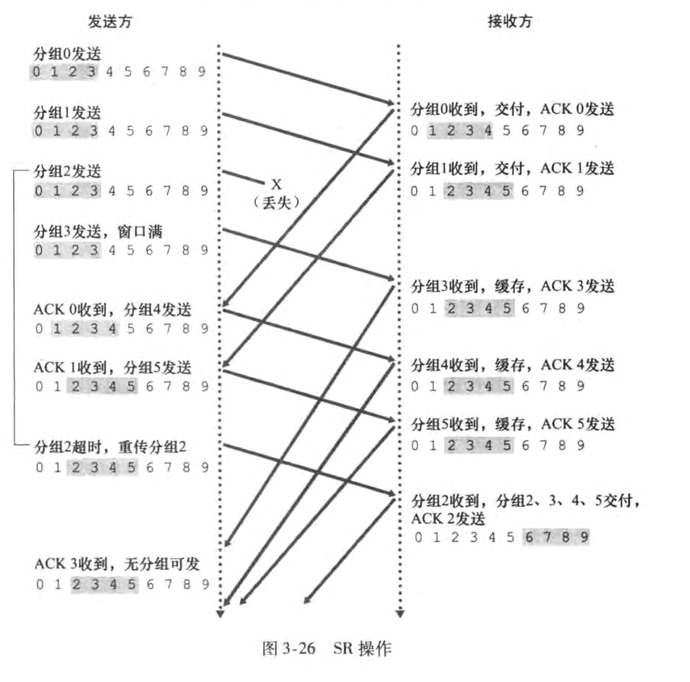

- 在SR协议中，如果接收方检测到接收到的分组出错（例如校验和错误），它将丢弃该分组并不发送ACK
- 如果序号在$[base - N,base + N -1]$的分组被正确的接收到，那么接受方发送ACK。其他情况忽略该分组。

总结一下可靠数据传输所需的机制：定时器、校验和、序号、确认与否定确认、窗口、流水线。

## UDP（User Datagram Protocol） 

`UDP RFC[768]`

在“尽力而为”的IP服务上，并没有添加更多的服务，而仅仅实现了多路复用。

UDP存在的必要性：

- 无需建立连接，适合事务性应用，无需会话状态的维护
- 不做可靠性工作，适合实时性要求较高的应用
- 没有拥塞控制和流量控制，应用能够按照设定的速度发送数据。而TCP上的应用，应用发送数据的速度与主机向网络发送的速度不一致。

~~~
                            |<-          32bit          ->|
                            +--------------+--------------+
                            |   源端口号    |   目的端口号  |
                            +--------------+--------------+
                            |    长度      |     校验和    |
                            +--------------+--------------+
                            |                             |
                            |         应用进程数据         |
                            |                             |
                            +--------------+--------------+
~~~

- 长度是整个报文段的长度

- 校验和计算：除校验和外，其他部分按16bit依次相加。最高位进位按回卷处理。最后取反码填入校验和中。

	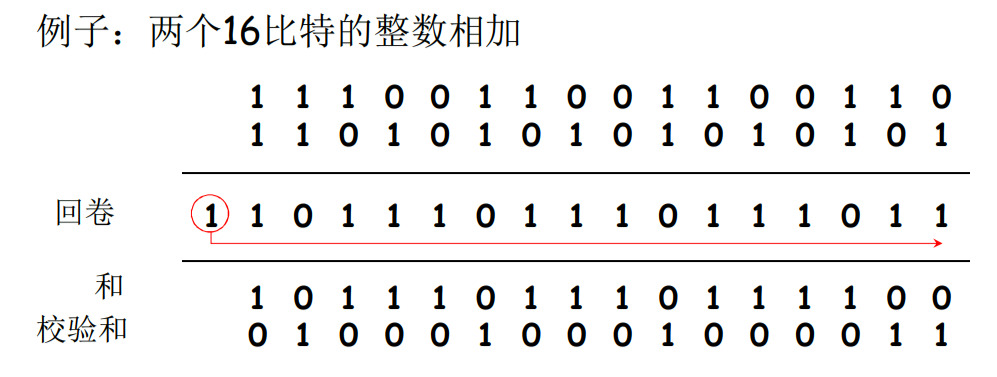
	
	在目标端中，校验范围 + 校验和 = 1111111111111111，则通过校验。否则该数据包将被丢弃，而且目标设备不会发送任何确认或错误消息。

## TCP （Transmission Control Protocol）

在TCP规范`[RFC793]`中，有一段叙述：“TCP应该在它方便的时候以报文段的形式发送数据”。这也就表明**使用TCP服务的应用层协议必须自己维护报文边界**。而TCP数据部分的大小上限为**最大报文段长度（Maximum Segment Size，MSS）**。而MSS计算如下：
$$
MSS = MTU - IP头部长度 - TCP头部长度
$$
其中，`MTU`是链路层（如以太网）的**最大传输单元（Maximum Transmission 。Unit）**此外，IP头部以及TCP头部有选项部分，因此MSS会动态调整的。

> - 在以太网等网络中，MTU包括数据帧的头部、有效载荷和帧尾。MTU的最大值为1518字节，其中包括数据帧的头部14字节、有效载荷最大为1500字节和数据帧的尾部4字节。
>
> - 在其他类型的网络中（例如PPP），MTU可能只包括有效载荷部分，不包括帧头和帧尾。
>
> - 在更高层次的网络协议中（例如TCP/IP协议中的IP层），MTU指的是IP数据报的最大长度（1500）。
>
> 注：以上由ChatGPT提供

### 报文格式

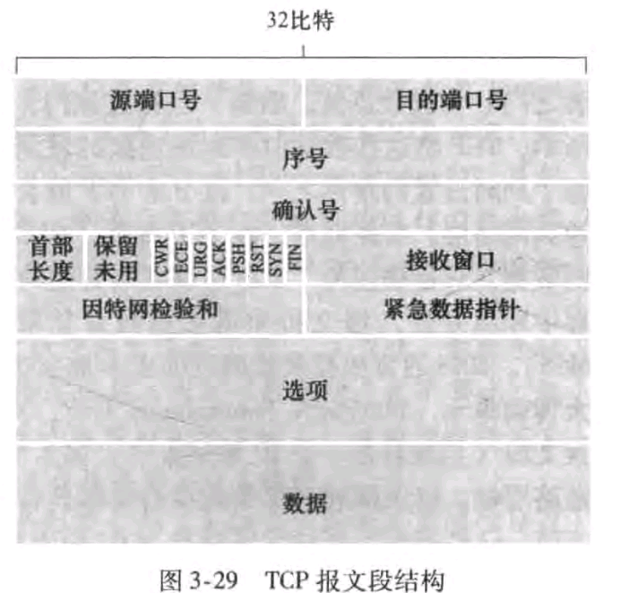

- 序号与确认号是对字节编号，而不是对报文段的编号
- 首部长度（4bit）：以32bit为单位的TCP首部长度
- ACK表明确认号字段是有效的；RST、SYN、FIN用于TCP连接管理；CWR、ECE用于拥塞控制；PSH、URG、紧急数据指针字段在实践中并没有使用。

### 定时器的设置

$SampleRTT$：测量从报文段发出到收到确认的时间

$EstimatedRTT = (1-a)*EstimatedRTT +a*SampleRTT$，EstimatedRTT是SampleRTT的加权平均值，因为过去样本的影响是呈指数衰减的，所以在统计学上，这种平均称为**指数加权移动平均（Exponential Weighted Moving Average）**，推荐$a=0.125$。

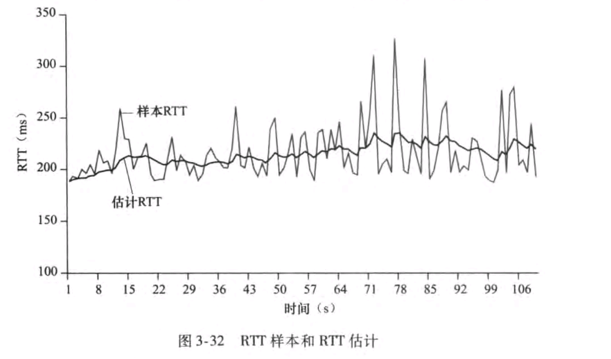

$DevRTT=(1-b)*DevRTT + b*|SampleTRTT-EstimatedRTT|$，用于估算SampleRTT偏移EstimatedRTT的平均程度，推荐$b=0.25$

那么超时时间间隔设置为：$TimeooutInterval=EstimatedRTT+4*DevRTT$

### RDT

TCP看起来很像SR协议，但是差错恢复机制为GBN与SR协议的混合体：

- 引入**冗余确认机制**。再接收到ACKN后，然后**累计**接收到三次ACKN后，会立即重传该报文段。因为从概率上来讲，该报文大概率已经丢失。如果此时还要等待超时重传，那么性能会严重受损。

  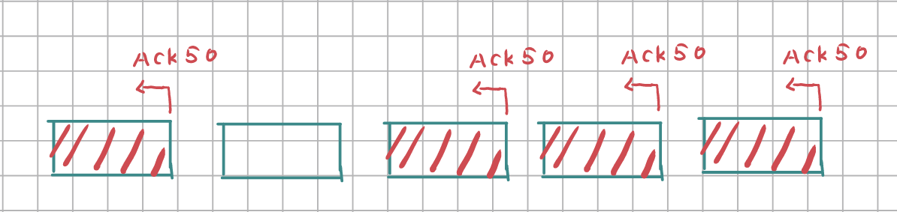

  ·

- 并没有规定接收方如何处理乱序的报文段，既可以缓存下来，而可以直接抛弃。出于性能考虑，基本上是缓存下来。严格来说，因为采取的累计确认机制，所以TCP接收缓存并不等价于接收窗口 > 1的情况。

- 超时重传时，只重传发送窗口中第一个报文段，而不是将整个发送窗口重传。因为接收方可能做了缓存处理。因此只需维护一个定时器（RFC6298所建议的单一定时器），性能负担较少。

### 流量控制 

防止接收方缓存区溢出（应用处理数据的速率与接收数据的速率不匹配），而限制发送方的发送。

现在考虑这样一个情景：主机A向主机B发送一个大文件。我们定义以下变量：

- LastByteRead：主机B从缓存中读出的最后一个字节的序号
- LastByteRevd：在缓存中数据流的最后一个字节的序号

由于不允许溢出：缓冲区的大小RevBuffer必须满足：
$$
RevBuffer \geq LastByteRevd - LastByteRead
$$
那么rwnd = RcvBuffer - (LastByteRevd - LastByteRead)

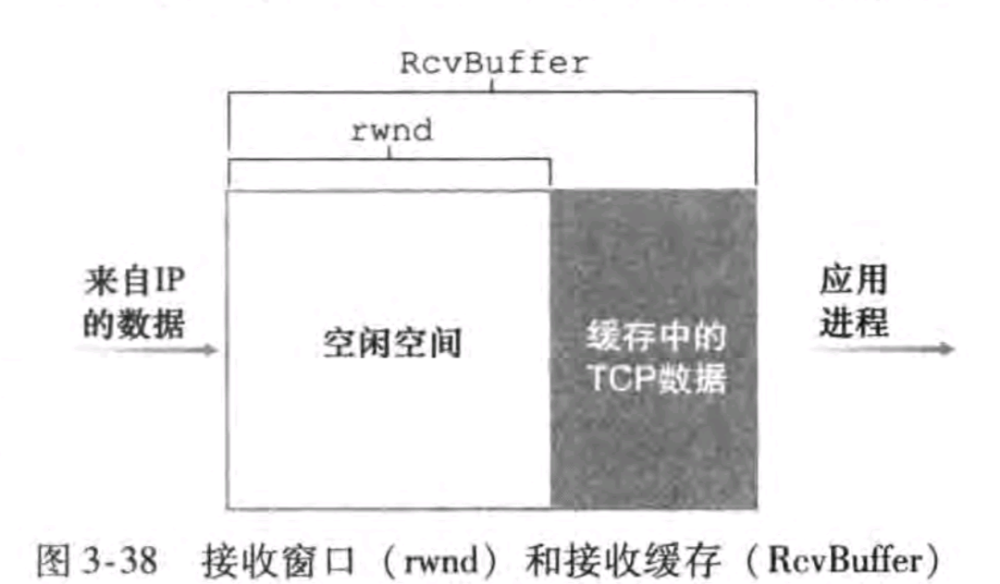

主机B向主机A发送报文段时，将接收窗口字段设置为rwnd。那么主机A必须要满足
$$
LastByteSent - LastByteAcked \leq rwnd
$$

如果rwnd=0，而且主机B并没有数据要给A发送，那么主机B并不会向A发送带有新rwnd的报文段。这就使得主机A被阻塞而不能再次发送数据。为了解决这个问题，TCP规范中要求：当主机B的接收窗口为0时，主机A继续发送只有一个字节数据的报文段。这使得主机B必须给A发送一个确认报文，而在确认报文中就有新的rwnd

> 注意：UDP并不提供流量控制，因此可能缓冲区溢出而丢失报文段。

### 连接管理

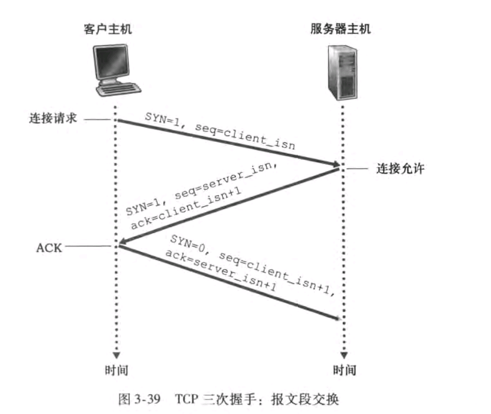

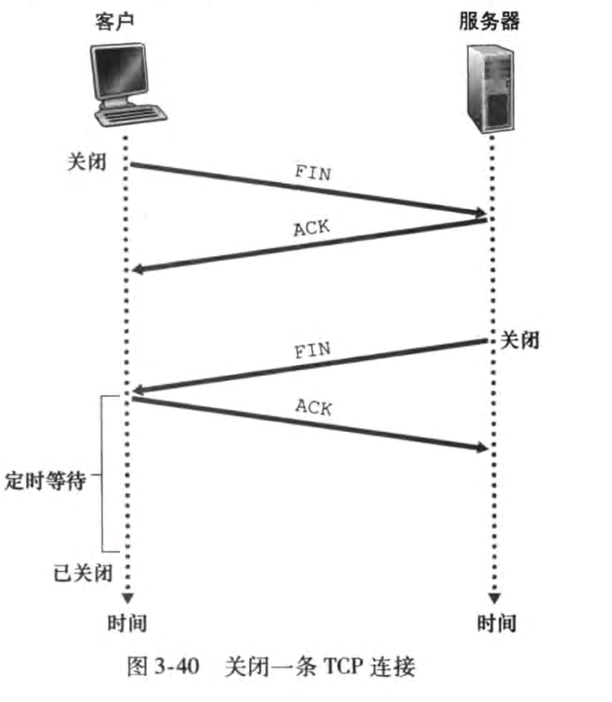

在第三次握手时，可以**捎带**数据。

为什么每次建立 TCP 连接时，初始化的序列号都要求不一样呢？

- 防止上一个连接的报文被下一个相同四元组的连接接收。
- 为了防止数据在网络中被篡改，TCP协议采用了一种加密算法，该算法需要用到一个参数，即随机的初始序列号（Initial Sequence Number，ISN）。

为什么要有`TIME_WAIT`状态：

- 为了实现TCP全双工连接的可靠释放。假设主动关闭一方（Client）最后发送的ACK丢失，那么Server会重传FIN报文段。因此Client必须维持这条连接的状态，不会立即释放掉通信资源。
- 消耗在网络中的报文段。保证数据的可靠传输。

根据RFC 793中的规定，建议TIME_WAIT时间为2倍的MSL。MSL指的是一个TCP报文段在网络中最长的生存时间，一般是2分钟左右。具体实现中可能为30秒，1分钟，2分钟。

### 拥塞控制

TCP发送端如何检测到拥塞发生：

- 超时重传：网络大概率发生拥塞，还有一定概率是由于信道不可靠使分组出错。
- 累计3个重复的ACK：轻微拥塞

记拥塞窗口的大小为$cwnd$（以字节数计），则
$$
LastByteSent - LastByteAcked \leq min\{cwnd, rwnd\}
$$
TCP有很多拥塞控制算法，这里介绍最经典的算法AIMD

TCP拥塞控制算法**AIMD（Additive-Increase，Multiplicative-Decrease）**[RFC5681]主要包括：

- 慢启动
- 拥塞避免
- 快速恢复：早期TCP Tahoe版本并没有实现这一部分，故无论是超时还是快速重传（三次冗余ACK），一律慢启动。而最新的TCP Reno版本实现了快速恢复。

其中慢启动与拥塞避免是该算法不可或缺的一部分，而快速恢复时推荐部分，可以不用实现。

慢启动：当TCP连接刚开始时，cwnd（以字节数计）设置为`MSS`（RFC3390），阈值$ssthresh$设置为某个初始值。每当收到n个字节的确认时，cwnd增加n。这等价于每过一个RTT，cwnd就会翻倍，呈指数级别增加。

拥塞避免：当cwnd大于阈值时。每过一个RTT，cwnd（以字节数计）就会增加MSS个字节。注意：如果在慢启动阶段cwnd翻倍后大于ssthresh，那么可以将cwnd设置为ssthresh。

如果出现超时，那么阈值$ssthresh = cwnd / 2$，$cwnd= 1$，进入慢启动状态

如果累计3个重复的ACK，那么阈值$ssthresh = cwnd / 2$，$cwnd= ssthresh +3$。这里`+3`只是为了“快速恢复”，即可以在此期间，拥塞窗口的大小仍然足够大，以充分利用可用的带宽。

状态机如下：

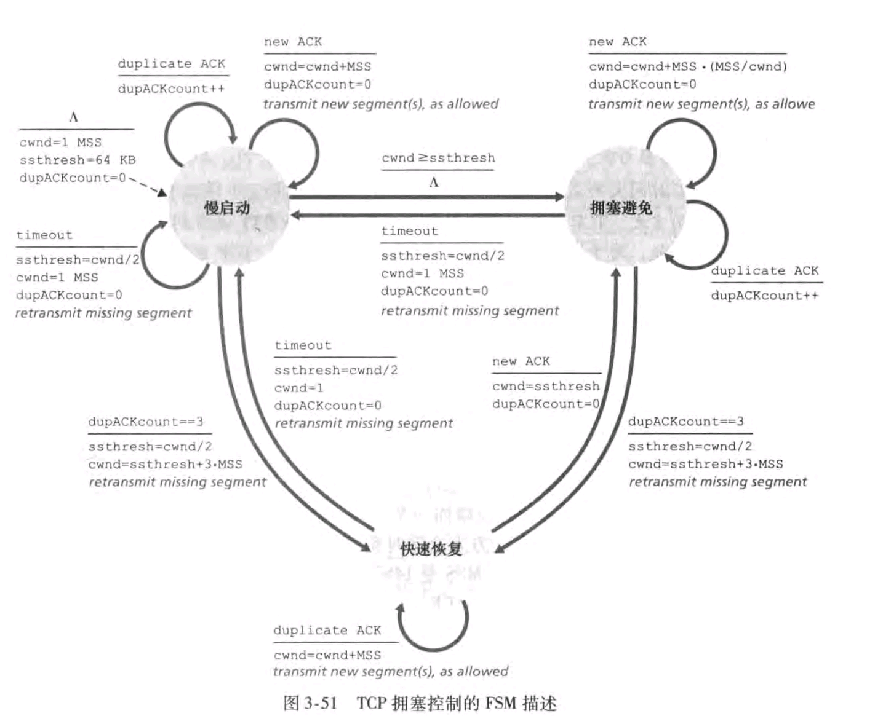

有无快速重传的区别：

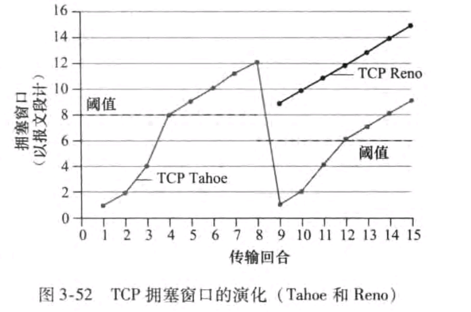

> 之前介绍的都是端到端拥塞控制，还有网络显式拥塞控制，在IP头部的ToS（Type of Service）字段中有ECN标志位（ECT、CE）。当路由器判定网络拥塞时，设置ECN位。接收端在ACK报文中设置TCP头部的ECE标志位，以告知发送端拥塞发送。
>
> 在某些情况下，在缓存溢出前丢弃一个分组的做法会很有用，这会向发送方发送一个拥塞信号。这种策略被称为**主动队列管理（Active Queue Management）**。**随机早期检测（Random Early Detection）**算法是最广泛研究的AQM算法之一

### TCP吞吐量、公平性以及发展

在AIMD中，TCP的吞吐量具有锯齿行为（忽略慢启动阶段，因为发送方很快以指数增长方式离开该阶段）

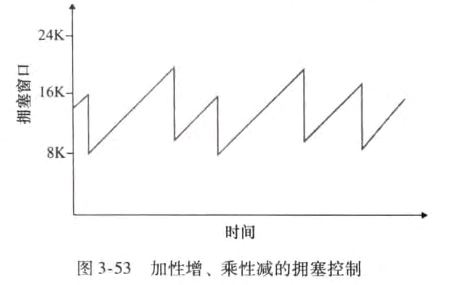

这里给出一个高度简化的稳态动态性模型（$W/(2*RTT)\to W/RTT$）来计算一条连接的平均吞吐量：$\frac{0.75 W}{RTT}$，以及一条连接的平均吞吐量与丢包率$L$的关系：$\frac{1.22\times MSS}{RTT\sqrt{L}}$。在高带宽链路中（例如10Gbps下100ms的RTT以及MSS=1500字节），如果TCP要获取高吞吐量，那么它的错误率低于$2\times10^{-10}$。这比物理链路的错误率低很多！所以有必要改进TCP协议以应对高带宽的挑战！

TCP是公平的，下面看在AIMD算法下，TCP是如何为两个用户**公平地**分配链路资源的：

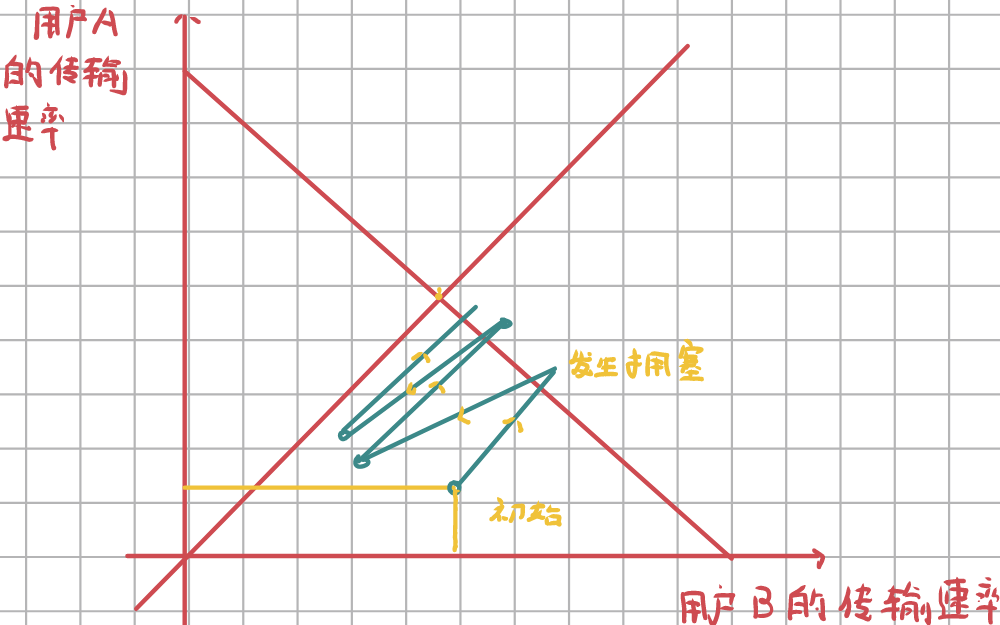

对于公平性的冲击：

- UDP的大量使用
- 一个应用可以并行维护多个TCP连接

