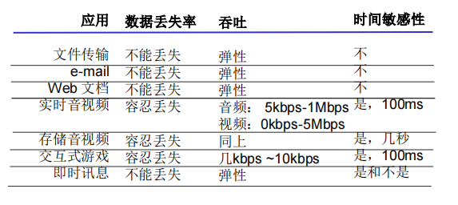

# 计算机网络 应用层

[TOC]

## 应用层协议原理

网络应用的例子：即时通信、网络游戏、流媒体、实时会议与社交。这些应用都是用相应的应用层协议，有些是公开协议，有些是私有协议（例如，微软的Skype所使用的协议）

> 注意：在网络核心中，并没有应用层。

网络应用的通信模式：**客户-服务器模式**、**对等模式**、**混合**。其中混合模式的例子：

- Napster
	- 文件搜索：C/S。主机向服务器注册自己拥有的文件资源，并向服务器查询所需文件的位置。
	- 文件传输：P2P
- 即时通信
	- 在线检测：C/S。当用户上线时，向服务器注册其IP地址，并获取其他好友的IP地址。
	- 两个用户聊天：P2P

对进程进行编址，即SAP：

- IP地址：区分不同主机
- TCP、UDP
- 端口号：区分同一个主机上的不同进程

> 注意：TCP、UDP都用各自的端口号

TCP socket是**四元组(源IP，源port，目标IP，目标port)**的**本地标识**，用文件描述符（Linux）或句柄（Window）表示。其中本地意味着目标主机并不知道源主机上的TCP socket。而UDP socket是二元组（源IP，源port）的本地表示。

socket使操作系统可以统一管理这些通信对象。

在同一个主机内，进程间通信使用操作系统提供的进程通信机制，例如管道、共享内存、本地Socket等。

- Client进程：发起通信的进程
- Server进程：等待连接的进程

> 注意：P2P架构的应用也有客户端进程与服务器进程之分

衡量传输层服务的指标：数据丢失率、延迟、吞吐与安全性。常见应用对传输服务的要求：

TCP服务：可靠的、流量控制、拥塞控制、面向连接。

UDP服务：不可靠的。

> 注意：有些流媒体使用TCP传输协议，这是因为有些运营商会过滤掉UDP。

UDP存在的必要性：

- 无需建立连接，适合事务性应用
- 不做可靠性工作，适合实时性要求较高的应用
- 没有拥塞控制和流量控制，应用能够按照设定的速度发送数据。而TCP上的应用，应用发送数据的速度与主机向网络发送的速度不一致。

TCP与UDP都不提供安全机制。SSL在TCP上面实现，为应用层提供加密的TCP连接。

## HTTP

通过URL访问Web对象，URL格式如下：
$$

$$

## FTP、Email

## DNS

## P2P

## CDN

## Socket API

### TCP

### UDP

