# 计算机网络 应用层

[TOC]

## 应用层协议原理

网络应用的例子：即时通信、网络游戏、流媒体、实时会议与社交。这些应用都是用相应的应用层协议，有些是公开协议，有些是私有协议（例如，微软的`Skype`所使用的协议）。

> 注意：在网络核心中，并没有应用层。


网络应用的通信模式：**客户-服务器模式**、**对等模式**、**混合**。其中混合模式的例子：

- `Napster`
	- 文件搜索：C/S。主机向服务器注册自己拥有的文件资源，并向服务器查询所需文件的位置。
	- 文件传输：P2P
- 即时通信
	- 在线检测：C/S。当用户上线时，向服务器注册其IP地址，并获取其他好友的IP地址。
	- 两个用户聊天：P2P

而C/S体系结构的可扩展性差：


 进程通信需要解决的问题：
- 进程寻址问题：

	- IP地址：标识不同主机
	- 协议：TCP、UDP有各自的端口号空间
	- 端口号：标识不同进程

- 传输层是如何提供的服务

	- 位置：SAP（TCP/IP：socket）：TCP socket是**四元组(源IP，源port，目标IP，目标port)**的**本地标识**，用文件描述符（Linux）或句柄（Window）表示。其中本地意味着目标主机并不知道源主机上的TCP socket。而UDP socket是**二元组（源IP，源port）**的本地表示。socket使操作系统可以统一管理这些通信对象。
	- 形式：Socket API

- 如何使用传输层提供的服务来实现应用：

	- 直接调用TCP或UDP的Socket API来定义或实现应用层协议

	- 使用框架或库函数中封装好的接口，直接使用应用层的协议。例如Javascript中的fetch，Servlet框架中的HttpServlet类

		~~~java
		@WebServlet(name = "", value = "")	
		public class servletXXX extends HttpServlet {
			@Override
		    protected void service(HttpServletRequest req, HttpServeltResponse resp) {
		    }
		}
		~~~

		

在同一个主机内，进程间通信使用操作系统提供的进程通信机制，例如管道、共享内存、本地Socket等。而不同主机间的通信需要使用协议！

- Client进程：发起通信的进程
- Server进程：等待连接的进程

> 注意：P2P架构的应用也有客户端进程与服务器进程之分


衡量传输层服务的指标：数据丢失率、延迟、吞吐与安全性。常见应用对传输服务的要求：

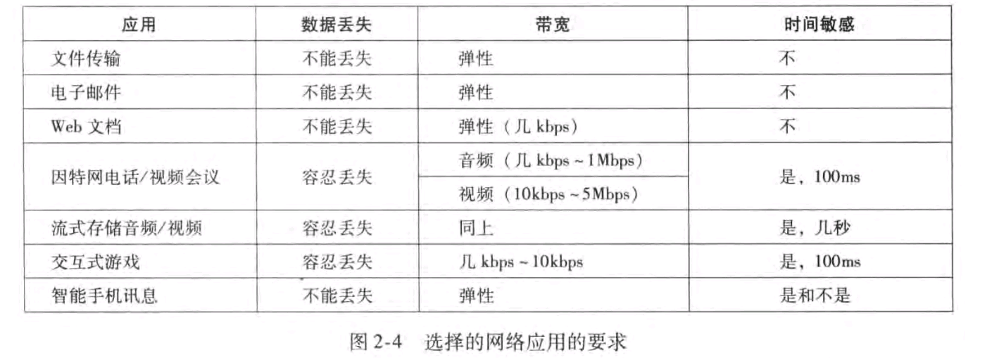

TCP服务：可靠的且保序、流量控制、拥塞控制、面向连接。

UDP服务：无连接、不可靠且乱序。


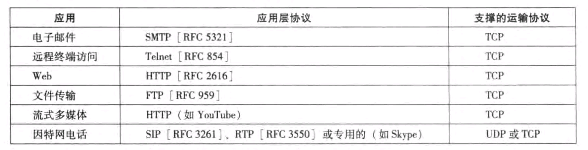

> 注意：有些流媒体仍然使用TCP传输协议，这是因为有些运营商的防火墙会过滤掉UDP。


UDP存在的必要性：

- 无需建立连接，适合事务性应用，无需会话状态的维护
- 不做可靠性工作，适合实时性要求较高的应用
- 没有拥塞控制和流量控制，应用能够按照设定的速度发送数据。而TCP上的应用，应用发送数据的速度与主机向网络发送的速度不一致。


TCP与UDP都不提供安全机制。SSL在TCP上面实现，为应用层提供加密的TCP连接。


## HTTP

Web对象包括：HTML文件、图像、音视频、Java小程序等

通过URL访问Web对象，URL格式如下：

```
https://www.example.com:80/path/to/myfile.html?key1=value1&key2=value2#SomewhereInTheDocument
```

- 协议（http、https）：https://

- 域名：[www.example.com](http://www.example.com/)

- 端口：80

- 资源路径：/path/to/myfile.html

- 额外参数：?key1=value1&key2=value2。

	```html
	 <a href="/23638727/favlist?fid=1802813327&ftype=create"> </a>		<!--手动填充-->
	 
	<form action="/23638727/favlist" method="get">								<!--form自动从input向URL添加参数-->
	     <input name="username" />
	     <input name="password" />
	 </form>
	```

- 资源的锚点：#SomewhereInTheDocument


Web采用**超文本传输协议（HyperText Transfer Protocol，HTTP）**


HTTP是无状态的，即服务器不维护有关客户的任何信息。

> 维护状态的协议实现起来很复杂的，涉及到一致性问题，维护历史信息等。在相同配置下，无状态服务器能够支持更多的客户端。

Cookie技术解决了这一问题：在HTTP报文中溴代状态信息，Set-cookie（响应）或cookie（请求）字段。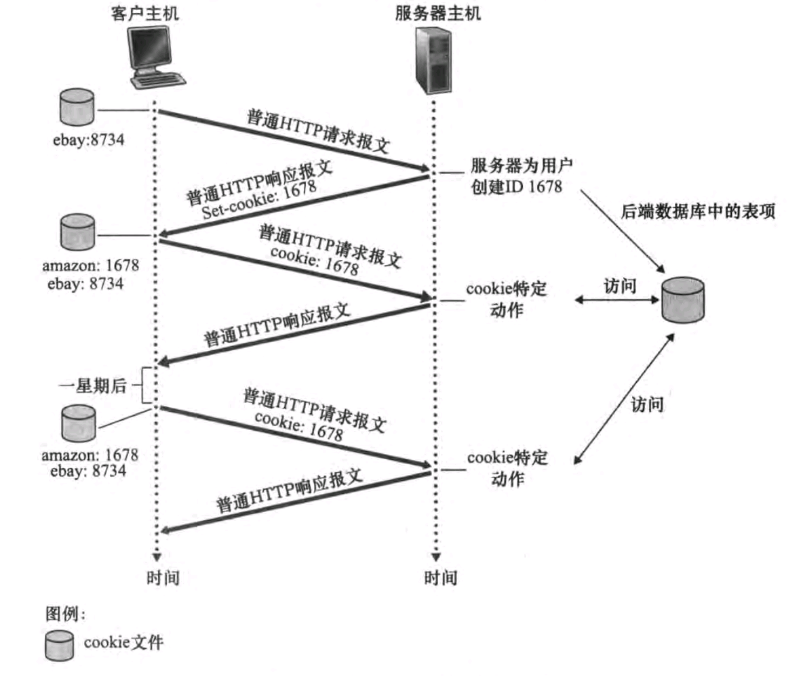

> 将Cookie数据放在内存中也是可以的


HTTP1.0协议使用了**非持久HTTP**，最多只有一个对象在一条TCP连接上传输，传输完毕这一个对象后关闭此TCP连接。而HTTP1.1默认使用**持久HTTP**（Connection: keep-alive），即多个对象可以在一条TCP连接上传输。

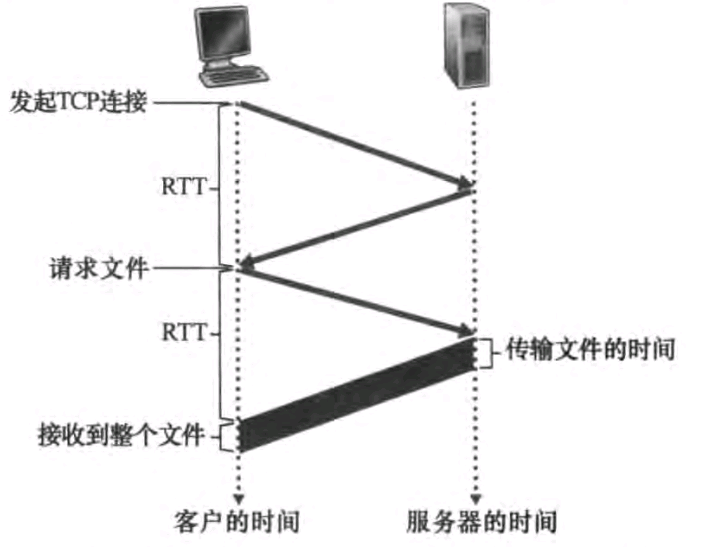

在第三次握手的同时，将请求一并发出。


持久HTTP进一步划分为：

- 非流水线：客户端在接收到一个响应后才能发送新的请求。
- 流水线：可以在一个连接中发送多个请求，收到请求的服务器必须按照请求收到的顺序发送响应（注意是双工信道）。HTTP 1.1流水线方式的实现存在一些问题，例如在请求队列中有一个失败的请求会阻塞后续的请求。因此，在大多数情况下即使浏览器支持流水线方式，也不一定会默认开启它。


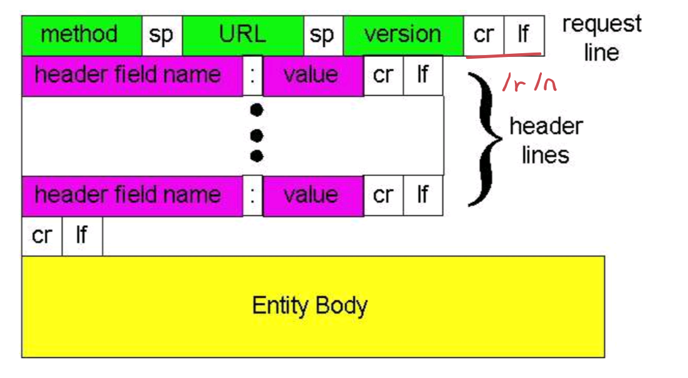

HTTP请求报文的通用格式：请求行、首部行、body（可选）。其中请求行中的方法有：GET、POST、HEAD（获取HTML文件的头部部分，通常用在搜索引擎的爬虫中）、PUT、DELETE

HTTP响应报文与请求报文类似：状态行、首部行、body。其中请求行中的状态码有：200 OK、404 Not Found等


- POST是非幂等的，POST方法适用于提交表单数据，上传文件等需要向服务器提交数据的场景；而PUT方法是幂等的，适用于对已有资源进行更新或者替换的场景。

	> 在计算机科学中，**幂等（Idempotence）**是指一个操作的多次执行所产生的影响相同。举例来说，HTTP请求方法中的GET和PUT方法就是幂等的，而POST方法则不是。GET方法是只读的，它只是从服务器上获取资源的状态，不会对资源状态造成任何修改。PUT方法用于向服务器上传资源，并替换原有的资源，多次执行PUT方法的结果相同，因为每次执行都是将相同的数据放到相同的位置上。而POST方法用于向服务器提交数据，多次执行POST方法可能会创建多个资源，因此不是幂等的。
	>
	> 在设计分布式系统中，幂等性也是一个重要的概念，因为在分布式系统中，操作的执行可能会失败或者超时，而在重试时，需要保证操作是幂等的，这样才能避免对系统造成不必要的影响。

- 要在以ASCII表示的HTTP1.1中传输一个二进制文件，要设置

	1. Content-Type：指定传输的文件类型。常见的类型有image/jpeg、image/png、audio/mpeg、video/mp4等。
	2. Content-Length（不包括头部大小）：指定传输的文件大小，以字节为单位。
	3. Content-Disposition：指定浏览器对文件的处理方式，包括下载、打开或者内嵌在页面中等。

	例如，要传输一个名为example.png的PNG图片文件，可以使用以下HTTP请求：

	~~~
	GET /example.png HTTP/1.1
	Host: example.com
	Content-Type: image/png
	Content-Length: 12345
	Content-Disposition: attachment; filename="example.png"
	~~~

	~~~
	HTTP/1.1 200 OK
	Content-Type: image/png
	Content-Length: 12345
	Content-Disposition: attachment; filename="example.png"
	
	[Binary data of the PNG image file]
	~~~

- Content-Length头部字段用于指定HTTP报文主体的长度，这个值不包括HTTP报文头部的长度。

- HTTP是使用TCP服务的，而TCP只传输字节流，因此HTTP协议要自己维护报文之间的界限。


Web缓存是指将已经访问过的Web页面或文件保存在一个中间站点（即缓存）中，以便当同一用户或其他用户再次请求相同的页面或文件时，可以更快速地获取这些内容，而不必从原始服务器上再次下载或检索。Web缓存能够加速页面加载速度，减少网络流量，提高了整个网络系统的性能和可用性。常见的Web缓存包括浏览器缓存、代理服务器缓存和内容分发网络（CDN）缓存。

解决缓存与服务器的一致性问题：

- 缓存更新：在服务器上更新了网页或文件后，可以通知缓存服务器相应的更新，以便缓存服务器能够将新内容存储到缓存中，并删除旧的内容。

	常用的方法包括使用HTTP协议的缓存控制头（如Cache-Control和ETag）来控制缓存的更新和过期时间

- 主动刷新：缓存服务器可以定期或按需请求服务器上的内容，并将其更新到缓存中。这种方式可以确保缓存中的内容与服务器上的内容同步，但也会增加服务器的负担和网络带宽的消耗。

	常用方法是使用**条件GET**方法：代理服务器向服务器发送的请求中包含一个或多个条件，如`If-Modified-Since、If-None-Match`等请求头，服务器会比较这些条件和资源的相关信息，以决定是否需要返回更新后的资源。如果服务器发现资源没有更新，它将返回一个304 Not Modified状态码，表示客户端可以继续使用本地缓存中的资源。

	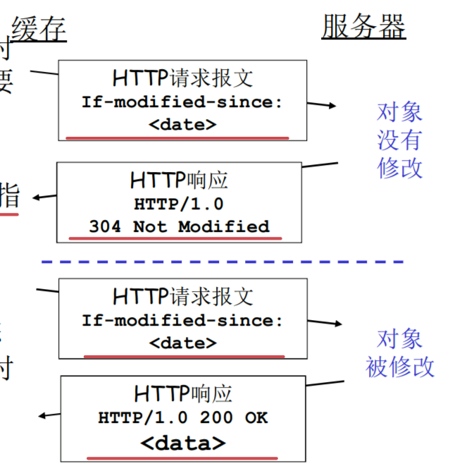


## FTP

FTP客户端通过TCP协议连接到FTP服务器的默认端口21。

FTP命令格式：`命令 参数1 参数2 ...`

FTP响应格式：`3位数字 空格 消息`

命令有：

- USER：登录FTP服务器、

- RETR：下载文件等。

3位数字就是HTTP中的状态码


近年来出现了一些新的文件传输协议，如SCP、SFTP、FTPS等，来弥补FTP协议的一些缺点（数据加密、传输速度等）

## Email

Email系统包括三部分：**用户代理（Gmail、outlook等）**、**邮件服务器**、**简单邮件传输协议（SMTP）**。

简单邮件传输协议的格式如下：

- `命令 参数1 参数2 ...`，命令有HELO：向SMTP服务器标识客户端身份，需要传递客户端的域名。MAIL FROM：指定发件人地址。RCPT TO：指定收件人地址。DATA：开始发送邮件数据，包括邮件内容和附件。QUIT：结束SMTP会话并关闭连接。
- `3位数字 空格 消息`，3位数字就是HTTP中的状态码


SMTP在80年代设计出，它用7位的ASCII表示。如果想要同时传输文本以及二进制文件，那么采用Base64等编码并且按照以下例子来设置相应的字段

~~~
From: sender@example.com
To: recipient@example.com
Subject: Test email with multipart content

MIME-Version: 1.0
Content-Type: multipart/mixed; boundary=boundary-example

--boundary-example
Content-Type: text/plain; charset=us-ascii

This is the text part of the email.

--boundary-example
Content-Type: image/jpeg
Content-Transfer-Encoding: base64
Content-Disposition: attachment; filename="example.jpg"

/9j/4AAQSkZJRgABAQEASABIAAD/2wBDAAIBAQIBAQICAgICAgICAwUDAwMDAwYEBAMFBwYHBwcG
~~~


字段与命令的区别：命令用于服务器与客户端之间的交互（握手）。而字段用于描述邮件的内容。在DATA命令后紧接着设置字段。

常用的字段有，From：发件人的邮件地址；To：收件人的邮件地址；Subject：邮件主题；Date：邮件发送时间；Message-ID：邮件的唯一标识符；Content-Type：邮件正文的内容类型；Content-Transfer-Encoding：邮件正文的编码方式；Content-Disposition：邮件附件的描述信息等


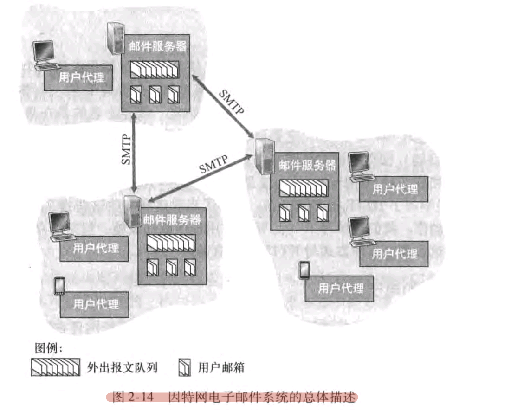

假设Alice向Bob发送电子邮件，基本工作流程如下：

- Alice的用户代理使用SMTP或HTTP协议向Alice的邮件服务器发送邮件
- Alice服务器将邮件保存在Alice的邮箱中
- Alice服务器通过STMP向Bob服务器发送邮件
- Bob服务器将邮件保存在Bob的邮箱中
- 当Bob用户代理上线时，通过HTTP、POP3等协议获取Bob邮箱中的邮件。SMTP是推送协议（PUSH），与HTTP拉取协议（PULL）不一样。因此Bob用户代理不能使用SMTP主动获取Bob服务器的邮件。


**POP3（Post Office Protocol version 3）**协议由`RFC1939`定义。POP3有三个阶段：认证（Authorization）、事务处理、更新。用户代理只能使用list、retr、dele、quit这四个命令。用户在发出quit命令后，进入更新阶段，将标记为删除的邮件删除掉。用户代理可以选择“下载并保留”，这样再retr命令后不会执行dele命令。一个简单的例子：


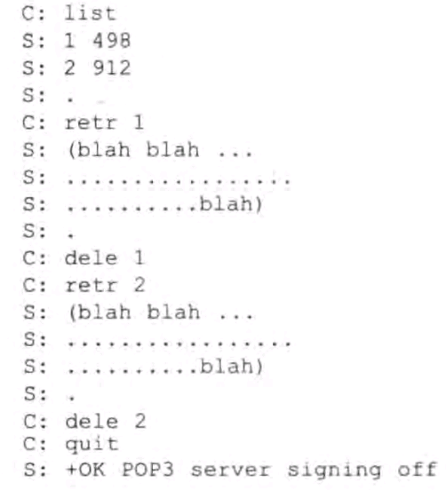


IMAP（Internet Mail Access Protocol）维护了用户状态信息，允许用户在邮箱服务器上管理邮件，例如创建、删除、重命名邮件夹；对邮件进行标记、移动、删除、回复、转发、附件下载等操作。近些年来，用户代理流行使用HTTP协议来与邮箱服务器通信（包括发送邮件），但邮件服务器之间仍采用STMP来通信。

## DNS

==DNS是一个分布式、层次化的数据库==，它提供以下功能：

- 名字到IP地址的转换
- 别名到规范名的转换：例如`relay1.west-coast.enterprise.com`规范名以及它的两个别名`www.enterprise.com`或`enterprise.com`
- 负载均衡：一个IP集合与一个规范域名相对应，DNS会从集合中返回一个IP。


有三种类型的DNS：**根DNS**、**顶级域（Top-Level Domain，TLD）DNS**、**权威DNS**。它的层次结构如下：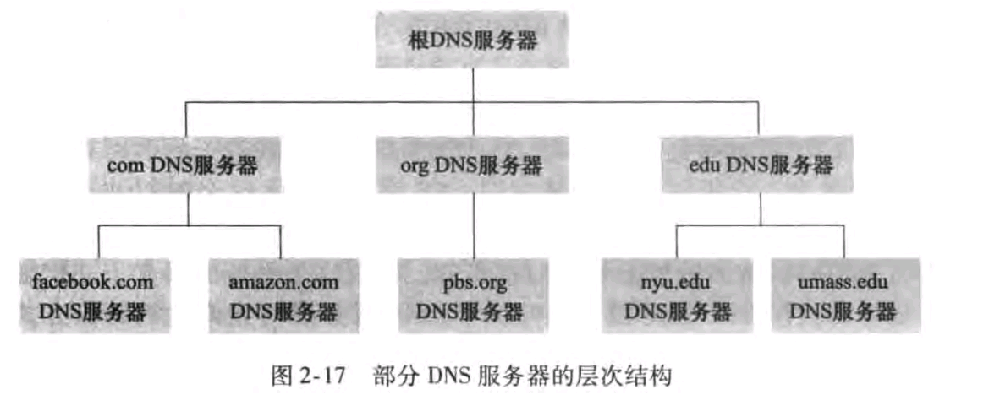

顶级域包括顶级域名（com、org、edu、gov）与国家域名（cn、uk、jp）。

- 根DNS服务器：共有13个，它记录顶级域服务器的地址

	- A.ROOT-SERVERS.NET：IPv4地址: 198.41.0.4；IPv6地址: 2001:503:ba3e::2:30

	- M.ROOT-SERVERS.NET：IPv4地址: 202.12.27.33；IPv6地址: 2001:dc3::35

- 顶级域服务器：它记录顶级域下权威DNS服务器的地址。

- 权威DNS服务器：可由公司、学校、个人来维护。

	在互联网中，每个域名都可以被分为多个子域名，而每个子域名可以与一个或多个主机名关联。严格来说在`www.example.com`中，`www`并不是三级域名，而是**主机域名**，它对应着域`www.example`域下面的Web服务，或者更准确地是Web网站的主机。而`shop.example.com`或`mail.example.com`可以区分不同的服务或者部门，这些域名被视为三级域名，它们下面还有主机域名或子域名。

	

	

还有一个DNS服务器：**本地DNS服务器**。它是由ISP维护的。当主机通过DHCP获取IP地址时，也会获取本地DNS服务器的地址。它扮演者代理（缓存）的角色。

名字解析的过程：递归查询、迭代查询

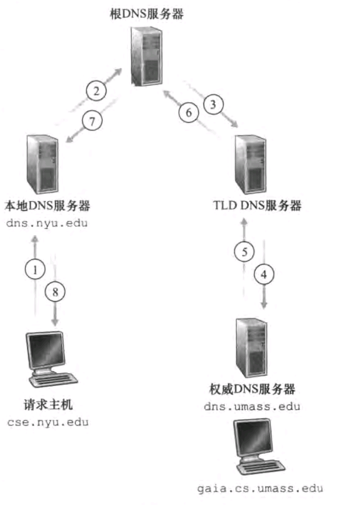

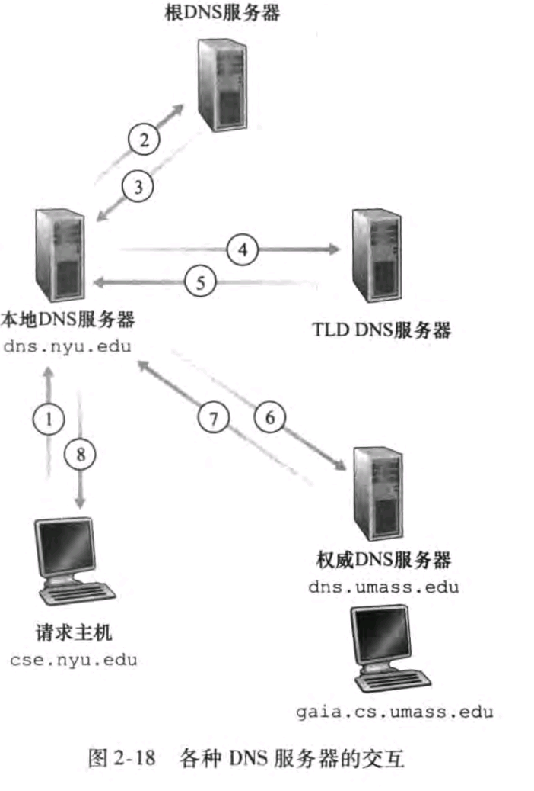


DNS采用缓存技术。为了解决缓存一致性问题，DNS服务器通常会设置TTL（Time to Live）值，指定该DNS记录可以在本地DNS服务器缓存中保留多长时间。当TTL时间到期时，本地DNS服务器会重新向权威DNS服务器查询最新的DNS记录并更新缓存。

在DNS服务器的数据库中保存资源记录（Resource Records，RR），它维护者域名到IP地址（其他）的映射关系。它的格式为（name，value、type、class、ttl）。对于Internet来说，class为IN。

- tpye = A：name为规范主机名，value为ip地址

- type = CNAME：name为别名，value为规范主机名

- type = NS：name为域名（foo.com），value为该域名下的权威DNS服务器的域名。下面是一个例子

	~~~shell
	dig example.com NS
	
	;; ANSWER SECTION:
	example.com.        86400    IN    NS    ns1.example.com.
	example.com.        86400    IN    NS    ns2.example.com.
	
	;; ADDITIONAL SECTION:
	ns1.example.com.    86400    IN    A     192.168.1.1    # 一定有对应的A类RR
	ns2.example.com.    86400    IN    A     192.168.1.2
	~~~

- type = MX：name为邮箱别名，value为邮箱服务器的规范名

	~~~
	example.com.        86400    IN    MX    mail.example.com.
	~~~

	

一个RR的例子：

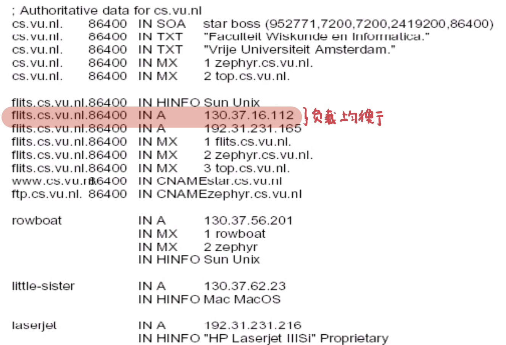


DNS报文格式：

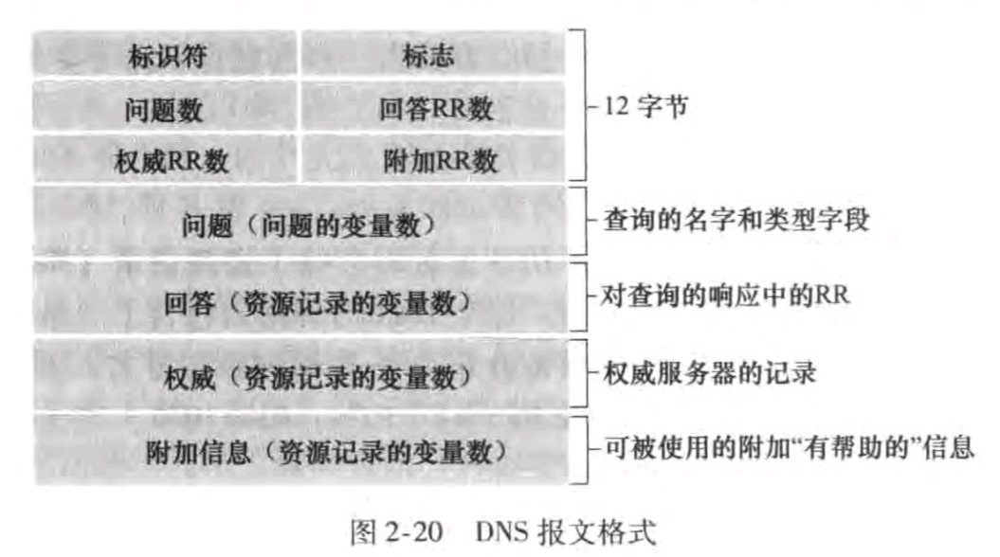


## P2P

案例学习：BitTorrent

BitTorrent是用于文件分发的P2P协议。参与一个特定文件分发的所有对等方的集合称为**洪流（torrent）**。洪流中的对等方彼此下载等长度（通常为256kb）的文件块。每个洪流都有一个基础设施——**追踪器（tracker）**。当一个对等方Alice加入洪流中，她向追踪器注册自己，并周期性通知追踪器她仍在洪流中。追踪器会在注册时返回一个洪流的子集给新加入的对等方Alice。对等方Alice尝试于子集中的各个对等方建立TCP连接。建立成功的对等方称为Alice的邻近对等方。在下载过程中，有些对等方会离开，而新加入的对等方可能与Alice建立TCP连接。因此邻近对等方是随时间变化的。Alice会周期性获取邻近对等方所具有块的列表。接下来就解决两个问题

- 请求哪个块：最稀缺技术。Alice根据块列表，请求当前副本最少的块。这样均衡每个块在洪流中的副本数量
- 响应哪个块：采用“一报还一报”（tit for tat）的激励交换算法。Alice周期性测量出4个最高速率的对等方，并向它们提供块，这四个对等方统称为**疏通（unckoked）**。同时每过30秒，Alice会随机选择一个邻居Bob向其发送块。这样Alice可能会成为Bob疏通的一员，而Bob反过来又可能成为Alice疏通的一员。这样对等方能够匹配速率相近的邻居！

BitTorrent还有一些有趣的机制，在这里不再介绍

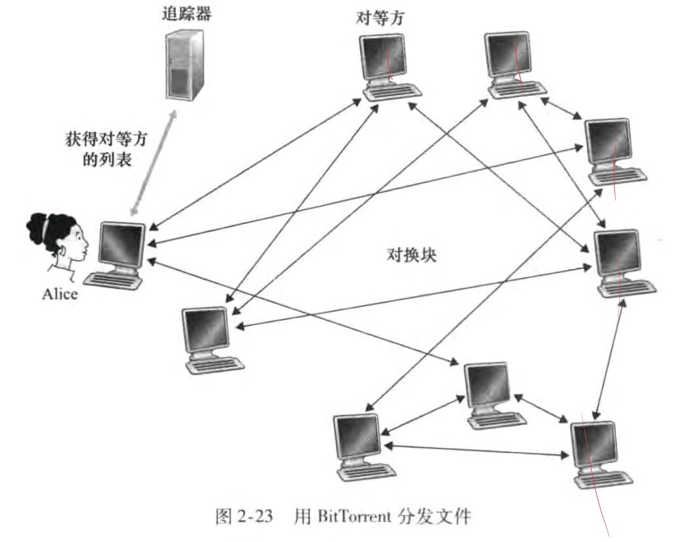


案例学习：分布式散列表（DHT）

对每个节点的IP哈希，根据hash值将这些节点构成一个树/环。再对文件Hash，根据Hash值放在相应的节点中。例如：


文件hash值为5-80的，放在hash值为5的节点中


## 流媒体

### HTTP动态适应流（Dynamic Adaptive Streaming over HTTP，DASH）

- 服务器：
	- 将视频分为多个块
	- 给每一个块编码为几个不同的版本，每个版本有着不同的编码率
	- 给客户端提供一个**告示文件（manifest file）**。为每个版本的每个块提供一个URL以及对应的码率
- 客户端：
	- 运行一个速率选择算法来决定下次请求的块。


### 内容分发网络（Content Distribution Network，CDN）

内容提供商如果采用单一大规模数据中心策略，那么有以下缺点：

- 单点故障
- 冗余传输
- 客户远离数据中心，端到端的吞吐量小于消耗速率，用户体验差


CDN可以是专用提供商（private CDN），即内容提供商自己拥有的。第三方CDN，由其他公司提供的。

CDN通常采用以下策略部署集群

- 深入：部署在接入网处，用户延迟小
- 邀请做客：部署在IXP处，利于维护和管理


现在还有两个问题：

- 如何将客户重定向到集群的某台服务器上

  - NetCinerma权威服务器返回CDN权威服务器的域名。LDSN根据CDN权威服务器的域名获取到KingCDN的IP。

  	

  	

  - ICP预先将内容部署到CDN Server。然后客户端从ICP中获取manifest file，重定向到CDN Server中

- 选择某个集群

	- 地理上最接近：当LDNS向CDN权威服务器请求时，CDN获得LDNS的IP，根据IP选择相应的集群。而用户离LDNS较远时，这种策略表现很差

## Socket API

### TCP

### UDP

