# 计算机网络 概述

[TOC]

## 什么是Internet

在概念上，网络是由若干**节点（node）**和连接这些节点的**边（edge）**构成，表示诸多对象及其之间的相互联系（边与节点的拓扑关系）。

在计算机网络中，节点是主机、主机上运行的程序、路由器、交换机等，边是通信链路。

Internet是采用`TCP/IP`协议栈的计算机网络。从具体构成角度看，Internet由协议、网络设备（主机终端、交换机等）、通信链路组成。而从服务角度看，Internet是由

- 使用通信基础设施进行通信的分布式应用
- 通信基础设施为app提供编程接口（通信服务）

> Internet表示因特网，是当前世界上最大的、开放的、由众多网络相互连接而成的特定计算机网络，它采用`TCP/IP`协议簇作为通信的规则。而internet表示互联网，泛指多个计算机网络互连而组成的网络，在这些网络之间的协议簇可以是任意的。intranet是与Internet采用相同技术栈的网络，但是不对外开放，一般用于企业内部网。

**协议**定义了在两个或多个通信实体之间交换的**报文格式（语法）**和**次序（语义）**，以及在报文传输等其他事件方面所采取的**动作**。

面向连接与有连接之间的区别：面向连接是指通信状态在端系统中维护，而网络不知道这些状态。有连接是指这些通信状态在网络中维护。

下面我们探讨网络结构：

- 网络边缘
- 网络核心
- 接入网、物理媒体

## 网络边缘

网络边缘是由端系统（主机）硬件以及在其上面的软件程序组成。应用有两种通信模式：

- 客户/服务端（C/S）模式，客户端主动向服务器发送请求。这种模式可扩展性比较差（随着负荷到达阈值，性能急剧下降）。
- 对等（Peer-Peer）模式，每个端系统即是客户端也是服务端。

网络基础设施向网络边缘提供两种类型的服务：TCP、UDP。

- TCP：流量控制、拥塞控制、可靠传输、面向连接
- UDP：无连接

## 网络核心

数据可以通过两种方式在网络中传输：

- **电路交换（线路交换）**
- **分组交换**

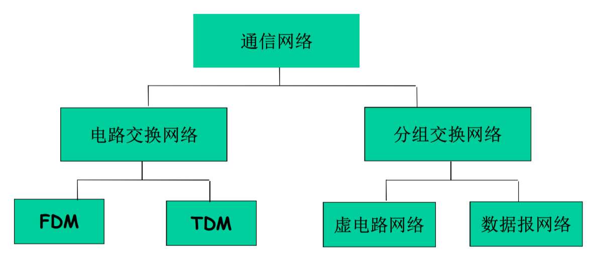

==电路交换（预约服务）vs 分组交换（按需服务）==

电路交换在通信之前使用信令（相当于控制信息）系统为通信双方预留一定的通信资源，这个过程称为**呼叫（call）**。通信资源被双方**独享**，可以保证通信质量。但是若呼叫后无数据发送，那么资源会被浪费，从而导致整个系统的利用率低。

在电路交换中，采用以下**资源复用**技术：

- **频分（Frequency Division Multiplexing）**
- **时分（Time Division Multiplexing）**
- **波分（Wave Division Multiplexing）**，本质上就是频分，不过用于频率较高（可见光频率）的带宽中。

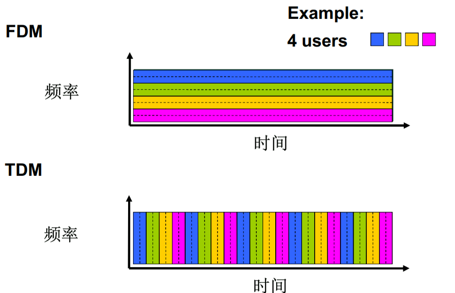

> **宽带是一种业务，带宽是传输速度**。

电路交换并不适合计算机之间的通信：

- 连接建立时间长
- 计算机网络通信具有突发性的特点，采用电路交换技术，利用率不高
- 需要路径上所有节点共同维护链路资源，可靠性不高。

分组交换是以分组为单位**存储-转发**。不再将复用网络资源，而是利用全部的链路资源，并且将传输的数据分为一个个分组。

为什么要存储-转发：

- 由于传输一个分组时使用全部的链路资源（节点的传输速率），并且同时有多台计算机通信要共享这一链路资源。所以采用**统计时分复用**技术，在时分复用的基础上，将片（piece）依次分配各个分组，而不再以固定的模式分配。

- 适合计算机通信的突发性。

- 而且可以进行错误检查，若出错可直接抛弃整个分组，而无需在接收端传输层中进行处理。
- 延迟要比线路交换大

分组交换网络按照网络层是否有连接，分为两种类型：

- 数据报网络(Internet)：

	- 由分组的目标地址决定下一跳
	- 路由可以改变

- 虚电路网络（例如X.25 ATM）：

	- 每个分组带有标签，标签决定下一跳，标签可能改变

	- 路由在呼叫建立时决定，在整个呼叫中路由保持不变

	- 路由器维持每个呼叫的状态信息

		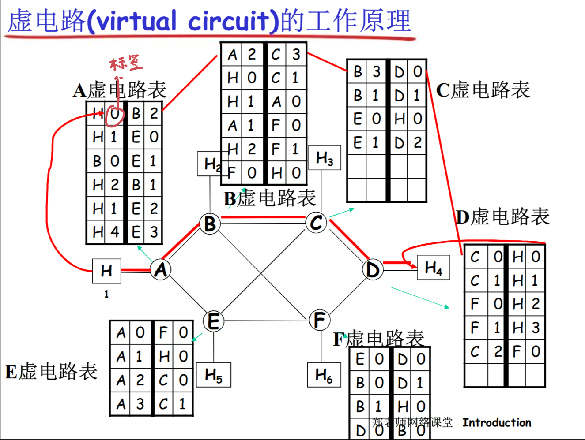

网络核心的关键功能：

- 路由：决定分组从源到目标的路径，通过路由算法得到路由表。
- 转发：根据路由表，将分组从路由器的输入链路转移到输出链路

## 接入网和物理媒体

接入网解决的是如何将网络边缘的端系统和网络核心的路由器连接的问题。

接入网分为：

- 家庭接入：DSL、HFC、FTTH、卫星🛰
- 企业接入：以太网、WiFi
- 广域网无线接入：5G

- DSL（Digital SubscriberLine）：DSL可以将数字信号与模拟信号相互转换。一个电话呼叫和一个互联网连接可以共享一条DSL链路（双绞铜线）。

	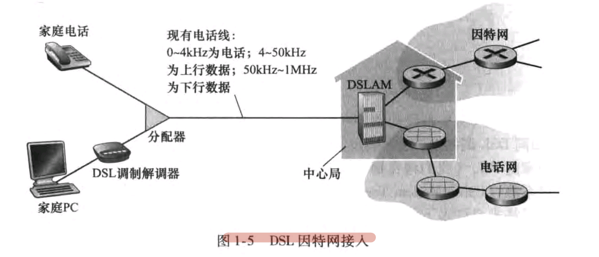

- HFC（HybridFiber Coax）混合光纤同轴。HFC系统一个重要特征是共享广播媒体，即用户间的上行信道与下行信道都是共享的，因此需要一个协议避免数据碰撞（数据链路层的问题）

	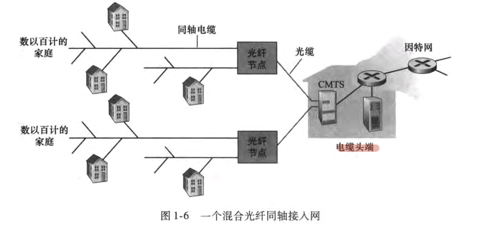

- FTTH

  光纤分布方案：

  - 直接光纤：从本地中心局到每户都设置一根光纤
  - 从中心局出来的每一根光纤由多个用户共享。当这跟光纤接近这些用户时，再分为一根根光纤接入到每个用户
  	- Active Optical Network AON：本质上是交换因特网，在数据链路层
  	- Passive Optical Network PON：OLT（Optical Line Terminator）提供了光信号到电信号的转换。

  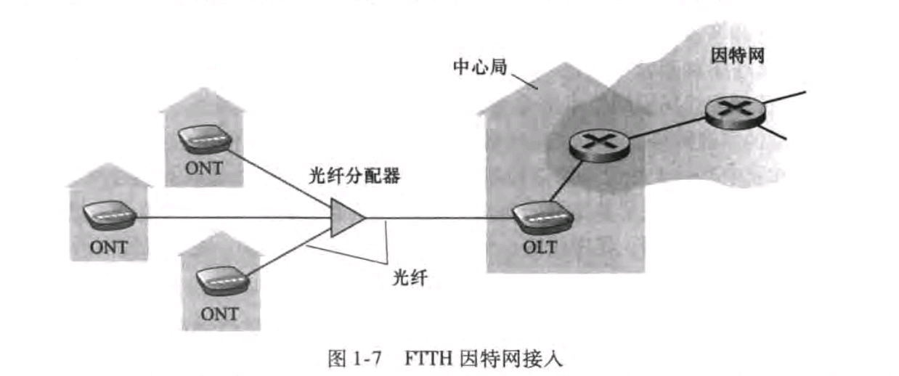

- 以太网

	以太网是最为流行的局域网接入技术。结构上，一般由以太网交换机与和用户连接的双绞铜线组成。
	
	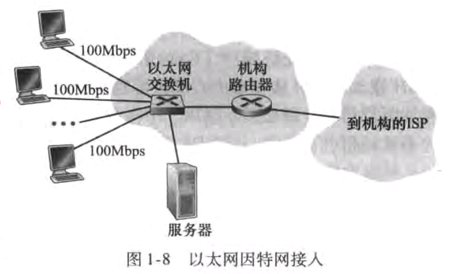

- WiFi是一种无线局域网接入技术，基于IEEE802.11
- 5G是无线广域网接入技术，相比较几十米的无线局域网，无线广域网有更大的接入范围（例如5G：300+米）

物理媒体有：双绞铜线、同轴电缆、光纤、卫星无线电、陆地无线电（基站）。

物理媒体可分为：

- 引导型媒体（guided media）：固体传导
- 非引导型媒体（unguided media）：气体传播等

## Internet结构和ISP

互联网结构的发展与演化是经济、政治因素主导的。

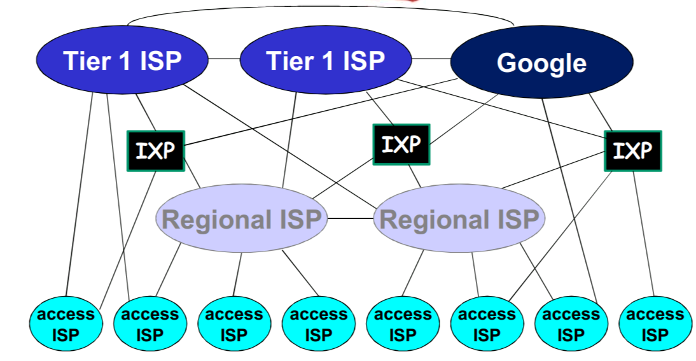

- 该网络结构存在等级制度——**提供商ISP**与**客户ISP**。
- 由于市场竞争，有多个**Tier1 ISP**。由于市场合作，有**IXP（Internet Exchange Point，因特网交换点）**，为ISP提供业务的扩展（在IXP处连接到别的网络）。相比直接铺设链路到其他ISP，IXP在成本、延迟方面好处很多。

- 为了减少通过上游ISP的费用，同级ISP之间有**Peer（对等）**（在IXP或peer link），将两个ISP的网络连接起来，而通过的流量一般不涉及费用结算。

- 客户ISP可以选择**多宿（multi-home）**，即选择更多的提供商ISP。

- **PoP（Point of Presence）**：提供商网络中的一台路由器或多台路由器集群。是面向客户ISP的接入点

- **内容提供商网络（Internet Content Providers）**：由于IXP成本高，且服务质量得不到保障（例如跨洋通信）。一些互联网大厂（Google）在全世界各地部署数据中心（DC）。然后租用或铺设光缆，将这些数据中心连接起来，构成一个分布式服务器。最后再与较近的IXP相连，为终端用户提供服务。如果用户所请求的服务在本地服务器不存在，那么通过自己的专用网络向别的服务器请求该服务，而不走一级ISP的线路。

## 分组延时、丢失和吞吐量

分组延时的四种类型：**处理延时**、**排队延时**、**传输延时**、**传播延时**。

节点延时：$d_{nodal} = d_{proc} + d_{queue} + d_{trans} + d_{prop}$

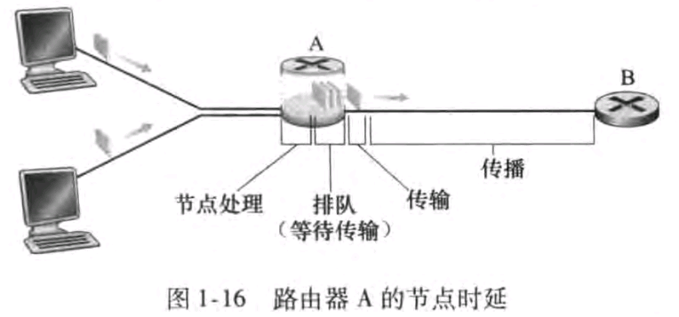

设链路带宽为$R$，则$\frac{1}{R}$为打出一个bit所花费的时间。

流量强度：$I = \frac{La}{R}$，其中`L`是分组长度，`a`是分组个数到达的平均速率，`R`是链路宽带。流量强度与平均排队延时的关系：

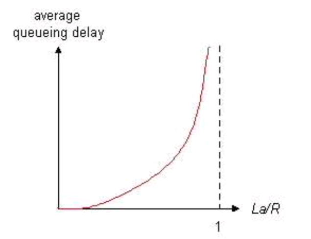

平均排队时延：$\frac{I}{1-I}\frac{L}{R}$

==设计系统时流量强度不能大于1==

`RTT`：从发送出请求报文的最后一个字节开始，到接收到响应报文的最后一个字节为止。

吞吐量：在源端与目标端之间传输的速率

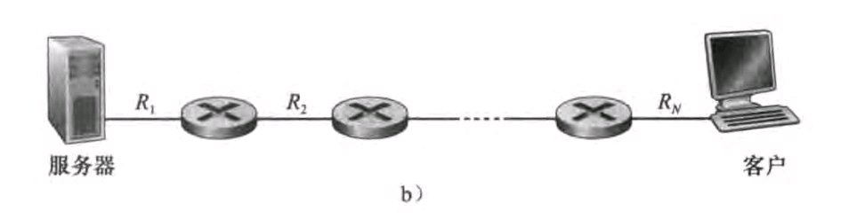

吞吐量为$min\{R_1, R_2, ... ,R_N\}$，瓶颈链路决定了吞吐量！

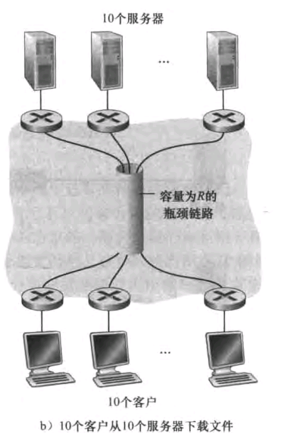

假设公平享有链路资源，那么吞吐量为$R/10$

## 协议层次及服务模型

如何组织和实现复杂的网络功能（路由、物理信号处理、域名解析、电子支付、社交等）：**模块化**。

一般来说模块化有两种形式：**扁平化**与**分层**。扁平化的模块之间可以相互调用。而分层的模块之间只能调用相邻层次的模块，而不建议跨层调用。

==计算机网络系统以分层的方式设计==，协议分层具有概念化与结构化的优点。缺点是可能冗余低层的功能。或跨层使用服务，这违反层次分离的目标。

- **服务**：本层为上层提供的功能，是本层协议所提供功能的子集。上层在SAP上调用原语来使用下层所提供的服务。

- **原语**：上层使用下层服务的形式，例如Socket API、读写I/O设备
- **协议**：本层的功能是协议作用的体现。本层协议的实现需要使用下层提供的服务，而本层协议在下层所提供服务的基础上，进一步为上层提供更高级的服务。
- **服务访问点（Services Access Point）**：具有区分上层多个实体的作用，例如传输层的端口号

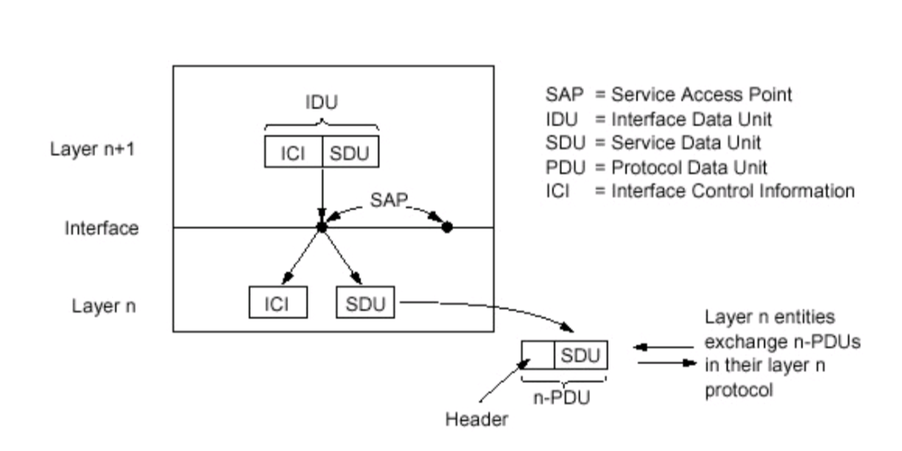

- ICI：一般为接口的参数。
- SDU：上层的SDU + Header = PDU（本层SDU）

这里涉及到封装与解封的思想

ISO/OSI模型：

- **表示层**：数据的加密、压缩以及数据的描述（不必考虑在不同计算机中有关表示数据或存储格式的问题，例如大小端）
- **会话层**：数据交换的同步，例如检查点与恢复机制。

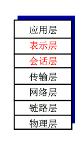

**协议数据单元（Protocol Data Unit）**在不同层次的称谓：

- 应用层：**报文（message）**
- 传输层：**报文段（segment）**
	- **TCP段**
	- **UDP数据报**
- 网络层：**分组（packet）**
	- 特别地，以无连接的方式（例如，Internet）：**数据报 datagram**
- 数据链路层：**帧（frame）**
- 物理层：**位（bit）**