# 计算机网络 网络层 数据平面

[TOC]

## 概述

 ==IP Over Everything==，即较好地处理各个网络的异构性，兼容各个链路层协议。

网络层的两个核心功能：

- **转发（数据平面）**：根据路由（转发）表将分组从路由器的输入接口转发到正确的输出接口
- **路由（控制平面）**：使用路由算法与协议生成路由（转发）表，决定分组从发送端到接收端的路径

==转发就是匹配 + 动作==。传统方式的动作只有转发；而SDN方式的动作有：1.转发、2.blocked、3.修改、4.泛洪等

这些功能有两种方式来实现：

- **传统**：数据平面与控制平面高度耦合

	- 转发：1.IP头部中的目的IP字段，2.路由表
	- 路由：在各个路由器中实现路由算法与协议。实现是分布式的，不易维护管理。

	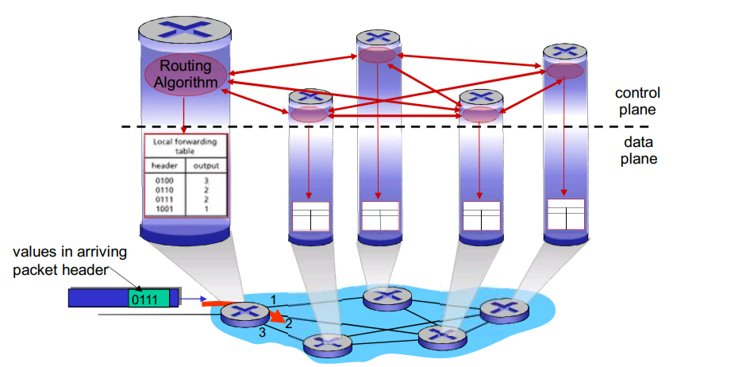

- **软件定义网络（software define network）**：

	- 转发：1.TCP/IP头部中的多个字段，2.流表
	- 路由：在远程服务器中实现。实现是集中式的，易维护管理。

	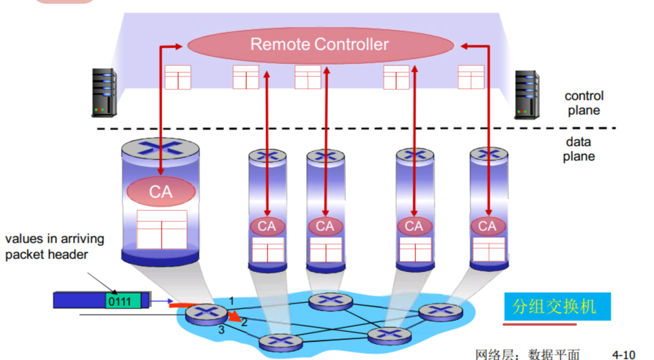

**网络服务模型**定义了分组在端到端运输的特性：

- 确保支付：确保分组最终到达目的地
- 具有时延上界的确保支付：确保分组在时延上界内（例如100ms）最终到达目的地
- 有序分组交付
- 确保最小宽带：在规定带宽下（例如低于1Mbps）确保分组最终到达目的地
- 安全性

Internet的网络层不具备上述特性，因此IP协议是一种尽力而为的服务。这里的尽力而为是一种“根本无服务”的委婉说法😅。ATM（Asynchronous Transfer Mode）网络就提供了上述特性

> 这里规范下术语：
>
> - 分组交换机：一台通用分组交换设备。
>
> - 链路层交换机：根据链路层帧中的字段进行转发的分组交换机
>
> - 路由器：根据数据报首部字段进行转发的分组交换机

## 路由器的组成

路由器一般由以下部分组成：

- 输入端口
- 输出端口：如果链路是双向的，那么输出端口与输入端口通常在同一张网卡上。
- 交换结构：将输入端口连接到输出端口
- 路由选择处理器：执行控制平面的功能。在传统路由器中，它执行路由选择协议；在SDN路由器中，负责与远程控制器通信以获取流表。

输入端口的组成如下：

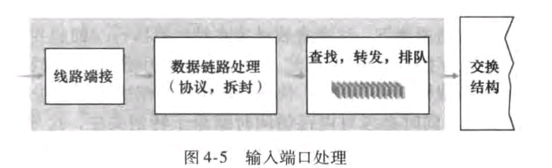

如果输入端口执行转发的功能（有自己的处理器以及存储器），那么路由选择处理器将转发表的副本通过总线传输给输入端口。

输出端口的组成如下：

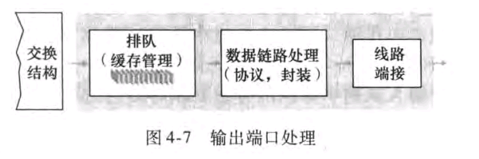

交换结构的类型有：

- 内存：由路由选择处理器执行转发功能。输入/输出端口的工作与传统I/O设备类似：当有分组到达时，输入端口向CPU中断信号。CPU将分组被复制到内存中并处理。最后CPU将数据复制到输出设备的缓存中。在现代内存式路由器中，目标地址的查找以及将分组复制内存的工作是由输入端口来完成的。
- 总线：一般由输入端口执行转发功能，通过总线传输给输出端口，一般无需路由选择处理器的干涉。分组被输入端口打上一个内部标签，然后复制到每个输出端口中。只有与该标签匹配的输出端口才保存该分组。
- 纵横式：一个更复杂的互联网络。

输入端口为什么要排队：分组到达速率 > 处理速率

输出端口为什么要排队：多个输入端口向同一个输出端口传输分组。处理速率 > 传输速率

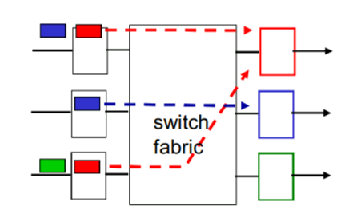

如何设置端口缓冲区的大小：一个经验法则：$缓存大小 = RTT * 链路容量$，这里链路容器是指传输速率。如果有*N*（比较大的）条TCP连接，那么$缓存大小 = RTT * 链路容量 / \sqrt{N}$

端口溢出时的丢弃策略：FIFO、优先级、随机

调度策略：

- FIFO

	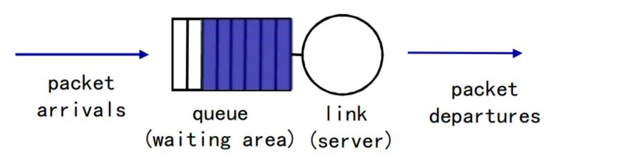

- 优先级：优先发送高优先级队列中的分组

	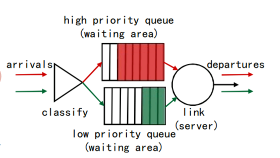

- RR：有多个队列，依次转发每个队列中的一个分组

- 一般化RR：每个队列有权重，根据权重有不同的服务时间

	

## IP协议

### 格式

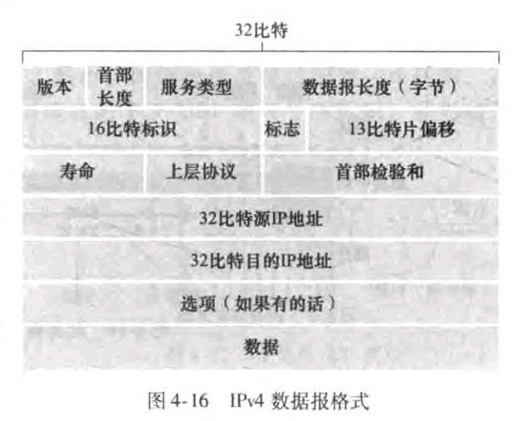

- 首部长度（4bit）：以32位比特为单位表示
- 数据报长度：首部 + 数据部分，以字节计
- 标识、标志、片偏移（以8个字节为单位）用于分组分片
- 首部校验和只对首部校验，不像TCP/UDP对整个报文检验

### 分片

网络链路层有MTU（最大传输单元）的限制。一个大的数据报会被分成若干个小数据报，在目标主机处重组这些小数据报。目标主机在接收到一个分片时启动定时器，若超时则抛弃所有已接收的分片。

IP协议中的标志字段用于标识是否最后一个分片。

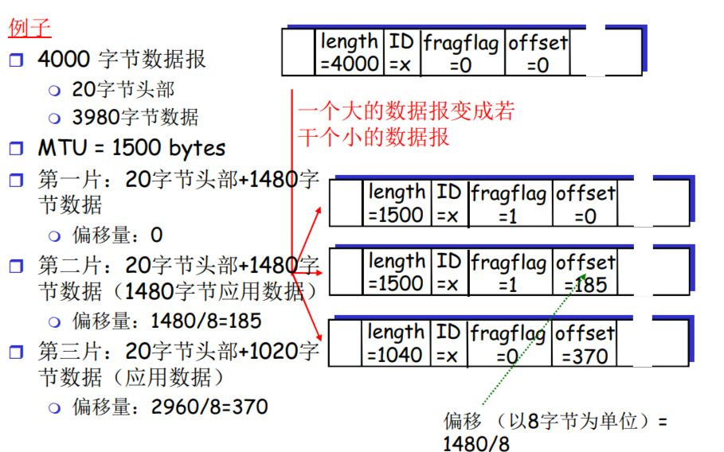

> - 在以太网等网络中，MTU包括数据帧的头部、有效载荷和帧尾。MTU的最大值为1518字节，其中包括数据帧的头部14字节、有效载荷最大为1500字节和数据帧的尾部4字节。
>
> - 在其他类型的网络中（例如PPP），MTU可能只包括有效载荷部分，不包括帧头和帧尾。
>
> - 在更高层次的网络协议中（例如TCP/IP协议中的IP层），MTU指的是IP数据报的最大长度（1500）。
>
> 注：以上由ChatGPT提供

### IP地址

IP地址用于标识物理链路的连接处，而不标识主机。所以一台主机可能有多个IP地址。

**现在无需考虑一个接口是如何连接到另一个接口**，这是我们在数据链路层要讨论的问题

IP地址划分为两个部分：主机部分（低位bits）与子网部分（高位bits）

IP地址高位部分相同的节点的集合称为子网，子网可以分为：

- 纯子网：无需路由器接入
- 非纯子网：路由器接入

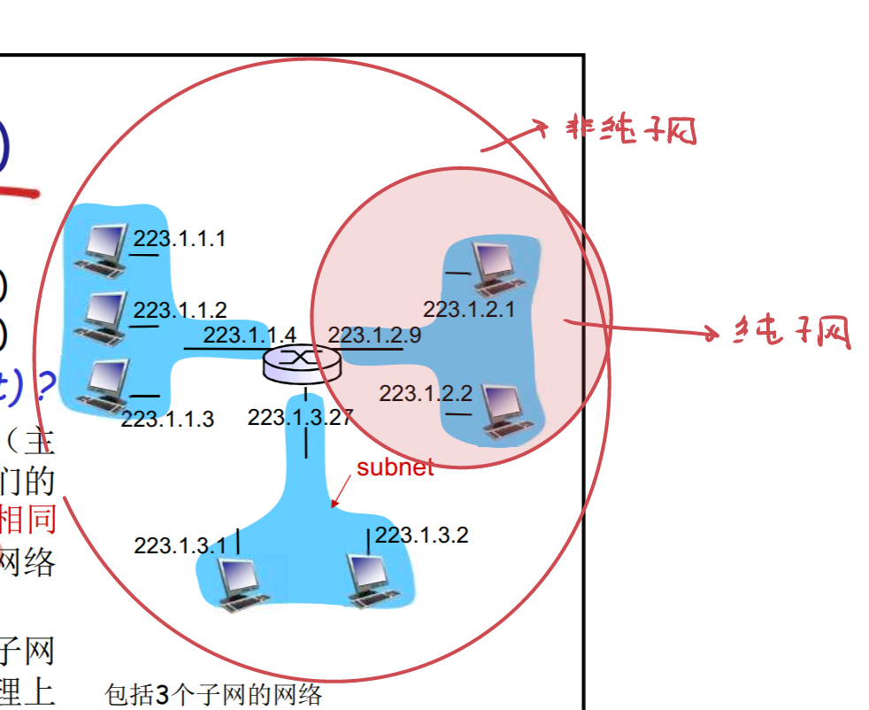

一般子网这个术语默认为纯子网

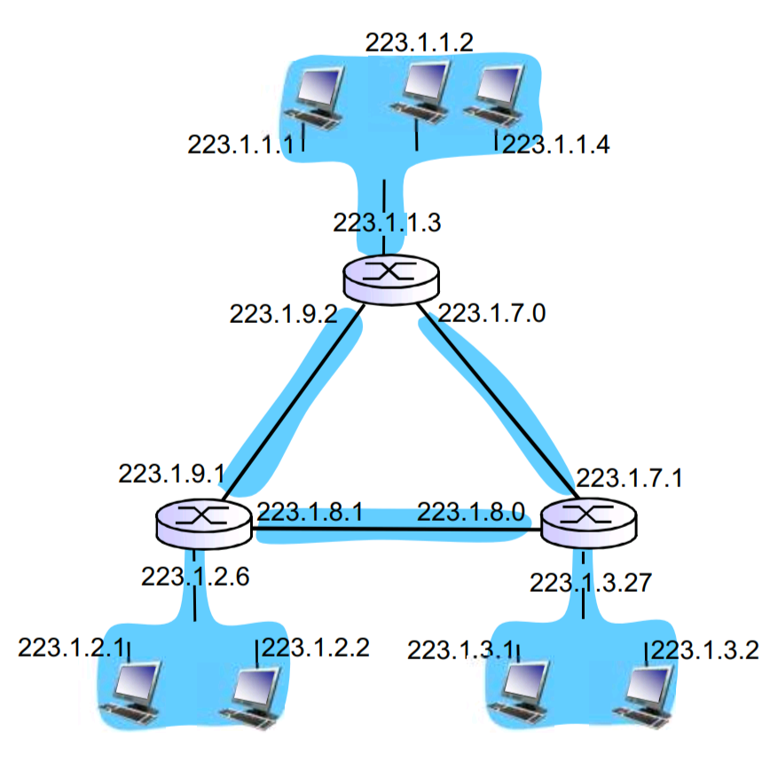

上述图中一共有6个子网

IP地址的分类（分类编址）：

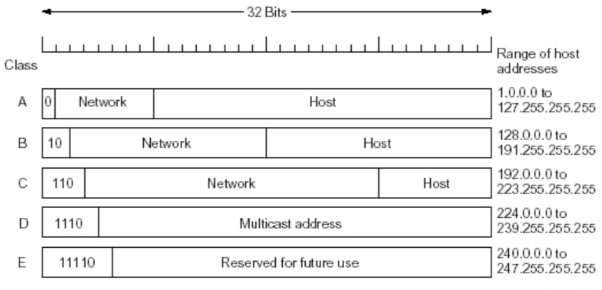

一些特殊的地址：

- 子网全0：本网络
- 主机全0：本主机
- 主机全1：在某个网络上广播
- 全1：在本网络上广播
- 127.x.x.x：环回测试

0.0.0.1/24与192.168.1.1/24有什么区别？当路由器获知子网全0时，它不再查找路由表而是直接向本网络转发

内网（专用）地址：用于局部网络中

- class A ：10.0.0.0 - 100.255.255.255/8
- class B ：172.16.0.0 - 172.31.255.255/16
- class C ：192.168.0.0-192.168.255.255/24

Internet采用**无类别域间路由选择（Classless Interdomain Routin，CIDR）**来进行地址分配，即a.b.c.d/x，其中x不必为8、16、24。

一个组织机构通常被分配一块连续的地址，即地址的子网部分。该组织可以随意分配地址的主机部分，可进一步**划分子网**或标识组织内部的设备。这样就按**层次方式**分配地址。**外部不需要知道该组织内部子网的情况**，只有当该组织内部的路由器转发时，才会考虑这`32-x`bit的主机部分。当我们讨论BGP路由协议时，一般考虑`x`bit的子网部分，这样以子网络为单位计算路由表，路由表的表项更少！下面我们看一个例子：

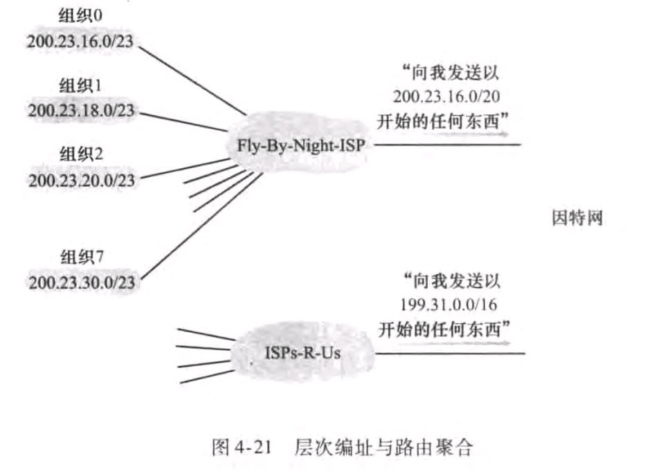

Fly-By-Night ISP有8个组织，每个组织都有自己的子网，但外部无需知道这8个组织。Fly-By-Night ISP的路由器向外部告知`200.23.16.0/20`，这样使用单个网络前缀告知多个网络的能力称为**路由聚合（route aggregation）**，这同样会减少路由表的表项，从而减少计算、存储的代价！

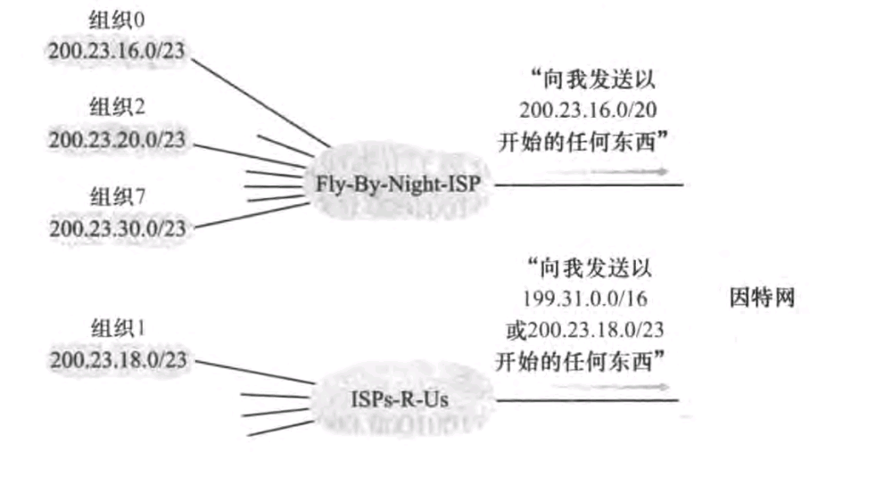

但是我们现在有两个问题：

- 组织1更换ISP，它的子网号应该怎么办？
- 若使用路由聚合，但这个网络前缀中有些子网号并不在该ISP中怎么办，形象点来说有空洞。例如路由器向外部告知`200.23.16.0/20`，它有`200.23.16.0/23`  `18` `20` ...`29`子网号，但`30`并不在里面。

使用**最长前缀匹配**就可以解决这个问题。在这个例子中，组织1无需更换自己的子网号，同时ISP-R-U的路由器向外部通知`200.23.18.0/23`。这样就完美解决上述两个问题。

如何获取一个IP地址呢？

- **文件配置**。用户向ISP联系，获取自己的IP地址。而ISP从ICANN组织获取IP地址，该组织还负责管理DNS根服务器。

- **DHCP（Dynamic Host Configuration Protocol，DHCP），动态主机配置协议**。

	DHCP会返回IP地址以及子网掩码、第一条路由器的IP地址（默认网关）、DNS服务器域名和IP地址

	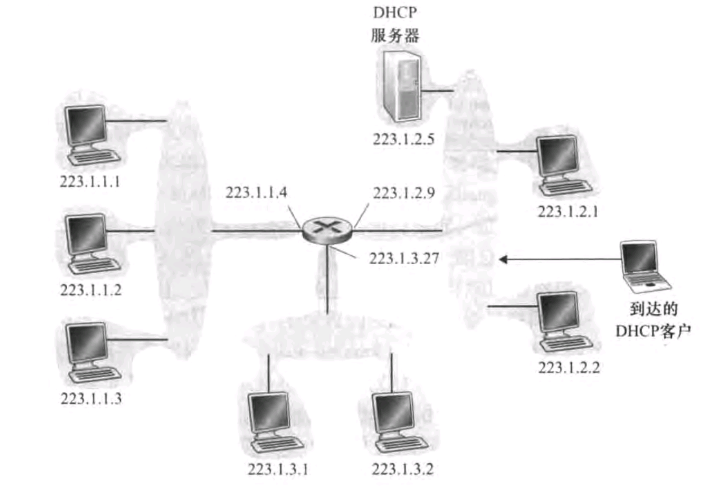

	基本工作流程如下：

	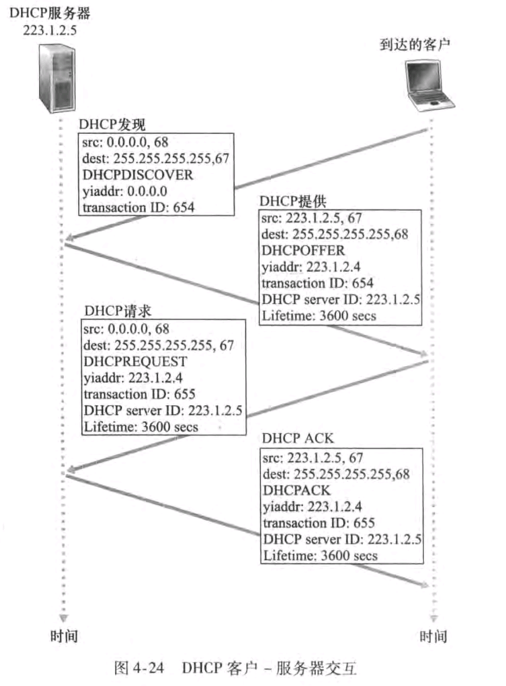

	- 客户端在子网中广播DHCP发现报文
	- DHCP服务器向子网广播DHCP提供报文
	- 客户端从多个DHCP提供报文选择一个，单播DHCP请求报文
	- DHCP服务器单播DHCP ACK报文，DHCP服务器可能会在本地缓存中保存IP地址和对应的MAC地址，以便后续通信使用

	DHCP在移动性表现很差！因为每当节点连接到一个新子网时，要从DHCP获取一个新的IP地址。

	校园网登录一般用Captive Portal协议。

### NAT

### IPv6

## 通用转发和SDN

### 匹配

### 动作

### 实例

